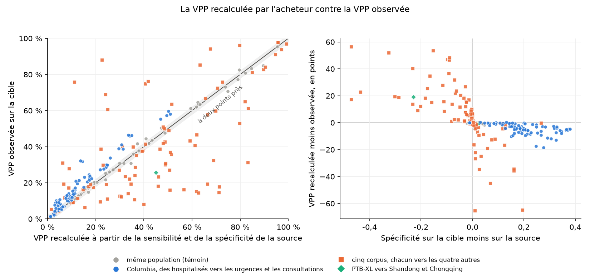
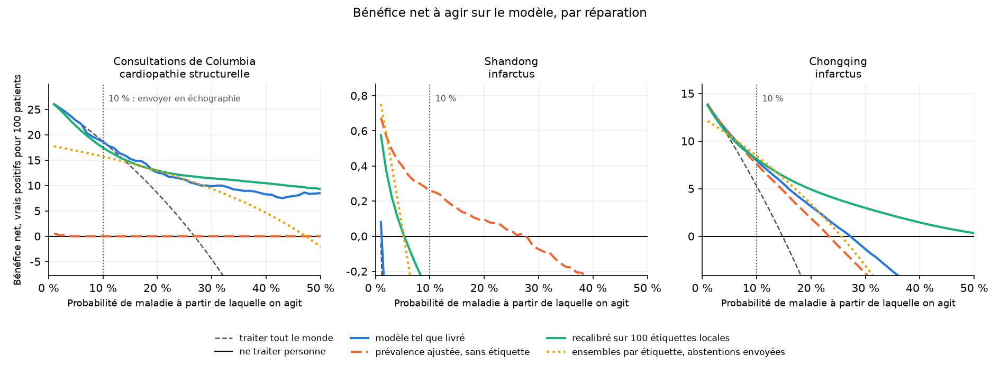

# La VPP d'un modèle, recalculée pour votre hôpital, se trompe de cinq points, dans un sens ou dans l'autre

Un hôpital qui évalue un modèle ECG reçoit une AUROC, une sensibilité et une spécificité mesurées sur les patients d'un autre. Le conseil habituel, que j'ai donné moi aussi, est de recalculer la valeur prédictive positive (VPP) à la prévalence locale par la formule de Bayes. La recette n'est exacte que si la sensibilité et la spécificité restent les mêmes chez les nouveaux patients. Je l'ai mise à l'épreuve sur 174 transferts de modèles ECG d'une population à une autre, là où la vraie VPP pouvait se compter. Avec la vraie prévalence locale en main, la recette manque la VPP observée de 5,3 points de pourcentage en médiane. Elle tombe hors de l'intervalle à 95 % de la VPP observée dans 75 % des transferts, et elle se trompe tantôt vers le haut, tantôt vers le bas. Sur 72 paires témoins, où la population cible est celle de la source, elle se trompe de 0,3 point.

À gauche, chaque point est un modèle, un diagnostic et une paire de populations. Les points gris sont les témoins, où la cible est tirée de la population source. À droite, les mêmes points, avec l'écart en points de pourcentage contre le déplacement de la spécificité.

## La formule de Bayes ne vaut que si le test se comporte de même chez les nouveaux patients

L'AUROC est une propriété d'un modèle sur un échantillon, et elle ne bouge pas quand la prévalence change. La VPP, la part des patients signalés qui ont la maladie, dépend de la prévalence : l'AUROC seule ne dit donc pas à un service combien de ses alertes seront justes. La recette corrige cela en calculant VPP = sens × prév / (sens × prév + (1 − spéc) × (1 − prév)) avec la prévalence du site.

Le modèle d'hyperkaliémie validé par Harmon et ses collègues à la Mayo Clinic montre la recette qui marche. Aux urgences, où 1 % des patients avaient une kaliémie au-dessus de 6,0 mEq/L, le modèle atteignait 80 % de sensibilité, 80 % de spécificité et une VPP de 3 %. En réanimation, à 3 % de prévalence, il atteignait 82 % et 82 %, et une VPP de 14 % [1]. Portée des urgences à la prévalence de la réanimation, la recette donne 12 %, deux points sous la valeur observée, parce que la sensibilité et la spécificité ont à peine bougé d'un service à l'autre.

Elles bougent souvent. Ransohoff et Feinstein ont nommé le problème du spectre en 1978 : la sensibilité et la spécificité d'un test dépendent des malades et des non-malades sur lesquels on les mesure [2]. Sur 23 méta-analyses, Leeflang et ses collègues ont trouvé que la sensibilité ou la spécificité d'un même test variait jusqu'à 40 points entre les études à faible et à forte prévalence, et que la spécificité tendait à baisser quand la prévalence montait [3]. Dans l'étude EchoNext, à sensibilité fixée à 70 %, la spécificité des hôpitaux externes était inférieure de 10 points à celle de Columbia [4]. Rien de cela ne dit de combien une VPP recalculée se trompera dans un hôpital donné, d'où la mesure.

## Un seuil par source, compté sur la cible

Les scores viennent de deux études de ce dépôt, sur des corpus ECG publics. Dans chaque paire, un seuil est ajusté sur la source pour signaler 90 % de ses malades, puis appliqué tel quel sur la cible. La sensibilité et la spécificité de la source à ce seuil, avec la vraie prévalence de la cible, donnent la VPP recalculée. La VPP observée est la part des patients signalés de la cible qui sont malades. Donner à la recette la vraie prévalence est généreux : un acheteur devrait l'estimer.

| Paires | Modèle | Diagnostics | Transferts résumés |
|---|---|---|---|
| Hospitalisés de Columbia vers les urgences et les consultations de Columbia (EchoNext) | quatre : un réseau entraîné ici, le mini-modèle EchoNext publié, ECGFounder avec des sondes logistiques, un plancher à initialisation aléatoire | onze anomalies échographiques et leur composite | 80 |
| Cinq corpus d'Allemagne, de Chine et des États-Unis, chacun vers les quatre autres | un réseau entraîné sur chaque source | rythme sinusal, fibrillation atriale, blocs de branche gauche et droit, bloc auriculo-ventriculaire du premier degré | 92 |
| PTB-XL (Allemagne) vers Shandong et Chongqing (Chine) | un réseau entraîné sur PTB-XL | infarctus du myocarde | 2 |

Un transfert est résumé quand sa cible compte au moins 10 malades et que son seuil en signale au moins 20, pour que la VPP observée ait un intervalle plus étroit que les écarts en jeu. Les témoins sont les mêmes modèles lus sur une partie réservée de leur propre source : les hospitalisés de Columbia de la partie validation vers ceux de la partie test, et chaque corpus vers sa propre partie test.

## La recette s'est trompée dans les deux sens

| Paires | Transferts | Écart médian, en points | À deux points près | VPP recalculée hors de l'intervalle à 95 % observé | Recette trop haute |
|---|---|---|---|---|---|
| Témoins, même population | 72 | 0,3 | 86 % | 1 % | 40 % |
| Tous les transferts | 174 | 5,3 | 25 % | 75 % | 36 % |
| Columbia, des hospitalisés vers les urgences | 44 | 3,2 | 36 % | 66 % | 9 % |
| Columbia, des hospitalisés vers les consultations | 36 | 4,8 | 19 % | 81 % | 0 % |
| Cinq corpus, chacun vers les quatre autres | 92 | 10,9 | 22 % | 76 % | 62 % |

L'écart compte aussi rapporté à la VPP elle-même. Dans 57 % des transferts, la VPP recalculée s'écarte d'au moins un quart de la VPP observée, contre 1 % des témoins.

À Columbia, la recette était trop pessimiste dans les 36 transferts vers les consultations. Pour une fraction d'éjection inférieure ou égale à 45 %, elle prédisait que 14 % des consultants signalés par le réseau de l'étude en auraient une. La valeur observée était de 32 %, et la recette annonçait 5,9 fausses alertes par malade trouvé là où il y en avait 2,1. Pour le composite des onze anomalies, elle prédisait 34 % et l'observation donnait 46 %. La cause est chez les consultants sains. Le seuil ajusté sur les hospitalisés signale 60 % des hospitalisés sains mais seulement 29 % des consultants sains, si bien que la spécificité passe de 40 % à 71 %. Les consultants sains sont en meilleure santé que les hospitalisés sains : c'est l'effet de spectre dans sa forme de manuel.

L'écart vient avec un diagnostic. Si seule la prévalence avait changé entre deux populations, le rapport de vraisemblance d'un modèle calibré, moyenné sur les patients sains, serait le même dans les deux, proche de 1. Chez les hospitalisés de Columbia de la partie test, la médiane sur toutes les anomalies et tous les modèles est de 0,99. Aux urgences elle est de 0,75, et en consultation de 0,49. Les ECG des sains eux-mêmes ont changé, et les trois contextes se classent dans le même ordre sur ce rapport que sur l'écart de VPP.

À Chongqing, l'erreur allait dans l'autre sens. La recette prédisait une VPP de 45 % pour l'infarctus, et on observait 26 %, parce que la spécificité tombait de 81 % à 58 %. L'étiquette de Chongqing est un infarctus aigu lu sur une coronarographie, alors que les positifs de PTB-XL sont surtout le tracé d'un infarctus ancien : une partie de cette chute tient à une définition différente de la maladie. À Shandong, à 1 % de prévalence, la recette se trompait de moins d'un point, 4,5 % contre 5,4 %. Ce point fait un sixième de la VPP observée : 21 fausses alertes par infarctus trouvé, là où il y en avait 17. Sur la rotation des cinq corpus, la pire erreur est un bloc de branche gauche à Shandong, prédit à 23 % et observé à 88 %.

Trois prédictions qui ne demandent aucune étiquette locale font moins bien que la recette munie de la vraie prévalence. La recette à une prévalence estimée sur les ECG non étiquetés du site se trompe de 13,7 points en médiane. La probabilité moyenne du modèle chez les patients signalés se trompe de 8,2 points, et la même probabilité ramenée à la prévalence estimée de 12,6.

## Le bénéfice net dit s'il faut agir sur une alerte

Une VPP basse ne rend pas un modèle inutile. Agir sur une alerte dépend de ce que coûte une fausse alerte et de ce que coûte un malade manqué, et l'analyse par courbe de décision ramène cet arbitrage à un seul nombre [5]. Un clinicien qui enverrait un patient en échographie au-dessus de 10 % de probabilité de cardiopathie structurelle accepte neuf examens normaux pour un anormal. Le bénéfice net compte les vrais positifs par patient moins les faux positifs pondérés par ce rapport, et compare le modèle à l'examen pour tous et à l'examen pour personne.

À Columbia, pour les consultants à un seuil de 10 %, le modèle tel que livré donne 18,6 vrais positifs nets pour 100 consultants, contre 18,7 en les envoyant tous en échographie. À cette prévalence et à ce seuil, une échographie pour chaque consultant fait aussi bien que le modèle. À partir d'environ 15 %, le modèle fait mieux que les deux stratégies. À Shandong, le modèle tel que livré fait moins bien que de n'envoyer personne à tout seuil à partir de 2 %, parce que ses probabilités, ajustées là où un patient sur quatre avait un infarctus, sont bien trop hautes là où un sur cent en a un.

## Sur trois réparations, seule la recalibration sur des étiquettes locales gagne en moyenne

Un site peut réparer un modèle transféré de trois façons. Je les ai appliquées toutes trois aux mêmes scores, lues chacune sur une moitié de la cible coupée par patient, en gardant l'autre moitié comme réserve où puise la réparation étiquetée.

La première n'utilise aucune étiquette : elle estime la prévalence du site à partir de ses probabilités non étiquetées, par la méthode du maximum de vraisemblance de Saerens et ses collègues [6], après avoir recalibré le modèle sur la source comme le recommandent Alexandari et ses collègues [7], puis déplace chaque probabilité vers cette prévalence. La deuxième recalibre le modèle par une ordonnée et une pente logistiques ajustées sur 100 ECG étiquetés du site, ou par l'ordonnée seule quand le tirage compte moins de 10 patients de la classe rare [8]. La troisième est la prédiction conforme par étiquette de l'étude : un seuil pour les malades, un pour les sains, ajustés sur la source, et les patients entre les deux envoyés à un lecteur humain.

| À un seuil de 10 %, sur 146 transferts | Variation moyenne du bénéfice net par rapport au modèle tel que livré, pour 1 000 patients | Transferts où elle est la meilleure règle |
|---|---|---|
| Prévalence ajustée, sans étiquette | −15,6 | 15 |
| Recalibré sur 100 étiquettes locales | +11,0 | 35 |
| Ensembles par étiquette, abstentions écartées | −13,5 | 27 |
| Ensembles par étiquette, abstentions envoyées | −4,2 | 22 |
| Modèle tel que livré | 0 | 39 |

Le tableau compte une égalité pour chaque règle qui l'atteint. La recalibration sur 100 étiquettes locales est la seule réparation qui gagne en moyenne, à chacun des trois seuils de 5, 10 et 20 % : 6,9, 11,0 et 18,1 vrais positifs nets pour 1 000 patients. Elle échoue là où 100 étiquettes ne contiennent presque aucun malade. À Shandong, un tirage de 100 ECG contient environ un infarctus, et la réparation y reste sous la correction sans étiquette.

La correction sans étiquette marche quand seule la prévalence a changé et échoue quand les patients sains ont changé aussi. À Shandong, elle a fait passer le modèle de sous la ligne « personne » à la courbe la plus haute de la figure à partir d'un seuil de 6 %. À Columbia, elle a estimé la prévalence de la cardiopathie structurelle des consultants à 0,1 % là où elle est de 27 %, parce que les consultants sains paraissent en meilleure santé que tout hospitalisé sain. Elle n'envoyait alors plus personne en échographie. Le contrôle par le rapport de vraisemblance dit dans quel cas un site se trouve, mais il demande des étiquettes.

L'abstention ne répare pas un seuil. Les ensembles par étiquette protègent la part des malades couverts tant que les ECG des malades et des sains restent ceux de la source. Ils confient le milieu incertain à un humain, et leur bénéfice net dépend de ce que décide cet humain, que l'étude ne modélise pas.

## Ce qu'il faut demander avant d'allumer un modèle

- La VPP et les fausses alertes par malade trouvé, comptées sur vos propres patients au seuil que vous utiliserez, sur un échantillon local d'au moins dix malades. Une VPP recalculée à partir de la sensibilité et de la spécificité d'un fournisseur peut se tromper, dans un sens ou dans l'autre, de plus que la marge de la plupart des décisions.
- Une courbe de décision à un seuil nommé pour l'action que déclenche l'alerte, face à traiter tout le monde et ne traiter personne. À forte prévalence, un modèle peut ne pas faire mieux que traiter tout le monde ; à faible prévalence, un modèle mal calibré peut faire pire que ne rien faire.
- Une recalibration sur des étiquettes locales avant l'usage. Sur ces 146 transferts, 100 ECG étiquetés ont apporté en moyenne plus de bénéfice net qu'aucune correction sans étiquette.
- Quand un fournisseur propose une correction sans étiquette locale, la preuve que vos patients sains ressemblent aux siens. En consultation à Columbia, ce n'était pas le cas.

## Limites

C'est une mesure rétrospective sur des données publiques et anonymisées. La règle de seuil est celle de l'étude, 90 % de sensibilité à la source ; les fournisseurs choisissent la leur autrement, et l'écart dépend de la place du seuil. L'étiquette de Chongqing désigne un autre événement clinique que celle de PTB-XL. Les tracés d'EchoNext n'ont pas d'unité physique, et chaque cible a été standardisée comme la source. Les cinq modèles de la rotation ont été entraînés sur 3 500 ECG chacun, moins qu'un modèle commercial. Le seuil de 10 % pour une échographie est une hypothèse posée, pas une préférence mesurée.

Le code, les résultats par cellule et les commandes sont dans ce dépôt : `scripts/ppv_gap.py` écrit `results/ppv_gap.json` et, quand EchoNext est sur le disque, `results/echonext_ppv_gap.json` ; `scripts/repairs.py` écrit `results/repairs.json` ; `scripts/ppv_figures.py` dessine les deux figures. La page de transfert de chaque modèle, dans [reports/transfer/](reports/transfer/), porte l'écart pour chaque anomalie, et les réparations pour le composite et pour une fraction d'éjection inférieure ou égale à 45 %.

*Déclaration : j'ai travaillé chez Anumana, qui commercialise les travaux d'ECG par IA de la Mayo Clinic, dont la lignée de l'étude sur l'hyperkaliémie citée plus haut, et avant cela chez Idoven.*

## Sources

1. Harmon DM et al. Validation of noninvasive detection of hyperkalemia by artificial intelligence-enhanced electrocardiography in high acuity settings. *CJASN* 2024;19(8):952-958. doi:10.2215/CJN.0000000000000483. [verified 2026-10-05 — texte intégral, PMC11321728, Résultats : 351 patients sur 40 128 et 87 sur 2 636, les deux jeux de chiffres cités]
2. Ransohoff DF, Feinstein AR. Problems of spectrum and bias in evaluating the efficacy of diagnostic tests. *N Engl J Med* 1978;299(17):926-930. doi:10.1056/NEJM197810262991705. [verified 2026-10-05 — notice bibliographique et résumé ; texte intégral non lu]
3. Leeflang MMG, Rutjes AWS, Reitsma JB, Hooft L, Bossuyt PMM. Variation of a test's sensitivity and specificity with disease prevalence. *CMAJ* 2013;185(11):E537-E544. [verified 2026-10-05 — résumé : 23 méta-analyses, variations de 0 à 40 points, spécificité plus basse à forte prévalence]
4. Poterucha TJ et al. Detecting structural heart disease from electrocardiograms using AI. *Nature* 2025;644:221-230. [verified 2026-10-05 — texte intégral, PMC12328201, External validation : « At a fixed sensitivity of 70%, the external cohorts showed comparable positive predictive value, but a 10% drop in specificity »]
5. Vickers AJ, Elkin EB. Decision curve analysis: a novel method for evaluating prediction models. *Med Decis Making* 2006;26(6):565-574. [verified 2026-10-05 — notice bibliographique et résumé]
6. Saerens M, Latinne P, Decaestecker C. Adjusting the outputs of a classifier to new a priori probabilities: a simple procedure. *Neural Comput* 2002;14(1):21-41. [verified 2026-10-05 — notice bibliographique et résumé]
7. Alexandari A, Kundaje A, Shrikumar A. Maximum likelihood with bias-corrected calibration is hard-to-beat at label shift adaptation. ICML 2020, arXiv:1901.06852. [verified 2026-10-05 — résumé : calibration avant le maximum de vraisemblance, vraisemblance concave]
8. Steyerberg EW, Borsboom GJ, van Houwelingen HC, Eijkemans MJ, Habbema JD. Validation and updating of predictive logistic regression models: a study on sample size and shrinkage. *Stat Med* 2004;23(16):2567-2586. [verified 2026-10-05 — résumé : mise à jour parcimonieuse préférée sur petits échantillons]
