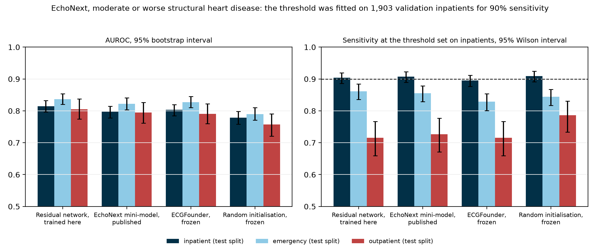

# Threshold generalisation across care settings and hospitals for ECG-AI diagnostic support

[REPORT.md](REPORT.md) · Ruben Abbou · 2026

An ECG model's decision threshold is set on one population and used on others. At Columbia, on EchoNext, a threshold set to recognise 90% of inpatients with moderate or worse structural heart disease recognised 71.6% to 72.7% of outpatients with it, for a network trained here, the published EchoNext mini-model and the ECGFounder foundation model. Over the same move specificity rose and the AUROC barely changed, 0.815 to 0.805 for the network trained here, so a report of AUROC by care setting does not show the loss. Milder disease among outpatients explains about a third of it. Refitting on 100 labelled outpatient ECGs, about 25 of them ill, brought coverage of the ill to 93.4% to 97.6%, at a cost in specificity. An infarction model carried from a German research corpus to two Chinese hospitals lost coverage at Chongqing, where the label definition also changes, and kept it at Shandong. A site adopting such a tool has to measure sensitivity within each diagnosis and care setting, on its own patients.



AUROC (left) and the sensitivity of the threshold set on inpatients (right) in each care setting of EchoNext's test split. Dashed: the 90% the threshold was set for.

## What a receiving site should measure

The share of ill patients a threshold recognises is a property of the threshold and the population together, and it moved between care settings of one hospital while the ranking of patients held. Measuring it needs labelled cases of the disease from the receiving site: the per-class thresholds of the trained network were infinite in 86.5% of draws refitted on 25 outpatient ECGs, and usable from 100.

The per-class conformal rule is no substitute for that measurement. For the ill, its threshold is the sensitivity threshold; the second threshold it adds sends some patients to a human with both labels. On outpatients it gave the disease label alone to 22.5% to 35.4% of the ill and referred 36.2% to 49.1% of them, and the share it referred fell from 42.3% to 29.4% while its coverage of the ill fell, so the one figure it reports without labels gave no warning.

This is a retrospective measurement study on public, de-identified data. It is not a medical device and has no regulatory status, it involved no contact with patients, and nothing here is meant to guide the care of any patient. The ethics approvals and the author's competing interests open [REPORT.md](REPORT.md).

## Design

EchoNext holds 100,000 ECGs from Columbia, each paired with an echocardiogram. Thresholds are fitted on 1,903 inpatient ECGs of its validation split and read on the inpatient, emergency and outpatient ECGs of its test split, one per patient, with no patient in two roles. Four models score every ECG: a residual network trained on EchoNext, the published EchoNext mini-model on its authors' weights, ECGFounder frozen under one logistic regression per finding, and the same residual network frozen at random initialisation as the floor.

The infarction study trains a residual network on PTB-XL, fits its thresholds on held-out PTB-XL patients, and carries them unchanged to Shandong and Chongqing. Five corpora then take the calibration role in turn on five rhythm and conduction diagnoses. [docs/data.md](docs/data.md) gives the corpora and the label mapping.

| Corpus | Country | Records in the release | Role |
|---|---|---|---|
| EchoNext | United States | 100,000 | structural heart disease, inpatients to outpatients |
| PTB-XL | Germany | 21,799 | infarction source; rotation |
| SPH (Shandong) | China | 25,770 | infarction target; rotation |
| ACS-ECG (Chongqing) | China | 19,955 | infarction target |
| Chapman-Shaoxing and Ningbo | China | 45,152 | rotation, as one source |
| Georgia | United States | 10,344 | rotation |
| CPSC 2018 and its extension | China | 10,330 | rotation |

EchoNext is under PhysioNet's restricted licence, so no tracing and no per-record score from it is in this repository; the results hold counts and aggregate figures only.

## Reproduce

Every number and figure the report prints is redrawn from files committed here, and `tests/test_report_numbers.py` holds the report and this page to those files. `outcomes.py`, `subgroups.py` and the other infarction tables need PTB-XL's `ptbxl_database.csv` (6.6 MB from PhysioNet), which holds each record's patient, sex and age; point `ECS_PTBXL_DIR` at the directory holding it.

```bash
uv sync                                     # 1 min
uv run pytest -m "not data"                 # unit tests and the report's numbers, no corpora, 2 min
uv run python scripts/echonext_outcomes.py  # results/echonext_outcomes.json from the coverage grid, 2 s
uv run python scripts/figures.py            # redraws every figure, 10 s
uv run python scripts/figures.py --lang fr  # five of them in French, *_fr.png
export ECS_PTBXL_DIR=/path/to/ptbxl         # the directory with ptbxl_database.csv
uv run python scripts/outcomes.py           # results/outcomes.json, 5 s
uv run python scripts/shift_table.py        # results/shift.json, 30 s
uv run python scripts/auxiliary.py          # results/auxiliary.json, 2 min
uv run python scripts/perturbations.py      # results/perturbations.json from the committed scores, 20 s
uv run python scripts/subgroups.py          # results/subgroups.json, 5 min
```

EchoNext's own steps need the distribution. Point `ECS_ECHONEXT_DIR` at it (default `~/data/echonext`); `ECS_ECHONEXT_DERIVED` (default `~/data/echonext-derived`) and `ECS_EMBEDDING_STORE` (default `~/data/ecg-embeddings`) receive what the scripts derive from it. `scripts/echonext_transfer.py` scores a model first when its scores are missing, which for the trained network is a training run; the two published models read their weights from `data/weights/`, each checked against the SHA-256 it had when it was fetched.

```bash
uv run python scripts/echonext_provenance.py   # results/echonext_provenance.json, 5 min on CPU
uv run python scripts/echonext_transfer.py     # the coverage grid, then echonext_outcomes.py
uv run python scripts/echonext_severity.py     # results/echonext_severity.json
uv run pytest -m data tests/test_echonext_data.py
```

Timings are wall clock on a six-core i7-8700, CPU only. Re-scoring from the raw tracings, the corpus downloads and the rotation chain are in [docs/data.md](docs/data.md).

## Code

| Module | Role |
|---|---|
| `src/ecs/conformal.py` | the three decision rules both studies compare (`fit_thresholds`), split conformal scores and quantiles, Mondrian quantiles, label-shift weighting, BBSE |
| `src/ecs/metrics.py` | coverage, the three outcomes of a case, Wilson and percentile intervals, set size, effective sample size |
| `src/ecs/splits.py` | splits by patient, the calibration halves every table draws, the patient bootstrap |
| `src/ecs/report.py` | coverage as a distribution over calibration draws, at one site and carried to others |
| `src/ecs/transfer.py` | EchoNext: thresholds fitted on inpatients and read on each care setting, the outcome split, the ladder of local labels |
| `src/ecs/severity.py` | EchoNext: severity of the ill and the reweighting to the inpatients' mix |
| `src/ecs/echonext.py` | EchoNext's files, one provenance row per tracing, and its inpatient, emergency and outpatient cohorts |
| `src/ecs/echonext_mini.py` | the published EchoNext mini-model, rebuilt to run its own checkpoint |
| `src/ecs/calibration.py` | calibration curve, slope and intercept, Brier score, net benefit and positive predictive value |
| `src/ecs/ingest.py` | every corpus read into one canonical form, and the patient of each record |
| `src/ecs/labels.py` | one comparable infarction label across three annotation schemes (SCP-ECG, AHA, discharge diagnosis) |
| `src/ecs/models.py` | the residual network and its batched probabilities |
| `src/ecs/small_set.py`, `src/ecs/challenge.py`, `src/ecs/rotation.py`, `src/ecs/duplicates.py` | the five rotation diagnoses, the Challenge-2021 partitions, the rotation splits and the repeated tracings |
| `src/ecs/encoders.py`, `src/ecs/arms.py`, `src/ecs/embedding_store.py` | the five encoder arms, their probes and their cached vectors |
| `src/ecs/provenance.py` | the producers and commit a results file records |
| `mappings/` | the three published code tables the label mapping joins on, with provenance and digests |

`pre-commit` runs `ruff`, `ruff format`, `mypy` and the unit tests, and CI runs them again on every push and pull request.

## Licence and citation

The code is MIT ([LICENSE](LICENSE)), with three exceptions. `third_party/ecg_jepa/` is vendored from Sehun Kim's ECG-JEPA release under MIT, with its own LICENSE. `third_party/ecgfounder/` is not covered by the root licence; its MIT and Apache 2.0 notices are in [PROVENANCE.md](third_party/ecgfounder/PROVENANCE.md). The HuBERT-ECG weights are CC BY-NC 4.0, and so is every number computed from them: `results/embeddings/hubert_ecg/` and the HuBERT-ECG rows of `results/arms.json` are for research use only.

The committed score files hold one row per record (identifier, label, score), derived data under each corpus's licence; [docs/data.md](docs/data.md) lists them. PTB-XL is CC BY 4.0, which requires attribution: cite Wagner et al. 2020 (doi:10.1038/s41597-020-0495-6), the PhysioNet resource (doi:10.13026/kfzx-aw45) and PhysioNet itself (Goldberger et al., Circulation 2000;101(23):e215–e220). To cite the study, use [CITATION.cff](CITATION.cff).

## Sources

- EchoNext: Poterucha et al., *Nature* 2025, 10.1038/s41586-025-09227-0
- EchoNext-Mini: Hughes et al., *NEJM AI* 2026, 10.1056/AIdbp2500516; dataset 10.13026/r9pp-3y42
- ECGFounder: Li et al., arXiv:2410.04133
- PTB-XL: Wagner et al., *Sci Data* 2020, 10.1038/s41597-020-0495-6
- SPH: Liu et al., *Sci Data* 2022, 10.1038/s41597-022-01403-5
- ACS-ECG: Du et al., *Sci Data* 2026, 10.1038/s41597-026-07278-0
- PhysioNet/CinC Challenge 2021: Reyna et al., Computing in Cardiology 2021, 10.23919/CinC53138.2021.9662687
- Split conformal: Angelopoulos & Bates, arXiv:2107.07511
- Label conditional validity: Vovk, ACML 2012, PMLR 25:475-490
- Conformal prediction under label shift: Podkopaev & Ramdas, UAI 2021, arXiv:2103.03323
- BBSE: Lipton, Wang & Smola, ICML 2018, arXiv:1802.03916
