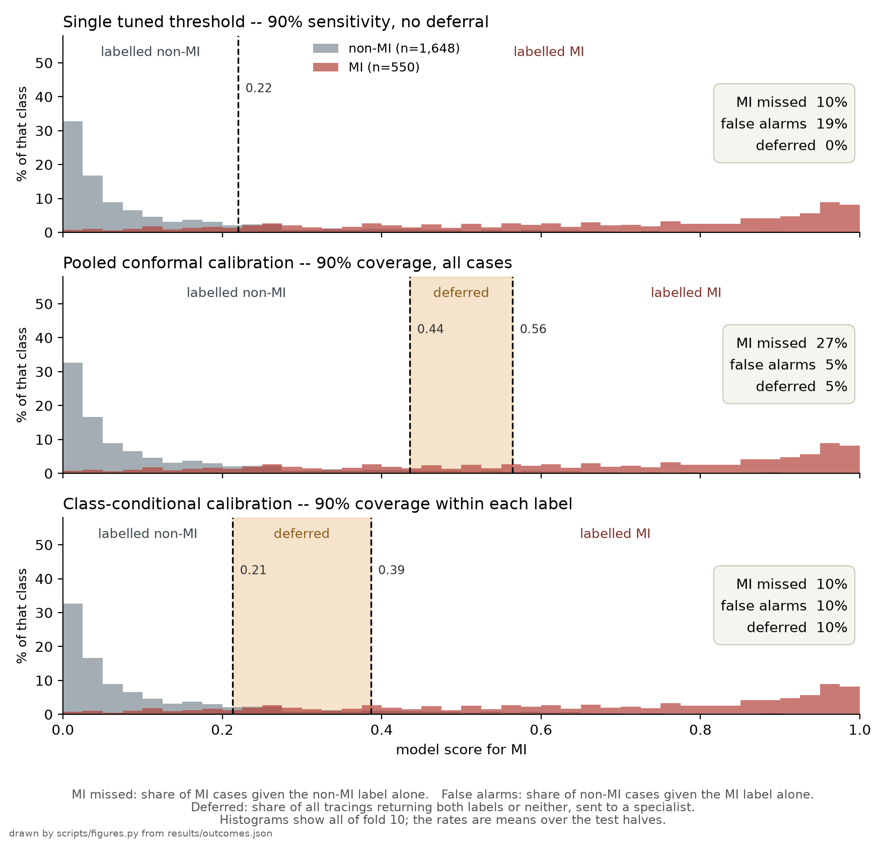
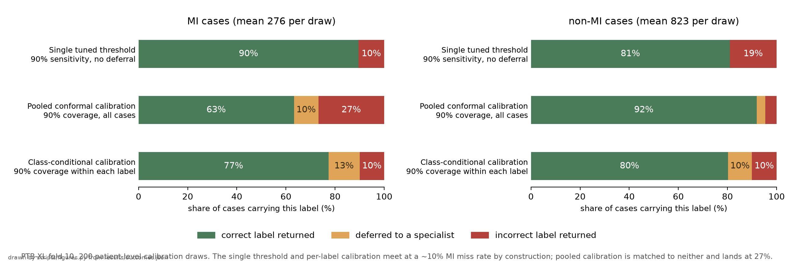
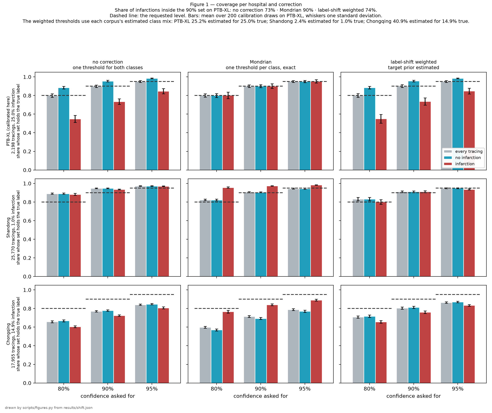

# Per-label conformal calibration of an ECG classifier under prevalence shift

PTB-XL · SPH · ACS-ECG · 45,923 tracings scored · working draft, 4 September 2026

## Abstract

**Background.** A binary diagnostic classifier returns one label per case by comparing a continuous score against a threshold fixed during validation, so the sensitivity and specificity that accompany that threshold describe the validation population rather than the model. Deployed where disease prevalence differs, the classifier will operate at different error rates, and a single-label output gives no indication that it has done so. Conformal prediction (CP) offers an alternative in which the model returns a set of admissible labels together with a distribution-free guarantee on the proportion of cases whose set contains the true label. That proportion is called coverage, and a 90% coverage target means that 90 cases in 100 should receive a set holding the correct answer; it is not a false-positive rate and not a sensitivity. The guarantee costs an exchangeability assumption between the calibration and deployment populations.

**Objective.** To measure what three ways of converting the same frozen scores into a clinical output deliver in per-label error terms, and how each behaves once its calibration threshold is transferred without adjustment to sites of markedly different disease prevalence. The proof of concept is detection of myocardial infarction (MI) from the 12-lead electrocardiogram (ECG).

**Methods.** A supervised residual network was trained on PTB-XL, a German research dataset, after which its scores were held fixed. Three schemes were compared: a single threshold tuned to 90% sensitivity with no deferral option, split CP with one threshold pair calibrated on the pooled calibration sample, and split CP with one threshold pair calibrated within each label, both conformal schemes at a 90% coverage target. The single threshold's 90% and the conformal 90% are different quantities, matched deliberately so that the resulting miss rates are comparable. Thresholds fitted on held-out PTB-XL patients were then applied without re-calibration to two Chinese hospital datasets at 1.0% and 14.9% MI prevalence, with coverage reported per label as a mean over 200 patient-level calibration draws. Throughout, an error rate is a share of all cases carrying that label, with deferred cases counted as neither correct nor wrong.

**Results.** At the source site, pooled CP met its 90% coverage target overall while covering only 73.2% of MI cases, and gave the non-MI label alone to 26.8% of them. It reaches that point at a 4.5% false-alarm rate, so it is not operating where the single tuned threshold is: placed at the same false-alarm rate, an ordinary threshold misses 36.7% of MI cases and gives the correct label alone to 63.3% of them, against pooled CP's 63.3%. The two therefore serve MI cases alike, and what pooled CP adds is that it defers about ten points of them rather than labelling them wrong. Calibrating within each label brought coverage to 90.0% within each, at an MI miss rate that matches the single threshold's by construction rather than by measurement, since both thresholds are the same quantile of the same MI scores; against the single threshold it lowers the false-alarm rate from 19.0% to 10.0%, and the nine points are exactly the 9.7% of non-MI cases it defers. Under transfer, coverage of MI cases rose to 93.6% at the low-prevalence site and fell to 72.5% at the acute-presentation site, where class-conditional calibration recovered it to 84.0% without reaching the 90% requested.

**Conclusion.** Pooled conformal calibration satisfies its stated guarantee while systematically under-serving the minority label: 90.0% of all cases against 73.2% of MI cases on a cohort at 25% prevalence. That gap is the finding, and it needs no comparator. Calibrating within each label closes it at the source site, and does so by declining to answer on about one case in ten rather than by classifying better. At neither target site did any scheme hold the requested coverage within the MI label without also moving what it refuses to answer, so the quantity a receiving site would have to measure for itself is the per-label coverage, not the overall one.

[README.md](README.md) documents the datasets and the reproduction commands. [QUESTIONS.md](QUESTIONS.md) answers the questions this study raises.

## 1. Introduction

Binary classifiers intended for clinical use report one label per case, obtained by comparing a continuous score against a threshold selected during validation, commonly to meet a sensitivity target or to maximise the sum of sensitivity and specificity. Because that threshold is chosen on a particular population, the operating characteristics it delivers are conditional on that population; a site whose patients differ in disease prevalence, presentation, acquisition hardware or annotation practice will obtain different error rates, and nothing in a single-label output reveals when this has happened.

Conformal prediction addresses the second half of that problem. Given any scoring model and a labelled calibration sample the model has not been trained on, split CP returns for each new case the set of labels that cannot be excluded at a requested confidence level, guaranteeing without distributional assumptions that the set contains the true label in a stated proportion of cases [1]. That proportion is the coverage, and it is the only quantity the guarantee constrains. In a two-label problem the output takes one of four forms: either label alone, both labels, or neither. The last two are deferrals, also called abstentions, and route the case to a specialist rather than to an automated label. They are not the same event clinically — a both-label set says the evidence admits either answer, an empty set says the case resembles nothing in the calibration data — and at the setting used throughout this report only the first can occur, for a reason given in section 2.2.

Two properties of the guarantee shape everything that follows. It holds only while the calibration and deployment populations remain exchangeable, meaning drawn from the same distribution, which is precisely the condition a change of site breaks. And it is marginal, meaning that it averages over cases rather than holding within any subgroup of them. Ninety per cent coverage therefore implies neither ninety per cent for a given patient nor ninety per cent among the patients who are ill.

On imbalanced data the marginal property has a known consequence: since the guarantee averages over the whole population, it can be satisfied while coverage within the minority label falls well below the requested level. Both variants below are split CP and differ only in the population each threshold is fitted on. Class-conditional CP avoids the failure by fitting one threshold within each label, which Vovk proves is valid conditionally on the label whatever the class proportions turn out to be, the threshold being fitted inside a taxonomy that partitions the calibration set by label [2]; the same construction is widely called Mondrian conformal prediction. A weighted alternative instead reweights the calibration cases toward the target population's estimated prevalence, with an asymptotic guarantee that depends on that estimate [3,4].

The empirical consequence is documented across several fields. In medical imaging, marginal coverage was met on a skin-lesion classifier while the melanoma class was under-covered and the nevus class over-covered [12]; two 2026 preprints report the same pattern, and its class-conditional repair, in virtual drug screening and across fifteen imbalanced tabular datasets [5,6]. Closest to this setting, a 2026 study of ICU arrhythmia classification from the photoplethysmogram found marginal coverage at 90.0% with critical-rhythm coverage at 7.5%, raised to 0.825 by class-conditional calibration and still uncertified at the patient level, and concluded that such systems should be evaluated by per-class and per-patient coverage [14]. The effect this report measures is therefore not in question; where it sits on the 12-lead ECG, and what happens to it when a calibration is carried to another hospital, is. A conference abstract by Dzikowicz and colleagues applies split, class-conditional and learn-then-test CP to acute MI on PTB-XL, reporting an AUROC of 0.923 without CP against 0.932 for split and 0.943 for class-conditional, with overall coverage falling to 84.8% and 86.7% respectively; it uses no dataset besides PTB-XL, reports coverage over all cases rather than within each label, and sets no tuned single threshold beside the conformal ones [7]. The second is a reader study in which 62 cardiologists, recruited from the mailing list of the Portuguese Society of Cardiology, interpreted 20 ECG Wave-Maven cases under single-valued against set-valued AI support, the sets carrying 95% confidence; it reports improved diagnostic accuracy under set-valued support, most in complex cases and among cardiologists with under ten years of experience. That measures how clinicians respond to prediction sets rather than how the sets themselves behave across sites [8].

Neither of those therefore answers the questions this report takes up. One study does calibrate Mondrian split CP on PTB-XL for MI with patient-wise splitting and then assess it on a second cohort, Chapman-Shaoxing, without re-calibration: El Allam and Hamlich report 10.44% empirical miscoverage against a 10% target in-distribution and 51.9% under that transfer, offered as a reliability monitor for a quantised model on embedded hardware [15]. Their published abstract reports that external figure as a single aggregate; it names no per-label breakdown, no deferral rate, and no comparison against a tuned single threshold, and the full text was not obtainable at the time of writing, so what their tables contain on those three points is unknown here. Searches of the ECG literature on 2 and 4 September 2026, repeated on 8 September across PubMed, arXiv, Crossref, OpenAlex, Google Scholar and OpenReview, found no other work measuring conformal coverage within each label across sites on the ECG. The first question is how a conformal threshold calibrated at one site behaves when it is transferred without re-calibration to sites at substantially different MI prevalence, measured within each label rather than over all cases. The second is how conformal schemes compare against an ordinary tuned threshold in the error terms a clinician uses, namely the miss rate, the false-alarm rate and the share of cases deferred. This report addresses both. Every technique it applies is established; what it adds is the measurement.

## 2. Methods

### 2.1 Datasets

Three public datasets were used, with PTB-XL serving as the training and calibration source while the two remaining datasets served as transfer targets. Each target was scored once, and no label from either entered any threshold.

| Dataset | Country, years | Tracings scored | MI prevalence | Role |
|---|---|---|---|---|
| PTB-XL [9] | Germany, 1989–96 | 2,198 | 25.0% | calibration, in-distribution test |
| SPH, Shandong [10] | China, 2019–20 | 25,770 | 1.0% | transfer target |
| ACS-ECG, Chongqing [11] | China, 2015–24 | 17,955 | 14.9% | transfer target |

Two properties differ between source and targets. MI prevalence falls from 25.0% to 1.0% in the Shandong dataset and to 14.9% in the Chongqing dataset, and the label definition differs as well. The Chongqing positive is that dataset's `AMI` column, set when the discharge diagnosis names an acute myocardial infarction, in a cohort every patient of which underwent coronary angiography; PTB-XL annotates ECG diagnoses, predominantly of older infarct patterns. Shandong codes infarction in the AHA scheme with separate modifiers for acute, recent and old, and 89.6% of its positives carry the old modifier, so its labels sit closer to PTB-XL's than Chongqing's do, though the remaining 10.4% are acute, recent or unmodified. Its shift is therefore the nearer of the two to a change in prevalence alone, while the Chongqing shift moves the definition of the positive class as well.

### 2.2 Model and calibration

A supervised residual network was trained on PTB-XL folds 1 to 8 and scored on fold 10, where its discrimination on the MI label is an area under the receiver operating characteristic curve (AUROC) of 0.932, with a 95% confidence interval of 0.921 to 0.943. The nearest published anchor for this architecture and split is 0.930, but that is a macro average over the five PTB-XL diagnostic superclasses rather than the MI column, which the benchmark does not report separately and whose archived predictions no longer resolve (`results/baseline.json` records both the anchor and the three routes tried to obtain the MI-only figure). The two are different quantities, so their agreement is a plausibility check on an ordinary baseline and not a reproduction. AUROC, the probability that a randomly selected MI tracing receives a higher score than a randomly selected non-MI tracing, is reported here to certify that the baseline is of ordinary and documented quality, and is not itself a study endpoint. The model was frozen thereafter, so that all three schemes operate on identical scores and any difference between them is a difference in threshold placement alone.

The three schemes were as follows. The **single tuned threshold** places one threshold on the calibration half to achieve 90% sensitivity, with every case receiving a label; this represents current practice. Its 90% is a sensitivity, whereas the 90% of the two conformal schemes is a coverage. The single threshold and class-conditional calibration meet at a comparable MI miss rate by construction and not by measurement: the class-conditional MI threshold is the 90% quantile of the calibration half's MI scores, which is the single threshold's 90%-sensitivity point, the two differing only by the finite-sample (n+1) correction. Pooled calibration is matched to neither, and where it lands is the result reported below. Both conformal schemes score a case by one minus the probability the model gives its label, the least-ambiguous-set score, and admit a label when that score falls at or below the ⌈(n+1)(1−α)⌉/n empirical quantile of the calibration scores, the (n+1) being what makes the guarantee hold in finite samples rather than asymptotically. At α = 0.10 that quantile is 0.568 on this model, and since two label probabilities sum to one, a set can be empty only when the quantile falls below 0.5: every deferral reported here is therefore a both-label set, and no empty set occurs. An adaptive-prediction-sets score is also computed in the results files and behaves differently, as section 5 notes. **Pooled conformal calibration** fits one threshold pair on all calibration cases, such that 90% of them receive a set containing the true label. **Class-conditional conformal calibration** fits one threshold within the MI cases of the calibration half and one within the remainder, so that the 90% holds separately within each label. A fourth scheme, label-shift weighting with the target prior estimated by black-box shift estimation, was also evaluated; because its effect was small and its prior estimate poor at the Chongqing site, it is reported in the results files rather than discussed here.

### 2.3 Evaluation

Every reported figure is a mean over 200 draws in which fold 10 was halved by patient, so that no patient contributed to both calibration and test, with standard deviations across draws recorded in the results files. Coverage is reported separately for each label as well as overall, and outcomes are decomposed into three exhaustive categories per label: the case received the correct label alone, the case was deferred, or the case received the incorrect label alone. Each is expressed as a share of all cases carrying that label, so that a miss rate and a false-alarm rate remain comparable across schemes with and without deferral; deferred cases are counted as neither correct nor wrong rather than excluded from the denominator. Each methodological commitment is enforced by a named test in the repository, including patient-level splitting, the absence of any hard-coded threshold, paired comparisons between encoders, and a test that fails if any target-dataset label reaches a threshold.

## 3. Results

### 3.1 Threshold placement

Figure 1 shows where each scheme places its thresholds on the score distribution of the source dataset. Pooled calibration places both thresholds substantially to the right of the single tuned threshold, because three quarters of the calibration population are non-MI cases and the requirement is stated over that population as a whole, so that serving the majority well is the cheapest way to satisfy it. Class-conditional calibration cannot make that trade, since each of its thresholds is answerable only to the label it governs.

Figure 1. Threshold placement on the model score for MI, PTB-XL fold 10. Grey: 1,648 non-MI cases. Coral: 550 MI cases. Dashed lines mark the fitted decision boundaries; the labelled bands give the resulting decision regions.

### 3.2 Per-label outcomes at the source site

Table 1 and figure 2 give the decomposition at the source site. Pooled conformal calibration satisfied its stated coverage, covering 90.0% of all cases, while covering only 73.2% of MI cases; it gave the non-MI label alone to 26.8% of them, against 10.4% under the single tuned threshold. Those two figures are the same row of `results/outcomes.json` and sum to 100: coverage counts the 63.26% given the correct label alone together with the 9.96% deferred. The guarantee was at no point violated, since it constrains the average case rather than the minority label.

Figure 2. Outcome decomposition by label at the source site, averaged over 200 patient-level calibration draws, on 550 MI and 1,648 non-MI cases. The two conformal schemes run at a 90% coverage target and the single threshold at 90% sensitivity. That places the single threshold and class-conditional calibration at a comparable MI miss rate by construction; pooled calibration is matched to neither and lands at 27%. Each share is of all cases carrying that label, and a deferred case counts as neither correct nor wrong.

Table 1. Source-site outcomes per 100 patients of each label, from `results/outcomes.json`.

| Outcome | Single threshold | Pooled CP | Class-conditional CP |
|---|---|---|---|
| MI case, labelled non-MI | 10 | 27 | **10** |
| MI case, deferred | 0 | 10 | 13 |
| Non-MI case, labelled MI | 19 | **5** | 10 |
| Non-MI case, deferred | 0 | 4 | 10 |

Class-conditional calibration returned coverage to 90.0% within each label in the same file. Measured against the single tuned threshold at a matched MI miss rate of approximately 10%, it reduced the false-positive rate from 19.0% to 10.0% while deferring 12.7% of MI cases and 9.7% of non-MI cases; measured against pooled calibration, it raised the false-positive rate from 4.5% to 10.0% while reducing missed infarctions from 26.8% to 10.0%. Which of the two trades is preferable depends on the cost of a missed infarction relative to an unnecessary workup, a judgement this design does not attempt.

### 3.3 Transfer to the two target sites

Thresholds fitted on PTB-XL were applied unchanged to both target datasets, whereupon coverage moved in opposite directions. At the Shandong site coverage of MI cases under pooled calibration reached 93.6%, above the 90% requested. The majority label has nothing to do with that figure: at a fixed threshold, coverage within the MI label depends only on the scores of MI cases, and what rose is that the MI cases there score further from the threshold than PTB-XL's do. Both labels over-cover at that site, the non-MI label at 94.8%, so a report of the overall figure alone would have read as a success. Class-conditional calibration, applied to a site that needed no repair, pushed MI coverage to 97.4%. At the Chongqing site coverage of MI cases fell to 72.5%, 17.5 points below the 90% requested, and class-conditional calibration lifted it to 84.0% without reaching the requested level. The non-MI label moved further at that site than the MI label did, from 95.5% at the source to 78.0% under pooled calibration and 69.4% under class-conditional calibration, so whatever changed at Chongqing did not act on the positive class alone. For comparison, the single tuned threshold fell from 89.6% sensitivity at the source to 83.7% at Chongqing, with specificity falling from 81.0% to 57.9%.

Figure 3. Coverage by site (rows) and calibration scheme (columns). Grey: all cases. Red: MI cases. Dashed line: requested coverage. Bars are means over 200 calibration draws, with whiskers at one standard deviation.

Class-conditional calibration did not restore the Chongqing site to the requested coverage because both corrections assume that only the label proportions change between sites. At Chongqing more than the proportions changed: the positive label is drawn from a discharge diagnosis of acute infarction rather than from the tracing, and both score distributions sit elsewhere than they do at the source, the negative one having moved the further of the two. A threshold fitted on German data tracks neither. This report does not separate the contributions of the label definition, the population, the recording hardware and the era, which differ together between the two sites; it measures the resulting gap. The score distributions per site that would show the movement directly are not plotted here.

## 4. Discussion

A coverage guarantee stated over a whole population is compatible with systematic failure inside a minority label, and on a cohort at 25% prevalence the gap was 90.0% against 73.2%. A single-number coverage claim on an imbalanced diagnosis is therefore close to uninformative about the label that matters clinically, and per-label reporting should be treated as the minimum standard for such a tool. On ECG this reproduces an effect already reported in medical imaging, where marginal coverage was met while the melanoma class was under-covered [12], and since in virtual drug screening and on fifteen imbalanced tabular datasets [5,6].

What that gap is not is evidence against conformal calibration as against an ordinary threshold, and the comparison is easy to draw wrongly. The two schemes sit at different points: pooled CP runs at a 4.5% false-alarm rate and the tuned threshold at 19.0%. Matched at pooled CP's false-alarm rate, an ordinary threshold gives the correct label alone to 63.3% of MI cases and pooled CP to 63.3%; the difference is that pooled CP defers about ten points of them instead of labelling them wrong. Read in the terms a clinician uses, the scheme this report recommends returns the MI label to 77.4% of MI cases where the single threshold returns it to 89.6%, the remainder being deferred rather than missed. Whether that is an improvement depends on what a deferral costs, which this design does not measure.

Calibrating within each label removes the source-site gap at no computational cost, and estimates only one quantile per label, the minority one resting on about 275 calibration cases. Against current practice it offers a lower false-positive rate at an unchanged miss rate, purchased by deferring roughly one case in ten to a specialist, so that whether the trade is favourable turns on the relative costs of a missed infarction, an unnecessary workup and a specialist read, none of which this design evaluates. On the narrower question of whether clinicians act better on a set than on a single label, the reader study above reports improved diagnostic accuracy under set-valued support, with Cohen's d of 0.53 on complex cases and 0.67 among cardiologists of under ten years' experience, and a further gain from adding a written explanation (d = 0.62). Its comparison was framed as non-inferiority against a margin of -0.20, to establish set-valued support as a viable alternative rather than a superior one, so it speaks to whether a deferral route is tolerable and not to what it costs [8].

Most relevant to deployment, neither conformal scheme prevented degradation at the harder target site, where the single tuned threshold degraded as well, losing six points of sensitivity and twenty-three of specificity. What distinguishes a conformal scheme is that it commits in advance to an explicit quantity a receiving site can test, namely the share of cases of each label whose set contains the true label. Estimating it is a question of how many cases of the rarer label a site can collect, not of how many tracings: pinning per-label coverage to within two points takes on the order of 864 MI cases, which is about 5,800 tracings at Chongqing's prevalence and some 86,000 at Shandong's. A site cannot read its own per-label coverage off a few hundred tracings, and this report does not measure how the estimate behaves at any target sample size, having calibrated only on PTB-XL. That coverage guarantees fail under domain and label shift, and that recalibration is the remedy, is already established for medical imaging [12], and the value of estimating a model's performance at a new hospital before clinical deployment has been argued there too, albeit through label-free accuracy estimation rather than by re-measuring coverage [13]. What this study supplies is the per-label magnitude on ECG. The two sites moved in opposite directions, and this design cannot say which of the several differences between them produced each move; a third site would be needed to test whether the stability of the positive-class definition predicts the direction.

## 5. Limitations

- **No outcome endpoint.** Deferral is reported as a rate rather than as a clinical benefit, since whether routing one case in ten to a specialist improves care depends on reader availability and turnaround, neither of which was measured.
- **Limited generality.** Two target sites, one diagnosis and one source dataset, with the two targets moving in opposite directions, so that neither the direction nor the magnitude of the effect extrapolates to a third site.
- **Confounded shift.** Acquisition hardware, population, era and label definition differ simultaneously between source and targets, so the design measures the resulting change without being able to attribute it to any single factor.
- **Marginal guarantee.** Coverage is an average over the cases of a label and supports no statement about an individual tracing, while the class-conditional guarantee is conditional on the true label, which is unknown at the point of care.
- **One score, one confidence level.** Everything reported here uses the least-ambiguous-set score at a 90% target. The results files also carry an adaptive-prediction-sets score and an 80% target, and neither is a cosmetic variation: under the adaptive score the source-site MI coverage reads 82.7% rather than 73.2% and the deferral rate is four times larger, and at the 80% target the ordering of the schemes on the MI miss rate no longer holds. The choice of 90% is conventional and is not defended here against any particular clinical cost.
- **Coverage, not predictive value.** Coverage says how often a set holds the truth within a label. It is not the probability that a case flagged MI is one, which is what a clinician reads off a positive result and which prevalence moves directly; at Shandong the recommended scheme's positive predictive value is 9.2%. No predictive value is reported in the tables.
- **Not a device.** This is a retrospective measurement study on public data, carrying no device claim, no outcome claim, no prospective patient contact and no regulatory status.

## References

1. Angelopoulos AN, Bates S. *A gentle introduction to conformal prediction and distribution-free uncertainty quantification.* arXiv:2107.07511.
2. Vovk V. *Conditional validity of inductive conformal predictors.* ACML 2012, PMLR 25:475–490. Proposition 3 gives label conditional validity for label conditional inductive conformal predictors.
3. Tibshirani RJ, Barber RF, Candès E, Ramdas A. *Conformal prediction under covariate shift.* NeurIPS 2019. The weighted conformal quantile the reweighting arm is built on.
4. Podkopaev A, Ramdas A. *Distribution-free uncertainty quantification for classification under label shift.* UAI 2021, PMLR 161:844–853. arXiv:2103.03323. Reweighting conformal prediction and calibration by importance weights estimated from unlabelled target data.
5. Tursunbadalov M, Tursunbadalov M. *A quiet failure in calibrated virtual screening: marginal conformal prediction under-covers the minority class, and a class-conditional fix recovers it.* arXiv:2607.06605, July 2026. Four molecular datasets; at a 90% global target, minority coverage falls to 64.8% on blood-brain-barrier penetration, 38.9% on a Tox21 endpoint and 4.2% on clinical-trial toxicity.
6. Singh M, Srikantha A, Lakhanpal S. *Cost-sensitive conformal prediction and human-in-the-loop abstention for imbalanced high-stakes decision support: a multi-domain benchmark.* arXiv:2607.27143, July 2026. Fifteen real-world imbalanced tabular datasets, seven models; marginal CP averages 30.5% minority coverage and Mondrian CP recovers 61.7 points of it.
7. Dzikowicz D, Garcia JJ, Zègre-Hemsey J, Kitzmiller R, Rogers D, Betts J, Bouvier M, Goyal A, Hu X, Xiao R. *Conformal prediction improves acute myocardial infarction identification from 12-lead ECGs: a practical deep learning application.* Conference abstract in *Abstracts: 50th International Congress on Electrocardiology*, Annals of Noninvasive Electrocardiology 2025;30(Suppl 1). doi:10.1111/anec.70099, PMCID PMC12234157. Read in full 2026-09-04 via PubMed Central; a one-paragraph meeting abstract, not a full paper.
8. Folgado D, Famiglini L, Campagner A, Dores H, Barandas M, Gamboa H, Cabitza F. *Conformal prediction for ECG interpretation: a study on human-AI collaboration in clinical decision support.* AIME 2025, LNAI 15734, pp. 140-149. doi:10.1007/978-3-031-95838-0_14. Read in full 2026-09-07. A reader study of 1,240 responses from 62 physicians, 27 assigned single-valued support and 35 set-valued; set-valued support improved diagnostic accuracy "particularly in complex cases (Cohen's d = .53) and for cardiologists with less than 10 years of experience (Cohen's d = .67)", and textual explanations improved it further (d = .62). The between-subject comparison is a non-inferiority test on Cohen's d against a margin of -0.20, with 95% intervals from BCa bootstrap over 5,000 resamples, asking "whether set-valued support is a viable alternative rather than a strictly superior approach". The recruitment channel, the 20-case Wave-Maven stimulus set and the 95% confidence level appear in the open supplementary material rather than the chapter, doi:10.5281/zenodo.15322935, read in full 2026-09-04 (§A.1, §A.3, Figure 2 caption).
9. Wagner P, Strodthoff N, Bousseljot R-D, Kreiseler D, Lunze FI, Samek W, Schaeffter T. *PTB-XL, a large publicly available electrocardiography dataset.* Scientific Data 2020. doi:10.1038/s41597-020-0495-6. Recorded by Schiller AG devices between October 1989 and June 1996, curated at the Physikalisch-Technische Bundesanstalt.
10. Liu H, Chen Dan, Chen Da, Zhang X, Li H, Bian L, Shu M, Wang Y. *A large-scale multi-label 12-lead electrocardiogram database with standardized diagnostic statements.* Scientific Data 2022. doi:10.1038/s41597-022-01403-5. 25,770 records from 24,666 patients, acquired at Shandong Provincial Hospital between 2019/08 and 2020/08.
11. Du X, Liu Y, Wang L, He W, Yang J, Bin G, Deng G. *A large-scale 12-lead electrocardiogram dataset for acute coronary syndrome prediction containing 19,955 ECGs.* Scientific Data 2026, doi:10.1038/s41597-026-07278-0; data at doi:10.6084/m9.figshare.29925314. Preoperative ECGs from 18,909 patients undergoing coronary angiography at the First Affiliated Hospital of Chongqing Medical University, December 2015 to May 2024.
12. Mehrtens H, Bucher T-C, Brinker TJ. *Pitfalls of conformal predictions for medical image classification.* In: Uncertainty for Safe Utilization of Machine Learning in Medical Imaging (UNSURE 2023, MICCAI workshop), LNCS, pp. 198–207. doi:10.1007/978-3-031-44336-7_20; preprint arXiv:2506.18162. German Cancer Research Center. Coverage under domain shift and label shift on CAMELYON17 and HAM10000, and the marginal against conditional coverage distinction: "The nevus class is over-covered, all other classes, including the melanoma class are undercovered, even though the overall coverage guarantee is met."
13. Lu C, Ahmed SR, Singh P, Kalpathy-Cramer J. *Estimating test performance for AI medical devices under distribution shift with conformal prediction.* arXiv:2207.05796, 2022. Estimates a black-box model's accuracy on an unlabelled target domain; argues for knowing performance "at new hospitals, patient populations, medical scanner equipment, etc. before actual clinical deployment".

14. Kinalioglu IH. *Conformal reliability assessment of PPG-based ICU arrhythmia classification under class imbalance and patient heterogeneity.* Physiological Measurement, 24 August 2026. doi:10.1088/1361-6579/ae92e8, PMID 42532108. MIMIC-III-Ext-PPG, 826 patients: "Under global CP, marginal coverage reaches 90.0%, yet critical-rhythm coverage is only 7.5%"; class-conditional calibration raises it to 0.825 with a patient-clustered interval of [0.578, 0.985]; concludes that "systems should be evaluated by per-class and per-patient coverage".

15. El Allam O, Hamlich M. *Quantization-aware Mondrian conformal prediction for embedded ECG classification.* Biomedical Signal Processing and Control 2026;127:111217. doi:10.1016/j.bspc.2026.111217. Preprint, same work: *Quantization-aware conformal prediction framework for trustworthy myocardial infarction detection*, SSRN doi:10.2139/ssrn.5944060, deposited 26 December 2025. Mondrian split CP on PTB-XL (n=21,837) with patient-wise splitting, generalisation assessed on Chapman-Shaoxing (n=24,749): "10.44% empirical miscoverage against a 10% target", and "External validation revealed distribution shift effects (51.9% miscoverage)". Abstract read 8 September 2026; the full text is paywalled and was not obtained.

References 1 to 13 were read in full: the AIME 2025 chapter [8] on 7 September 2026, the rest on 4 September 2026. Of the two added on 8 September, [14] was read as its published abstract and [15] as its SSRN abstract only.

## Data and code

Numbers: `results/outcomes.json` (per-label outcomes and decision boundaries), `results/shift.json` (coverage per site and correction), `results/arms.json` (encoders), `results/abstention.json`, `results/baseline.json`. The two tables are built by separate scripts that each draw their own 200 patient-level splits, so the same quantity can differ between them in the third digit; the source-site decomposition here is quoted from `outcomes.json` throughout and the per-site coverage from `shift.json`, and neither is mixed into a single sentence. `scripts/outcomes.py` builds the outcome table and `scripts/figures.py` redraws every figure, pixel for pixel, from a committed results file. Reproduction: `uv sync`, `uv run pytest`, `uv run python scripts/outcomes.py`, `uv run python scripts/figures.py`.
