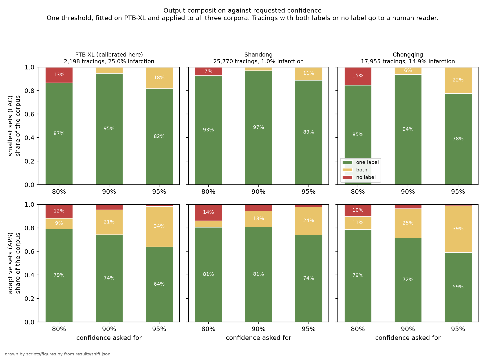
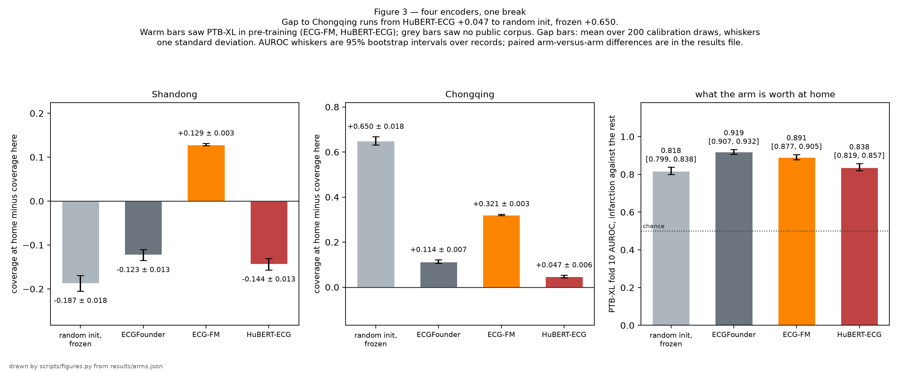
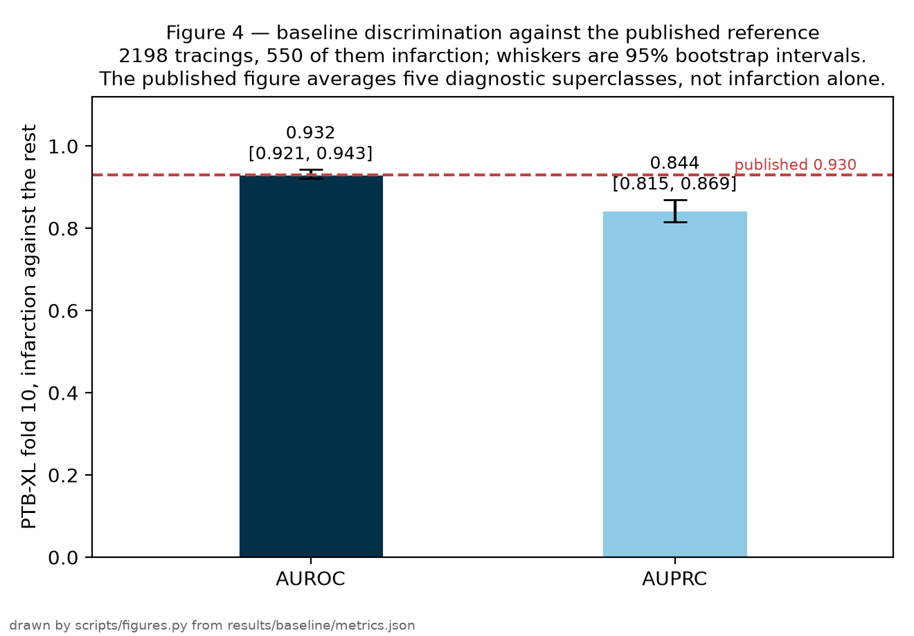

# Conformal coverage under a change of hospital

Deep ECG classifiers return a diagnosis without a statement of uncertainty. Split conformal prediction adds one: a prediction set guaranteed to contain the true label at a requested rate, at the cost of one assumption, that calibration and test patients are exchangeable. A change of hospital breaks that assumption, and the size of the resulting coverage loss had not been measured on ECG data. We calibrated a myocardial-infarction classifier on PTB-XL, a German corpus, froze the threshold and spent it once on two Chinese hospital corpora, SPH (Shandong) and ACS-ECG (Chongqing), repeating the measurement over four frozen encoders and two standard corrections. At an 80% target, overall coverage is 80.0% at the source, 89.1% in Shandong and 65.9% in Chongqing, and coverage of infarction cases at the source is 54.8%, a gap the overall average hides. Per-class calibration recovers most of the loss, raising infarction coverage at a 90% target from 73.5% to 90.1% at the source and from 72.5% to 84.0% in Chongqing; reweighting by an estimated class mix changes little.

[README.md](README.md) documents the corpora and the reproduction commands. [QUESTIONS.md](QUESTIONS.md) answers common questions about the study.

## Background

The classifier reads a resting 12-lead electrocardiogram and scores it for myocardial infarction, the electrical signature of a heart attack. Its output is a prediction set: the subset of the two labels, infarction and no infarction, that it cannot rule out at the requested confidence. Most tracings receive one label. A set with both labels means the model does not decide between them. An empty set means the tracing is unlike anything in the calibration data. In practice both cases mean that a human reads the tracing.

The threshold that determines what enters the set is fitted by split conformal prediction. A labelled sample that the model was not trained on, called the calibration set, is used to choose the threshold so that the sets contain the true label at the requested rate. The observed rate on new patients is called coverage. The guarantee holds under one assumption: calibration and test patients are exchangeable, meaning drawn from the same population.

The guarantee is marginal. It is an average over patients and over draws of the calibration set. 90% coverage does not mean 90% for a given patient, and does not by itself mean 90% within each diagnostic class.

## Cohorts and method

The classifier was trained on PTB-XL, a German research corpus. A threshold was fitted on PTB-XL calibration patients and applied unchanged to three test sets: held-out PTB-XL patients, the full SPH corpus (Shandong), and the full ACS-ECG corpus (Chongqing). Each external corpus was scored once. No external label was used to fit any threshold. Coverage figures are means over 200 draws of the calibration set, reported with their standard deviation (sd).

| Cohort | Country, years | Tracings scored | Infarction share | Role |
|---|---|---|---|---|
| PTB-XL | Germany, 1989–96 | 2,198 (fold 10) | 25.0% | calibration + in-distribution test |
| SPH (Shandong) | China, 2019–20 | 25,770 | 1.0%, mostly old infarcts | shifted test |
| ACS-ECG (Chongqing) | China, 2015–24 | 17,955 | 14.9%, acute, angiography-confirmed | shifted test |

Two things change between source and targets. The infarction share drops from 25.0% to 1.0% in Shandong and to 14.9% in Chongqing. The label definition also changes: Chongqing labels acute infarctions confirmed by angiography, while PTB-XL labels are ECG diagnoses, most of them older infarcts.

Three threshold variants were compared:

- none: a single threshold shared by both classes;
- Mondrian: one threshold per class, fitted within each class on PTB-XL; exact in finite samples under any change of class proportions, with nothing estimated;
- label-shift weighting: PTB-XL calibration points reweighted toward the target's class mix; the mix is unknown and is estimated from the model's own unlabelled predictions on that corpus (BBSE).

Each methodological commitment is enforced by a named test; the acceptance criteria in [PLAN.md](PLAN.md) map to tests in `tests/`.

- The supervised baseline reproduces a published benchmark value before any other measurement (figure 4).
- Every operating point is calibrated from data; no threshold is hard-coded.
- Discrimination is reported without choosing an operating point, with bootstrap confidence intervals. Comparisons between encoders are paired on the same tracings.
- Coverage is reported per class as well as overall.
- Splits are drawn by patient, so none appears on both sides of a calibration or test boundary.
- No target-corpus label reaches any threshold; a test fails if one does.

## Results

At the source hospital, overall coverage is 90.0% when 90% is requested, but coverage of infarction cases is 73.5% (sd 3.0). The overall average is dominated by the majority class. The per-class gap exists before any change of hospital; the class mix at each hospital determines how much of it the overall average hides.

At the external hospitals the uncorrected threshold moves in opposite directions. In Shandong, where 99% of tracings have no infarction, infarction coverage is 93.6% (sd 0.3), above the requested level. In Chongqing infarction coverage is 72.5% (sd 0.8), 17.5 points below the requested level.

The picture is the same at an 80% target: overall coverage is 80.0% at the source, 89.1% in Shandong and 65.9% in Chongqing, and infarction coverage at the source falls to 54.8% (sd 3.8). Figure 1 reports coverage at each requested level.

Mondrian calibration brings infarction coverage at the source to 90.1% (sd 2.5), a paired gain of +16.7 points (sd 2.6) over the uncorrected threshold. In Chongqing it adds +11.5 points (sd 1.0), reaching 84.0%. It costs wider sets, with mean set size at the source going from 1.05 to 1.11, and it leaves the minority class calibrated on 275 of 1,099 points.

Label-shift weighting changes little: +0.1 points at the source, +3.6 in Chongqing, and a loss of 2.3 points in Shandong. Its estimate of the class mix is poor on the harder target: 40.9% infarction estimated for Chongqing against 14.9% observed. Reweighting also reduces the effective calibration sample from 1,099 points to 864 in Shandong and 967 in Chongqing.

Figure 1. Coverage per hospital (rows) and correction (columns). Grey: all tracings. Red: infarction cases. Dashed line: requested coverage.

No correction restores Chongqing to 90%. Both corrections assume that only the class proportions change between hospitals. In Chongqing the label refers to a different clinical event, so the appearance of the positive class changes as well, and reweighting source data cannot compensate for that.

The sets themselves change with the requested confidence: as the target rises, single-label outputs give way to both-label sets, and at lower confidence the model abstains with empty sets instead.

Figure 2. Composition of the model's output at three confidence levels: one label, both labels, or none. The last two categories go to a human reader.

The encoder affects how far coverage falls. Across four frozen encoders, the coverage gap between source and Chongqing ranges from +0.047 to +0.650 at the 80% setting (figure 3). The encoder with no public corpus in its pre-training, ECGFounder, has the best source AUROC, 0.919 with 95% CI 0.907 to 0.932. The two encoders that included PTB-XL in their pre-training score lower at the source, so pre-training contamination produced no visible home advantage in this comparison.

Figure 3. Coverage gap between source and targets for four encoders. ECG-FM and HuBERT-ECG included PTB-XL in their pre-training corpora.

These measurements rest on a baseline of known quality: the supervised model reproduces a published benchmark value on the PTB-XL split (figure 4).

Figure 4. Discrimination of the supervised baseline on the PTB-XL benchmark split: AUROC 0.932, 95% CI 0.921 to 0.943, against a published reference of 0.930. AUROC is the probability that a randomly chosen infarction tracing receives a higher score than a randomly chosen non-infarction tracing.

## Limitations

- Generality: two target hospitals, one disease, one source corpus. The two targets moved in opposite directions; results at a further hospital cannot be extrapolated.
- Causes: device, population, era and label definition differ at the same time. This design measures the coverage change and cannot attribute it to any of them.
- Clinical validity: coverage is a population average, not a per-patient statement. The Mondrian guarantee is conditional on the true class, which is unknown at the point of care. This is not a medical device and was not tested in clinical use.
- The weighting arm: its class-mix estimate came from this model's own predictions, and a better estimator would give it a better result. The estimator (BBSE), its effective sample size and its estimates are reported next to each result.

## Data and code

The numbers in this report are stored under [`results/`](results/): `shift.json` (coverage per hospital and correction), `arms.json` (encoder comparison), `abstention.json` (abstention rates), `baseline.json` (baseline reference). `scripts/figures.py` regenerates the four figures from these files. Corpora: [PTB-XL](https://physionet.org/content/ptb-xl/1.0.3/) (PhysioNet, CC BY 4.0), [SPH](https://doi.org/10.1038/s41597-022-01403-5) (*Scientific Data*, CC0), [ACS-ECG](https://doi.org/10.6084/m9.figshare.29925314) (figshare, CC0). Methods: Angelopoulos & Bates, arXiv:2107.07511 (split conformal); Podkopaev & Ramdas, arXiv:2103.03323 (Mondrian under label shift); Tibshirani et al., NeurIPS 2019 (weighted conformal); Lipton et al., ICML 2018 (BBSE). Reproduction: `uv sync`, then `uv run pytest`, then `uv run python scripts/figures.py`.
