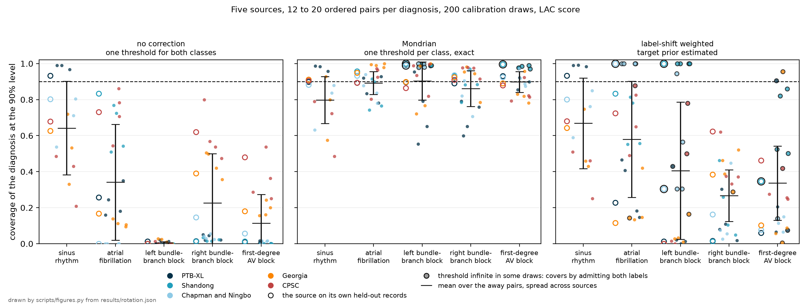
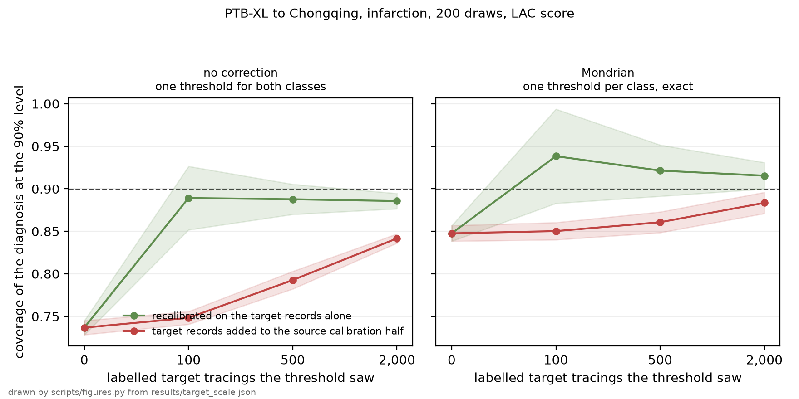

# Per-label conformal calibration of an ECG classifier across hospitals

Ruben Abbou

PTB-XL · SPH · ACS-ECG · 45,923 tracings scored across three corpora, with five corpora rotated through the calibration role in section 3.6 · draft of 9 September 2026

**Competing interests.** The author has worked at Idoven, which develops ECG analysis software. Idoven had no part in the design, conduct, funding or reporting of this study, took no view on its results, and none of its data, models or software were used.

**Funding.** None.

**Data.** All three datasets are public. PTB-XL and the four auxiliary PhysioNet corpora were downloaded on 23 August 2026; the Shandong dataset and the Chongqing dataset from figshare on the same date. Access dates and checksums are recorded in `scripts/fetch_open_corpora.sh` and `results/ingest_report.json`.

**Ethics.** This is a secondary analysis of three publicly released, de-identified ECG datasets, with no patient contact, and no further approval was sought. The approvals under which each dataset was released are as follows. PTB-XL: the Institutional Ethics Committee approved publication of the anonymous data in an open-access database, reference PTB-2020-1; the source publication states no participant consent procedure. SPH: approved by the Institutional Review Board of Shandong Provincial Hospital, with the requirement for individual patient consent waived and public sharing permitted after de-identification; no approval number is given. ACS-ECG: approved by the ethics committee of the First Affiliated Hospital of Chongqing Medical University, approval number 2024-256-01, with written informed consent waived as the study is retrospective and all patient identifiers removed. No attempt was made to re-identify any patient, and nothing this repository publishes would permit it.

**Not a device.** See section 5.

## Abstract

**Background.** A binary diagnostic classifier returns one label per case by comparing a continuous score against a threshold fixed during validation, so the sensitivity and specificity that accompany that threshold describe the validation population rather than the model. Deployed where disease prevalence differs, the classifier will operate at different error rates, and a single-label output gives no indication that it has done so. Conformal prediction (CP) offers an alternative in which the model returns a set of admissible labels together with a distribution-free guarantee on the proportion of cases whose set contains the true label. That proportion is called coverage, and a 90% coverage target means that 90 cases in 100 should receive a set holding the correct answer; it is not a false-positive rate and not a sensitivity. The guarantee costs an exchangeability assumption between the calibration and deployment populations.

**Objective.** To measure what three ways of converting the same frozen scores into a clinical output deliver in per-label error terms, and how each behaves once its calibration threshold is transferred without adjustment to sites of markedly different disease prevalence. The proof of concept is detection of myocardial infarction (MI) from the 12-lead electrocardiogram (ECG).

**Methods.** A supervised residual network was trained on PTB-XL, a German research dataset, after which its scores were held fixed. Three schemes were compared: a single threshold tuned to 90% sensitivity with no deferral option, split CP with one threshold pair calibrated on the pooled calibration sample, and split CP with one threshold pair calibrated within each label, both conformal schemes at a 90% coverage target. The single threshold's 90% and the conformal 90% are different quantities, matched deliberately so that the resulting miss rates are comparable. Thresholds fitted on held-out PTB-XL patients were then applied without re-calibration to two Chinese hospital datasets at 1.0% and 14.9% MI prevalence, with coverage reported per label as a mean over 200 patient-level calibration draws. The design was then repeated with each of five public corpora in the calibration role in turn, its thresholds spent unchanged on the other four, on five diagnoses annotated across all of them, and the number of labelled target records that repairs a transfer was measured on a ladder from none to 2,000. Throughout, an error rate is a share of all cases carrying that label, with deferred cases counted as neither correct nor wrong.

**Results.** At the source site, pooled CP met its 90% coverage target overall while covering only 73.2% of MI cases, and gave the non-MI label alone to 26.8% of them. It reaches that point at a 4.5% false-alarm rate, so it is not operating where the single tuned threshold is. Moving an ordinary threshold to that false-alarm rate makes the two agree on MI cases exactly, and by construction rather than by measurement: pooled CP's upper boundary is an ordinary threshold, and a case receives the MI label alone under either scheme when its score sits above it. What pooled CP adds at that operating point is the lower boundary, which turns about ten points of MI cases from wrong answers into deferrals. Calibrating within each label brought coverage to 90.0% within each, at an MI miss rate that matches the single threshold's by construction rather than by measurement, since both thresholds are the same quantile of the same MI scores; against the single threshold it lowers the false-alarm rate from 19.0% to 10.0%, and it defers 9.7% of non-MI cases to do it, so the nine points saved are the cases it declines to answer on rather than cases it now gets right; against pooled CP, which sits at 4.5%, the same scheme doubles the false-alarm rate. Which of the two comparators is in view changes the sign of the result, and both are given here whenever one is. Under transfer, coverage of MI cases rose to 93.6% at the low-prevalence site and fell to 72.5% at the angiography cohort, where class-conditional calibration recovered it to 84.0% without reaching the 90% requested. Across the rotation the gap appears at every source: reading their own held-out records the five corpora cover 90.1% of all cases under pooled calibration and 29.0% of the cases carrying the diagnosis asked about. Calibrating within each label repairs that at home, at 91.0%, and not on transfer, at 86.1%, over the pairs whose per-class threshold was finite; the three pairs that cover by abstaining take the same figures to 92.0% and 87.7%. The spread across calibrating corpora reaches 13 points and dwarfs the mean. Recalibrating on 100 labelled records from the harder target returned its infarction coverage from 73.7% to 88.9%.

**Conclusion.** Pooled conformal calibration satisfies its stated guarantee while systematically under-serving the minority label: 89.9% of all cases against 73.2% of MI cases on a cohort at 25% prevalence. That gap is the finding, and it needs no comparator. Calibrating within each label closes it at the source site, and does so by declining to answer on about one case in ten rather than by classifying better. At neither target site did any scheme hold the requested coverage within the MI label without also moving what it refuses to answer, so the quantity a receiving site would have to measure for itself is the per-label coverage, not the overall one. Rotating five corpora through the calibration role shows that gap to be a property of pooled calibration rather than of one dataset, and that how far a transferred threshold falls depends on which corpus calibrated more than on any average over transfers, so no single source-target pair supports either claim. What repaired a transfer was the receiving site's own labelled tracings, of which a hundred were enough here.

[README.md](README.md) documents the datasets and the reproduction commands. [QUESTIONS.md](QUESTIONS.md) answers the questions this study raises.

## 1. Introduction

Binary classifiers intended for clinical use report one label per case, obtained by comparing a continuous score against a threshold selected during validation, commonly to meet a sensitivity target or to maximise the sum of sensitivity and specificity. Because that threshold is chosen on a particular population, the operating characteristics it delivers are conditional on that population; a site whose patients differ in disease prevalence, presentation, acquisition hardware or annotation practice will obtain different error rates, and nothing in a single-label output reveals when this has happened.

Conformal prediction addresses the second half of that problem. Given any scoring model and a labelled calibration sample the model has not been trained on, split CP returns for each new case the set of labels that cannot be excluded at a requested confidence level, guaranteeing without distributional assumptions that the set contains the true label in a stated proportion of cases [1]. That proportion is the coverage, and it is the only quantity the guarantee constrains. In a two-label problem the output takes one of four forms: either label alone, both labels, or neither. The last two are deferrals, also called abstentions, and route the case to a specialist rather than to an automated label. They are not the same event clinically: a both-label set says the evidence admits either answer, an empty set says the case resembles nothing in the calibration data. Which of the two a scheme can produce is a property of its thresholds, and section 2.2 gives the condition.

Two properties of the guarantee shape everything that follows. It holds only while the calibration and deployment populations remain exchangeable, meaning drawn from the same distribution, which is precisely the condition a change of site breaks. And it is marginal, meaning that it averages over cases rather than holding within any subgroup of them. Ninety per cent coverage therefore implies neither ninety per cent for a given patient nor ninety per cent among the patients who are ill.

On imbalanced data the marginal property has a known consequence: since the guarantee averages over the whole population, it can be satisfied while coverage within the minority label falls well below the requested level. Both variants below are split CP and differ only in the population each threshold is fitted on. Class-conditional CP avoids the failure by fitting one threshold within each label, which Vovk proves is valid conditionally on the label whatever the class proportions turn out to be, the threshold being fitted inside a taxonomy that partitions the calibration set by label [2]; the same construction is widely called Mondrian conformal prediction. A weighted alternative instead reweights the calibration cases toward the target population's estimated prevalence, with an asymptotic guarantee that depends on that estimate [3,4].

The empirical consequence is documented across several fields. In medical imaging, marginal coverage was met on a skin-lesion classifier while the melanoma class was under-covered and the nevus class over-covered [12]; two 2026 preprints report the same pattern, and its class-conditional repair, in virtual drug screening and across fifteen imbalanced tabular datasets [5,6]. Closest to this setting, a 2026 study of ICU arrhythmia classification from the photoplethysmogram found marginal coverage at 90.0% with critical-rhythm coverage at 7.5%, raised to 82.5% by class-conditional calibration and still uncertified at the patient level, and concluded that such systems should be evaluated by per-class and per-patient coverage [14]. The effect this report measures is therefore not in question; where it sits on the 12-lead ECG, and what happens to it when a calibration is carried to another hospital, is. A conference abstract by Dzikowicz and colleagues applies split, class-conditional and learn-then-test CP to acute MI on PTB-XL, reporting an AUROC of 0.923 without CP against 0.932 for split and 0.943 for class-conditional, with overall coverage falling to 84.8% and 86.7% respectively; it uses no dataset besides PTB-XL, reports coverage over all cases rather than within each label, and sets no tuned single threshold beside the conformal ones [7]. The other is a reader study in which 62 cardiologists, recruited from the mailing list of the Portuguese Society of Cardiology, interpreted 20 ECG Wave-Maven cases under single-valued against set-valued AI support, the sets carrying 95% confidence; it reports improved diagnostic accuracy under set-valued support, most in complex cases and among cardiologists with under ten years of experience. That measures how clinicians respond to prediction sets rather than how the sets themselves behave across sites [8].

The effect has since been shown on the ECG, and by a study whose main subject is elsewhere. El Allam and Hamlich, calibrating a quantised classifier for a microcontroller, compared pooled against class-conditional calibration on PTB-XL over ten patient-wise rotations of a binary Normal-against-MI task at 36.4% MI: "pooled calibration achieved 91.64% Normal coverage and 88.59% MI coverage; Mondrian calibration achieved 90.65% and 90.53%, reducing the class-coverage gap from 3.06 to 0.12 percentage points", and they draw from it the conclusion this report reaches independently, that "nominal overall coverage from a pooled threshold can conceal clinically relevant MI undercoverage" [15]. The under-covering of the minority label at the calibration site, and its repair by fitting a threshold within each label, are therefore theirs first on this modality. Their second dataset does not extend to the question of transfer, and they say so twice: Chapman-Shaoxing "was evaluated in a separate in-distribution experiment", with training and calibration inside Chapman itself, so it "is not evidence that PTB-XL-derived thresholds transfer without recalibration" and "should not be interpreted as evidence of cross-database transfer".

What is left for this report is therefore narrower than a first reading of the literature suggests, and it is what the two questions below ask. No study measures per-label coverage after a threshold has been carried from one site to another without recalibration, none sets a tuned single threshold beside the conformal ones in the error terms a clinician uses, and none reports what the schemes decline to answer on. Searches of the ECG literature on 2 and 4 September 2026, repeated on 8 September across PubMed, arXiv, Crossref, OpenAlex, Google Scholar and OpenReview, found none, and the nearest study, above, states in its own words that it is not one. The first question is how a conformal threshold calibrated at one site behaves when it is transferred without re-calibration to sites at substantially different MI prevalence, measured within each label rather than over all cases. The second is how conformal schemes compare against an ordinary tuned threshold in the error terms a clinician uses, namely the miss rate, the false-alarm rate and the share of cases deferred. This report addresses both. Every technique it applies is established; what it adds is the measurement.

## 2. Methods

### 2.1 Datasets

Three public datasets were used, with PTB-XL serving as the training and calibration source while the two remaining datasets served as transfer targets. Each target was scored once, and no label from either entered any threshold.

| Dataset | Country, years | Tracings scored | MI prevalence | Role |
|---|---|---|---|---|
| PTB-XL [9] | Germany, 1989–96 | 2,198 | 25.0% | calibration, in-distribution test |
| SPH, Shandong [10] | China, 2019–20 | 25,770 | 1.0% | transfer target |
| ACS-ECG, Chongqing [11] | China, 2015–24 | 17,955 | 14.9% | transfer target |

Two properties differ between source and targets. MI prevalence falls from 25.0% to 1.0% in the Shandong dataset and to 14.9% in the Chongqing dataset, and the label definition differs as well. The Chongqing positive is that dataset's `AMI` column, set when the discharge diagnosis names an acute myocardial infarction, in a cohort every patient of which underwent coronary angiography; PTB-XL annotates ECG diagnoses, predominantly of older infarct patterns. Shandong codes infarction in the AHA scheme with separate modifiers for acute, recent and old, and 89.6% of its positives carry the old modifier, so its labels sit closer to PTB-XL's than Chongqing's do, though the remaining 10.4% are acute, recent or unmodified. Its shift is therefore the nearer of the two to a change in prevalence alone, while the Chongqing shift moves the definition of the positive class as well.

The counts above are what remained after reading. Each release is larger, and the difference is accounted for record by record rather than left to the reader.

| | PTB-XL | Shandong | Chongqing |
|---|---|---|---|
| Records in the release | 21,799 | 25,770 | 19,955 |
| No label released | 0 | 0 | 1,995 |
| Unreadable, or holding a non-finite sample | 0 | 0 | 5 |
| Read into canonical form | 21,799 | 25,770 | 17,955 |
| Held out for training, folds 1 to 8 | 17,418 | — | — |
| Held out for validation, fold 9 | 2,183 | — | — |
| **Scored** | **2,198** | **25,770** | **17,955** |
| MI cases among those scored | 550 | 260 | 2,679 |

Chongqing releases its labels for 17,960 of its 19,955 tracings; the remaining 1,995 form the corpus's own held-out split and carry no diagnosis column, so nothing here can be measured on them. Of the 17,960 labelled, three hold a non-finite sample and two do not decode, and all five are MI-negative, which is why the positive count is the release's own. Shandong loses no record: 6,928 of its tracings run longer than ten seconds and are cropped to the first ten. PTB-XL loses none either, and the three counts of its own benchmark split account for all 21,799. The five records dropped at read time are listed by identifier in `results/ingest_report.json`; the 1,995 unlabelled are the corpus's own released split and are not enumerated anywhere, having no diagnosis to record.

### 2.2 Model and calibration

A supervised residual network was trained on PTB-XL folds 1 to 8 and scored on fold 10, where its discrimination on the MI label is an area under the receiver operating characteristic curve (AUROC) of 0.932, with a 95% confidence interval of 0.921 to 0.943. The nearest published anchor for this architecture and split is 0.930, but that is a macro average over the five PTB-XL diagnostic superclasses rather than the MI column, which the benchmark does not report separately and whose archived predictions no longer resolve (`results/baseline.json` records both the anchor and the three routes tried to obtain the MI-only figure). The two are different quantities, so their agreement is a plausibility check on an ordinary baseline and not a reproduction. AUROC, the probability that a randomly selected MI tracing receives a higher score than a randomly selected non-MI tracing, is reported here to certify that the baseline is of ordinary and documented quality, and is not itself a study endpoint. The model was frozen thereafter, so that all three schemes operate on identical scores and any difference between them is a difference in threshold placement alone.

The model itself is a baseline and not a contribution, so it is described here in full and not discussed again.

| | |
|---|---|
| Architecture | one-dimensional ResNet after Wang et al. 2017, the shape the PTB-XL benchmark uses: a stem of one 15-wide convolution to 64 channels at stride 2 with batch normalisation and max pooling, then four stages of two residual blocks at widths 64, 128, 256 and 256 with 7-wide kernels, each stage after the first halving the time axis, then global average pooling and a linear head to two classes. 4,082,306 parameters |
| Input | 12 leads in the order I, II, III, aVR, aVL, aVF, V1 to V6, 500 Hz, ten seconds, 5,000 samples, in millivolts. One centre and one spread over all leads, taken from the training fold alone and applied unchanged everywhere: -0.00078 mV and 0.23707 mV |
| Objective | cross-entropy, unweighted. No class weighting, no resampling, no augmentation of any kind |
| Optimiser | AdamW, learning rate 10⁻³, weight decay 10⁻², batch size 64 |
| Stopping | at most 15 epochs, stopping after 3 without a better validation AUROC on fold 9. Epoch 7 was the best and was kept, so the run stopped at epoch 10 |
| Seed | 0, for the weights and for the batch order |
| Hardware and time | six-core Intel i7-8700, CPU only, six threads, PyTorch 2.2.2 on Python 3.11.15; 9,470 seconds, two hours thirty-eight |
| Determinism | the seed fixes a run at a given thread count, and the thread count is part of the seed. Two runs of the training step agree bit for bit at one thread and at four; a one-thread run and a four-thread run of the same seed differ in every one of the 62 parameter tensors after six batches, by up to 4·10⁻³. Reproducing the checkpoint therefore needs the six threads the machine line records, and reproducing the AUROC to its third decimal does not |
| What it reports | one probability per class for the MI label. AUROC 0.932, 95% interval 0.921 to 0.943; area under the precision-recall curve 0.844, 0.815 to 0.869; on fold 10, 2,198 tracings, 550 of them MI |
| What it is for | supplying frozen scores so that three threshold placements can be compared on identical inputs |
| What it is not for | any clinical use, any diagnosis other than MI, and any site: it was fitted on one German research corpus recorded between 1989 and 1996, and section 3.3 measures what happens when its thresholds are carried elsewhere |

Every value above is recorded in `results/baseline/config.json` and `results/baseline/metrics.json`, or is the setting `scripts/train_baseline.py` applies, with two exceptions: the parameter count is a property of the architecture, recorded in `results/timing.json`, and the determinism row reports a probe of the training step rather than a setting of the run.

The three schemes were as follows. The **single tuned threshold** places one threshold on the calibration half to achieve 90% sensitivity, with every case receiving a label; this represents current practice. Its 90% is a sensitivity, whereas the 90% of the two conformal schemes is a coverage. The single threshold and class-conditional calibration meet at a comparable MI miss rate by construction and not by measurement: the class-conditional MI threshold admits MI above the point below which 10% of the calibration half's MI probabilities fall, which is the single threshold's 90%-sensitivity point, the two differing only by the finite-sample (n+1) correction. Pooled calibration is matched to neither, and where it lands is the result reported below. Both conformal schemes score a case by one minus the probability the model gives its label, the least-ambiguous-set score, and admit a label when that score falls at or below the ⌈(n+1)(1−α)⌉/n empirical quantile of the calibration scores, the (n+1) being what makes the guarantee hold in finite samples rather than asymptotically. Since two label probabilities sum to one, a set comes back empty only when the two thresholds admitting each label sum to less than one. At α = 0.10 on this model they do not: the pooled scheme puts a single threshold at 0.566, and the class-conditional pair at 0.388 and 0.787, summing to 1.18. Every deferral in the two schemes discussed below is therefore a both-label set. The weighted scheme is the exception, and section 3.3 says where. An adaptive-prediction-sets score is also computed in the results files and behaves differently, as section 5 notes. **Pooled conformal calibration** fits one threshold pair on all calibration cases, such that 90% of them receive a set containing the true label. **Class-conditional conformal calibration** fits one threshold within the MI cases of the calibration half and one within the remainder, so that the 90% holds separately within each label. A fourth scheme, label-shift weighting with the target prior estimated by black-box shift estimation, was also evaluated. Its result is reported in section 3.3 rather than set aside, because a correction that has to estimate something failing where one that estimates nothing holds is part of the answer and not an aside.

### 2.3 Evaluation

Every reported figure is a mean over 200 draws in which fold 10 was halved by patient, so that no patient contributed to both calibration and test, with standard deviations across draws recorded in the results files. Coverage is reported separately for each label as well as overall, and outcomes are decomposed into three exhaustive categories per label: the case received the correct label alone, the case was deferred, or the case received the incorrect label alone. Each is expressed as a share of all cases carrying that label, so that a miss rate and a false-alarm rate remain comparable across schemes with and without deferral; deferred cases are counted as neither correct nor wrong rather than excluded from the denominator. Three commitments are enforced by named tests in the repository: patient-level splitting, which fails if a record-level split is substituted; a test that fails if any target-dataset label reaches a threshold, checked by injecting two kinds of leak; and the recomputation of every published figure from the raw scores by an implementation that does not import the one under test. The standard deviations recorded across draws describe the spread of the calibration draw and not the sampling error of the cohorts, which is the larger quantity at the target sites; section 5 returns to this. Coverage inside sex and age was measured on those same draws, on the same three schemes and with the same definition of coverage, in bands wide enough that both labels appear in every one of them. PTB-XL records sex as male or female and stores every age above 89 as 300 for privacy [9], so those records sit in the oldest band rather than in one of their own. Because the spread across draws carries none of a subgroup's own sampling error, the intervals quoted with every subgroup figure come from a separate bootstrap of 2,000 replicates, each of which resamples the patients of fold 10 with replacement before halving them, refits every threshold and evaluates on the half it kept back; a difference between two subgroups is formed inside each replicate, so its interval is on the paired difference rather than on the distance between two separately quoted intervals. `scripts/subgroups.py` writes `results/subgroups.json`, and a test recomputes all fifty-four of its cells from the raw scores without importing it. Four acquisition faults were then applied to the same fold and scored through the same model. The first exchanges the left and right arm electrodes, the commonest placement error, which Einthoven's and Goldberger's definitions turn into a determinate relabelling: lead I becomes its own negative, II and III exchange, aVR and aVL exchange, aVF is untouched, and so are the chest leads, since Wilson's central terminal is the mean of the three limb electrodes and does not move. The second and third scale every lead by 0.8 and by 1.25, a calibration set to the wrong standard. The fourth adds a 0.3 Hz sinusoid of 0.5 mV to every lead with the phase drawn per record, which is respiration and electrode drift. A fifth condition inverts the polarity of every lead. In each case the thresholds are fitted on a clean calibration half, as they would be at a site that calibrated before the fault appeared, and spent on the perturbed half. `scripts/perturbations.py` writes `results/perturbations.json` and the six score arrays it rests on; its unperturbed condition is scored through that same path and agrees with `results/baseline/scores.npz` to 1.2 × 10⁻⁷, which is what makes the differences below the fault rather than the pipeline. Six further quantities are argued from in sections 4 and 5 and none of them belongs in a results table: the interval on the difference between two schemes, the reject rule the discussion compares against, the size of the finite-sample correction, the cases a site would need to measure its own coverage, the predictive value at each site, and the interval Shandong's own MI cases support. `scripts/auxiliary.py` computes all six from the committed scores and writes `results/auxiliary.json`. The interval on a difference is a percentile interval over 2,000 replicates that resample the source patients before halving them and resample each target cohort as well, so it carries the cohorts' sampling error; at the targets the resampling is by record rather than by patient, the committed score files carrying no patient identifier. In both corpora the distinction is small: the scored cohorts are 25,770 tracings from 24,666 patients at Shandong and 17,955 from 17,018 at Chongqing.

### 2.4 The source rotation

One calibration source and two targets give two ordered pairs, which cannot separate a property of conformal prediction under a change of hospital from a property of PTB-XL and Chongqing. Five corpora were therefore rotated through the source role: PTB-XL, Shandong, Chapman-Shaoxing with Ningbo, Georgia, and CPSC 2018 with its extension, the last three read from the PhysioNet/CinC Challenge 2021 collection. Each was trained and calibrated on its own records and its thresholds spent once, unchanged, on the test part of each of the other four.

Infarction is not available across those corpora, so the rotation runs on five diagnoses that are: sinus rhythm, atrial fibrillation, left bundle-branch block, right bundle-branch block and first-degree atrioventricular block. Each is treated as its own binary problem against the rest, so coverage of a diagnosis is the same quantity the infarction axis reports. The corpora annotate in three schemes, and `results/label_map.json` records the mapping onto those five classes together with its counts. Those counts reproduce the Challenge's own published per-partition figures exactly: published minus measured minus the records carrying both halves of a fused pair is zero for every class on every one of its four corpora. Five joins could not be made cleanly and each is recorded rather than settled quietly, among them Shandong's "Normal ECG", which is a statement about a whole tracing where the Challenge's "sinus rhythm" is a statement about the rhythm, so that class is refused on Shandong and the rotation carries twelve ordered pairs for it against twenty for the others.

Three of the five corpora file the same tracing under more than one record identifier, and the Challenge collection ships no patient key, so a split by patient treated each copy as a separate patient. Screening the first ten seconds of the twelve canonical leads, quantised to ten microvolts, found 485 groups of identical tracings sitting in two parts a figure is read across, 421 of them in CPSC, 56 in Georgia and 8 in Chapman-Shaoxing with Ningbo, some straddling the boundary between training and test. The splitting unit is therefore the transitive closure over same patient and same recording, and `results/split_leak.json` reports the count before and after, which is zero. Shandong repeats 168 tracings and files them under one patient, so its split already held them; PTB-XL's distribution repeats none. On the 49,199 records this screen and the one published by the delivery corpus both cover, the two digests agree on every record. No group of this screen spans two of the five corpora, so no source-target pair shares a recording, which is a condition no split inside a corpus could have repaired.

Train and calibration parts are capped at the size the smallest corpus reaches, 3,500 and 2,000 records, so that a source is not advantaged by the size of its corpus. A corpus is scored on the same test part whether it is acting as source or as target. Coverage is reported per diagnosis under the three corrections of section 2.2, as a mean over 200 calibration draws.

Two quantities accompany it. The spread over calibration draws describes the threshold and not the population, so each target cohort is also resampled by patient, 2,000 times, for a percentile interval; both are in `results/rotation_uncertainty.csv`, which repeats every row by sex and by four age bands and flags a cell resting on fewer than 25 cases of the diagnosis. And because class-conditional calibration is a per-class quantile, the same file reports what a rejection rule with one plain empirical quantile per class reaches on the same scores, which is the construction of section 4 minus the finite-sample correction.

## 3. Results

### 3.1 Threshold placement

Figure 1 shows where each scheme places its thresholds on the score distribution of the source dataset. Pooled calibration places both thresholds substantially to the right of the single tuned threshold, because three quarters of the calibration population are non-MI cases and the requirement is stated over that population as a whole, so that serving the majority well is the cheapest way to satisfy it. Class-conditional calibration cannot make that trade, since each of its thresholds is answerable only to the label it governs.

Figure 1. Threshold placement on the model score for MI, PTB-XL fold 10. Grey: 1,648 non-MI cases. Coral: 550 MI cases. Dashed lines mark the fitted decision boundaries; the labelled bands give the resulting decision regions.

### 3.2 Per-label outcomes at the source site

Table 1 and figure 2 give the decomposition at the source site. Pooled conformal calibration satisfied its stated coverage, covering 89.9% of all cases, while covering only 73.2% of MI cases; it gave the non-MI label alone to 26.8% of them, against 10.4% under the single tuned threshold. That 26.8% and the 73.2% above it are the same row of `results/outcomes.json` and sum to 100: coverage counts the 63.26% given the correct label alone together with the 9.96% deferred. The guarantee was at no point violated, since it constrains the average case rather than the minority label.

Figure 2. Outcome decomposition by label at the source site, averaged over 200 patient-level calibration draws. Fold 10 holds 550 MI and 1,648 non-MI cases, of which each draw scores about half, the figure's own note giving the per-draw means. The two conformal schemes run at a 90% coverage target and the single threshold at 90% sensitivity. That places the single threshold and class-conditional calibration at a comparable MI miss rate by construction; pooled calibration is matched to neither and lands at 27%. Each share is of all cases carrying that label, and a deferred case counts as neither correct nor wrong.

Table 1. Source-site outcomes per 100 patients of each label, from `results/outcomes.json`.

| Outcome | Single threshold | Pooled CP | Class-conditional CP |
|---|---|---|---|
| MI case, labelled non-MI | 10 | 27 | **10** |
| MI case, deferred | 0 | 10 | 13 |
| Non-MI case, labelled MI | 19 | **5** | 10 |
| Non-MI case, deferred | 0 | 4 | 10 |

Class-conditional calibration returned coverage to 90.0% within each label in the same file. Measured against the single tuned threshold at a matched MI miss rate of approximately 10%, it reduced the false-alarm rate from 19.0% to 10.0% while deferring 12.7% of MI cases and 9.7% of non-MI cases. Those nine points are not cases it now gets right. The share of non-MI cases given the correct label alone falls at the same time, from 81.0% to 80.3%, so the 9.7 points deferred account for the 9.0 points of false alarms removed with 0.7 to spare: the deferrals are 107.8% of the gain. The second threshold moves non-MI cases out of the wrong column and into the deferred one, and moves none into the right one. Measured against pooled calibration, it raised the false-alarm rate from 4.5% to 10.0% while reducing missed infarctions from 26.8% to 10.0%. Put in the terms a clinician acts on, the two conformal schemes withhold an MI flag from more infarct patients than the single threshold does, and the withholding is of different kinds: adding the missed to the deferred, 22.6% of infarcts leave class-conditional calibration without an MI flag and 36.7% leave pooled calibration without one, against 10.4% under the single tuned threshold. Which of the three trades is preferable depends on the cost of a missed infarction relative to an unnecessary workup and to a specialist read, a judgement this design does not attempt.

### 3.3 Transfer to the two target sites

Thresholds fitted on PTB-XL were applied unchanged to both target datasets, whereupon coverage moved in opposite directions. At the Shandong site coverage of MI cases under pooled calibration reached 93.6%, above the 90% requested. The majority label has nothing to do with that figure: at a fixed threshold, coverage within the MI label depends only on the scores of MI cases, and what rose is that the MI cases there score further from the threshold than PTB-XL's do. Both labels over-cover at that site, the non-MI label at 94.8%, so a report of the overall figure alone would have read as a success. Class-conditional calibration, applied to a site that needed no repair, pushed MI coverage to 97.4%. At the Chongqing site coverage of MI cases fell to 72.5%, 17.5 points below the 90% requested, and class-conditional calibration lifted it to 84.0% without reaching the requested level. The non-MI label moved further at that site than the MI label did, from 95.5% at the source to 78.0% under pooled calibration and 69.4% under class-conditional calibration, so whatever changed at Chongqing did not act on the positive class alone. Those coverages are not comparable with a sensitivity, and the two should be set side by side in the same terms. At Chongqing the single tuned threshold returns the MI label to 83.7% of MI cases; class-conditional calibration returns it to 74.6% and defers a further 9.4%, which is what its 84.0% coverage is made of. At Shandong the single threshold returns it to 97.3% and class-conditional calibration to 95.0%, deferring 2.4%. So at both target sites the ordinary threshold labels more infarctions correctly than either conformal scheme does, and the conformal schemes convert part of the difference into deferrals rather than into correct answers. Adding the missed infarcts to the deferred ones as at the source, 25.4% of Chongqing's infarct patients leave class-conditional calibration with no MI flag against 16.4% under the single threshold, and at Shandong 5.1% against 2.7%. The other label moves against the recommended scheme at that site: class-conditional calibration flags 30.7% of Chongqing's non-MI patients as MI and defers a further 12.0%, where pooled calibration flags 22.1% and defers 6.0%. At the site the report calls the harder one, the scheme it recommends is the worse of the two conformal schemes on false alarms. For completeness the single threshold's specificity fell from 81.0% at the source to 57.9% at Chongqing, so it degrades too, on the axis the coverage figures do not show.

Figure 3. Coverage by site (rows: PTB-XL 2,198 tracings, Shandong 25,770, Chongqing 17,955) and calibration scheme (columns: no correction, class-conditional, label-shift weighted; the third is the label-shift weighted scheme of section 3.3). Within each panel the horizontal axis is the confidence asked for. Grey: all cases. Blue: non-MI cases. Red: MI cases. Dashed line: requested coverage. Bars are means over 200 calibration draws of PTB-XL, and the whiskers are one standard deviation across those draws, which is the spread of the calibration and not the sampling error of the site.

The weighted scheme is the one that had to estimate the target's class mix, and its estimate was poor: 40.9% MI at Chongqing against 14.9% observed, and 2.4% at Shandong against 1.0%. Reweighting also spends calibration data, the effective sample size falling from 1,099 points to 967 at Chongqing and 864 at Shandong. Paired on the same draws it gained 0.1 points of MI coverage at the source where class-conditional calibration gained 16.7 on those same draws, and at Shandong it lost 2.3 points and produced empty sets on 4.3% of tracings. An asymptotic guarantee resting on an estimated prior bought nothing here that an exact finite-sample construction resting on none did not buy more cheaply.

Class-conditional calibration did not restore the Chongqing site to the requested coverage because both corrections assume that only the label proportions change between sites. At Chongqing more than the proportions changed: the positive label is drawn from a discharge diagnosis of acute infarction rather than from the tracing, and both score distributions sit elsewhere than they do at the source, the negative one having moved the further of the two. A threshold fitted on German data tracks neither. This report does not separate the contributions of the label definition, the population, the recording hardware and the era, which differ together between the two sites; it measures the resulting gap. The score distributions per site that would show the movement directly are not plotted here.

### 3.4 Coverage inside sex and age

The guarantee class-conditional calibration delivers is conditional on the label. Nothing in it holds within a subgroup of a label, and on this fold it does not. Table 2 gives what the recommended scheme returns to each sex and each age band, within each label, with the bootstrap interval beside every figure.

Table 2. Coverage within each label under class-conditional calibration, PTB-XL fold 10, from `results/subgroups.json`. Counts are of the whole fold; each draw scores about half of it. Intervals are 95% percentile intervals over 2,000 patient-level bootstrap replicates. The under-50 MI row rests on 38 cases, about nineteen per draw, and its upper limit is the ceiling the bootstrap can reach rather than an estimate.

| Subgroup | Tracings (MI) | MI coverage | Non-MI coverage |
|---|---|---|---|
| Under 50 | 521 (38) | 88.9 [69.2, 100.0] | 97.9 [95.4, 99.6] |
| 50 to 64 | 629 (133) | 88.2 [78.8, 95.3] | 89.5 [85.3, 93.9] |
| 65 to 74 | 496 (147) | 87.7 [77.7, 95.8] | 89.0 [82.7, 94.0] |
| 75 and over | 552 (232) | 92.7 [86.6, 98.0] | 79.7 [71.5, 87.7] |
| Men | 1,132 (297) | 92.1 [86.8, 97.0] | 90.4 [86.9, 93.9] |
| Women | 1,066 (253) | 87.6 [79.8, 94.2] | 89.6 [85.6, 93.4] |

Across age the scheme is not flat, and the direction is the opposite of the one a reader expects. Coverage over all cases falls from 97.3% under 50 to 85.2% at 75 and over, a gap of 12.1 points with an interval of 6.9 to 17.3. That gap is not a failure on infarct patients: within the MI label coverage runs the other way, 88.9% to 92.7%, a difference of 3.8 points whose interval, -9.2 to 22.5, settles nothing. The whole of the age gradient sits in the non-MI label, 97.9% to 79.7%, a fall of 18.2 points with an interval of 10.2 to 26.3. The figure over all cases also mixes in a change of composition, MI prevalence in the fold rising from 7.3% under 50 to 42.0% at 75 and over, so it should not be read as either label's coverage. A non-MI case whose set does not cover it has been given the MI label alone, so what the age gradient says is that the scheme over-calls infarction in the old: 20.3% of non-MI patients aged 75 and over are labelled MI, against 2.1% under 50. A receiving site would take from this that its oldest patients without infarction are the ones most often told they are infarcting.

Across sex the scheme narrows a gap that pooled calibration opens, and neither the gap nor its repair is established on this cohort. Under pooled calibration, coverage of MI cases is 78.5% in men and 66.9% in women, a difference of 11.6 points whose interval, -0.2 to 22.6, does not exclude zero. Class-conditional calibration brings the same difference to 4.5 points, interval -2.5 to 12.3. The point estimates say the minority-label deficit falls harder on women and that fitting a threshold within each label removes most of it; the intervals say fold 10 cannot settle either claim, holding 253 female MI cases of which each draw scores about half. Nothing here licenses a subgroup claim, and that is the useful result: a cohort large enough to certify per-label coverage is not large enough to certify it inside a subgroup, and a site that adopts per-label reporting on this report's argument still does not know what its tool delivers to its women or to its oldest patients.

### 3.5 What an acquisition fault does, and whether anything notices

A site does not decide to change its input distribution. It swaps two cables, sets a gain to the wrong standard, or records over a wandering baseline. Without labels the only quantity a deployed conformal scheme emits is the share of tracings it defers, so the question is whether that share moves when the input breaks. Table 3 applies four faults and an inversion to the source fold, with thresholds fitted before the fault.

Table 3. Class-conditional calibration under acquisition faults, PTB-XL fold 10, from `results/perturbations.json`. Coverage and deferral are means over the same 200 patient-level draws; AUROC is over the whole perturbed fold.

| Condition | AUROC | MI coverage | Non-MI coverage | Coverage, all | Deferred |
|---|---|---|---|---|---|
| As recorded | 0.932 | 90.0 | 90.0 | 90.0 | 10.4 |
| Arm electrodes exchanged | 0.727 | 98.5 | 23.4 | 42.2 | 12.2 |
| Every lead × 0.8 | 0.932 | 92.4 | 87.6 | 88.8 | 12.3 |
| Every lead × 1.25 | 0.928 | 86.3 | 92.1 | 90.7 | 10.0 |
| Baseline wander added | 0.886 | 97.6 | 72.6 | 78.9 | 30.5 |
| Polarity inverted | 0.374 | 100.0 | 0.3 | 25.3 | 0.3 |

The deferral rate does not track the damage. Exchanging the arm electrodes takes coverage over all cases from 90.0% to 42.2% and moves the share deferred by 1.8 points, from 10.4% to 12.2%. Inverting the polarity takes the model below chance, AUROC 0.374, and coverage to 25.3%, and the share deferred *falls*, to 0.3%. Both faults are silent on the one number a site can watch. Baseline wander is the exception that shows why: it is the only fault here that moves the bulk of the distribution onto the deferral band rather than past it. It compresses the scores, the standard deviation falling from 0.31 to 0.20, and shifts them, the median rising from 0.10 to 0.34, so that 30.7% of tracings land between the two class-conditional boundaries against 10.5% as recorded. That share is the deferral rate. The fault is visible because it puts cases where the scheme refuses to answer, not because the scheme detects faults.

Coverage within the MI label is no better as a warning. It rises under every fault that pushes scores upward, reaching 98.5% with the cables crossed and 100.0% with the polarity inverted, at the moment the model has stopped separating the classes at all. A scheme that reported only its MI coverage would report a success on a tracing set it can no longer read.

The gain conditions make a narrower point about what AUROC monitors. At × 0.8 the AUROC is unchanged to four decimals, 0.932 against 0.932, and this is not because the fault left the scores alone: 2,177 of the 2,198 records change rank, Kendall's tau between the two score vectors being 0.930. The reordering is local and cancels in a statistic that averages over every MI and non-MI pair: 1.6% of those pairs flip, in both directions, and the AUROC moves by 3 in the fifth decimal. What does not cancel is that the whole distribution moves, the median score rising from 0.104 to 0.140, so a threshold left where it was now cuts the distribution somewhere else and non-MI coverage falls 2.4 points. An aggregate over pairs and a statement about a fixed cut are not the same measurement, and a site watching discrimination alone would see nothing here.

### 3.6 Five corpora in the calibration role

Sections 3.2 and 3.3 rest on one calibration source and two targets, which cannot separate a property of pooled calibration from a property of PTB-XL. The rotation of section 2.4 puts each of five corpora into the source role in turn and spends its thresholds on the other four, giving twenty ordered source-target pairs, and 92 away cells at the headline setting once the five diagnoses that replace infarction are counted separately. `results/rotation.csv` holds every cell and `results/rotation.json` the summary.

The source-site gap is not PTB-XL's. Reading their own held-out records, the five corpora under pooled calibration cover 90.1% of all cases and 29.0% of the cases carrying the diagnosis they are asked about, averaged over the 24 home cells; the requirement is met on the population and missed by sixty-one points inside the label. Section 3.2 measured that gap once, at 89.9% against 73.2%, on infarction at 25% prevalence. It is far wider here because these five diagnoses are rarer than infarction was, and the mechanism is the one section 3.1 draws: a threshold answerable to the pooled population is bought by the majority label. Transferred, both figures fall together, to 82.3% and 23.3%, which is the shift acting on top of a gap that was already there. Each pooled figure is quoted once, unlike the class-conditional ones below: a pooled threshold is a quantile of the whole calibration sample and is finite in every one of the 140 cells the grid holds at this setting, the five corpora reading their own held-out records and each other's, so no pooled coverage here is bought by abstaining.

Calibrating within each label repairs the gap at home on all five corpora, covering 92.0% of the cases carrying the diagnosis against 90.2% of all cases, and does not survive transfer intact: away, the same scheme reads 87.7% within the diagnosis. Both of those include three source-diagnosis pairs that cover by declining to answer, described below. Over the pairs whose per-class threshold was finite the same two figures read 91.0% and 86.1%, and it is the second pair that describes the scheme working rather than abstaining. Per diagnosis the mean away bias is −0.008 for atrial fibrillation over twenty pairs, −0.039 for right bundle-branch block over twenty, and −0.102 for sinus rhythm over the twelve pairs that class carries. The mean is the least informative part of it. The standard deviation across sources runs from 0.058 on first-degree atrioventricular block to 0.130 on sinus rhythm, and the worst single pair loses 41.5 points, CPSC's sinus-rhythm threshold spent on PTB-XL, with PTB-XL's left bundle-branch block threshold spent on CPSC next at 34.7. Both of those thresholds were finite in every draw, so neither is an artefact of the abstention below. At home it sits within 0.1 points of the target on sinus rhythm and over-covers by 1.8 to 3.0 points on the other four. So the direction of the two target sites in section 3.3 was not a coin toss over a stable quantity: which source calibrated matters more than the average of the transfers, and two hospitals cannot show that.

Three source-diagnosis pairs cover by declining to answer, and reporting them with the rest would flatter the scheme. On Shandong's left bundle-branch block the class-conditional threshold is infinite in 189 of 200 draws, on its first-degree atrioventricular block in 152, and on Chapman-Shaoxing with Ningbo's left bundle-branch block in 132: too few calibration cases of the label for the 90th percentile of their scores to fall below the maximum, so the rule admits both labels and coverage is bought rather than earned. Their sets average 1.49 to 1.76 labels of a possible two, against 1.015 on the other eighty away pairs, and their coverage reads 0.970 to 1.000. Removing them moves left bundle-branch block from +0.004 over twenty pairs to −0.053 over the twelve where the threshold was finite, which is a change of sign, and first-degree atrioventricular block from −0.002 to −0.022. Both columns are carried in `results/rotation.json` and figure 4 marks the affected points.

Figure 4. Coverage of each diagnosis at a 90% target under each correction, every source-target pair drawn. Columns are the five diagnoses, panels the three corrections. Filled dots are away pairs, coloured by the corpus whose threshold they carry; the hollow marker is that corpus reading its own held-out records. Bars are the mean over away pairs with the spread across sources. A dot ringed in black is a pair whose per-class threshold ran to infinity in some draws, so its coverage there is bought by admitting both labels: three source-diagnosis pairs under class-conditional calibration and fifteen under label-shift weighting, which is why the height of the weighted panel is not a measure of that scheme answering. Sinus rhythm carries twelve ordered pairs where the others carry twenty, the class being refused on Shandong for the reason given in section 2.4.

The spread quoted throughout sections 3.2 to 3.5 is the spread of the calibration draw, and the rotation says what that spread is and is not. Two things have to be settled before the comparison means anything: a bootstrap width is a 95% interval and a draw spread is a standard deviation, so the second has to be put on the first's scale, and the two corrections have to be read apart, because they answer differently. Over the 92 source-target-diagnosis pairs of `results/rotation_uncertainty.csv`, class-conditional calibration has a median bootstrap width of 0.055 against a draw spread of 0.122 on the same scale, the draw being the wider on 78 of the 92; pooled calibration inverts it, at 0.041 against 0.036, the draw being the wider on 38. So which quantity dominates depends on the scheme, and a median over both stacked says neither. What makes the class-conditional draw move is that its threshold is a quantile of one label's calibration cases rather than of all of them, so it rests on the smallest sample in the design. Neither quantity stands in for the other: one is what the calibration sample could have been and the other what the cohort could have been, a receiving site has to read both, and the limitation section keeps the separate point that a draw spread is not a confidence interval. 248 of the file's 1,624 rows rest on fewer than 25 cases of the diagnosis and are flagged rather than dropped.

The comparison with a plain reject rule is looser across the rotation than it was at the source site. Chow's rule places one empirical quantile per class, so the class-conditional column is the only like-for-like comparison, and over its 92 away pairs the two constructions differ by a median of 0.026 in coverage and by as much as 0.365. Section 4 measures that difference at the source site as 0.44 of a coverage point, the size of the finite-sample correction; across five corpora it is about six times that, and every departure above 0.35 sits on the three pairs whose conformal threshold is infinite, where the two rules have nothing left to agree about. So per-label tuning still does most of the work, and the further claim that the conformal apparatus adds only the correction and the vocabulary is a statement about one corpus, not about the rotation.

Coverage inside subgroups moves in different directions for different diagnoses, which section 3.4 could not have shown on one label. Away and under class-conditional calibration, sinus rhythm falls monotonically with age, from 84.2% below 50 to 82.0%, 76.1% and 61.6% in the oldest band, while right bundle-branch block rises across the same bands, from 73.0% to 85.4%, 87.7% and 90.6%. Both are what a prevalence gradient does to a fixed threshold, in opposite directions because the two diagnoses move opposite ways with age. Between the sexes the median gap over 168 pairs is 2.1 points and the widest is 16.1.

A receiving site's own labelled tracings are worth more than the transfer results alone suggest. On PTB-XL calibrated and spent on Chongqing, infarction coverage under pooled calibration reads 73.7% with no target records, and recalibrating on 100 of them takes it to 88.9%, where 500 and 2,000 leave it at 88.8% and 88.6%. Pooling the same records with the source calibration sample instead reaches 74.8%, 79.3% and 84.2% over the same ladder and has not caught up at 2,000. What buys the repair is that the threshold sees the target distribution, not that it sees many records, and a hundred labelled tracings is a quantity a department can assemble.

Figure 5. Coverage of infarction cases at Chongqing against the number of labelled target records the threshold saw, PTB-XL as source, 90% target, least-ambiguous-set score. Rung zero is the frozen source threshold and is the same point on both lines. Recalibrating uses the target records alone; pooling adds them to the source calibration sample.

Changing the encoder does not repair the transfer. Five encoders were frozen, a linear probe fitted on their PTB-XL representations and the thresholds spent as in section 3.3, at an 80% target rather than the 90% used elsewhere. All five hold the target at home, between 79.8% and 80.0%. None of them reaches it at Chongqing, where they read between 14.9% and 75.1%, and four of the five over-cover at Shandong. Their discrimination spans an AUROC of 0.818 (95% CI 0.799 to 0.838) to 0.919 (0.907 to 0.932), and both ends of that range are arms with no corpus of this study in their pre-training: the randomly initialised control and the strongest pretrained encoder. Every Chongqing figure is a held-out reading too, no arm having been pretrained there. What cannot be read is the middle of the range, where three of the five arms had a corpus used here in their pre-training, one PTB-XL, one PTB-XL and Shandong together, and one Chapman-Shaoxing with Ningbo, so their PTB-XL AUROCs are not held-out figures and the five cannot be put in an order. `results/arms.json` records for each arm which corpora it saw, and section 5 says what that forbids.

## 4. Discussion

A coverage guarantee stated over a whole population is compatible with systematic failure inside a minority label, and on a cohort at 25% prevalence the gap was 89.9% against 73.2%. A single-number coverage claim on an imbalanced diagnosis is therefore close to uninformative about the label that matters clinically, and per-label reporting should be treated as the minimum standard for such a tool. This reproduces an effect already reported in medical imaging, where marginal coverage was met while the melanoma class was under-covered [12], since then in virtual drug screening and on fifteen imbalanced tabular datasets [5,6], and on the ECG itself by El Allam and Hamlich, whose ten-fold rotation on PTB-XL closed a 3.06-point Normal-MI gap to 0.12 by calibrating within each label [15]. The gap measured here is the larger one because the task is harder: infarction against everything else at 25% prevalence rather than infarction against normal at 36.4%.

What that gap is not is evidence against conformal calibration as against an ordinary threshold, and the comparison is easy to draw wrongly. The two schemes sit at different points: pooled CP runs at a 4.5% false-alarm rate and the tuned threshold at 19.0%. Matched at pooled CP's false-alarm rate, an ordinary threshold gives the correct label alone to 63.3% of MI cases and pooled CP to 63.3%; the difference is that pooled CP defers about ten points of them instead of labelling them wrong. Read in the terms a clinician uses, the scheme this report recommends returns the MI label to 77.4% of MI cases where the single threshold returns it to 89.6%, the remainder being deferred rather than missed. Whether that is an improvement depends on what a deferral costs, which this design does not measure.

Calibrating within each label removes the source-site gap at no computational cost, and estimates only one quantile per label, the minority one resting on about 275 calibration cases. Little of that is specific to conformal prediction. A classifier with a reject option, in the sense Chow set out in 1970, placed at the empirical 90th percentile of each label's scores, reproduces the class-conditional results at all three sites on both labels at once [16]: MI coverage within 0.44, 0.06 and 0.33 points of it, non-MI coverage within 0.16, 0.11 and 0.22, at a refusal rate lower by under a point. What does the work is fitting a threshold within each label rather than over the pool; the conformal apparatus adds the finite-sample (n+1) correction, worth 0.44 of a coverage point here against a between-draw standard deviation of 2.75 points, and the vocabulary of coverage, in which the quantity a receiving site should measure has a name and a target. That near-equivalence is a source-site reading: over the rotation of section 3.6 the two rules differ by a median of 0.026 in coverage, about six times the correction, so the closeness measured here does not carry to another corpus unexamined. What does not reproduce the results is a symmetric reject rule, one that refuses a band around a single threshold. Widened until it refuses as much as the class-conditional scheme does, it cannot hold both labels: at the source site it takes MI coverage to 92.9% and drops non-MI coverage to 85.7%, and at Chongqing it reads 86.6% and 62.5% against 84.0% and 69.3%. It moves the two labels in opposite directions because it has one threshold to move. The gain is per-label tuning, not refusal as such, and a report recommending the conformal route should say so rather than let the formalism take credit for the arithmetic. Against current practice it offers a lower false-alarm rate at a miss rate that is unchanged by construction rather than by measurement, and the nine points of false alarms it removes are the non-MI cases it defers rather than non-MI cases it now labels correctly. So what it offers is a specialist read on roughly one case in ten in place of nine points of automated false alarms, and whether that trade is favourable turns on the relative costs of a missed infarction, an unnecessary workup and a specialist read, none of which this design evaluates. On the narrower question of whether clinicians act better on a set than on a single label, the reader study above reports improved diagnostic accuracy under set-valued support, with Cohen's d of 0.53 on complex cases and 0.67 among cardiologists of under ten years' experience, and a further gain from adding a written explanation (d = 0.62). Its comparison was framed as non-inferiority against a margin of -0.20, to establish set-valued support as a viable alternative rather than a superior one, so it speaks to whether a deferral route is tolerable and not to what it costs [8].

Most relevant to deployment, neither conformal scheme prevented degradation at the harder target site, where the single tuned threshold degraded as well, losing six points of sensitivity and twenty-three of specificity. What distinguishes a conformal scheme is that it commits in advance to an explicit quantity a receiving site can test, namely the share of cases of each label whose set contains the true label. Estimating it is a question of how many cases of the rarer label a site can collect, not of how many tracings: pinning per-label coverage to within two points takes 865 MI cases, which is 5,798 tracings at Chongqing's prevalence and 85,735 at Shandong's. A site cannot read its own per-label coverage off a few hundred tracings, and this report does not measure how the estimate behaves at any target sample size, having calibrated only on PTB-XL. That coverage guarantees fail under domain and label shift, and that recalibration is the remedy, is already established for medical imaging [12], and the value of estimating a model's performance at a new hospital before clinical deployment has been argued there too, albeit through label-free accuracy estimation rather than by re-measuring coverage [13]. What this study supplies is the per-label magnitude on ECG. The two sites moved in opposite directions, and this design cannot say which of the several differences between them produced each move; a third site would be needed to test whether the stability of the positive-class definition predicts the direction. Section 3.6 supplies twenty ordered pairs on other diagnoses, where transfers again run in both directions and the spread across calibrating corpora reaches 13 points, and it decomposes what differs between two corpora no better than this pair does. The two also carry unequal weight. At Shandong, the site whose shift is nearest to a change in prevalence alone, nothing failed: both labels over-covered, and class-conditional calibration lifted MI coverage to 97.4% at a site that needed no repair. Under-coverage after transfer is therefore demonstrated at Chongqing alone, which is the site where the definition of the positive class moves as well. The central transfer result rests on the one target whose shift this design cannot decompose.

## 5. Limitations

- **No outcome endpoint.** Deferral is reported as a rate rather than as a clinical benefit, since whether routing one case in ten to a specialist improves care depends on reader availability and turnaround, neither of which was measured.
- **Limited generality.** Infarction is measured on one source dataset and two target sites moving in opposite directions, so neither the direction nor the magnitude of that effect extrapolates to a third site. The rotation of section 3.6 widens the design to five corpora and twenty ordered pairs, at the cost of changing the diagnoses: its five are rhythm and conduction findings, and nothing there is ischaemia. All seven corpora were collected in Europe, China and the United States.
- **Coverage bought by abstention.** Any scheme that fits a threshold within a label can place it above every score once that label has few calibration cases, whereupon it admits both labels and covers everything. Under class-conditional calibration three source-diagnosis pairs of section 3.6 do this; under label-shift weighting, which fits within the label and then reweights, fifteen do. Every class-conditional figure in that section is therefore given twice, with those pairs and without, and no weighted mean is quoted at all.
- **One trained model per source.** Each of the five corpora was trained once, under one seed, so the spread across sources that section 3.6 reads as a property of the corpora also carries the variance of a single training run. Nothing here separates the two, and the spread should be treated as an upper bound on what changing the calibrating corpus does.
- **Contaminated encoder arms.** Three of the five encoders compared in section 3.6 were pretrained on corpora used here, and their published descriptions are the only record of that. Their readings on those corpora are not held-out readings, so the five arms are not a like-for-like ranking and none of the transfer results rests on them.
- **Confounded shift.** Acquisition hardware, population, era and label definition differ simultaneously between source and targets, so the design measures the resulting change without being able to attribute it to any single factor.
- **Marginal guarantee.** Coverage is an average over the cases of a label and supports no statement about an individual tracing, while the class-conditional guarantee is conditional on the true label, which is unknown at the point of care.
- **Spread, not confidence intervals.** The dispersion quoted with every figure is the standard deviation across the 200 calibration draws. Those draws re-partition one fold and overlap by half, and they hold the target cohorts fixed, so that number is not a confidence interval and is smaller than one. At Shandong it is 0.34 points, while the site's own 260 MI cases support a 95% Wilson interval of 89.8% to 95.9%, four points below the estimate and two above. The 90% requested sits inside that interval, so the 93.6% there is not evidence of coverage above the target. A bootstrap that resamples the cohorts leaves the differences this report rests on intact — the source-site gap at +16.8 points, 95% interval 10.9 to 23.4, and the Chongqing recovery at +11.6, 8.9 to 14.6 — while widening the intervals on the individual levels to 66.0% to 80.2% for pooled calibration and 84.6% to 95.0% for class-conditional. Those two remain separated, so the source-site gap survives the wider interval as well as the paired one.
- **Subgroups measured, none established.** Section 3.4 reports coverage within sex and age. Within a label, the only difference whose interval excludes zero is the non-MI age gradient; the gradient over all cases excludes zero too, and mixes a change of prevalence into it. The cohort is the reason: 253 female MI cases and 232 MI cases aged 75 and over, each draw scoring about half of them. The measurement is on one fold of one dataset, and sex and age are the two subgroups PTB-XL carries; ethnicity, device and site are not recorded in a usable form, and the two target datasets publish no demographics that would let the transfer results be broken down the same way.
- **One score, one confidence level.** Everything reported here uses the least-ambiguous-set score at a 90% target. The results files also carry an adaptive-prediction-sets score and an 80% target, and neither is a cosmetic variation: under the adaptive score the source-site MI coverage reads 82.7% against that file's 73.5% for the score used throughout, bought with a much larger deferral rate. At the 80% target the ordering of the schemes on the MI miss rate no longer holds, and the deferral changes kind as well: the two thresholds then sum to less than one, so every deferral is an empty set rather than a both-label set, 13.4% of tracings at the source, and section 1 says those two are not the same event for a reader. The choice of 90% is conventional and is not defended here against any particular clinical cost.
- **Coverage, not predictive value.** Coverage says how often a set holds the truth within a label. It is not the probability that a case flagged MI is one, which is what a clinician reads off a positive result and which prevalence moves directly; at Shandong the recommended scheme's positive predictive value is 9.2%, against 29.9% at Chongqing and 72.3% at the source, all three in `results/auxiliary.json`. No predictive value is reported in the tables.
- **Synthetic faults, source site only.** The four faults of section 3.5 are applied in software to PTB-XL fold 10, at one severity each and one at a time. A real site's faults arrive on a subset of tracings, in combination, and at severities nobody chose, and the two target datasets were not perturbed. What the section establishes is that a deferral rate can stay flat while coverage collapses, not how often that happens in a hospital.
- **Not a device.** This is a retrospective measurement study on public data, carrying no device claim, no outcome claim, no prospective patient contact and no regulatory status.

## References

1. Angelopoulos AN, Bates S. *A gentle introduction to conformal prediction and distribution-free uncertainty quantification.* arXiv:2107.07511.
2. Vovk V. *Conditional validity of inductive conformal predictors.* ACML 2012, PMLR 25:475–490. Proposition 3 gives label conditional validity for label conditional inductive conformal predictors.
3. Tibshirani RJ, Barber RF, Candès E, Ramdas A. *Conformal prediction under covariate shift.* NeurIPS 2019. The weighted conformal quantile the reweighting arm is built on.
4. Podkopaev A, Ramdas A. *Distribution-free uncertainty quantification for classification under label shift.* UAI 2021, PMLR 161:844–853. arXiv:2103.03323. Reweighting conformal prediction and calibration by importance weights estimated from unlabelled target data.
5. Tursunbadalov Muhammadjon, Tursunbadalov Mustafojon. *A quiet failure in calibrated virtual screening: marginal conformal prediction under-covers the minority class, and a class-conditional fix recovers it.* arXiv:2607.06605, July 2026. Four molecular datasets; at a 90% global target, minority coverage falls to 64.8% on blood-brain-barrier penetration, 38.9% on a Tox21 endpoint and 4.2% on clinical-trial toxicity.
6. Singh M, Srikantha A, Lakhanpal S. *Cost-sensitive conformal prediction and human-in-the-loop abstention for imbalanced high-stakes decision support: a multi-domain benchmark.* arXiv:2607.27143, July 2026. Fifteen real-world imbalanced tabular datasets, seven models; marginal CP averages 30.5% minority coverage and Mondrian CP recovers 61.7 points of it.
7. Dzikowicz D, Garcia JJ, Zègre-Hemsey J, Kitzmiller R, Rogers D, Betts J, Bouvier M, Goyal A, Hu X, Xiao R. *Conformal prediction improves acute myocardial infarction identification from 12-lead ECGs: a practical deep learning application.* Conference abstract in *Abstracts: 50th International Congress on Electrocardiology*, Annals of Noninvasive Electrocardiology 2025;30(Suppl 1). doi:10.1111/anec.70099, PMCID PMC12234157. Read in full 2026-09-04 via PubMed Central; a one-paragraph meeting abstract, not a full paper.
8. Folgado D, Famiglini L, Campagner A, Dores H, Barandas M, Gamboa H, Cabitza F. *Conformal prediction for ECG interpretation: a study on human-AI collaboration in clinical decision support.* AIME 2025, LNAI 15734, pp. 140-149. doi:10.1007/978-3-031-95838-0_14. Read in full in the AIME 2025 volume 2026-09-08; every figure quoted here is from the chapter itself. A reader study of "1,240 responses from 62 physicians: 27 were assigned to the single-valued group and 35 to the set-valued group"; its abstract calls the same participants cardiologists, which is why both words appear above; set-valued support improved diagnostic accuracy "particularly in complex cases (Cohen's d = .53) and for cardiologists with less than 10 years of experience (Cohen's d = .67)", and textual explanations improved it further (d = .62). The between-subject comparison is a non-inferiority test on Cohen's d against a margin of -0.20, with 95% intervals from "bias-corrected and accelerated (BCa) bootstrap with 5000 reshuffles", asking "whether set-valued support is a viable alternative rather than a strictly superior approach". The recruitment channel, the 20-case Wave-Maven stimulus set and the 95% confidence level appear in the open supplementary material rather than the chapter, doi:10.5281/zenodo.15322935, read in full 2026-09-04 (§A.1, §A.3, Figure 2 caption).
9. Wagner P, Strodthoff N, Bousseljot R-D, Kreiseler D, Lunze FI, Samek W, Schaeffter T. *PTB-XL, a large publicly available electrocardiography dataset.* Scientific Data 2020. doi:10.1038/s41597-020-0495-6. Recorded by Schiller AG devices between October 1989 and June 1996, curated at the Physikalisch-Technische Bundesanstalt.
10. Liu H, Chen Dan, Chen Da, Zhang X, Li H, Bian L, Shu M, Wang Y. *A large-scale multi-label 12-lead electrocardiogram database with standardized diagnostic statements.* Scientific Data 2022. doi:10.1038/s41597-022-01403-5. 25,770 records from 24,666 patients, acquired at Shandong Provincial Hospital between 2019/08 and 2020/08.
11. Du X, Liu Y, Wang L, He W, Yang J, Bin G, Deng G. *A large-scale 12-lead electrocardiogram dataset for acute coronary syndrome prediction containing 19,955 ECGs.* Scientific Data 2026, doi:10.1038/s41597-026-07278-0; data at doi:10.6084/m9.figshare.29925314. Preoperative ECGs from 18,909 patients undergoing coronary angiography at the First Affiliated Hospital of Chongqing Medical University, December 2015 to May 2024.
12. Mehrtens H, Bucher T-C, Brinker TJ. *Pitfalls of conformal predictions for medical image classification.* In: Uncertainty for Safe Utilization of Machine Learning in Medical Imaging (UNSURE 2023, MICCAI workshop), LNCS, pp. 198–207. doi:10.1007/978-3-031-44336-7_20; preprint arXiv:2506.18162. German Cancer Research Center. Coverage under domain shift and label shift on CAMELYON17 and HAM10000, and the marginal against conditional coverage distinction: "The nevus class is over-covered, all other classes, including the melanoma class are undercovered, even though the overall coverage guarantee is met."
13. Lu C, Ahmed SR, Singh P, Kalpathy-Cramer J. *Estimating test performance for AI medical devices under distribution shift with conformal prediction.* arXiv:2207.05796, 2022. Estimates a black-box model's accuracy on an unlabelled target domain; argues for knowing performance "at new hospitals, patient populations, medical scanner equipment, etc. before actual clinical deployment".

14. Kinalioglu IH. *Conformal reliability assessment of PPG-based ICU arrhythmia classification under class imbalance and patient heterogeneity.* Physiological Measurement, 24 August 2026. doi:10.1088/1361-6579/ae92e8, PMID 42532108. MIMIC-III-Ext-PPG, 826 patients: "Under global CP, marginal coverage reaches 90.0%, yet critical-rhythm coverage is only 7.5%"; class-conditional calibration raises it to 0.825 with a patient-clustered interval of [0.578, 0.985]; concludes that "systems should be evaluated by per-class and per-patient coverage".

15. El Allam O, Hamlich M. *Quantization-aware Mondrian conformal prediction for embedded ECG classification.* Biomedical Signal Processing and Control 2026;127:111217. doi:10.1016/j.bspc.2026.111217. Received 29 January 2026, revised 15 July, accepted 31 July, online 10 August 2026. Read in full 8 September 2026. A binary Normal-against-MI classifier quantised to INT8 for an ESP32-S3 microcontroller. Its §4.3 compares pooled against Mondrian calibration over a patient-wise ten-fold rotation of PTB-XL: "Across ten patient-wise rotations, pooled calibration achieved 91.64% Normal coverage and 88.59% MI coverage; Mondrian calibration achieved 90.65% and 90.53%, reducing the class-coverage gap from 3.06 to 0.12 percentage points", concluding that "nominal overall coverage from a pooled threshold can conceal clinically relevant MI undercoverage". Its Chapman-Shaoxing evaluation is not a transfer experiment: §3.8 states that Chapman "was evaluated in a separate in-distribution experiment" and that "it is not evidence that PTB-XL-derived thresholds transfer without recalibration", and §4.4 that the results "should not be interpreted as evidence of cross-database transfer"; coverage there is 89.22% with a 27.65% doubleton rate. The earlier SSRN preprint (doi:10.2139/ssrn.5944060, deposited 26 December 2025) carries different figures under a different title; neither the 10.44% nor the 51.9% it reports appears anywhere in the published paper, and this report cites the published version only.

16. Chow CK. *On optimum recognition error and reject tradeoff.* IEEE Transactions on Information Theory 1970;16(1):41–46. doi:10.1109/TIT.1970.1054406. The reject option and its error-rejection tradeoff.

References 1 to 13 and 15 were read in full: the AIME 2025 chapter [8] and the published El Allam and Hamlich paper [15] on 8 September 2026, the rest on 4 September 2026. Reference 14 was read as its published abstract.

## Data and code

Numbers: `results/outcomes.json` (per-label outcomes and decision boundaries), `results/shift.json` (coverage per site and correction), `results/subgroups.json` (coverage within sex and age), `results/auxiliary.json` (the quantities sections 4 and 5 argue from), `results/perturbations.json` with the score arrays in `results/perturbations.npz`, `results/abstention.json`, `results/baseline.json`. `results/arms.json` holds a comparison of five encoders; it now records the seed it was drawn with, which an earlier version of it did not, and section 3.6 quotes it only for the two AUROCs at the ends of its range and for which corpora each arm was pretrained on. The rotation of sections 2.4 and 3.6 adds `results/label_map.json` (the join of three label vocabularies onto five classes, with the counts that check it), `results/duplicate_groups.json` and `results/split_leak.json` (the repeated tracings and the split they would have crossed), `results/rotation.csv` with `results/rotation.json` (every source-target cell and the summary), `results/rotation_uncertainty.csv` with its own summary, and `results/target_scale.json`. Every figure those sections print is held to one of those files by `tests/test_rotation_report.py`, which rebuilds the number from the file and fails if the prose no longer says it. Those two results files are built by separate scripts that each draw their own 200 patient-level splits, so the same quantity can differ between them in the third digit; the source-site decomposition here is quoted from `outcomes.json` throughout and the per-site coverage from `shift.json`, and neither is mixed into a single sentence. `scripts/outcomes.py` builds the outcome table and `scripts/figures.py` redraws every figure, pixel for pixel, from a committed results file. That script draws more figures than this report shows and numbers its files in its own order, so figure 4 here is `fig7_rotation.png` and figure 5 is `fig8_target_scale.png`; the figure number is the report's and the file name is the script's, and a test holds each of the five to the file it names. Each results file that can be rebuilt from committed inputs carries the digest of every source file its numbers depend on, and a test fails if any of those files has changed since: `results/outcomes.json`, `results/shift.json`, `results/abstention.json`, `results/subgroups.json` and `results/perturbations.json` are therefore the output of the code in this commit and not of some earlier state of it. The files that cannot be rebuilt in minutes — the training run, the two external re-scores, the ingest report, the encoder arms and the two timing files — are named in `tests/test_provenance.py` with the reason, so the distinction is on the record rather than left to a commit hash that nothing checks. `scripts/subgroups.py` builds the subgroup table. Reproduction: `uv sync`, `uv run pytest`, `uv run python scripts/figures.py`, then `uv run python scripts/outcomes.py` and `uv run python scripts/subgroups.py`, which need PTB-XL's `ptbxl_database.csv` for the patient, sex and age of each record; the README gives the timings and the environment variable that points at it. The rotation is rebuilt by `scripts/label_table.py`, `scripts/duplicate_scan.py`, `scripts/split_leak.py`, `scripts/train_source.py` once per corpus, then `scripts/rotation_table.py`, `scripts/rotation_uncertainty.py` and `scripts/target_scale.py`, in that order and with the same README pointing at the corpora; the five training runs are the part that takes hours.
