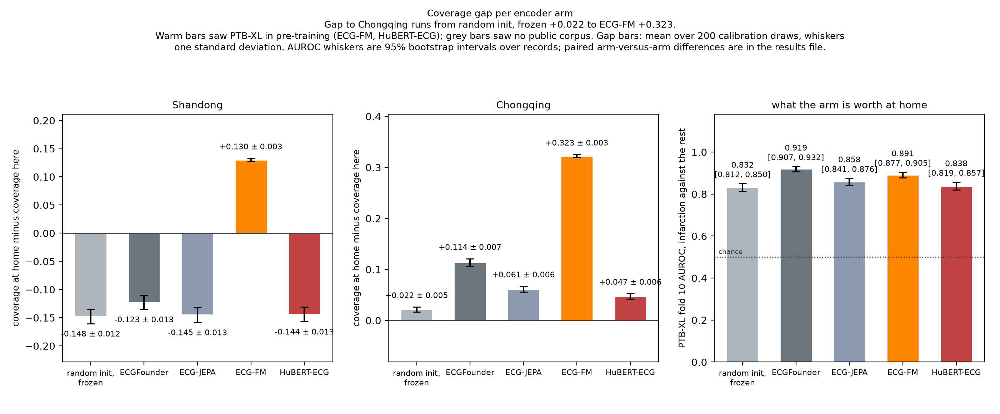

# An ECG model's threshold set on inpatients misses more than a quarter of outpatients with structural heart disease while its AUROC holds

Ruben Abbou · 4 October 2026

**Competing interests.** The author has worked at Idoven, which develops ECG analysis software. Idoven had no part in the design, conduct, funding or reporting of this study, took no view on its results, and none of its data, models or software were used.

**Funding.** None.

**Data.** EchoNext v1.1.1 is released by PhysioNet under its credentialed licence (doi:10.13026/r9pp-3y42); no tracing and no per-record score from it is in this repository. PTB-XL, the Shandong and Chongqing datasets and the four Challenge-2021 corpora are public; access dates and checksums are in `scripts/fetch_open_corpora.sh` and `results/ingest_report.json`.

**Ethics.** This is a secondary analysis of publicly released, de-identified ECG datasets. It involved no contact with patients and was not submitted for further approval. EchoNext was released under approval of the Columbia University institutional review board with waiver of patient consent [2]. PTB-XL was released under approval PTB-2020-1 of the institutional ethics committee [14]. Shandong was approved by the review board of Shandong Provincial Hospital with consent waived [15], and Chongqing by the ethics committee of the First Affiliated Hospital of Chongqing Medical University, approval 2024-256-01, with written consent waived [16]. The release approvals of the four Challenge-2021 corpora were not checked. No attempt was made to re-identify any patient.

**Not a device.** This is a retrospective measurement study on public data. It has no regulatory status and nothing in it is meant to guide the care of a patient.

## Abstract

**Background.** A model that reads structural heart disease from the ECG is tuned on patients who had an echocardiogram, most of them inpatients, and is then proposed for outpatients. Its AUROC is reported by care setting; the sensitivity its threshold delivers in each setting is not.

**Methods.** On EchoNext, 100,000 ECGs from Columbia each paired with an echocardiogram, thresholds were fitted on 1,903 inpatient ECGs and applied unchanged to 1,059 outpatient ECGs, one per patient, for three models: a residual network trained here, the published EchoNext mini-model and the ECGFounder foundation model, with a randomly initialised network as the floor. Two thresholds were compared: one set for 90% sensitivity, and the per-class conformal rule, which adds a second threshold that sends some patients to a human reader. A model of infarction trained on PTB-XL and carried unchanged to two Chinese hospitals was read the same way.

**Results.** Set for 90% sensitivity on inpatients, the threshold recognised 71.6% to 72.7% of the 271 outpatients with moderate or worse structural heart disease, for all three models. Specificity rose from 38.8%–42.8% among test inpatients to 71.1%–71.3% among outpatients, while the trained network's AUROC moved from 0.815 to 0.805. The per-class rule gave the disease label alone to 22.5% to 35.4% of ill outpatients and referred 36.2% to 49.1% of them to a human. Milder disease among outpatients accounted for 29% to 35% of the lost sensitivity. Refitting on 100 labelled outpatient ECGs brought coverage of the ill to 93.4% to 97.6%. For infarction, the per-class rule covered 84.0% of infarctions at Chongqing, where the label definition also changes, and 97.4% at Shandong.

**Conclusion.** The operating point of an ECG model moves between care settings of one hospital while its discrimination holds, so a report of AUROC by setting does not show the loss. A site adopting such a tool has to measure sensitivity on its own patients, and about a hundred labelled ECGs were enough here to refit the threshold, at a cost in specificity.

## 1. Introduction

A deep-learning model that detects structural heart disease from the 12-lead ECG would let a clinic decide who needs an echocardiogram. EchoNext, trained on more than a million ECGs from eight New York hospitals, outperformed cardiologists at the task and is the reference model for it [1]. Its training labels come from patients who had an echocardiogram within a year of the ECG, and in a hospital those are mostly inpatients. A screening programme would run it on outpatients.

Both EchoNext papers report discrimination by care setting and find it stable: the AUROC of the full model is 84.3% among outpatients and 84.1% among inpatients and in the emergency department [1], and the public EchoNext-Mini model shows no setting whose AUROC differs significantly from the whole test set [2]. Neither reports the sensitivity a fixed threshold delivers in each setting. AUROC is a property of the ranking and is blind to where a threshold falls in each population; a threshold set where 90% of inpatients with the disease score above it says nothing about the share of outpatients with the disease who will.

Here thresholds are fitted on Columbia inpatients and read on Columbia outpatients, for three models built in three different ways, and the loss is set beside the AUROC, the severity of disease and the number of local labels that repairs it. A second, smaller study carries an infarction model from a German research corpus to two Chinese hospitals and reads it the same way.

## 2. Related work

**Thresholds that do not travel.** A diagnostic test's sensitivity and specificity vary with the patients it is applied to, the spectrum effect [12]. For ECG models the clearest case is the Mayo Clinic low-ejection-fraction model, applied to 4,277 adults of a Russian population study: its AUROC was 0.82, and at the cut-off of the derivation study, 0.256, its sensitivity was 26.9% [4]. The authors concluded that population-specific cut-offs may be necessary. The counter-example is the same kind of model run at four US sites at a threshold fixed before the study, where sensitivity held at 84.5% and specificity at 83.6% with no difference between sites (Breslow-Day p = 0.45) [5]. A threshold can therefore travel; whether it does has to be measured for each move. Outside cardiology, a commercial breast-screening tool recalled close to half the women of a Scottish programme at its prespecified threshold and 13.0% once the threshold was calibrated on site, and a software upgrade of the mammography units tripled the recall rate again [11].

**EchoNext and its public model.** EchoNext-Mini is a model of the same architecture trained on 100,000 ECGs from Columbia alone, released with its weights and with the dataset this study uses [2]. Its authors report an AUROC of 82.0% on the test split, and a sensitivity of 70.1% with a specificity of 77.9% at a cut-off chosen to give 70% sensitivity on that split. By care setting they report AUROC only, and read the slight, non-significant declines as an effect of prevalence. The dataset holds one ECG per patient in its validation and test splits and labels each ECG from an echocardiogram within the following year; all its ECGs come from one vendor's machines at one institution, which the authors name as a limit on generalisation. Two later studies carried the EchoNext models outside the hospital. In MIMIC-IV, the mini-model's composite AUROC was 0.790 against 0.820 on its own test split, 0.796 among outpatients and 0.773 among inpatients and intensive-care patients; its probabilities overestimated risk, and a shift derived from the training prevalences corrected that without local data [6]. In a community study of people aged 65 to 85, the full model's discrimination fell, which its authors attribute to a milder spectrum of disease [7]. Neither reports sensitivity at a fixed threshold.

**AUROC beside sensitivity.** PanEcho, which reads complete echocardiograms, sets each diagnostic threshold at the Youden index of its tuning set and reports sensitivity and specificity for every external cohort beside the AUROC [3]. Its own figure shows the operating point moving while discrimination holds: for moderate or worse left ventricular systolic dysfunction, sensitivity is 0.92 at Yale with an AUROC of 0.98, 0.97 in Budapest with 0.99, and 0.80 on EchoNet-Dynamic with 0.94. Its discussion reads the results by AUROC. A few rows of that figure carry intervals inconsistent with their counts, which is why only this one is quoted.

**Thresholds per class.** Split conformal prediction fits a threshold on held-out data so that a stated share of cases receive a set of labels holding the true one [8]. Fitting one threshold inside each class makes that share hold within each class whatever the prevalence [9], and a model's coverage can then be read per class. Under a change of prevalence alone the per-class guarantee holds [10]. When more than the prevalence changes it need not: in magnetic resonance imaging of multiple sclerosis, a per-class threshold calibrated on 3 T scans covered 85.8% of patients at 3 T and 77.5% at 1.5 T for a target of 90%, which the authors read as validity maintained under shift [13]. On the ECG, a per-class threshold fitted on PTB-XL closed the gap in coverage between normal and infarction tracings from 3.06 points to 0.12 [17]; its authors state that their second dataset says nothing about transfer. For the class of the ill, a per-class threshold is a sensitivity threshold: it is placed where 90% of the calibration patients with the disease score above it. What the conformal rule adds is a second threshold, on the class of the healthy, that leaves some patients with both labels and no machine answer.

## 3. Methods

### 3.1 EchoNext cohorts

EchoNext v1.1.1 holds 100,000 ECGs from NewYork-Presbyterian/Columbia, 10 seconds at 250 Hz in z-score units, each labelled from a transthoracic echocardiogram within the following year with eleven findings and their composite, moderate or worse structural heart disease [2]. The training split (72,475 ECGs) trained the models. Thresholds were fitted on the inpatient ECGs of the validation split and read on the inpatient, emergency and outpatient ECGs of the test split. Each patient contributes one ECG to the validation and test splits, and no patient appears in two roles.

Table 1. EchoNext cohorts, from `results/echonext_transfer.json`.

| Cohort | ECGs, one per patient | Structural heart disease | Ejection fraction 45% or less |
|---|---|---|---|
| Calibration: validation split, inpatients | 1,903 | 53.2% | 24.5% |
| Test split, inpatients | 2,203 | 52.5% | 24.4% |
| Test split, emergency | 1,971 | 40.0% | 15.7% |
| Test split, outpatients | 1,059 | 25.6% | 6.6% |

### 3.2 Models

Four models scored every ECG. A residual network (ResNet1d, 12 sigmoid outputs) was trained from scratch on the training split, one seed. The EchoNext mini-model was run on its published weights, with nothing refitted; it reads the seven tabular features the dataset ships beside the tracing, which the other models do not see, and its test-split AUROC of 0.820 replays the 82.0% its authors report. ECGFounder, pre-trained on more than ten million ECGs from another hospital [18], was frozen and read through one logistic regression per finding fitted on the training split. The same residual network frozen at random initialisation, read through the same regressions, is the floor a pre-trained model has to clear. Appendix H gives how the published weights were loaded and why the tracings have no millivolt scale.

### 3.3 Two thresholds and what they give a patient

The sensitivity threshold is placed so that 90% of the calibration patients with the disease score at or above it, the rank taken as in split conformal prediction, ⌈(n+1)·0.9⌉ [8]. Every patient receives one label. Its sensitivity on a cohort is the share of ill patients flagged; its specificity, the share of healthy patients cleared.

The per-class rule keeps that threshold for the ill and adds one for the healthy, placed so that 90% of the healthy calibration patients score at or below it [9]. A patient between the two thresholds receives both labels: no machine answer, and a human reads the ECG. Each patient therefore receives one of three answers. An ill patient is recognised (the disease label alone), referred (both labels) or missed (the healthy label alone); a healthy patient is cleared, referred or falsely flagged. Coverage of the ill, the share of ill patients whose answer includes the disease, adds the recognised and the referred. In this report "recognised" never counts a referred patient. Since the rule's threshold for the ill is the sensitivity threshold, the two flag the disease in the same ill patients, and coverage of the ill under the rule equals the sensitivity of the threshold. The split into three answers is read off two rows of `results/echonext_coverage.csv` by `scripts/echonext_outcomes.py`; a unit test checks it against direct counts.

A third rule, one conformal threshold pooled over all calibration patients, is the usual form of split conformal prediction. It mixes the prevalence into the threshold and is reported in appendix A.

### 3.4 Severity, local labels and intervals

Whether milder disease explains the loss was tested by a rule fixed before any coverage by stratum was read and recorded in `results/echonext_severity.json`: the outpatients' coverage of the ill was reweighted to the severity mix of the ill calibration inpatients over six cells (one finding or two and more, by ejection fraction of 35% or less, 36% to 45%, above 45%), with 2,000 bootstrap draws.

The repair was measured on a ladder. The outpatients were split once by patient into a pool and an evaluation half of 530 ECGs, 137 of them ill. At each rung, the per-class thresholds were refitted on that many ECGs drawn from the pool, 200 times, and read on the evaluation half.

Intervals on a share are 95% Wilson intervals; on an AUROC, 95% bootstrap intervals over 500 draws.

### 3.5 Infarction across hospitals

A residual network was trained on PTB-XL folds 1 to 8 [14] and frozen (appendix H). Thresholds were fitted on half of the patients of fold 10 and read on the other half, on all of Shandong [15] and on all of Chongqing [16], no label from either target reaching a threshold. Each figure is a mean over 200 draws that halve fold 10 by patient. The infarction label changes with the site: PTB-XL annotates infarct patterns on the tracing, mostly old ones; Shandong codes infarction on the tracing with a modifier for its age, and most of its infarctions carry the old one; Chongqing's positive is an acute myocardial infarction on the discharge diagnosis, in a cohort that all underwent coronary angiography.

Table 2. Infarction cohorts, from `results/shift.json`.

| Dataset | Country, years | Tracings scored | Infarction prevalence | Role |
|---|---|---|---|---|
| PTB-XL | Germany, 1989–96 | 2,198 | 25.0% | calibration (fold 10) |
| Shandong | China, 2019–20 | 25,770 | 1.0% | target |
| Chongqing | China, 2015–24 | 17,955 | 14.9% | target |

## 4. Results

### 4.1 The AUROC holds and the sensitivity falls

Set on inpatients for 90% sensitivity, the threshold recognised 71.6% to 72.7% of the 271 outpatients with structural heart disease for the three models built in different ways (table 3). Among the test inpatients, read with the same thresholds, it recognised 89.5% to 90.7%. Over the same move specificity rose, from 38.8%–42.8% to 71.1%–71.3%. The AUROC barely moved: 0.815 to 0.805 for the trained network, with overlapping intervals for every model. The operating point moved along a receiver operating characteristic curve whose area stayed the same, so a report of AUROC by care setting does not show the loss.

Figure 1. AUROC (left) and the sensitivity of the threshold set on calibration inpatients (right) in each care setting of the EchoNext test split, for the four models. Dashed: the 90% the threshold was set for. From `results/echonext_transfer.json`.

Table 3. AUROC and the sensitivity threshold's operating point for the composite, test inpatients against outpatients, thresholds fitted on calibration inpatients. From `results/echonext_transfer.json` and `results/echonext_coverage.csv`.

| Model | AUROC, inpatients | AUROC, outpatients | Sensitivity, inpatients | Sensitivity, outpatients | Specificity, inpatients | Specificity, outpatients |
|---|---|---|---|---|---|---|
| Residual network, trained here | 0.815 (0.796 to 0.832) | 0.805 (0.774 to 0.837) | 90.4% (88.6% to 92.0%) | 71.6% (65.9% to 76.6%) | 42.2% | 71.1% |
| EchoNext mini-model, published | 0.797 (0.778 to 0.815) | 0.795 (0.762 to 0.827) | 90.7% (88.9% to 92.3%) | 72.7% (67.1% to 77.7%) | 38.8% | 71.1% |
| ECGFounder, frozen | 0.804 (0.785 to 0.820) | 0.791 (0.760 to 0.822) | 89.5% (87.6% to 91.2%) | 71.6% (65.9% to 76.6%) | 42.8% | 71.3% |
| Random initialisation, frozen | 0.779 (0.758 to 0.798) | 0.758 (0.721 to 0.790) | 90.9% (89.1% to 92.4%) | 78.6% (73.3% to 83.1%) | 36.6% | 57.4% |

At the outpatients' prevalence of 25.6%, a positive answer from the trained network was right for 46.0% of outpatients flagged; computed from the inpatients' sensitivity and specificity, the same figure would have been 34.2%. The rise in specificity partly offsets the loss for a clinician reading a positive result. Among emergency patients the trained network recognised 86.2% of the ill, and among outpatients with an ejection fraction of 45% or less, the finding the model reads best, 87.1%.

### 4.2 Three models lose the same share

A network trained here, a network trained by the EchoNext authors with tabular features, and a foundation model pre-trained at another hospital all fall to within 1.1 points of one another. When three models built this differently lose the same share, the cause lies with the outpatients' ECGs rather than with one model. The floor model recognised more of the ill, 78.6%, because it flags more of everyone — its specificity among outpatients was 57.4%, and under the per-class rule it referred 44.2% of outpatients to a human.

### 4.3 What the per-class rule gives an outpatient

The per-class rule reaches its coverage of the ill mostly by referring them to a human. For the three models it gave the disease label alone to 22.5% to 35.4% of ill outpatients, referred 36.2% to 49.1%, and missed the rest, the same patients the sensitivity threshold misses (table 4). It cleared the same healthy outpatients as the sensitivity threshold and referred most of the others, so its false alarms fell to 1.8% to 2.3% of healthy outpatients at the price of referring 29.4% to 32.3% of all outpatients.

Table 4. What the per-class rule gives each outpatient, composite, thresholds fitted on calibration inpatients. Shares of the ill and of the healthy outpatients; the last column is of all outpatients. From `results/echonext_outcomes.json`.

| Model | Ill, recognised | Ill, referred | Ill, missed | Healthy, cleared | Healthy, referred | Healthy, falsely flagged | All referred |
|---|---|---|---|---|---|---|---|
| Residual network, trained here | 35.4% | 36.2% | 28.4% | 71.1% | 27.0% | 1.9% | 29.4% |
| EchoNext mini-model, published | 25.5% | 47.2% | 27.3% | 71.1% | 27.2% | 1.8% | 32.3% |
| ECGFounder, frozen | 22.5% | 49.1% | 28.4% | 71.3% | 26.4% | 2.3% | 32.2% |
| Random initialisation, frozen | 21.8% | 56.8% | 21.4% | 57.4% | 39.8% | 2.8% | 44.2% |

The one figure a deployed rule reports without labels did not signal the loss. For the trained network the share of patients referred to a human fell from 42.3% among test inpatients to 29.4% among outpatients, while its coverage of the ill fell from 90.4% to 71.6%: the one figure a deployed rule reports moved in the reassuring direction.

### 4.4 Milder disease explains about a third

The ill outpatients carried fewer findings and kept a higher ejection fraction than the ill inpatients who set the threshold (appendix C). Coverage followed severity: the trained network recognised 64.2% (56.7% to 71.2%) of ill outpatients with one finding and 83.0% (74.7% to 89.0%) of those with two or more (table 5). Reweighted to the inpatients' severity mix, coverage of the ill rose to 76.9% to 78.7% across the three models, still short of 90%: severity explained 29% to 35% of the drop. Of the 201 ill outpatients whose ejection fraction is above 45%, 64.7% to 66.7% were covered, against 83.5% to 84.6% of calibration inpatients in the same band, a figure read on the ECGs that set the threshold and so flattered. Four of the six reweighting cells hold fewer than 30 ill outpatients and are not judged one by one.

Table 5. Ill outpatients covered by stratum of severity, and reweighted to the inpatients' severity, with 95% intervals: Wilson for a stratum, bootstrap percentiles for the reweighted figure and the share of the drop it explains. From `results/echonext_severity.json`.

| Model | Ill outpatients covered | One finding, 165 | Two or more, 106 | Ejection fraction 35 or less, 37 | 36 to 45, 33 | Above 45, 201 | Reweighted to the inpatients' severity | Share of the drop explained |
|---|---|---|---|---|---|---|---|---|
| Residual network, trained here | 71.6% | 64.2% (56.7% to 71.2%) | 83.0% (74.7% to 89.0%) | 86.5% (72.0% to 94.1%) | 97.0% (84.7% to 99.5%) | 64.7% (57.9% to 71.0%) | 77.3% (72.3% to 81.9%) | 31% (16% to 47%) |
| EchoNext mini-model, published | 72.7% | 65.5% (57.9% to 72.3%) | 84.0% (75.8% to 89.7%) | 94.6% (82.3% to 98.5%) | 84.8% (69.1% to 93.3%) | 66.7% (59.9% to 72.8%) | 78.7% (74.0% to 83.1%) | 35% (21% to 51%) |
| ECGFounder, frozen | 71.6% | 66.7% (59.2% to 73.4%) | 79.2% (70.6% to 85.9%) | 89.2% (75.3% to 95.7%) | 90.9% (76.4% to 96.9%) | 65.2% (58.4% to 71.4%) | 76.9% (71.7% to 81.7%) | 29% (15% to 45%) |

### 4.5 A hundred local labels, counted in patients

Refitting the per-class thresholds on 100 outpatient ECGs drawn from the pool covered 93.4% to 97.6% of the ill outpatients of the evaluation half for the three models, on average over 200 draws (table 6). A hundred ECGs from a pool at the outpatients' prevalence hold about 25 ill patients. The repair costs specificity: for the trained network, coverage of the healthy fell from 97.5% to 90.5%. Below 100 the ladder is not usable: at 25 ECGs the trained network's per-class threshold for the ill was infinite in 86.5% of draws, flagging everyone. The ladder records coverage and not the split into recognised and referred, so the share of the repaired coverage that comes from referrals is not measured.

Table 6. Ill outpatients covered as local labels are added, evaluation half, mean over draws with the 10th percentile of draws in brackets. The last column is the healthy covered, before and after 100 labels. From `results/echonext_transfer.json`.

| Model | No local label | 50 | 100 | 200 | 400 | Healthy covered |
|---|---|---|---|---|---|---|
| Residual network, trained here | 69.3% | 94.5% (89.1%) | 93.4% (89.7%) | 92.7% (90.5%) | 92.1% (92.0%) | 97.5% to 90.5% |
| EchoNext mini-model, published | 73.0% | 96.8% (93.5%) | 97.6% (94.9%) | 97.3% (94.9%) | 97.3% (94.9%) | 97.7% to 90.1% |
| ECGFounder, frozen | 70.8% | 96.0% (88.2%) | 95.3% (88.3%) | 95.2% (91.2%) | 94.8% (92.7%) | 97.2% to 89.5% |
| Random initialisation, frozen | 79.6% | 90.7% (81.8%) | 88.8% (83.9%) | 87.3% (84.7%) | 86.7% (85.4%) | 96.9% to 89.8% |

### 4.6 Infarction across hospitals, per class

Carried unchanged from PTB-XL, the per-class rule covered 90.1% of infarctions on held-out PTB-XL patients, 97.4% at Shandong (94.5% to 98.7% on its 260 infarctions) and 84.0% at Chongqing (82.5% to 85.3% on 2,679), where the non-infarction class fell to 69.4% (table 7). Unlike EchoNext, discrimination did not hold at Chongqing — the AUROC fell from 0.932 on PTB-XL to 0.793. Chongqing is also where the definition of the positive class moves, from an infarct pattern on the tracing to an acute infarction on the discharge diagnosis, and this design cannot separate the definition from the population, the machine and the era. At Shandong, whose label is nearest to PTB-XL's, nothing failed.

Table 7. The infarction model at three sites, thresholds fitted on PTB-XL, mean over 200 draws. AUROC is over each whole cohort. Shares are of the infarction cases and of the other cases. From `results/outcomes.json` and `results/auxiliary.json`.

| Site | AUROC | Sensitivity threshold: sensitivity | specificity | Per-class rule: infarction recognised | referred | missed | Other cases referred | falsely flagged |
|---|---|---|---|---|---|---|---|---|
| PTB-XL | 0.932 | 90.1% | 80.3% | 77.3% | 12.8% | 9.9% | 9.7% | 9.9% |
| Shandong | 0.978 | 97.4% | 82.4% | 94.9% | 2.4% | 2.6% | 8.1% | 9.5% |
| Chongqing | 0.793 | 84.0% | 57.2% | 74.6% | 9.5% | 16.0% | 12.2% | 30.6% |

Recalibrating the per-class rule at Chongqing on 100 of its labelled tracings raised coverage of infarction from 84.8% to 93.8% on the tracings held out there for evaluation, with 500 and 2,000 tracings leaving it at 92.1% and 91.5%. A hundred Chongqing tracings hold 14.9 infarctions on average (`results/target_scale.json`, appendix B).

## 5. Discussion

A threshold set to recognise 90% of inpatients with structural heart disease recognised about 72% of outpatients with it, for three models built in three different ways, while the AUROC did not move. The EchoNext authors' reading of their own care-setting results, a stable AUROC, is right about discrimination and silent about the decision a clinic would take; this study supplies the missing number. Attia and colleagues showed a threshold failing to travel to another population [4]; here it fails between care settings of one hospital — one vendor's machines, one echocardiography laboratory — in a way the usual report does not show.

A site that adopts such a tool has to measure sensitivity, per diagnosis, on its own patients in the setting where the tool will run, since the AUROC does not show the loss. The repair is affordable — a hundred labelled outpatient ECGs, about 25 of them ill, refitted the threshold, and the price is specificity, coverage of the healthy falling from 97.5% to 90.5% for the trained network. The per-class conformal rule is no substitute for that measurement. For the ill it is the sensitivity threshold under another name; the second threshold it adds converts some errors into referrals, and on outpatients it recognised 22.5% to 35.4% of the ill outright and referred 36.2% to 49.1%. Whether that trade is worth having depends on what a referral costs a clinic, which this design does not measure. The number of referrals is also no alarm: it fell on outpatients as coverage fell.

Milder disease explains a third of the loss, and the rest sits inside each stratum of severity. Outpatients with an ejection fraction above 45% were recognised in 64.7% to 66.7% of cases, against 83.5% to 84.6% of calibration inpatients in that band. What else distinguishes them — the type of finding, the age, a coexisting rhythm, something in the ECG the label does not record — is open; the reweighting over six cells is a lower bound on what severity explains.

The infarction transfer agrees in direction and differs in kind. At Chongqing both the AUROC and the coverage fell, and the label changed with the hospital; at Shandong neither fell. Unlike EchoNext, that pair cannot separate an operating point that slides from a model that stops discriminating. Rotating five corpora through the calibration role (appendix B) shows transfers moving coverage in both directions, with the calibrating corpus mattering more than the average.

Carter and colleagues' low-ejection-fraction model held its sensitivity over four US sites [5]. Those were four comparable clinical populations; the move from inpatients to outpatients changes the spectrum of disease, which is the change the EchoNext authors' community study points to [7]. Whether a threshold travels therefore depends on the population it is carried to, which a site can only learn by measuring sensitivity on its own patients.

## 6. Limitations

1. **The share referred to a human is large.** The per-class rule leaves without an answer 29.4% of outpatients and 42.3% of test inpatients for the trained network. Whether a clinic can absorb that, and what a referral costs, was not measured.
2. **Severity is only partly measured.** Six cells of findings and ejection fraction explain 29% to 35% of the drop, a lower bound: they do not describe all that distinguishes an ill outpatient, and the comparison is against the ECGs that set the threshold, covered at 90% by construction.
3. **At Chongqing the definition of the ill changes with the hospital.** The positive class there is an acute infarction on the discharge diagnosis, in patients who all underwent angiography; at PTB-XL it is an infarct pattern on the tracing, mostly old. The design does not separate the definition, the population, the machine and the era.
4. **One training seed.** The trained network was trained once (seed 0), so the spread between models carries the variance of one training run.
5. **Two care settings in one hospital.** The EchoNext measurement does not cross to another hospital; all its ECGs come from one vendor's machines.
6. **Coverage on the ladder is not split.** The ladder records coverage of the ill, which counts referrals, and its pool and evaluation half are cut once rather than at every draw.
7. **Exploratory subgroups.** Among outpatients, the trained network recognised 61.1% of ill women (52.4% to 69.2%) and 80.7% of ill men (73.5% to 86.3%). No subgroup conclusion is drawn and no correction for multiple comparisons is applied.
8. **Coverage is an average.** It is an average over the patients of a class, conditional on a true class unknown at the point of care, and says nothing about one patient.

## Appendix A. The shared threshold

Split conformal prediction with one threshold over all calibration patients meets its target over everyone while serving the majority class. On PTB-XL fold 10 it covered 90.0% of all tracings and 73.5% of infarctions, giving the non-infarction label alone to 26.5% of them (figures A1 to A3, `results/shift.json`, `results/outcomes.json`). Carried to the targets, it covered 93.6% of infarctions at Shandong and 72.5% at Chongqing. On EchoNext it covered 74.5% of ill outpatients for the trained network and none of the ill outpatients for three rarer findings, whose pooled threshold the healthy majority sets. These figures mix the prevalence into the threshold, which is why the body of the report reads the per-class rule. A label-shift weighting that estimates the target's prevalence did no better than the per-class rule, which estimates nothing (figure A3, third column).

Figure A1. Where each rule places its thresholds on the infarction score, PTB-XL fold 10.

Figure A2. What an infarction case and another case receive under each rule at the source, mean over 200 draws.

Figure A3. Coverage by site (rows) and correction (columns) as the confidence asked for rises. Red: infarction cases. Blue: other cases. Grey: all. Dashed: the coverage asked for. Whiskers are one standard deviation across calibration draws, the spread of the calibration and not the sampling error of the site.

## Appendix B. Five corpora in the calibration role

Infarction is annotated on too few corpora to rotate, so the rotation runs on five diagnoses that five corpora all annotate: sinus rhythm, atrial fibrillation, left and right bundle-branch block and first-degree atrioventricular block, each its own binary problem. PTB-XL, Shandong, Chapman-Shaoxing with Ningbo, Georgia, and CPSC 2018 with its extension, the last three from the Challenge-2021 collection [19], take the calibration role in turn. Each trains and calibrates on its own records and spends its thresholds unchanged on the test part of the other four, which gives twenty ordered source-target pairs and 92 away cells at a 90% target, beside 24 home cells read on a corpus's own held-out records. `results/label_map.json` maps three annotation schemes onto the five classes and reproduces the Challenge's published counts on every one of its four corpora; five joins could not be made cleanly, among them Shandong's "Normal ECG", a statement about a whole tracing, so sinus rhythm is refused on Shandong and carries twelve ordered pairs.

Three corpora file the same tracing under more than one record, and the Challenge collection ships no patient key. Screening the canonical window found 485 groups of identical tracings sitting in two parts, 421 of them in CPSC, 56 in Georgia and 8 in Chapman-Shaoxing with Ningbo; each group became one splitting unit (`results/split_leak.json`). Shandong repeats 168 tracings and files them under one patient. On the 49,199 records this screen and the delivery corpus's own both cover, the two digests agree. No group of this screen spans two of the five corpora. Train and calibration parts are capped at 3,500 and 2,000 records, so that no source gains from the size of its corpus, and every figure is a mean over 200 calibration draws.

Under the shared threshold the five corpora, reading their own held-out records, cover 90.1% of all cases and 29.0% of the cases carrying the diagnosis, averaged over the home cells: the target is met over everyone and missed inside the diagnosis, as appendix A shows for infarction. Transferred, both figures fall together, to 82.3% and 23.3%, which is the shift acting on a gap that was already there.

The per-class rule repairs that gap at home, covering 92.0% of the cases carrying the diagnosis against 90.2% of all cases, and away reads 87.7% within the diagnosis. Those include three source-diagnosis pairs that cover by declining to answer: Shandong's left bundle-branch block, whose per-class threshold is infinite in 189 of 200 draws, its first-degree atrioventricular block in 152, and Chapman-Shaoxing with Ningbo's left bundle-branch block in 132; too few calibration cases leave the rule admitting both labels. Over the pairs whose threshold was finite in every draw the two figures read 91.0% and 86.1%. Per diagnosis the mean away bias is −0.008 for atrial fibrillation over twenty pairs, −0.039 for right bundle-branch block over twenty, and −0.102 for sinus rhythm over the twelve pairs that class carries. The standard deviation across sources runs from 0.058 on first-degree atrioventricular block to 0.130 on sinus rhythm, and the worst single pair loses 41.5 points, CPSC's sinus-rhythm threshold spent on PTB-XL, with PTB-XL's left bundle-branch block threshold spent on CPSC next at 34.7. Transfers move coverage in both directions, and which corpus calibrated matters more than the average over transfers. Each corpus was trained once, under one seed, so that spread also carries the variance of a training run.

Figure B1. Coverage of each diagnosis at a 90% target under each correction, every source-target pair drawn. Filled dots are away pairs, coloured by the corpus whose threshold they carry; the hollow marker is that corpus on its own held-out records. A ringed marker is a pair whose per-class threshold ran to infinity in some draws: three source-diagnosis pairs under the per-class rule and fourteen under label-shift weighting, so the height of the weighted panel does not measure that rule answering.

Figure B2. Coverage of infarction at Chongqing against the number of labelled Chongqing tracings the threshold saw, PTB-XL as source. Rung zero is the frozen PTB-XL threshold. Recalibrating uses the Chongqing tracings alone; pooling adds them to the PTB-XL calibration sample.

## Appendix C. The severity of the ill

Among the ill, inpatients who set the thresholds against outpatients who test them; two-sided Mann-Whitney tests on ranks. Grades read none, mild, moderate, severe; the right ventricle normal to severely reduced; the effusion none, trace, small, moderate, large. From `results/echonext_severity.json`.

| Among the ill, median (quartiles) | Inpatients, 1,013 | Outpatients, 271 | p |
|---|---|---|---|
| Findings present | 2 (1 to 3) | 1 (1 to 2) | < 0.001 |
| Ejection fraction, % | 50.0 (32.5 to 57.5) | 57.5 (45.0 to 62.5) | < 0.001 |
| Pulmonary artery systolic pressure, mmHg | 43.0 (33.0 to 53.0), 661 measured | 39.0 (31.0 to 49.2), 172 measured | 0.007 |
| Tricuspid regurgitation peak velocity, m/s | 2.8 (2.4 to 3.3), 483 measured | 2.7 (2.4 to 3.2), 125 measured | 0.109 |
| Septal thickness, cm | 1.2 (1.0 to 1.3) | 1.2 (1.0 to 1.3) | 0.011 |
| Posterior wall thickness, cm | 1.1 (0.9 to 1.3) | 1.1 (0.9 to 1.3) | 0.387 |
| Aortic stenosis, moderate or worse | none (none to none), 12.7% | none (none to none), 18.8% | 0.056 |
| Aortic regurgitation, moderate or worse | none (none to none), 3.2% | none (none to mild), 1.5% | 0.117 |
| Mitral regurgitation, moderate or worse | mild (none to mild), 14.4% | none (none to mild), 11.1% | 0.053 |
| Tricuspid regurgitation, moderate or worse | mild (none to mild), 17.2% | mild (none to mild), 9.6% | 0.002 |
| Pulmonary regurgitation, moderate or worse | none (none to none), 1.1% | none (none to none), 0.0% | 0.026 |
| Right ventricular dysfunction, moderate or worse | normal (normal to mildly reduced), 21.6% | normal (normal to normal), 7.4% | < 0.001 |
| Pericardial effusion, moderate or large | trace (none to trace), 3.4% | none (none to trace), 0.8% | < 0.001 |

## Appendix D. The eleven findings

The trained network, outpatients, thresholds fitted on calibration inpatients; findings with fewer than ten ill outpatients are left out. Sensitivity is that of the per-finding sensitivity threshold; the pooled column is the shared threshold of appendix A. From `results/echonext_coverage.csv` and `results/echonext_transfer.json`.

| Finding | Prevalence, calibration | Prevalence, outpatients | Ill outpatients | Sensitivity | Pooled threshold, ill covered | AUROC, outpatients |
|---|---|---|---|---|---|---|
| Ejection fraction 45% or less | 24.5% | 6.6% | 70 | 87.1% | 60.0% | 0.929 |
| Left ventricular wall 1.3 cm or more | 22.1% | 13.8% | 146 | 74.7% | 48.6% | 0.779 |
| Aortic stenosis | 6.8% | 4.8% | 51 | 96.1% | 0.0% | 0.907 |
| Mitral regurgitation | 7.7% | 2.8% | 30 | 70.0% | 3.3% | 0.759 |
| Tricuspid regurgitation | 9.1% | 2.5% | 26 | 69.2% | 15.4% | 0.842 |
| Right ventricular dysfunction | 11.5% | 1.9% | 20 | 75.0% | 35.0% | 0.872 |
| Pulmonary artery systolic pressure 45 mmHg or more | 15.4% | 5.9% | 63 | 73.0% | 34.9% | 0.767 |
| Tricuspid regurgitation velocity 3.2 m/s or more | 7.4% | 3.3% | 35 | 74.3% | 11.4% | 0.829 |

## Appendix E. Acquisition faults

Four faults and an inversion were applied in software to PTB-XL fold 10 and scored by the infarction model; thresholds were fitted on clean calibration halves. The share referred, the only figure a deployed per-class rule reports without labels, did not track the damage: exchanging the arm electrodes took AUROC to 0.727 and moved the share referred by under two points, and inverting the polarity took the model below chance while the share referred fell. From `results/perturbations.json`; scores in `results/perturbations.npz`.

| Condition | AUROC | Infarction covered | Other cases covered | Referred |
|---|---|---|---|---|
| As recorded | 0.932 | 90.1% | 90.1% | 10.5% |
| Arm electrodes exchanged | 0.727 | 98.5% | 23.4% | 12.3% |
| Every lead × 0.8 | 0.932 | 92.5% | 87.7% | 12.5% |
| Every lead × 1.25 | 0.928 | 86.5% | 92.2% | 10.1% |
| Baseline wander added | 0.885 | 97.7% | 73.0% | 30.9% |
| Polarity inverted | 0.374 | 100.0% | 0.3% | 0.2% |

## Appendix F. Five encoders

Changing the encoder does not repair the infarction transfer. Five encoders were frozen, a linear probe fitted on their PTB-XL representations and the thresholds spent as in section 3.5, at an 80% target rather than the 90% used elsewhere. All five hold the target at home, between 79.8% and 80.0%. None reaches it at Chongqing, where they read between 14.9% and 75.1%, and four of the five over-cover at Shandong. Their discrimination on PTB-XL spans an AUROC of 0.818 (95% CI 0.799 to 0.838) to 0.919 (0.907 to 0.932), the randomly initialised floor and ECGFounder. Every Chongqing figure is a held-out reading, no arm having been pretrained there. The middle of the range cannot be read: three of the five arms had a corpus used here in their pre-training, so the five cannot be put in an order. `results/arms.json` records which corpora each arm saw.

Figure F1. Infarction coverage at home minus coverage at Shandong and at Chongqing for each encoder, at the 80% target, and each encoder's AUROC on PTB-XL fold 10. From `results/arms.json`.

## Appendix G. Sex and age at PTB-XL

Coverage within each class under the per-class rule, PTB-XL fold 10, with 95% percentile intervals over 2,000 bootstrap replicates that resample patients before halving. Counts are of the whole fold. From `results/subgroups.json`.

| Subgroup | Tracings (infarction) | Infarction covered | Other cases covered |
|---|---|---|---|
| Under 50 | 521 (38) | 88.7 [68.2, 100.0] | 97.9 [95.4, 99.6] |
| 50 to 64 | 629 (133) | 88.0 [78.0, 95.7] | 89.8 [85.4, 94.0] |
| 65 to 74 | 496 (147) | 88.0 [78.1, 95.6] | 89.0 [83.0, 94.3] |
| 75 and over | 552 (232) | 92.9 [85.9, 98.2] | 80.0 [71.2, 87.3] |
| Men | 1,132 (297) | 92.1 [86.5, 97.2] | 90.4 [86.8, 93.7] |
| Women | 1,066 (253) | 87.8 [79.6, 94.4] | 89.7 [85.4, 93.5] |

## Appendix H. Models and data handling

**The infarction model.** A one-dimensional ResNet after Wang et al. 2017, the shape of the PTB-XL benchmark, 4,082,306 parameters, trained on folds 1 to 8 with AdamW (learning rate 10⁻³, weight decay 10⁻², batch 64), stopped on the AUROC of fold 9, seed 0, on six CPU threads. On fold 10 (2,198 tracings, 550 infarctions) its AUROC is 0.932 (0.921 to 0.943). Every setting is in `results/baseline/config.json`. The per-class rule's finite-sample correction, the (n+1) in its rank, is worth 0.47 of a coverage point on this fold.

**The EchoNext tracings.** Each lead was median-filtered, clipped at its 0.1st and 99.9th percentiles and standardised over the dataset before release [2], so every tracing is in z-score at 250 Hz, as `results/echonext_provenance.json` records for all 100,000. The millivolt scale cannot be recovered from the files; moving a model trained here to another hospital means replaying the same preprocessing on that hospital's ECGs.

**The published weights.** The mini-model's weights come from the authors' IntroECG repository (commit 15233e93) and hold tensors only, read with `weights_only=True` into an architecture written from the checkpoint's shapes, every tensor loading with none missing. ECGFounder's checkpoint holds one numpy scalar beside its tensors; it is read through an unpickler that resolves five names and refuses any other. Its network is the authors' Net1D, vendored in `third_party/ecgfounder`; tracings are resampled from 250 Hz to the 500 Hz its model card asks for.

**Records read.** Of Chongqing's 19,955 released tracings, 1,995 carry no label and five do not decode or hold a non-finite sample, leaving 17,955; Shandong and PTB-XL lose none (`results/ingest_report.json`).

## References

1. Poterucha TJ, Jing L, Ricart RP, et al. *Detecting structural heart disease from electrocardiograms using AI.* Nature 2025;644:221–230. doi:10.1038/s41586-025-09227-0, PMID 40670798. Read in full; AUROC by care setting from Table 2.
2. Hughes JW, Jing L, Finer J, et al. *EchoNext-Mini: a dataset and baseline AI model for detecting structural heart disease from electrocardiograms.* NEJM AI 2026;3(5). doi:10.1056/AIdbp2500516. Read in full.
3. Holste G, Oikonomou EK, Tokodi M, Kovács A, Wang Z, Khera R. *Complete AI-enabled echocardiography interpretation with multitask deep learning.* JAMA 2025;334(4):306–318. doi:10.1001/jama.2025.8731. Read in full; figures from its Figure 2.
4. Attia IZ, Tseng AS, Benavente ED, et al. *External validation of a deep learning electrocardiogram algorithm to detect ventricular dysfunction.* Int J Cardiol 2021;329:130–135. doi:10.1016/j.ijcard.2020.12.065, PMID 33400971. Read in full.
5. Carter RE, et al. *Multisite, external validation of an AI-enabled ECG algorithm for detection of low ejection fraction.* JACC Adv 2026;5(2):102537. doi:10.1016/j.jacadv.2025.102537, PMID 41547169. Read in full.
6. Otabor E, Hassan A, Okunlola A, Lam J, Alomari L, Hamilton M. *Transportability of an artificial intelligence electrocardiography model for structural heart disease: external validation and recalibration of EchoNext-Mini in MIMIC-IV.* Eur Heart J Digit Health 2026;7(8):ztag147. doi:10.1093/ehjdh/ztag147, PMID 42807400. Read in full.
7. Poterucha TJ, Hughes JW, Brener MI, et al. *AI-ECG detection of structural heart disease in the community setting: transportability and spectrum effects in the PREVUE-VALVE study.* J Am Coll Cardiol 2026;88(7):752–764. doi:10.1016/j.jacc.2026.06.013, PMID 42615442. Abstract read; no figure quoted.
8. Angelopoulos AN, Bates S. *A gentle introduction to conformal prediction and distribution-free uncertainty quantification.* arXiv:2107.07511.
9. Vovk V. *Conditional validity of inductive conformal predictors.* ACML 2012, PMLR 25:475–490.
10. Podkopaev A, Ramdas A. *Distribution-free uncertainty quantification for classification under label shift.* UAI 2021, PMLR 161:844–853. arXiv:2103.03323.
11. de Vries CF, Colosimo SJ, Staff RT, et al. *Impact of different mammography systems on artificial intelligence performance in breast cancer screening.* Radiol Artif Intell 2023;5(3):e220146. doi:10.1148/ryai.220146, PMID 37293340. Read in full.
12. Usher-Smith JA, Sharp SJ, Griffin SJ. *The spectrum effect in tests for risk prediction, screening, and diagnosis.* BMJ 2016;353:i3139. doi:10.1136/bmj.i3139, PMID 27334281.
13. Millar AS, Román C, Gouripeddi R, Facelli JC. *Reliable uncertainty under class imbalance and distribution shift: class-conditional conformal prediction of multiple sclerosis.* medRxiv 2026, preprint not peer reviewed. doi:10.64898/2026.05.12.26353057, PMID 42180360. Read in full.
14. Wagner P, Strodthoff N, Bousseljot R-D, et al. *PTB-XL, a large publicly available electrocardiography dataset.* Sci Data 2020;7:154. doi:10.1038/s41597-020-0495-6.
15. Liu H, Chen D, Chen D, et al. *A large-scale multi-label 12-lead electrocardiogram database with standardized diagnostic statements.* Sci Data 2022. doi:10.1038/s41597-022-01403-5.
16. Du X, Liu Y, Wang L, et al. *A large-scale 12-lead electrocardiogram dataset for acute coronary syndrome prediction containing 19,955 ECGs.* Sci Data 2026. doi:10.1038/s41597-026-07278-0.
17. El Allam O, Hamlich M. *Quantization-aware Mondrian conformal prediction for embedded ECG classification.* Biomed Signal Process Control 2026;127:111217. doi:10.1016/j.bspc.2026.111217. Read in full.
18. Li J, et al. *An electrocardiogram foundation model built on over 10 million recordings with external evaluation across multiple domains.* arXiv:2410.04133.
19. Reyna MA, et al. *Will two do? Varying dimensions in electrocardiography: the PhysioNet/Computing in Cardiology Challenge 2021.* Computing in Cardiology 2021. doi:10.23919/CinC53138.2021.9662687.
20. Lipton ZC, Wang Y-X, Smola AJ. *Detecting and correcting for label shift with black box predictors.* ICML 2018. arXiv:1802.03916.
21. Chow CK. *On optimum recognition error and reject tradeoff.* IEEE Trans Inf Theory 1970;16(1):41–46. doi:10.1109/TIT.1970.1054406.

## Data and code

Every number in this report is read from a file under `results/`, and `tests/test_report_numbers.py` holds the text to those files: it rebuilds each table row and each figure of the prose from its file, and fails on a number in the text that no file, cited source or stated constant accounts for. The README is held the same way.

| File | What it holds | Written by |
|---|---|---|
| `results/echonext_transfer.json`, `results/echonext_coverage.csv` | EchoNext cohorts, AUROC, coverage grid, ladder, subgroups | `scripts/echonext_transfer.py` |
| `results/echonext_outcomes.json` | recognised, referred and missed per care setting | `scripts/echonext_outcomes.py` |
| `results/echonext_severity.json` | severity of the ill and the reweighting | `scripts/echonext_severity.py` |
| `results/echonext_provenance.json` | file digests and units of the EchoNext release | `scripts/echonext_provenance.py` |
| `results/outcomes.json`, `results/shift.json`, `results/abstention.json` | infarction outcomes and coverage per site | `scripts/outcomes.py`, `scripts/shift_table.py`, `scripts/abstention_table.py` |
| `results/auxiliary.json` | AUROC per site, Wilson intervals, reject rules, predictive values | `scripts/auxiliary.py` |
| `results/target_scale.json` | the Chongqing ladder | `scripts/target_scale.py` |
| `results/subgroups.json`, `results/perturbations.json` | appendices E and G | `scripts/subgroups.py`, `scripts/perturbations.py` |
| `results/rotation.csv`, `results/rotation_uncertainty.csv` and their summaries | appendix B | `scripts/rotation_table.py`, `scripts/rotation_uncertainty.py` |
| `results/arms.json` | appendix F | `scripts/arms_table.py` |

The README gives the commands and their timings; [docs/data.md](docs/data.md) gives the corpora, their licences and the label mapping.
