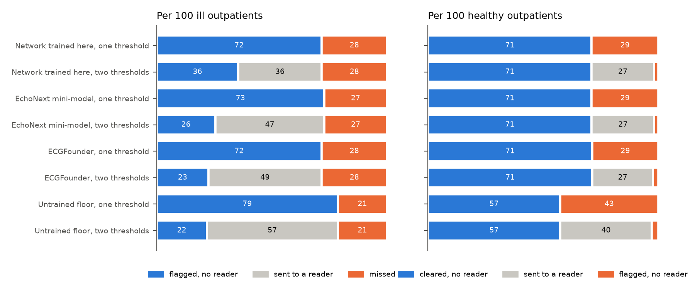
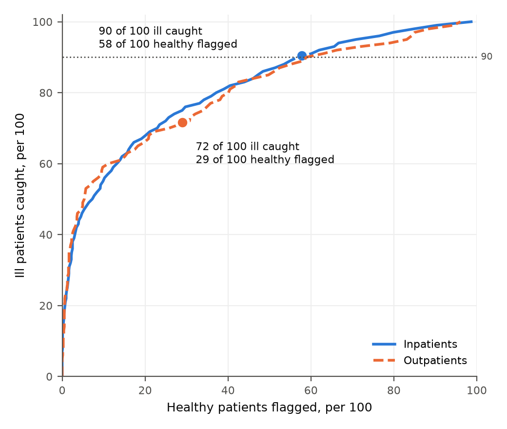
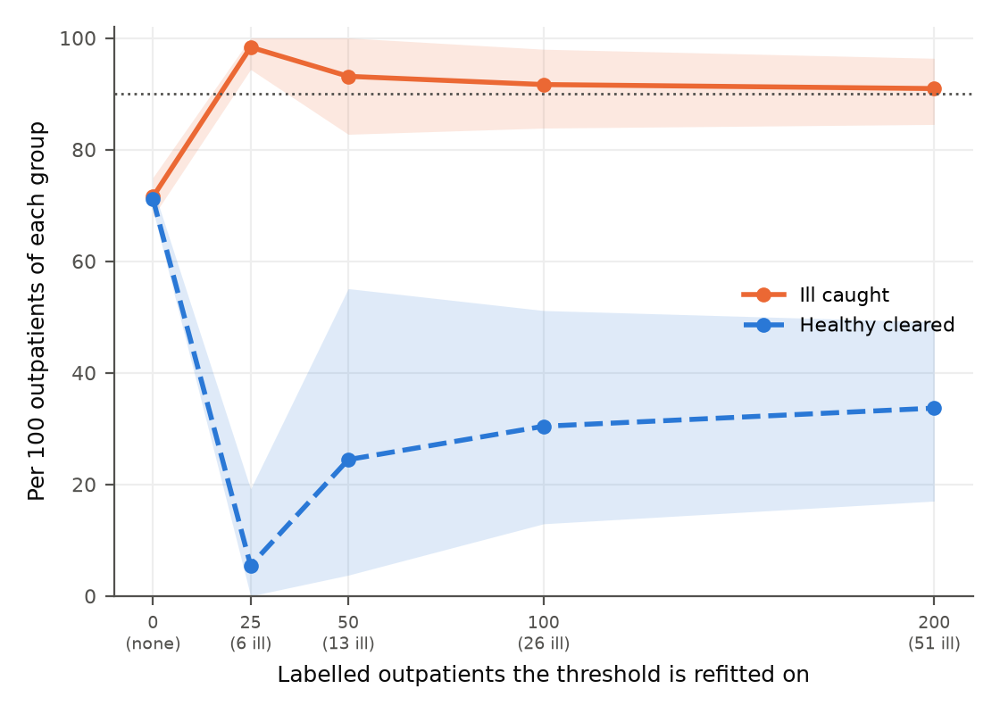

# Carrying an ECG-AI threshold from inpatients to outpatients: a retrospective measurement of three structural heart disease models at one hospital

Ruben Abbou · October 2026

## Abstract

**Background.** An ECG model for structural heart disease gives each patient a score, and a cut-off on that score, the threshold, decides who is flagged for an echocardiogram. The threshold is set on patients who already had an echocardiogram, and the model is then offered for outpatients. Published validations report the AUROC by care setting, the chance that a randomly chosen ill patient scores higher than a randomly chosen healthy one, and find it stable. The AUROC does not say how many ill outpatients the inpatient threshold catches.

**Methods.** EchoNext holds 100,000 ECGs from Columbia, each paired with an echocardiogram. Three models scored them: a network trained here, the published EchoNext mini-model and the ECGFounder foundation model. For each, the threshold was set on 1,903 inpatients to catch 90% of those with moderate or worse structural heart disease, and applied unchanged to 1,059 outpatients, 25.6% of them ill. It was then set again on outpatients with known diagnoses: on 100 drawn from those same outpatients, and on the 858 outpatients of EchoNext's separate validation group. An infarction model carried from a German ECG database to two Chinese hospitals is reported beside it.

**Results.** Of 100 ill outpatients, the inpatient threshold caught 72 and missed 28 for the trained network; the mini-model caught 73 and ECGFounder 72. It also flagged fewer healthy patients: 29 of 100 healthy outpatients, against 58 of 100 healthy inpatients. The AUROC moved only from 0.815 to 0.805: the model told ill from healthy outpatients almost as well, and the threshold, unchanged, flagged fewer healthy patients at the cost of missing more ill ones. Set on every validation patient whatever the setting, the threshold caught 77 of 100 ill outpatients. Set again on 100 outpatients, about 26 of them ill, it caught 91.6% of the other outpatients' ill on average, fell short of 90% in 33.1% of repetitions and flagged 70 of 100 healthy. Set on 858 separate outpatients, 240 of them ill, it caught 86.3% (81.7% to 89.9%), 87.8% for the mini-model and 89.7% for ECGFounder, and flagged 52 of 100 healthy.

**Conclusion.** At Columbia, a threshold validated on inpatients caught 72 to 73 of 100 ill outpatients for three models, and the AUROC did not show it. Set again on the hospital's own outpatients with known diagnoses, it came near 90% but, read on separate outpatients, fell short of it for all three models, and it flagged more than half of the healthy. A clinic adopting such a model learns the sensitivity it gets only by measuring it on its own outpatients with known diagnoses.

## 1. Introduction

At Columbia, a threshold validated on inpatients caught far fewer ill outpatients, and nothing in an AUROC table warned of it. Earlier work shows thresholds failing between populations, not between the care settings of one hospital.

An ECG model returns a score for each patient, and a threshold on that score decides who is flagged. The threshold is usually set on validation patients to catch a stated share of the ill, often 90%; that share is the sensitivity, and the share of the healthy left unflagged is the specificity. Both belong to the threshold and to the patients it was set on. A test meets different ill and different healthy patients in another population, so its sensitivity and specificity change there; this is called the spectrum effect [1,2]. For an ECG model of structural heart disease, the threshold is set on patients who had an echocardiogram; at Columbia, 41% of the validation patients were inpatients.

EchoNext is a public set of 100,000 ECGs from Columbia, each paired with an echocardiogram [3]. Its authors report an AUROC of 84.3 for outpatients and 84.1 for inpatients, and describe consistent performance across care settings. Their table by care setting reports the AUROC and other measures of how well the model separates ill from healthy patients, but no sensitivity or specificity. At another hospital, the published mini-model separated almost as well, with an AUROC of 0.790 against 0.820 on the EchoNext test patients [4]. In a community cohort of people aged 65 to 85 the AUROC fell to 71%, from 83% in hospital, which the authors attribute to milder disease [5].

Thresholds that do not travel are not new. The Mayo Clinic model for an ejection fraction of 35% or less still separated ill from healthy well in a Russian population sample, with an AUROC of 0.82, yet the cut-off chosen in its original study caught only 26.9% of those with the condition; its authors concluded that each population may need its own cut-off [6]. The opposite has been seen too: across four American sites and 13,960 patients, a low-ejection-fraction model at a cut-off fixed in advance was 84.5% sensitive and 83.6% specific, with no difference between sites [7]. In pathology and CT, groups have reset cut-offs on a handful to 25 local cases [8,9]. In screening mammography, a commercial model's cut-off was reset on 16,204 local screens, 200 of them with cancer, and each version of the mammography software needed its own [10]. For structural heart disease, no study has measured what happens to a fixed threshold when one hospital's model moves from its inpatients to its outpatients. This study measures it in patients caught and missed, on three models, together with what it costs to set the threshold again.

An infarction model carried from a German database to two Chinese hospitals is reported beside it, as a case where the model's own separation of ill from healthy changes too.

## 2. Methods

Thresholds were set on Columbia inpatients and applied, without change, to Columbia outpatients; then they were set again on outpatients with known diagnoses. Every outcome is counted per 100 ill and per 100 healthy patients.

### 2.1 Patients and ECGs

EchoNext v1.1.1 holds 100,000 ECGs from Columbia University Irving Medical Center, each paired with a transthoracic echocardiogram [3]. The condition studied is moderate or worse structural heart disease on echocardiography, which EchoNext defines as any of eleven findings: a left ventricular ejection fraction of 45% or less; a left ventricular wall thickness of 1.3 cm or more; moderate or worse aortic stenosis, aortic regurgitation, mitral regurgitation, tricuspid regurgitation or pulmonary regurgitation; moderate or worse right ventricular systolic dysfunction; a moderate or large pericardial effusion; a pulmonary artery systolic pressure of 45 mmHg or more; and a tricuspid regurgitation peak velocity of 3.2 m/s or more. An ECG is called ill when it was recorded within a year before an echocardiogram showing any of the eleven, and healthy when it was recorded at any time before the patient's most recent echocardiogram showing none: EchoNext puts no time limit on the healthy [3]. In the test split, 27.9% of the healthy outpatients and 10.9% of the healthy inpatients carry no echocardiographic measurement, which EchoNext records only within the year, so their ECG was taken earlier (supplement S1.2).

EchoNext divides its patients into three groups. The models learned from the 72,475 ECGs of the first. The thresholds were set on the 1,903 inpatient ECGs of the second, 53.2% of them from ill patients; these are called the calibration inpatients below. Everything was then measured on the third: 1,059 outpatient ECGs (25.6% ill), and beside them 2,203 other inpatient ECGs (52.5% ill) and 1,971 emergency ECGs (40.0% ill). Each patient contributes one ECG and belongs to one group only. EchoNext records the care setting of each ECG; nothing else separates the cohorts.

### 2.2 Models

Four models score every ECG. The first is a deep neural network (a residual network) trained on EchoNext for this study. The second is the published EchoNext mini-model, run on its authors' weights with nothing changed; on the EchoNext test patients it reaches an AUROC of 0.820, the figure reported for it there [4]. The third is ECGFounder, a network pre-trained on more than ten million ECGs from another hospital [11]. Its network was kept as published; it turns each ECG into a list of numbers, and a simple statistical formula (a logistic regression) fitted on EchoNext turns that list into a score for each finding. The fourth is the first network with its weights left at random, read through the same kind of formula: a floor that any useful model must beat. The results compare the first three. The [supplement](SUPPLEMENT.md) gives the architectures, how the published weights were read, and the statistics behind every method below.

### 2.3 The threshold and the second threshold

For each model, the threshold was placed among the calibration inpatients so that 90% of the ill scored at or above it. A patient above it is flagged for an echocardiogram, and a patient below it is cleared. With few ill patients the threshold is placed slightly lower than the exact 90% point, so that it errs toward catching more (supplement S1.1).

A second, higher threshold was placed among the healthy calibration inpatients, so that 90% of them scored at or below it. Patients above the second threshold are flagged with no reader. Patients between the two thresholds are flagged too, but a person reads their ECG before anything else happens. Patients below the first threshold are cleared, whatever the second threshold does. So the second threshold does not change who is caught or missed: it decides which flagged patients a person reads first. The supplement gives its statistical name and construction, and a third design the main text does not use.

The main figures set the threshold on the calibration inpatients alone: the case of a model validated in hospital and then offered to clinics, and the case where the two settings differ most. The same rule was also set on two other groups of validation patients: all 4,626 of them whatever the setting, as a vendor validating on everyone with an echocardiogram might, and the 858 validation outpatients, 240 of them ill, who are not the outpatients the results are read on.

### 2.4 What was counted

For 100 ill patients: caught, meaning flagged by the first threshold, and missed. For 100 healthy patients: cleared and flagged. With the second threshold, the flagged split into those flagged with no reader and those sent to a reader. The positive predictive value is the share of flagged patients who are ill, and the negative predictive value the share of cleared patients who are healthy. Both depend on the prevalence, the share of patients who are ill, and are given at the outpatients' own prevalence and at 10% and 5%. The figures at 10% and 5% assume that sensitivity and specificity stay the same at those prevalences, an assumption a companion study measured and found off by several points [14]. A range in brackets after a percentage is its 95% confidence interval; a range across repetitions is named as such.

To see how well each model separates ill from healthy in each setting, the AUROC was computed, and Figure 2 draws every possible threshold as a curve of ill caught against healthy flagged. The three models were compared on the same outpatients.

Milder disease among outpatients could explain part of the loss. To measure how much, a formula fitted on the ill patients of both settings estimated each patient's chance of being caught from their findings, ejection fraction, age, sex and setting. Applied to the ill inpatients as if they were outpatients, it gives the outpatients' sensitivity had they carried the inpatients' case mix (supplement S1.6). Differences between women and men and between age groups were tested with a correction for running six tests at once (supplement S1.8); they are exploratory.

To measure what setting the threshold again costs, the outpatients were split at random into two halves. 100 patients with known diagnoses were picked from the first half, both thresholds were set again on them, and the result was read on the second half. This was repeated 2,000 times with a new split each time, and each repetition noted how many ill patients its 100 held. Those 100 come from the outpatients the result is read on. To read the remedy on patients it never saw, the threshold was also set on all 858 validation outpatients, and on 100 drawn from them 2,000 times, and each was read on every test outpatient.

### 2.5 Infarction across three hospitals

A deep neural network was trained on PTB-XL, a German research database of ECGs recorded between 1989 and 1996 [15]. Its threshold was set to catch 90% of infarctions in half of PTB-XL's held-out patients and applied unchanged; this was repeated with 200 different random halves, and each figure is the average, to Shandong Provincial Hospital [16] and to the First Affiliated Hospital of Chongqing Medical University [17]. At PTB-XL and Shandong an infarction is read on the tracing, mostly as an old one; at Chongqing it is an acute infarction named in the discharge diagnosis of patients who all had coronary angiography. The supplement repeats the design across five databases, each in turn setting the threshold that is then applied to the other four, on five rhythm and conduction diagnoses: sinus rhythm, atrial fibrillation, left bundle-branch block, right bundle-branch block and first-degree atrioventricular block.

## 3. Results

The inpatient threshold caught 72 to 73 of 100 ill outpatients for each of the three models, while the models separated ill from healthy outpatients about as well as inpatients. Catching 90 again means flagging most healthy outpatients.

### 3.1 The threshold catches 72 of 100 ill outpatients

Set to catch 90% of the ill calibration inpatients, the trained network's threshold caught 90.4% of the ill among the other inpatients (95% confidence interval 88.6% to 92.0%) and 71.6% of ill outpatients (65.9% to 76.6%). The published mini-model caught 72.7% and ECGFounder 71.6% of the ill outpatients. Emergency patients sat between, at 86.2%. Figure 1 counts the outcomes per 100 outpatients.

Set instead on all 4,626 validation patients, whatever their setting, the threshold caught 77.1% of ill outpatients (71.8% to 81.7%) and 94.0% of ill inpatients; for the mini-model and ECGFounder, 76.4% and 77.9% of ill outpatients. The fall is smaller from that threshold, and it remains.

Figure 1. What the inpatient threshold does to 100 ill and 100 healthy outpatients, for each model, with the threshold alone and with the second threshold. Blue: the right answer with no reader (an ill patient flagged, a healthy patient cleared). Grey: sent to a reader. Orange: the wrong answer (an ill patient missed, a healthy patient flagged). 271 ill and 788 healthy outpatients.

Table 1. The trained network's inpatient threshold, per 100 patients of each group, from `results/echonext_clinical.json`.

| | Other inpatients | Outpatients |
|---|---|---|
| Ill, caught | 90 | 72 |
| Ill, missed | 10 | 28 |
| Healthy, flagged | 58 | 29 |
| With the second threshold: ill flagged with no reader | 54 | 35 |
| With the second threshold: ill sent to a reader | 37 | 36 |
| With the second threshold: healthy sent to a reader | 49 | 27 |
| With the second threshold: healthy flagged with no reader | 9 | 2 |

In a clinic seeing 1,000 outpatients at Columbia's outpatient prevalence of 25.6%, the inpatient threshold sends 398 for an echocardiogram, finds 183 of the 256 ill and misses 73. Of the outpatients it flags, 46.0% are ill; of those it clears, 87.9% are healthy. At a screening prevalence of 10% those figures would be 21.6% and 95.7%, and at 5%, 11.5% and 97.9%, if sensitivity and specificity held there.

The second threshold sent 36 of 100 ill outpatients and 27 of 100 healthy outpatients to a reader, and left 2 healthy outpatients in 100 flagged with no reader. In all, 29.4% of outpatients went to a reader, against 42.3% of inpatients.

The loss was not spread evenly over the eleven findings. A threshold set the same way for each finding on its own kept its sensitivity in outpatients for an ejection fraction of 45% or less (87.1%, against 87.7% among inpatients) and for aortic stenosis (96.1%, against 94.3%). For a wall thickness of 1.3 cm or more it fell from 89.4% to 74.7%, and for mitral regurgitation, tricuspid regurgitation and right ventricular dysfunction it fell by 12 to 20 points (supplement, Table S3).

### 3.2 The model separates as well; the threshold sits elsewhere

The AUROC of the trained network was 0.815 among inpatients and 0.805 among outpatients. For the mini-model it moved from 0.797 to 0.795, and for ECGFounder from 0.804 to 0.791. Figure 2 draws, for every possible threshold, how many ill it catches against how many healthy it flags. The inpatient and outpatient curves nearly coincide, so the model separates the two groups about as well in both settings. The same threshold lands at a different point on that curve: among inpatients it caught 90 ill in 100 and flagged 58 healthy in 100; among outpatients it caught 72 and flagged 29. Ill and healthy outpatients both scored lower than their inpatient counterparts.

Figure 2. Ill patients caught against healthy patients flagged, per 100, for the trained network, among inpatients (2,203) and outpatients (1,059). Each curve runs through every possible threshold. The dots mark the threshold set on the calibration inpatients.

The curves also give the price of catching 90 of 100 ill outpatients when every outpatient's diagnosis is known: 59 of 100 healthy outpatients flagged, against 57 of 100 healthy inpatients; for the mini-model, 65 and 59, and for ECGFounder, 58 and 58. The threshold carried from the inpatients therefore misses 18 more ill outpatients in 100 than one set for 90% among outpatients, and flags 30 fewer healthy ones.

### 3.3 Three models lose the same share

On the same ill outpatients, the trained network caught exactly as many as ECGFounder and 1.1 points fewer than the mini-model. With 95% confidence, no pair of the three models differs by more than 5.5 points. The fourth, untrained model caught more ill outpatients, 78.6%, only because it flagged far more healthy ones: 43 in 100, against 29 for the trained network. Three models built three ways fall to the same level, so the loss does not belong to one model. All three learned from the same EchoNext patients, so they are not three independent tests of its cause.

### 3.4 Milder disease explains about a quarter of the fall

The ill outpatients were ill more mildly than the ill inpatients. Among the ill, the median number of the eleven findings was 2 for the calibration inpatients and 1 for outpatients, and the median ejection fraction 50.0% against 57.5%. The trained network's sensitivity fell by 19 points from inpatients to outpatients. Had the ill outpatients carried the inpatients' findings, ejection fraction, age and sex, it would have been 76.8% instead of 71.6%: 5 of the 19 points, 28% of the fall (16% to 38%). For the other two models the share was 27% and 25%. Most of the fall happens among patients with the same findings, ejection fraction, age and sex.

Among the ill outpatients, the trained network caught 61.1% of women (77 of 126) and 80.7% of men (117 of 145), and 53.3% of patients aged 18 to 49 (16 of 30) against 87.3% of those aged 80 and over. Both differences were larger than chance would explain after correcting for six tests (p = 0.002 for sex and 0.002 for age), and the other two models showed the same pattern (corrected p no higher than 0.041). These are exploratory readings at one hospital.

### 3.5 Without diagnoses, a clinic sees that the scores moved, not how many ill it misses

Without diagnoses, a clinic sees how many patients the model flags and how many it sends to a reader. From inpatients to outpatients, the share flagged by the trained network fell from 74.9% to 39.8%, and the share sent to a reader from 42.3% to 29.4%. Fewer ill patients alone cannot produce that fall. Had the inpatients' sensitivity and specificity held, the share flagged would have been 66.1% at the outpatients' prevalence, and no prevalence could take it below 57.8%, the share of healthy inpatients flagged; the share sent to a reader could not fall below 36.6%. The mini-model flagged 40.1% of outpatients against a floor of 61.2%, and ECGFounder 39.7% against 57.2%. A clinic that compares its share flagged with the validated one therefore sees that the scores moved. That share does not say how many ill outpatients are missed, 28 in 100 here, which only diagnoses count. Nor does a correction without diagnoses recover them: re-estimating the outpatients' prevalence from their unlabelled scores, as the companion study did, gave 0.1% against a true 27% among the outpatients it was read on, and the corrected threshold flagged no one [14].

### 3.6 Set again on outpatients, the threshold comes near 90%, not reliably to it, and flags most healthy ones

Set again on 100 outpatients with known diagnoses, the threshold caught 91.6% of the ill on average over 2,000 repetitions, against 71.5% with the inpatient threshold on the same patients (Figure 3). The 100 held 26 ill patients on average, between 13 and 41 across the repetitions. In 33.1% of the repetitions the new threshold still caught fewer than 90% of the ill outpatients it had not seen; for the mini-model and ECGFounder, 31.1% and 29.9%. The healthy paid: it flagged 70 of 100 healthy outpatients on average, against 29 with the inpatient threshold. The mini-model and ECGFounder behaved alike, catching 91.9% and 91.8% of the ill and flagging 72 and 70 of 100 healthy. With 200 outpatients, about 51 of them ill, the trained network caught 90.9%, flagged 66 of 100 healthy, and still fell short of 90% in 37.0% of the repetitions. More labelled outpatients narrowed the spread, the middle 80% of repetitions running from 83.8% to 98.0% with 100 and from 84.5% to 96.4% with 200, but did not lower the share that fell short: the rule places the threshold to catch 90% on average, with a margin above it that shrinks as the sample grows.

These 100 were drawn from the outpatients the threshold was read on. A clinic sets its threshold on past patients and reads it on new ones. EchoNext's validation group holds 858 other outpatients of the same hospital, 240 of them ill. Set on all of them, the threshold caught 86.3% of the ill test outpatients (81.7% to 89.9%), 87.8% (83.4% to 91.2%) for the mini-model and 89.7% (85.5% to 92.8%) for ECGFounder: below 90% for all three, and for the trained network the interval excludes 90%. It flagged 52, 60 and 57 of 100 healthy outpatients. Set on 100 drawn from those 858, it caught 89.0%, 90.9% and 89.5% of the ill test outpatients on average and fell short of 90% in 38.4% to 48.5% of the repetitions. The untrained floor, set on the same 858, caught 91.9% and flagged 75 of 100 healthy.

Figure 3. The trained network's threshold set again on outpatients with known diagnoses, against how many there were, with the average number of ill patients among them. The result is read on other outpatients. Lines: the average over 2,000 repetitions. Bands: the middle 80% of the repetitions.

In the same clinic of 1,000 outpatients, the new threshold would send 752 for an echocardiogram and miss 21 of the 256 ill, against 398 and 73 with the inpatient threshold: about 7 more echocardiograms for each extra ill outpatient found. With every outpatient's diagnosis known, catching 90 of 100 ill flags 59 of 100 healthy. Most of the difference is the safety margin the rule takes on a small sample: it places the threshold slightly below the sample's own 90% point, so that it still catches 90% on average when the sample happens to be unrepresentative. Placed at the sample's own 90% point, with no margin, the threshold caught 88.8% on average, flagged 61 of 100 healthy, and fell short of 90% in 48.8% of the repetitions. The untrained floor, set again on 100 outpatients the same way, caught 91.6% and flagged 76 of 100 healthy: once the threshold is set on outpatients, the trained models flag 5 to 7 fewer healthy outpatients in 100 than a network that learnt nothing.

### 3.7 Infarction: across hospitals, the model's separation changes too

The infarction threshold, set to catch 90% of infarctions at PTB-XL, caught 89.6% there (84.0% to 95.1%), 83.7% at Chongqing (81.2% to 86.1%) and 97.3% at Shandong (95.4% to 99.3%). Each range spans 95% of what one threshold set this way would catch: at PTB-XL it is the spread of the 200 draws, each read on about 276 infarctions; at Chongqing and Shandong, read whole in every draw, it adds the sampling of the site's own infarctions. Its specificity was 81.0% at PTB-XL, 57.9% at Chongqing and 82.9% at Shandong.

Table 2. The PTB-XL threshold at three hospitals, from `results/infarction_sites.json` and `results/outcomes.json`. Each draw sets the threshold on one half of PTB-XL's held-out fold and reads the other half, so the PTB-XL column counts the whole fold and, in brackets, the tracings and infarctions one draw reads on average; Chongqing and Shandong are read whole.

| | PTB-XL, Germany | Chongqing, China | Shandong, China |
|---|---|---|---|
| Tracings | 2,198 (1,099 per draw) | 17,955 | 25,770 |
| Infarctions | 550 (276 per draw) | 2,679 | 260 |
| Infarctions caught, per 100 | 90 | 84 | 97 |
| Others flagged, per 100 | 19 | 42 | 17 |
| AUROC | 0.932 | 0.793 | 0.978 |

At Chongqing the threshold caught fewer infarctions and flagged more other patients at once, and the AUROC fell from 0.932 to 0.793: the model separated acute infarctions from other angiography patients worse than it separated PTB-XL's infarct patterns, a different definition of the disease. At Shandong, where most infarctions are old ones read on the tracing as at PTB-XL, the AUROC rose to 0.978 and the threshold caught more infarctions than it was set for; even the low end of its range lies above 90%. The same threshold erred in one direction at one hospital and in the other at the next.

## 4. Discussion

A threshold set on inpatients caught 72 to 73 of 100 ill outpatients in one hospital, for three models built three ways, while the AUROC stayed where it was. A clinic adopting such a model gets a different trade from the one validated, and only its own patients with known diagnoses show which.

The model did not get worse at telling ill from healthy outpatients; the threshold landed at a different point of the same curve. Ill and healthy outpatients both scored lower than their inpatient counterparts, so a fixed threshold caught fewer ill and flagged fewer healthy at once. The AUROC compares ill with healthy patients within one setting, and because both groups moved together it barely changed. A validation that reports the AUROC by care setting, as EchoNext's did [3], therefore sees nothing. A clinic that receives a model validated on inpatients is receiving 72 ill caught and 29 healthy flagged per 100, not the trade advertised.

This is the spectrum effect [1,2], measured inside one hospital on three models. It agrees with Attia and colleagues' low ejection fraction model, whose original cut-off caught 26.9% of ill patients in a Russian population sample where its AUROC was still 0.82 [6]. Carter and colleagues found sensitivity holding at four sites with comparable clinical populations [7]. One difference is the move here from hospital beds to clinics, where disease is milder and the healthy are healthier; this study does not test it against Carter's sites. Milder disease explained about a quarter of the fall, and most of it happens among patients with the same findings, ejection fraction, age and sex. Without diagnoses, a clinic can see that its share flagged fell below anything fewer ill patients could produce, but not how many ill patients that fall leaves behind.

The remedy the hospital's own data allows is to set the threshold again on outpatients with known diagnoses, and it neither reaches 90% reliably nor comes free. With every outpatient's diagnosis known, catching 90 of 100 ill outpatients flags 59 of 100 healthy ones. With 100 outpatients of known diagnosis drawn from the group it is read on, about 26 of them ill, the new threshold reaches 90% on average, still falls short in about one repetition in three (29.9% to 33.1% for the three models), and flags 70 of 100 healthy. Set on 858 separate outpatients of the same hospital, it caught 86.3% to 89.7% of the ill, short of 90% for all three models. Labelling 200 narrows the spread but leaves the share that falls short where it was, 36.4% to 37.0%. Han and Qu show that the ill patients a sample needs grow fast as the precision asked for tightens [18]; this study did not vary the ill and the ECGs apart, so it does not measure that. A clinic therefore faces a choice the inpatient validation hid: keep the delivered trade, or buy a sensitivity near 90% with echocardiograms for most of its healthy outpatients, and check on new patients what it bought. Which is right depends on what a missed valve lesion or cardiomyopathy costs against an echocardiogram. Net benefit, the ill found less the healthy flagged weighted by the decision threshold (the chance of disease at which a clinician would order the echocardiogram), puts numbers on the choice for the trained network, per 1,000 outpatients (supplement, Table S7d). At a decision threshold of 10%, setting the threshold again on 100 outpatients nets 177, an echocardiogram for every outpatient 173, and the inpatient threshold 159, each counted as ill found after the healthy flagged are charged against it. At 5%, an echocardiogram for everyone nets the most, 217 against 207. At 20%, the inpatient threshold does, 129 against 105.

The second threshold spends a reader's time; it catches no one the first threshold misses. Among the outpatients the first threshold flags, it sends to a reader half or more of the ill and nearly all of the healthy, those whose scores sit closest to the healthy patients'. Whether that helps depends on what the reader decides, which was not measured.

The infarction model gives the other case. Between hospitals the model's own separation changed, from an AUROC of 0.932 at PTB-XL to 0.793 at Chongqing, where the disease is defined differently, and its threshold lost specificity as well as sensitivity. Within Columbia the model separated as well as before and the threshold failed anyway. Either way, the sensitivity a clinic gets is known only once it is measured on its own patients.

## 5. Limitations

- One hospital and two care settings. The EchoNext result has not been measured at a second hospital, so its size there is not known.
- The three models learned from the same EchoNext patients, and the network trained here was trained once. The mini-model was trained by its authors and ECGFounder's network elsewhere, with only its final regression fitted here, so a quirk of one training run cannot explain the agreement of all three.
- Outpatients were told apart from inpatients only by the care setting EchoNext records. Why the ill outpatients score lower is explained only in part, the quarter that milder disease accounts for.
- The main figures set the threshold on validation inpatients alone. Set on every validation patient, it caught 77 of 100 ill outpatients instead of 72: the size of the fall depends on where the threshold is set.
- The separate outpatients are one group of 858 from the same hospital; one group cannot say how much of its shortfall from 90% is chance.
- What a reader does with a patient sent to them was not measured. Net benefit counts the ill found and the healthy flagged at a decision threshold the clinic chooses; it does not count outcomes or costs.
- The healthy are defined with no time limit, and more healthy outpatients than inpatients were recorded over a year before their echocardiogram. Without them, the trained network flagged 32 of 100 healthy outpatients instead of 29, and the outpatient AUROC was 0.792; the specificity and the predictive values depend on this definition, the sensitivity does not.
- Predictive values at 10% and 5% assume that sensitivity and specificity hold in a screening population, which the main result shows they need not.
- At Chongqing the definition of infarction, the population, the recording equipment and the era change together, and the design does not separate them.

This is a retrospective measurement study on public, de-identified data. It is not a medical device and has no regulatory status, it involved no contact with patients, and nothing here is meant to guide the care of any patient.

## Declarations

**Competing interests.** The author has worked at Idoven, which develops ECG analysis software, and at Anumana, which commercialises Mayo Clinic's AI-ECG work; the studies cited as [6] and [7] come from Mayo Clinic. Idoven had no part in the design, conduct, funding or reporting of this study. None of either company's data, models or software were used.

**Funding.** None.

**Data.** EchoNext is distributed by PhysioNet under its Restricted Health Data License; its tracings and the per-record scores computed from them stay outside this repository, which holds counts and aggregate figures only. PTB-XL and the Shandong and Chongqing datasets are public, downloaded on 23 August 2026; access dates and checksums are in `scripts/fetch_open_corpora.sh` and `results/ingest_report.json`.

**Ethics.** This is a secondary analysis of publicly released, de-identified ECG data, and it involved no contact with patients. EchoNext is released under PhysioNet's Restricted Health Data License, whose terms forbid any attempt at re-identification. PTB-XL: the Institutional Ethics Committee approved publication of the anonymous data in an open-access database, reference PTB-2020-1. Shandong: approved by the Institutional Review Board of Shandong Provincial Hospital, with the requirement for individual patient consent waived and public sharing permitted after de-identification; no approval number is given. Chongqing: approved by the ethics committee of the First Affiliated Hospital of Chongqing Medical University, approval number 2024-256-01, with written informed consent waived. No attempt was made to re-identify any patient.

**Code and numbers.** Every number in this report is read from a file under `results/` by `tests/paper_values.py`, and `tests/test_paper_numbers.py` fails if the text and the files part. The supplement gives the commands.

## References

1. Usher-Smith JA, Sharp SJ, Griffin SJ. The spectrum effect in tests for risk prediction, screening, and diagnosis. *BMJ* 2016;353:i3139. doi:10.1136/bmj.i3139.
2. Ransohoff DF, Feinstein AR. Problems of spectrum and bias in evaluating the efficacy of diagnostic tests. *N Engl J Med* 1978;299(17):926-930. doi:10.1056/NEJM197810262991705.
3. Poterucha TJ, Jing L, Ricart RP, et al. Detecting structural heart disease from electrocardiograms using AI. *Nature* 2025;644:221-230. doi:10.1038/s41586-025-09227-0. Table 2 gives the AUROC by care setting.
4. Otabor E, Hassan A, Okunlola A, et al. Transportability of an artificial intelligence electrocardiography model for structural heart disease: external validation and recalibration of EchoNext-Mini in MIMIC-IV. *Eur Heart J Digit Health* 2026;7(8):ztag147. doi:10.1093/ehjdh/ztag147.
5. Poterucha TJ, Hughes JW, Brener MI, et al. AI-ECG detection of structural heart disease in the community setting: transportability and spectrum effects in the PREVUE-VALVE study. *J Am Coll Cardiol* 2026;88(7):752-764. doi:10.1016/j.jacc.2026.06.013.
6. Attia IZ, Tseng AS, Benavente ED, et al. External validation of a deep learning electrocardiogram algorithm to detect ventricular dysfunction. *Int J Cardiol* 2021;329:130-135. doi:10.1016/j.ijcard.2020.12.065.
7. Carter RE, Johnson PW, Strom JB, et al. Multisite, external validation of an AI-enabled ECG algorithm for detection of low ejection fraction. *JACC Adv* 2026;5(2):102537. doi:10.1016/j.jacadv.2025.102537.
8. Pignet A, Klein J, Robin G, et al. Robust sensitivity control in digital pathology via tile score distribution matching. arXiv:2502.20144, 2025.
9. Adhikary S, Chabi N, Mastmeyer A, et al. Bound-aware per-organ recall risk control for multi-organ CT segmentation under clinical domain shift. arXiv:2608.18193, 2026.
10. de Vries CF, Colosimo SJ, Staff RT, et al. Impact of different mammography systems on artificial intelligence performance in breast cancer screening. *Radiol Artif Intell* 2023;5(3):e220146. doi:10.1148/ryai.220146.
11. Li J, Aguirre AD, Moura V, et al. An electrocardiogram foundation model built on over 10 million recordings. *NEJM AI* 2025;2(7). doi:10.1056/AIoa2401033.
12. Vovk V. Conditional validity of inductive conformal predictors. ACML 2012, PMLR 25:475-490.
13. Angelopoulos AN, Bates S. A gentle introduction to conformal prediction and distribution-free uncertainty quantification. arXiv:2107.07511.
14. Abbou R. A model's PPV, recomputed for your hospital, misses by five points and in either direction. [PPV.md](PPV.md), this repository, 2026.
15. Wagner P, Strodthoff N, Bousseljot R-D, et al. PTB-XL, a large publicly available electrocardiography dataset. *Sci Data* 2020;7:154. doi:10.1038/s41597-020-0495-6.
16. Liu H, Chen D, Chen D, et al. A large-scale multi-label 12-lead electrocardiogram database with standardized diagnostic statements. *Sci Data* 2022;9:272. doi:10.1038/s41597-022-01403-5.
17. Du X, Liu Y, Wang L, et al. A large-scale 12-lead electrocardiogram dataset for acute coronary syndrome prediction containing 19,955 ECGs. *Sci Data* 2026. doi:10.1038/s41597-026-07278-0.
18. Han W, Qu L. The label complexity of class-conditional coverage under distribution shift. arXiv:2607.18088, 2026.
