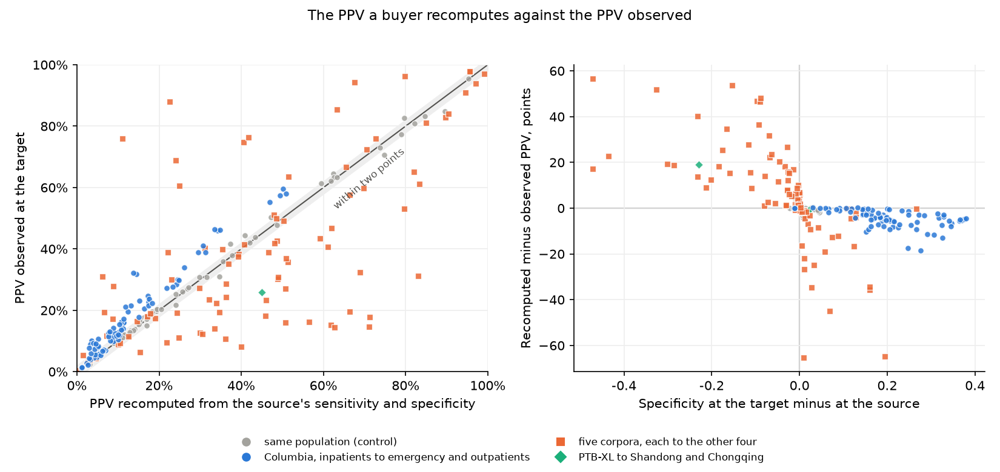

# Predicting an ECG model's positive predictive value from a clinic's prevalence: a retrospective measurement across hospitals and care settings

Ruben Abbou · October 2026

## Abstract

**Background.** A clinic that adopts an ECG model receives a sensitivity and a specificity measured in another hospital's population. Its positive predictive value (PPV), the proportion of test-positive patients who have the target condition, is then estimated by prevalence adjustment: Bayes' theorem applied to the published sensitivity and specificity at the clinic's own prevalence. Prevalence adjustment assumes that sensitivity and specificity are transportable across settings. The assumption holds under a pure prevalence shift and is violated under a spectrum shift, a change in the distribution of disease severity or presentation among cases and non-cases.

**Methods.** A decision threshold set for 90% sensitivity in a source population was applied unchanged to a target population in 174 transfers: four models for structural heart disease (SHD) transferred from Columbia inpatients to emergency patients and outpatients of the same institution (EchoNext), an infarction network transferred from a German database to two Chinese hospitals, and networks for five rhythm and conduction diagnoses rotated across five corpora from three countries. In each transfer, the PPV recomputed by Bayes' theorem from the source sensitivity and specificity at the target's true prevalence was compared with the PPV observed among test-positive target patients; 72 controls evaluated each model on held-out patients from its own source population. At Columbia, the threshold was also recalibrated on outpatients with known diagnoses, and three local updating methods were compared by net benefit.

**Results.** Values in parentheses are 95% confidence intervals. The recomputed PPV differed from the observed PPV by a median of 5.3 (4.2 to 7.8) percentage points, against 0.3 (0.2 to 1.0) in controls, and fell outside the observed PPV's confidence interval in 75% (67% to 82%) of transfers, overestimating it in some transfers and underestimating it in others. At Columbia, the prevalence of SHD among outpatients was 25.6% (23.1% to 28.3%) and the observed PPV of the trained network was 46.0% (41.3% to 50.7%); the recomputed PPV was 34.2%, an underestimate of 11.7 percentage points (8.3 to 15.3). Discrimination was similar in the two settings, with an AUROC of 0.815 (0.796 to 0.832) among inpatients and 0.805 (0.774 to 0.837) among outpatients, but the scores of outpatients with and without SHD were both lower. At the inpatient threshold, sensitivity was therefore 71.6% (65.9% to 76.6%) among outpatients against 90.4% (88.6% to 92.0%) among inpatients, and specificity 71.1% (67.8% to 74.1%) against 42.2% (39.3% to 45.2%). The proportion of outpatients flagged, 39.8% (36.9% to 42.8%), was lower than any prevalence could produce under the inpatients' sensitivity and specificity. After threshold recalibration on 858 separate outpatients, sensitivity was 86.3% (81.7% to 89.9%) and specificity 48.5% (45.0% to 52.0%). At Chongqing, prevalence adjustment overestimated the PPV of the infarction network: 45% recomputed, 26% (25% to 27%) observed.

**Conclusions.** The PPV of an ECG model in a new clinical setting was not reliably predicted from the local prevalence: the model's ranking of patients was preserved across settings, but the operating point of a fixed threshold was not. A clinic obtains its PPV by measuring it in its own patients with known diagnoses. The proportion of patients flagged requires no reference standard and signals early that the operating point has shifted.

## 1. Introduction

A hospital evaluating an ECG model receives an AUROC, a sensitivity and a specificity measured in another institution's patients, at a threshold on the model's score. None of these gives the proportion of a clinic's alerts that are true positives. That proportion is the positive predictive value (PPV); its counterpart, the negative predictive value (NPV), is the proportion of test-negative patients who do not have the condition. Both depend on the prevalence of the condition among the clinic's patients. The standard approach, which the author has also recommended, is prevalence adjustment: the PPV is recomputed at the local prevalence by Bayes' theorem, PPV = sens × prev / (sens × prev + (1 − spec) × (1 − prev)).

Prevalence adjustment is exact when sensitivity and specificity are transportable between the two populations, that is, when only the prevalence differs and cases and non-cases are otherwise alike. Machine learning calls this prevalence shift label shift: the class proportions change while the distribution of ECGs within each class does not [5]. Under covariate shift the distribution of ECGs changes, and under spectrum shift the cases or non-cases themselves differ in severity or presentation; in either case sensitivity and specificity change and the adjusted PPV is biased. Both are forms of dataset shift, a difference between the population on which a model was validated and the population in which it is used. Clinical epidemiology describes the same phenomenon as the spectrum effect: a test's sensitivity and specificity depend on the spectrum of cases and non-cases in which they are measured [2,3]. Across 23 meta-analyses, the sensitivity or specificity of a single test differed by up to 40 percentage points between low- and high-prevalence studies, and specificity tended to decrease as prevalence increased [4].

In some settings prevalence adjustment performs well. A hyperkalemia model validated at Mayo Clinic reached 80% sensitivity and 80% specificity in the emergency department, where 1% of patients had a potassium above 6.0 mEq/L and the PPV was 3%, and 82% and 82% in intensive care, at 3% prevalence and a PPV of 14% [1]. With sensitivity and specificity nearly unchanged between the two units, Bayes' theorem applied from one unit to the other approximates the observed PPV. For structural heart disease (SHD) the published evidence is less favourable. In the EchoNext study, at a fixed sensitivity of 70%, specificity at the external hospitals was 10 percentage points lower than at Columbia [6]. On their multicentre test set from eight NewYork-Presbyterian hospitals, EchoNext's authors report for the full model an AUROC of 0.843 among outpatients and 0.841 among inpatients and describe consistent performance across care settings [6]; the public EchoNext set used here comes with no AUROC by care setting. Their table by care setting gives the AUROC and the area under the precision-recall curve, and the F1 score and diagnostic odds ratio at a fixed cut-off of 0.5, but no sensitivity or specificity; the F1 score, which decreases with prevalence, was 0.557 among outpatients against 0.728 among inpatients. At another hospital, the published mini-model discriminated nearly as well, with an AUROC of 0.790 against 0.820 on the EchoNext test patients, and by care setting 0.796 among outpatients against 0.773 among inpatients and intensive care patients, with no sensitivity reported at a fixed cut-off [7]. In a community cohort of people aged 65 to 85 the AUROC fell to 0.71, from 0.83 in hospital, which the authors attribute to milder disease [8]. A preserved AUROC does not imply a preserved operating point at a fixed threshold.

Thresholds that fail to transport have been reported before. The Mayo Clinic model for an ejection fraction of 35% or less retained good discrimination in a Russian population sample, with an AUROC of 0.82, yet the cut-off chosen in its original study detected only 26.9% of cases; its authors concluded that each population may need its own cut-off [9]. The opposite has also been reported: across four American sites and 13,960 patients, a model for an ejection fraction of 40% or less, at a cut-off fixed in advance, had a sensitivity of 84.5% and a specificity of 83.6%, with no significant difference in performance between sites [10]. PRESENT-SHD, an SHD model whose threshold was set for 90% sensitivity at one hospital, detected 92.5% to 96.0% of cases at four others and 87.5% in a Brazilian population cohort [11]. In pathology and CT, cut-offs have been recalibrated on local samples of at most 25 cases [12,13]. In screening mammography, a commercial model's cut-off was recalibrated on 16,204 local screens, 200 of them with cancer, and each version of the mammography software required its own [14]. Searches of PubMed and Europe PMC on 5 October 2026 (supplement S1.13) identified no study that measured, for SHD, the operating point of a fixed threshold when one hospital's model is transferred from its inpatients to its outpatients.

This study asks whether a clinic can predict a model's PPV from its own prevalence. It measures the difference between the recomputed and the observed PPV in 174 threshold transfers between hospitals, care settings and corpora, uses the transfer from inpatients to outpatients at Columbia to identify the mechanism of the error, and evaluates the updating methods available to a site.

## 2. Methods

A transfer is one model, one diagnosis and one threshold, set in a source population and applied unchanged in a target population. All transfers were evaluated on public, de-identified ECGs with known diagnoses, so that the observed PPV could be computed.

### 2.1 Patients and ECGs at Columbia

EchoNext v1.1.1 holds 100,000 ECGs from Columbia University Irving Medical Center and the Allen Hospital, two NewYork-Presbyterian sites referred to below as Columbia, each paired with a transthoracic echocardiogram; the files do not record the site of each ECG [6]. The target condition is moderate or worse SHD on echocardiography, which EchoNext defines as any of eleven findings: a left ventricular ejection fraction of 45% or less; a left ventricular wall thickness of 1.3 cm or more; moderate or worse aortic stenosis, aortic regurgitation, mitral regurgitation, tricuspid regurgitation or pulmonary regurgitation; moderate or worse right ventricular systolic dysfunction; a moderate or large pericardial effusion; a pulmonary artery systolic pressure of 45 mmHg or more; and a tricuspid regurgitation peak velocity of 3.2 m/s or more. An ECG is labelled positive when it was recorded within one year before an echocardiogram showing any of the eleven findings, and negative when it was recorded at any time before the patient's most recent echocardiogram showing none: EchoNext applies no time limit to negatives [6]. In the test split, 27.9% of the negative outpatient ECGs and 10.9% of the negative inpatient ECGs carry no echocardiographic measurement, which EchoNext records only within the year, so these ECGs were recorded earlier (supplement S1.2).

EchoNext assigns its ECGs to a training, a validation and a test group, and leaves 17,457 in none, which this study does not use; no patient is in two of the three groups. The models were trained on the 72,475 ECGs of the training group, from 26,218 patients with several ECGs each. In the validation and test groups each patient contributes one ECG, the most recent. The thresholds were set on the 1,903 inpatient ECGs of the validation group, 53.2% of them positive; these are referred to below as the calibration inpatients. All measurements were then made on the test group: 1,059 outpatient ECGs (25.6% positive), and in addition 2,203 other inpatient ECGs (52.5% positive) and 1,971 emergency ECGs (40.0% positive). EchoNext records a fourth setting, procedural, whose 209 test ECGs are not analysed; supplement S1.2 accounts for every ECG and its use. The ECGs were recorded between 2008 and 2022, from patients aged 18 or over. The outpatients' ECGs are older than the inpatients' (median year 2015 against 2017), and within each band of recording years the outpatients' sensitivity remained below the inpatients' (66.2% to 82.3% against 88.9% to 92.2% across three bands and three models; supplement S1.2).

### 2.2 Other hospitals and corpora

PTB-XL is a German research database of ECGs recorded between 1989 and 1996 [15]. An infarction network trained on it was transferred to Shandong Provincial Hospital [16] and to the First Affiliated Hospital of Chongqing Medical University [17]. In PTB-XL an infarction is an infarct pattern on the tracing, most often without a stated stage; at Shandong it is also read from the tracing, and most are coded as old; at Chongqing it is an acute infarction named in the discharge diagnosis, in a cohort in which every patient underwent coronary angiography.

Five corpora were rotated through the source role on five rhythm and conduction diagnoses: sinus rhythm, atrial fibrillation, left bundle-branch block, right bundle-branch block and first-degree atrioventricular block. The corpora are PTB-XL, Shandong, and three from the PhysioNet/Computing in Cardiology Challenge 2021 collection [18]: Chapman-Shaoxing with Ningbo (China), Georgia (United States) and CPSC 2018 with its extension (China). Each corpus was split by patient, after merging records that file the same tracing twice, and its training and calibration parts were capped at the size of the smallest corpus (supplement S2.4).

### 2.3 Models

At Columbia four models score every ECG. The first is a residual neural network trained on EchoNext for this study. The second is the published EchoNext mini-model, run unchanged on its authors' weights; on the EchoNext test patients it reaches an AUROC of 0.820, the figure its authors report [6] and Otabor and colleagues quote [7]. The third is ECGFounder, a network pre-trained on more than ten million ECGs from another hospital [19]. Its network was kept frozen as published; it maps each ECG to an embedding, a fixed-length vector of features, and a logistic regression fitted on EchoNext maps that embedding to a probability for each finding. The fourth is the first network with randomly initialised weights, read through the same kind of logistic regression: a negative control, referred to below as the untrained floor, that any informative model must exceed. The Columbia results compare the first three. For infarction, a residual network was trained on PTB-XL; for the rotation, one residual network was trained on each corpus. The [supplement](SUPPLEMENT.md) gives the architectures, how the published weights were loaded, and the statistical details of every method below.

### 2.4 The threshold

For each model and diagnosis, the threshold was placed among the source cases so that 90% of them scored at or above it, a target sensitivity of 90%. A patient at or above the threshold is test-positive (flagged), and a patient below it test-negative. When cases are few, the threshold is placed slightly below the empirical 90th percentile, so that sensitivity errs above the target rather than below it (supplement S1.1).

At Columbia the source population is the calibration inpatients, which reproduces a model validated in hospital and then deployed in outpatient clinics. The same rule was also applied to two other groups of validation patients: all 4,626 of them regardless of care setting, as a vendor validating on every patient with an echocardiogram might do, and the 858 validation outpatients, 240 of them positive, who are distinct from the outpatients on whom the results are reported. For infarction, the threshold was set on one half of PTB-XL's held-out patients and applied unchanged to the other half, to Shandong and to Chongqing; this was repeated over 200 random halves, and each figure is the mean. In the rotation, each corpus set the threshold on its calibration part, and the threshold was applied to the test part of each of the other four, over 200 draws of the calibration part.

### 2.5 The recomputed and the observed PPV

In each transfer, the source sensitivity and specificity at the threshold, entered into Bayes' theorem with the target's true prevalence, give the recomputed (prevalence-adjusted) PPV. The observed PPV is the proportion of test-positive target patients who are cases, with a Wilson 95% confidence interval. Supplying the true prevalence favours the recomputation, since a clinic would have to estimate it. The gap is the recomputed PPV minus the observed PPV, in percentage points, with an interval from 2,000 redraws of both the source and the target counts. A transfer enters the summaries when its target holds at least 10 cases and its threshold flags at least 20 patients, so that the interval of the observed PPV is narrower than the gaps of interest; 24 transfers did not meet this criterion.

At Columbia the transfers are four models, eleven findings and their composite, from the calibration inpatients to the emergency patients and to the outpatients. Controls evaluated the same models on held-out patients from their own source population: Columbia's calibration inpatients to the inpatients of the test split, and each rotation corpus to its own test part. Transfers that share a model and a pair of populations are not independent, so each proportion across transfers carries a 95% cluster bootstrap interval that resamples whole groups of them, 30 groups for the transfers and 9 for the controls (supplement S3.1).

Under label shift, a model recalibrated on the source assigns non-cases the same likelihood ratio on average in both populations, close to 1. The likelihood ratio here is the odds the model assigns to a patient divided by the source's prevalence odds. Its median over diagnoses and models, among the non-cases of each target, was computed as a test of the label-shift assumption.

Three PPV predictions that require no local reference standard were also compared with the observed PPV: the recomputation at a prevalence estimated from the site's unlabelled scores, the model's mean predicted probability among test-positive patients, and that mean probability adjusted to the estimated prevalence.

### 2.6 Outcome measures at Columbia

Per 100 patients with SHD: true positives (detected by the threshold) and false negatives (missed). Per 100 patients without SHD: true negatives and false positives (flagged). PPV and NPV are given at the outpatients' own prevalence. A range in parentheses after a percentage is its 95% confidence interval, which resamples the patients evaluated at the threshold as set; where the calibration patients are resampled as well, the text says so. A range across repetitions is labelled as such.

To compare discrimination across settings, the AUROC was computed and a receiver operating characteristic curve drawn, as true positives against false positives per 100 at every possible threshold. The three models were compared on the same outpatients.

A different case mix among outpatients could account for part of the change. To quantify it, a logistic regression fitted on the patients with SHD of both settings estimated each patient's probability of detection from their findings, ejection fraction, age, sex and setting. Applied to the inpatients with SHD as if they were outpatients, it gives the outpatients' sensitivity standardised to the inpatients' case mix (supplement S1.6). Differences between women and men and between age groups were tested with Holm's correction for six tests (supplement S1.8); these analyses are exploratory.

### 2.7 Local updating methods

Three updating methods were applied to the same scores in every transfer with sufficient patients. The first requires no local diagnosis: it estimates the site's prevalence from its unlabelled probabilities by the maximum-likelihood method of Saerens and colleagues [5], after recalibrating the model on the source as Alexandari and colleagues recommend [20], and shifts every probability to that prevalence. The second is logistic recalibration on local labels: an intercept and a slope fitted on 100 local ECGs with known diagnoses, or the intercept alone when the draw holds fewer than 10 of the rarer class [21]. The third adds a second, higher threshold set on the source non-cases, so that patients between the two thresholds are referred to a human reader (section 3.8). Each method was evaluated on one half of the target split by patient, the other half serving as the pool from which the labelled method drew, over 200 draws.

The methods were compared by net benefit, the measure of decision curve analysis [22]. A clinician who would refer a patient to echocardiography above a 10% probability of disease accepts nine normal studies for one abnormal study. Net benefit is the number of true positives per patient minus the number of false positives weighted by those odds, and compares the model with referring every patient and referring none. It was computed at decision thresholds of 5%, 10% and 20%.

At Columbia, the threshold was also recalibrated on outpatients with known diagnoses: threshold recalibration on local labels, in which the model's weights are unchanged and only the cut-off moves. The outpatients were split at random into two halves; 100 patients with known diagnoses were drawn from the first half, the threshold was recalibrated on them, and the result was evaluated on the second half. This was repeated 2,000 times with a new split each time, and each repetition recorded the number of cases among its 100. Those 100 come from the outpatients on whom the result is evaluated. Local validation, the evaluation of a model in a site's own patients, requires patients the threshold was not set on, so the threshold was also set on all 858 validation outpatients, and on 100 drawn from them 2,000 times, and each was evaluated on every test outpatient.

## 3. Results

The PPV recomputed by Bayes' theorem differed from the observed PPV in most transfers, in both directions. At Columbia the model's ranking of patients was preserved while the outpatients' scores shifted downward, so the threshold fell at a different operating point and sensitivity and specificity changed.

### 3.1 The recomputed PPV was biased in both directions

Across 174 transfers, the recomputed PPV differed from the observed PPV by a median of 5.3 (4.2 to 7.8) percentage points. It fell within two points in 25% (18% to 33%) of transfers and outside the observed PPV's 95% confidence interval in 75% (67% to 82%). In the 72 controls it differed by 0.3 (0.2 to 1.0) points and fell outside the interval in 1% (0% to 5%). Relative to the PPV itself, the recomputed PPV was in error by a quarter or more of the observed value in 57% (46% to 69%) of transfers, against 1% (0% to 4%) of controls.

Table 1. The recomputed PPV against the observed PPV, from `results/ppv_intervals.json`, `results/ppv_gap.json` and `results/echonext_ppv_gap.json`. Groups are the model-and-population pairs the intervals resample. Too high: the recomputed PPV above the observed PPV. The two infarction transfers are reported in section 3.4.

| Pairs | Transfers | Groups | Median gap, points | Within two points | Outside the observed 95% interval | Off by a quarter or more | Too high |
|---|---|---|---|---|---|---|---|
| Controls, same population | 72 | 9 | 0.3 (0.2 to 1.0) | 86% (67% to 97%) | 1% (0% to 5%) | 1% (0% to 4%) | 40% (32% to 53%) |
| All transfers | 174 | 30 | 5.3 (4.2 to 7.8) | 25% (18% to 33%) | 75% (67% to 82%) | 57% (46% to 69%) | 36% (22% to 51%) |
| Columbia, inpatients to emergency | 44 | 4 | 3.2 (2.6 to 4.5) | 36% (27% to 45%) | 66% (59% to 73%) | 39% (23% to 55%) | 9% (2% to 16%) |
| Columbia, inpatients to outpatients | 36 | 4 | 4.8 (2.1 to 5.5) | 19% (0% to 50%) | 81% (50% to 100%) | 78% (42% to 100%) | 0% (0% to 0%) |
| Five corpora, each to the other four | 92 | 20 | 10.9 (6.3 to 15.8) | 22% (14% to 29%) | 76% (67% to 85%) | 59% (47% to 72%) | 62% (46% to 76%) |

The direction of the error depended on the pair of populations. At Columbia the recomputation underestimated the PPV in every outpatient transfer. Across the rotation it more often overestimated it. The largest error was for left bundle-branch block transferred from PTB-XL to Shandong, recomputed at 23% and observed at 88% (70% to 96%).

Figure 1. Left: each point is one transfer (one model, one diagnosis and one pair of populations), with the recomputed PPV against the observed PPV; grey points are controls, in which the target is drawn from the source population. Right: the same points, the gap in percentage points against the change in specificity from source to target.

The right panel locates the source of the gap. Where specificity rose in the target, the recomputation underestimated the PPV; where it fell, the recomputation overestimated it. The likelihood-ratio test points the same way. Among Columbia's test inpatients, the control, the median over all diagnoses and models was 0.99; among emergency patients it was 0.75, and among outpatients 0.49. The distribution of ECGs among non-cases changed, which label shift excludes, and the three settings rank in the same order on this ratio as on the PPV gap.

### 3.2 Columbia: discrimination is preserved, the operating point shifts

At Columbia, 25.6% (23.1% to 28.3%) of the test outpatients had moderate or worse SHD. Of the outpatients flagged by the trained network at its inpatient threshold, 46.0% (41.3% to 50.7%) had SHD. Among the calibration inpatients the threshold had a sensitivity of 90.1% and a specificity of 40.4%; Bayes' theorem with those two values at the outpatients' prevalence gives 34.2%, an underestimate of 11.7 points (8.3 to 15.3). The recomputation implied 1.9 false positives per true positive where there were 1.2. For an ejection fraction of 45% or less it predicted that 14.4% of flagged outpatients would have one, and 31.8% (25.6% to 38.7%) did: 5.9 false positives per true positive predicted, 2.1 observed.

Sensitivity and specificity both changed. Set for 90% sensitivity in the calibration inpatients, the trained network's threshold had a sensitivity of 90.4% among the other inpatients (88.6% to 92.0%) and 71.6% among outpatients (65.9% to 76.6%). Resampling the calibration inpatients as well, so that the threshold varies too, widens the outpatient interval to 65.2% to 78.0%. Emergency patients were intermediate, at 86.2%. The threshold also flagged fewer patients without SHD: 29 per 100 among outpatients, against 58 per 100 among the other inpatients; its specificity was 71.1% (67.8% to 74.1%) among outpatients and 42.2% (39.3% to 45.2%) among inpatients. The sensitivity among outpatients was 72.7% for the published mini-model and 71.6% for ECGFounder.

Table 2. The trained network's inpatient threshold, per 100 patients with SHD and per 100 patients without SHD in each group: 1,156 with and 1,047 without SHD among the other inpatients, 271 with and 788 without SHD among outpatients, from `results/echonext_clinical.json`.

| | Other inpatients | Outpatients |
|---|---|---|
| With SHD, detected (true positives) | 90 | 72 |
| With SHD, missed (false negatives) | 10 | 28 |
| Without SHD, flagged (false positives) | 58 | 29 |

In a clinic seeing 1,000 outpatients at Columbia's outpatient prevalence, the inpatient threshold refers 398 for echocardiography, detects 183 of the 256 patients with SHD and misses 73. Of the outpatients below the threshold, 87.9% (85.2% to 90.2%) do not have SHD.

Discrimination among outpatients did not deteriorate. The AUROC of the trained network was 0.815 among inpatients (0.796 to 0.832), 0.805 among outpatients (0.774 to 0.837) and 0.837 among emergency patients (0.820 to 0.854). For the mini-model it changed from 0.797 to 0.795, and for ECGFounder from 0.804 to 0.791. Figure 2 shows the receiver operating characteristic curve, true positives against false positives at every possible threshold. The inpatient and outpatient curves lie within a few points of each other: at 90 true positives per 100 cases the false positives per 100 non-cases are 57 and 59, and at 72 true positives they are 25 and 31. The same threshold falls at a different point on that curve: among inpatients it detected 90 per 100 cases and flagged 58 per 100 non-cases; among outpatients it detected 72 and flagged 29. Outpatients with and without SHD both scored lower than their inpatient counterparts. The AUROC compares cases with non-cases within one setting, and because both score distributions shifted together it barely changed; the PPV recomputed from the inpatients' values assumed a specificity the outpatients did not have.

Figure 2. Receiver operating characteristic curves of the trained network: patients with SHD detected per 100 against patients without SHD flagged per 100, at every possible threshold, among the 2,203 test inpatients (1,156 with SHD) and the 1,059 test outpatients (271 with SHD). The dots mark the threshold set on the 1,903 calibration inpatients.

Among the same outpatients with SHD, the trained network detected exactly as many as ECGFounder and 1.1 points fewer than the mini-model. Each paired 95% interval lies within 5.5 points of zero (supplement, Table S2); the three intervals are marginal, not simultaneous. The untrained floor detected more outpatients with SHD, 78.6%, only because it flagged many more patients without SHD: 43 per 100, against 29 for the trained network. The three models were trained on the same EchoNext patients, so they are not three independent tests of the mechanism. A score built on age and sex alone, fitted on the training group and thresholded by the same rule, had a sensitivity of 90.4% among inpatients and 89.7% among outpatients: its sensitivity did not fall, so the fall is not explained by the outpatients' age and sex but is associated with their ECG findings. That score discriminated poorly (AUROC 0.678 among outpatients) and flagged 73 per 100 outpatients without SHD, where the ECG models, with every diagnosis known, flag 58 to 65 at 90% sensitivity.

The population on which the threshold is set affects the size of the shift. Set on all 4,626 validation patients, regardless of setting, the threshold had a sensitivity of 77.1% among outpatients (71.8% to 81.7%) and 94.0% among inpatients; for the mini-model and ECGFounder, 76.4% and 77.9% among outpatients. The fall is smaller from that threshold, and it persists.

Figure 3. The inpatient threshold applied to the test outpatients (271 with SHD, 788 without), per 100 of each, for the three models and the untrained floor. Rows marked one threshold use the threshold alone; rows marked two thresholds add the second threshold of section 3.8, and patients between the two are referred to a reader (grey). Blue: a true positive or a true negative, with no reader. Orange: a false negative, or a false positive with no reader. Patients with SHD detected are blue plus grey. Each row's counts are rounded to sum to 100.

### 3.3 Determinants of the lower outpatient scores

The loss of sensitivity was not distributed evenly over the eleven findings. Among patients with an ejection fraction of 45% or less, the threshold detected 91.4% of outpatients (64 of 70) against 94.2% of inpatients, and among those with aortic stenosis 94.1% against 97.2%. For a wall thickness of 1.3 cm or more it detected 69.2% of outpatients (101 of 146) against 91.9%; for mitral regurgitation 70.0% against 95.4%, for tricuspid regurgitation 69.2% against 94.0%, and for a pulmonary pressure of 45 mmHg or more 71.4% against 91.0%. Of the 77 false negatives among outpatients, 59 had a single finding, an increased wall thickness alone for 35 of them; 12 had an ejection fraction of 35% or less or a severe grade. Excluding cases whose only finding was an increased wall thickness, sensitivity was 77.4% among outpatients against 91.6% among inpatients. A threshold set separately for each finding gives a similar pattern (supplement, Table S3).

The spectrum of SHD differed between outpatients and inpatients. Among cases, the median number of the eleven findings was 2 for the calibration inpatients and 1 for outpatients, and the median ejection fraction 50.0% against 57.5%; the outpatients had less right ventricular and tricuspid disease, but a thicker septum and more aortic stenosis (supplement S1.7). The case-mix model compares the outpatients with the test inpatients. The trained network's sensitivity fell by 18.8 points from inpatients to outpatients. Standardised to the inpatients' findings, ejection fraction, age and sex, the outpatients' sensitivity would have been 76.8% instead of 71.6%: 5.2 of the 18.8 points, 27.5% of the fall (16% to 38%); estimated as the difference between two of the model's own predictions (g-computation), the share is 25.2% (13% to 36%). For the other two models the share was 27.5% and 25.3%. Case mix accounts for about a quarter of the fall, and the remainder occurs among patients with the same findings, ejection fraction, age and sex.

Among outpatients with SHD, the trained network detected 61.1% of women (77 of 126) and 80.7% of men (117 of 145), and 53.3% of patients aged 18 to 49 (16 of 30) against 87.3% of those aged 80 and over. Both differences remained significant after Holm's correction for six tests (p = 0.002 for sex and 0.002 for age), and the other two models showed the same two differences (adjusted p no higher than 0.041). The same threshold had a higher specificity among women and younger outpatients: 78.9% among women without SHD against 59.4% among men without SHD, and 80.3% at 18 to 49 against 46.8% at 80 and over, while the AUROC intervals of women (0.773, 0.719 to 0.826) and men (0.827, 0.784 to 0.871) overlapped. Women and younger outpatients scored lower, with and without SHD, which reproduces the mechanism of the main result within the outpatients. In the 5 race and ethnicity groups EchoNext records with 20 or more outpatients with SHD, sensitivity was 70.6% to 72.7% among outpatients against 89.1% to 91.7% among inpatients. These are exploratory analyses in one hospital system.

### 3.4 Across hospitals, discrimination also changes

The infarction threshold, set for 90% sensitivity in PTB-XL, had a sensitivity of 89.6% there (84.0% to 95.1%), 83.7% at Chongqing (81.2% to 86.1%) and 97.3% at Shandong (95.4% to 99.3%). Each range spans 95% of the sensitivity a single threshold set this way would achieve: in PTB-XL it is the spread of the 200 draws, each evaluated on about 276 infarctions; at Chongqing and Shandong, evaluated in full in every draw, it also includes the sampling variation of the site's own infarctions. Its specificity was 81.0% in PTB-XL, 57.9% at Chongqing and 82.9% at Shandong.

Table 3. The PTB-XL threshold at three hospitals, from `results/infarction_sites.json` and `results/outcomes.json`. Each draw sets the threshold on one half of PTB-XL's held-out fold and evaluates the other half, so the PTB-XL column counts the whole fold and, in parentheses, the mean number of tracings and infarctions evaluated per draw; Chongqing and Shandong are evaluated in full.

| | PTB-XL, Germany | Chongqing, China | Shandong, China |
|---|---|---|---|
| Tracings | 2,198 (1,099 per draw) | 17,955 | 25,770 |
| Infarctions | 550 (276 per draw) | 2,679 | 260 |
| Infarctions detected, per 100 | 90 | 84 | 97 |
| Non-infarctions flagged, per 100 | 19 | 42 | 17 |
| AUROC | 0.932 | 0.793 | 0.978 |

At Chongqing the recomputation overestimated the PPV: it predicted 45% for infarction, and 26% (25% to 27%) was observed, because specificity fell from 81% to 58%. The threshold detected fewer infarctions and flagged more non-infarctions at the same time, and the AUROC fell from 0.932 to 0.793. At Chongqing the definition of infarction, the population, the recording equipment and the period of recording all differ from PTB-XL, and the design cannot attribute the lower AUROC to any one of them. At Shandong, where infarctions are read from the tracing and most are coded as old, the AUROC rose to 0.978 and the threshold exceeded its target sensitivity; the lower bound of its range lies above 90%. There the recomputation erred by less than one point, 4.5% against 5.4% (4.8% to 6.1%), but that point is a large fraction of a low PPV: 21 false positives per true positive predicted, 17 observed. With other encoders the direction of the error at Shandong can differ (supplement S2.10). Table 1 summarises the rotation's 92 transfers, and Part 2 of the supplement reports them by diagnosis.

### 3.5 The proportion flagged signals the shift without a reference standard

Without diagnoses, a clinic observes the proportion of patients the model flags. From inpatients to outpatients, the proportion flagged by the trained network fell from 74.9% (73.0% to 76.7%) to 39.8% (36.9% to 42.8%). A lower prevalence alone cannot produce that fall. Had the inpatients' sensitivity and specificity been preserved, the proportion flagged would have been 66.1% at the outpatients' prevalence, and no prevalence could reduce it below 57.8%, the false-positive rate among inpatients. The mini-model flagged 40.1% of outpatients against a lower bound of 61.2%, and ECGFounder 39.7% against 57.2%. A clinic that compares its proportion flagged with the proportion at validation therefore detects that the score distribution has shifted, and that its sensitivity, specificity and PPV differ from the validated values. The proportion flagged does not give the number of false negatives, 28 per 100 outpatients with SHD here, which only a reference standard can count.

Predictions that require no reference standard performed worse than the recomputation given the true prevalence. Across the 174 transfers, the recomputation at a prevalence estimated from the site's unlabelled scores erred by a median of 13.7 points, the model's mean predicted probability among test-positive patients by 8.2, and that probability adjusted to the estimated prevalence by 12.6. At Columbia, the estimate of the outpatients' prevalence from their unlabelled scores was 0.1%, against a true prevalence of 27% among the outpatients on which it was evaluated.

### 3.6 Three updating methods compared by net benefit

Figure 4. Decision curves: net benefit, in true positives per 100 patients, against the threshold probability of disease, for the model as delivered and three updating methods, among Columbia's outpatients for SHD and at Shandong and Chongqing for infarction. Each curve is evaluated on one half of the target.

A low PPV does not by itself make a model useless; whether to act on an alert depends on the relative cost of a false positive and a false negative. At Columbia, for outpatients at a decision threshold of 10%, the trained network's probabilities as delivered gave a net benefit of 186 true positives per 1,000 outpatients, against 187 for referring every outpatient to echocardiography, on the 530 outpatients of the evaluation half. At this prevalence and decision threshold, echocardiography for every outpatient performs as well as the model. At Shandong, the model as delivered had a lower net benefit than referring no one at each of the three decision thresholds: its probabilities, fitted in a population with an infarction prevalence of one in four, are miscalibrated upward where the prevalence is about one in a hundred.

Table 4. Mean change in net benefit relative to the model as delivered, per 1,000 patients, over 146 transfers, at decision thresholds of 5%, 10% and 20%, and the number of transfers in which each rule gave the highest net benefit at 10%, from `results/repairs.json`. A tie counts for every rule that reaches it.

| Rule | 5% | 10% | 20% | Best at 10% |
|---|---|---|---|---|
| Prevalence corrected, no label | −22.6 | −15.6 | −6.9 | 15 |
| Logistic recalibration on 100 local labels | +6.9 | +11.0 | +18.1 | 35 |
| Per-label sets, patients sent to a reader counted as cleared | −24.5 | −13.5 | −2.7 | 27 |
| Per-label sets, patients sent to a reader counted as referred | −4.8 | −4.2 | −18.0 | 22 |
| Model as delivered | 0 | 0 | 0 | 39 |

Logistic recalibration on 100 local labels was the only method with a positive mean gain, at each of the three decision thresholds: 6.9, 11.0 and 18.1 net true positives per 1,000 patients. It fails where 100 labelled ECGs contain almost no cases: at Shandong a draw of 100 ECGs holds about 1 infarction, and the recalibrated model remains below the label-free correction there. For Columbia's outpatients it lowered net benefit at decision thresholds of 5% and 10% for all three models.

The label-free correction performs well under prevalence shift alone and fails when the non-cases also change. At Shandong it gave the highest net benefit of the four rules at decision thresholds of 10% and 20%. At Columbia it estimated the outpatients' prevalence at 0.1%, because outpatients without SHD score lower than any inpatient without SHD, and then referred no one to echocardiography. The likelihood-ratio test of section 3.1 identifies which of the two situations a site is in, but it requires diagnoses.

### 3.7 Threshold recalibration on local labels

Recalibrated on 100 outpatients with known diagnoses, the threshold had a mean sensitivity of 91.6% over 2,000 repetitions, against 71.5% for the inpatient threshold on the same patients (Figure 5). The 100 contained 26 cases on average, between 13 and 41 across the repetitions. In 33.1% of the repetitions the recalibrated threshold still had a sensitivity below 90% among the outpatients it had not been set on; for the mini-model and ECGFounder, 31.1% and 29.9%, about one repetition in three. The cost was paid in false positives: it flagged a mean of 70 per 100 outpatients without SHD, against 29 for the inpatient threshold. The mini-model and ECGFounder behaved similarly, with sensitivities of 91.9% and 91.8% and 72 and 70 false positives per 100 non-cases. With 200 outpatients, about 51 of them cases, the trained network had a sensitivity of 90.9%, flagged 66 per 100 non-cases, and still fell below 90% in 37.0% of the repetitions. A larger labelled sample narrowed the spread, the middle 80% of repetitions ranging from 83.8% to 98.0% with 100 and from 84.5% to 96.4% with 200, but did not reduce the proportion that fell short: the rule places the threshold for 90% sensitivity on average, with a margin above it that narrows as the sample grows.

These 100 were drawn from the outpatients on which the threshold was evaluated. A clinic sets its threshold on past patients and applies it to new ones. EchoNext's validation group holds 858 other outpatients from the same hospital, 240 of them cases. Set on all of them, the threshold had a sensitivity among the test outpatients of 86.3% (81.7% to 89.9%), 87.8% (83.4% to 91.2%) for the mini-model and 89.7% (85.5% to 92.8%) for ECGFounder: short of 90% for all three, and for the trained network the interval excludes 90%. It flagged 52, 60 and 57 per 100 outpatients without SHD. Set on 100 drawn from those 858, it had mean sensitivities of 89.0%, 90.9% and 89.5% among the test outpatients and fell below 90% in 38.4% to 48.5% of the repetitions. The untrained floor, set on the same 858, had a sensitivity of 91.9% and flagged 75 per 100 non-cases.

Figure 5. The trained network's threshold recalibrated on n outpatients with known diagnoses (x axis, with the mean number of cases among them) and evaluated on the other half of the outpatients, 2,000 repetitions with a new split each. Solid line: true positives per 100 patients with SHD; dashed line: false positives per 100 patients without SHD. Lines are means and bands the middle 80% of the repetitions; x = 0 is the inpatient threshold, and the dotted line marks 90.

Threshold recalibration has a cost in false positives. In the same clinic of 1,000 outpatients, the recalibrated threshold would refer 752 for echocardiography and miss 21 of the 256 patients with SHD, against 398 and 73 with the inpatient threshold: about 7 additional echocardiograms per additional case detected. With every outpatient's diagnosis known, 90% sensitivity flags 59 per 100 non-cases, so the threshold transferred from the inpatients misses 18 more cases per 100 than a threshold set for 90% sensitivity among outpatients, and flags 30 fewer non-cases. Most of the difference between 59 and 70 false positives per 100 is the margin the rule takes on a small sample: it places the threshold slightly below the sample's empirical 90th percentile, so that sensitivity remains at least 90% on average when the sample is unrepresentative. Placed at the sample's empirical 90th percentile, with no margin, the threshold had a mean sensitivity of 88.8%, flagged 61 per 100 non-cases, and fell below 90% in 48.8% of the repetitions. The untrained floor, recalibrated on 100 outpatients by the same rule, had a sensitivity of 91.6% and flagged 76 per 100 non-cases: once the threshold is set on outpatients, the trained models flag 5 to 7 fewer non-cases per 100 than a network with random weights.

Net benefit summarises the choice in one number for the trained network, per 1,000 outpatients (supplement, Table S7d). At a decision threshold of 10%, threshold recalibration on 100 outpatients has a net benefit of 177, echocardiography for every outpatient 173, and the inpatient threshold 159. At 5%, echocardiography for every outpatient has the highest net benefit, 217 against 207. At 20%, the inpatient threshold has the highest, 129 against 105.

### 3.8 Conformal prediction reduced to the empirical percentile

Conformal prediction was the method with which this study began. It sets a threshold on a sample of patients with known diagnoses and guarantees that, on average over such samples, at least 90% of new cases are flagged, provided the new patients are exchangeable with the sample, that is, drawn from the same distribution so that their order carries no information [23]. Applied within each diagnosis separately (class-conditional, or Mondrian, conformal prediction) [24], its threshold for cases is the 90th percentile of the case sample with a finite-sample correction, the threshold of section 2.4; on the 1,013 cases among the calibration inpatients the correction had little effect, the uncorrected 90th percentile giving a sensitivity of 71.2% among outpatients against 71.6%. In practice it equals the empirical percentile. Its guarantee did not hold for outpatients because they are not exchangeable with inpatients, and recalibrated on 100 outpatients it held on average and fell short in about one repetition in three, as the guarantee permits. Its second threshold, set on the non-cases, refers patients between the two thresholds to a human reader. That threshold recovers no false negative of the first: among outpatients it referred 36 cases and 27 non-cases per 100 to a reader, against 36 and 49 among inpatients, and as an updating method it lowered net benefit on average (Table 4). The reader's decisions on referred patients were not measured.

## 4. Discussion

A PPV recomputed by Bayes' theorem at a clinic's true prevalence fell outside the observed PPV's confidence interval in 75% of transfers, with a median error of 5.3 points, overestimating in some transfers and underestimating in others. In controls the median error was 0.3. Prevalence adjustment is exact under prevalence shift alone, and between hospitals and care settings more than the prevalence changed.

Columbia illustrates the mechanism. Discrimination among outpatients did not deteriorate; the threshold fell at a different point on the same receiver operating characteristic curve. Outpatients with and without SHD both scored lower than their inpatient counterparts, so a fixed threshold detected fewer cases and flagged fewer non-cases at the same time, and the PPV exceeded the value predicted from the inpatients' specificity. A validation that reports the AUROC by care setting, as EchoNext's did [6], therefore does not establish the sensitivity, specificity or PPV a clinic will obtain. Case mix accounted for about a quarter of the fall in sensitivity, and the remainder occurs among patients with the same findings, ejection fraction, age and sex. At Chongqing the error was in the opposite direction, with specificity lower than in the source population, so the direction of the error cannot be inferred from the setting.

This is the spectrum effect [2,3], measured on the quantity on which a clinic acts. It is consistent with the finding of Leeflang and colleagues that sensitivity and specificity vary with prevalence [4], and with Attia and colleagues' low ejection fraction model, whose original cut-off detected 26.9% of cases in a Russian population sample where its AUROC was still 0.82 [9]. Carter and colleagues found performance preserved across four sites chosen to represent the national population [10]. PRESENT-SHD preserved its sensitivity at four other hospitals and in a population cohort [11], and it differs from this study in three respects. Its threshold was transferred between hospitals and to a community cohort, not between the care settings of one hospital; it reports sensitivity at the transferred threshold, not a recomputed PPV compared with an observed one; and its model reads ECG images. One difference from both Carter's sites and PRESENT-SHD is the transfer here from inpatient wards to outpatient clinics, where cases carry fewer findings and non-cases score lower; this study does not test that difference against their sites. Methods for label shift, such as the maximum-likelihood correction of Saerens and colleagues [5,20], assume that the distribution of ECGs within each diagnosis is unchanged; at Columbia it changed, and the correction estimated a prevalence near zero. Han and Qu show that the number of cases a sample requires increases rapidly as the required precision of a threshold tightens [25]; this study did not vary the number of cases and the number of ECGs independently, so it does not measure that relationship.

A clinic adopting a model validated elsewhere therefore faces a choice that the validation did not reveal. It can retain the delivered threshold and measure the resulting PPV, or obtain a sensitivity near 90% by recalibrating the threshold on its own patients, at the cost of echocardiography for most of its outpatients without SHD, and then verify the result on new patients. The appropriate choice depends on the cost of a missed valve lesion or cardiomyopathy relative to an echocardiogram, which net benefit summarises at a stated decision threshold. Monitoring the proportion of patients flagged requires no reference standard, and at Columbia that proportion fell below any value a lower prevalence could produce.

## 5. Limitations

- The SHD result comes from one hospital system and two care settings. It has not been measured in a second hospital system, so its magnitude there is unknown.
- The three Columbia models were trained on the same EchoNext patients, and the network trained here was trained once. The mini-model was trained by its authors and ECGFounder's network elsewhere, with only its final regression fitted here, so an artefact of a single training run cannot explain the agreement of all three.
- Outpatients were distinguished from inpatients only by the care setting EchoNext records, and the two groups also differ in recording period; the fall persists within each band of years. The lower scores of outpatients with SHD are explained only in part, by the quarter attributable to case mix.
- The Columbia thresholds were set on validation inpatients. Set on every validation patient, the threshold detected 77 per 100 outpatients with SHD instead of 72: the size of the fall depends on the population on which the threshold is set. Vendors set their thresholds in different ways, and the PPV gap depends on the position of the threshold.
- The separate outpatients are one group of 858 from the same hospital; a single group cannot separate sampling variation from systematic error in its shortfall from 90%.
- Negatives are defined with no time limit, and more negative outpatients than inpatients were recorded more than a year before their echocardiogram. Excluding them, the trained network flagged 32 per 100 outpatients without SHD instead of 29, and the outpatient AUROC was 0.792; specificity and the predictive values depend on this definition, sensitivity does not.
- The intervals across transfers resample groups of transfers that share a model and a pair of populations; with four groups in each Columbia block, those intervals are imprecise.
- At Chongqing the definition of infarction, the population, the recording equipment and the period of recording change together, and the design does not separate them. EchoNext's tracings carry no physical unit, and each target was standardised in the same way as its source.
- The rotation models were trained on a few thousand ECGs each, fewer than a commercial model. The decision threshold of 10% for echocardiography is an assumption, not a measured preference, and net benefit counts true and false positives, not clinical outcomes or costs. The reader's decisions on referred patients were not measured.

This is a retrospective measurement study on public, de-identified data. It is not a medical device and has no regulatory status, it involved no contact with patients, and nothing here is intended to guide the care of any patient.

## 6. Implications for sites adopting a model

- Measure the PPV and the number of false positives per true positive in the site's own patients with known diagnoses, at the threshold to be deployed, in a sample large enough that the confidence interval is narrower than the margin relevant to the decision. A PPV recomputed from a vendor's sensitivity and specificity can err in either direction by more than that margin.
- Request a decision curve at a stated decision threshold for the action the alert triggers, compared with treating all patients and treating none. Among Columbia's outpatients the model performed no better than echocardiography for every outpatient at 10%; at Shandong's prevalence the model as delivered performed worse than referring no one.
- Compare the proportion of patients flagged with the proportion at validation. A proportion below the lowest value any prevalence allows indicates that the score distribution has shifted, before any diagnosis is available.
- When a vendor offers a correction that requires no local diagnosis, request evidence that the site's non-cases resemble the vendor's. Among Columbia's outpatients they did not.
- When the threshold is recalibrated on local patients, evaluate it on patients it was not set on, and count its cost in false positives.

## Declarations

**Competing interests.** The author has worked at Idoven, which develops ECG analysis software, and at Anumana, which commercialises Mayo Clinic's AI-ECG work, including the lineage behind the hyperkalemia study [1]; the studies cited as [9] and [10] also come from Mayo Clinic. Idoven had no part in the design, conduct, funding or reporting of this study. None of either company's data, models or software were used.

**Funding.** None.

**Data.** EchoNext is distributed by PhysioNet under its Restricted Health Data License; its tracings and the per-record scores computed from them stay outside this repository, which holds counts and aggregate figures only. EchoNext v1.1.1's files match their published SHA-256 sums (`results/echonext_provenance.json`); the date they were downloaded is not recorded. PTB-XL and the Shandong and Chongqing datasets are public and were downloaded on 23 August 2026; Chongqing's MD5 sums are in `scripts/fetch_open_corpora.sh`, and the PTB-XL and Shandong files were not checksummed. The Challenge 2021 corpora and their sources are listed in `docs/data.md`.

**Ethics.** This is a secondary analysis of publicly released, de-identified ECG data, and it involved no contact with patients. EchoNext: the DISCOVERY trial and its analyses were approved by the Institutional Review Board at NewYork-Presbyterian Hospital/Columbia University Irving Medical Center, as its PhysioNet page states; no approval number is given there. EchoNext is released under PhysioNet's Restricted Health Data License, whose terms forbid any attempt at re-identification. PTB-XL: the Institutional Ethics Committee approved publication of the anonymous data in an open-access database, reference PTB-2020-1. Shandong: approved by the Institutional Review Board of Shandong Provincial Hospital, with the requirement for individual patient consent waived and public sharing permitted after de-identification; no approval number is given. Chongqing: approved by the ethics committee of the First Affiliated Hospital of Chongqing Medical University, approval number 2024-256-01, with written informed consent waived. No attempt was made to re-identify any patient.

**Code and numbers.** Every number in this report is read from a file under `results/` by `tests/paper_values.py`, and `tests/test_paper_numbers.py` fails if the text and the files part. Figures quoted from cited studies are the exception: that test lists them by source, and they were checked against the sources by hand. The EchoNext figures rest on scores that may not be committed; `results/echonext_clinical.json` records their SHA-256 sums, and `tests/test_echonext_data.py`, run where EchoNext and the scores are installed, rebuilds the file from them. The supplement gives the commands.

## References

1. Harmon DM et al. Validation of noninvasive detection of hyperkalemia by artificial intelligence-enhanced electrocardiography in high acuity settings. *Clin J Am Soc Nephrol* 2024;19(8):952-958. doi:10.2215/CJN.0000000000000483.
2. Usher-Smith JA, Sharp SJ, Griffin SJ. The spectrum effect in tests for risk prediction, screening, and diagnosis. *BMJ* 2016;353:i3139. doi:10.1136/bmj.i3139.
3. Ransohoff DF, Feinstein AR. Problems of spectrum and bias in evaluating the efficacy of diagnostic tests. *N Engl J Med* 1978;299(17):926-930. doi:10.1056/NEJM197810262991705.
4. Leeflang MMG, Rutjes AWS, Reitsma JB, Hooft L, Bossuyt PMM. Variation of a test's sensitivity and specificity with disease prevalence. *CMAJ* 2013;185(11):E537-E544.
5. Saerens M, Latinne P, Decaestecker C. Adjusting the outputs of a classifier to new a priori probabilities: a simple procedure. *Neural Comput* 2002;14(1):21-41.
6. Poterucha TJ, Jing L, Ricart RP, et al. Detecting structural heart disease from electrocardiograms using AI. *Nature* 2025;644:221-230. doi:10.1038/s41586-025-09227-0. Table 2 gives the AUROC by care setting on the multicentre test set; Supplementary Table 15 gives the mini-model's AUROC on the public set.
7. Otabor E, Hassan A, Okunlola A, et al. Transportability of an artificial intelligence electrocardiography model for structural heart disease: external validation and recalibration of EchoNext-Mini in MIMIC-IV. *Eur Heart J Digit Health* 2026;7(8):ztag147. doi:10.1093/ehjdh/ztag147.
8. Poterucha TJ, Hughes JW, Brener MI, et al. AI-ECG detection of structural heart disease in the community setting: transportability and spectrum effects in the PREVUE-VALVE study. *J Am Coll Cardiol* 2026;88(7):752-764. doi:10.1016/j.jacc.2026.06.013.
9. Attia IZ, Tseng AS, Benavente ED, et al. External validation of a deep learning electrocardiogram algorithm to detect ventricular dysfunction. *Int J Cardiol* 2021;329:130-135. doi:10.1016/j.ijcard.2020.12.065.
10. Carter RE, Johnson PW, Strom JB, et al. Multisite, external validation of an AI-enabled ECG algorithm for detection of low ejection fraction. *JACC Adv* 2026;5(2):102537. doi:10.1016/j.jacadv.2025.102537.
11. Dhingra LS, Aminorroaya A, Sangha V, et al. Ensemble deep learning algorithm for structural heart disease screening using electrocardiographic images. *J Am Coll Cardiol* 2025;85(12):1302-1313. doi:10.1016/j.jacc.2025.01.030.
12. Pignet A, Klein J, Robin G, Olivier A. Robust sensitivity control in digital pathology via tile score distribution matching. In: Medical Image Computing and Computer Assisted Intervention, MICCAI 2025. Lecture Notes in Computer Science, 2025:565-574. doi:10.1007/978-3-032-04978-0_54.
13. Adhikary S, Chabi N, Mastmeyer A. Bound-aware per-organ recall risk control for multi-organ CT segmentation under clinical domain shift. arXiv:2608.18193, 2026.
14. de Vries CF, Colosimo SJ, Staff RT, et al. Impact of different mammography systems on artificial intelligence performance in breast cancer screening. *Radiol Artif Intell* 2023;5(3):e220146. doi:10.1148/ryai.220146.
15. Wagner P, Strodthoff N, Bousseljot R-D, et al. PTB-XL, a large publicly available electrocardiography dataset. *Sci Data* 2020;7:154. doi:10.1038/s41597-020-0495-6.
16. Liu H, Chen D, Chen D, et al. A large-scale multi-label 12-lead electrocardiogram database with standardized diagnostic statements. *Sci Data* 2022;9:272. doi:10.1038/s41597-022-01403-5.
17. Du X, Liu Y, Wang L, et al. A large-scale 12-lead electrocardiogram dataset for acute coronary syndrome prediction containing 19,955 ECGs. *Sci Data* 2026;13:1009. doi:10.1038/s41597-026-07278-0.
18. Reyna MA, Sadr N, Perez Alday EA, et al. Will two do? Varying dimensions in electrocardiography: the PhysioNet/Computing in Cardiology Challenge 2021. *Computing in Cardiology* 2021;48.
19. Li J, Aguirre AD, Moura V, et al. An electrocardiogram foundation model built on over 10 million recordings. *NEJM AI* 2025;2(7). doi:10.1056/AIoa2401033.
20. Alexandari A, Kundaje A, Shrikumar A. Maximum likelihood with bias-corrected calibration is hard-to-beat at label shift adaptation. ICML 2020. arXiv:1901.06852.
21. Steyerberg EW, Borsboom GJ, van Houwelingen HC, Eijkemans MJ, Habbema JD. Validation and updating of predictive logistic regression models: a study on sample size and shrinkage. *Stat Med* 2004;23(16):2567-2586.
22. Vickers AJ, Elkin EB. Decision curve analysis: a novel method for evaluating prediction models. *Med Decis Making* 2006;26(6):565-574.
23. Angelopoulos AN, Bates S. Conformal prediction: a gentle introduction. *Found Trends Mach Learn* 2023;16(4):494-591. doi:10.1561/2200000101.
24. Vovk V. Conditional validity of inductive conformal predictors. ACML 2012, PMLR 25:475-490.
25. Han W, Qu L. The label complexity of class-conditional coverage under distribution shift. arXiv:2607.18088, 2026.
