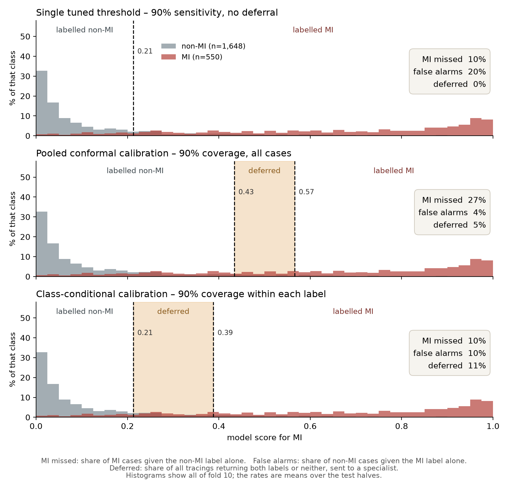
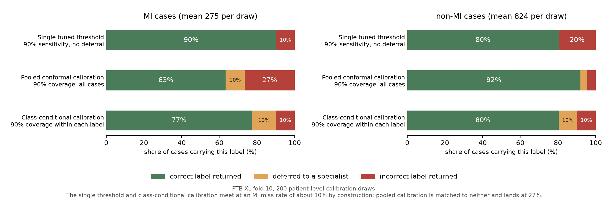
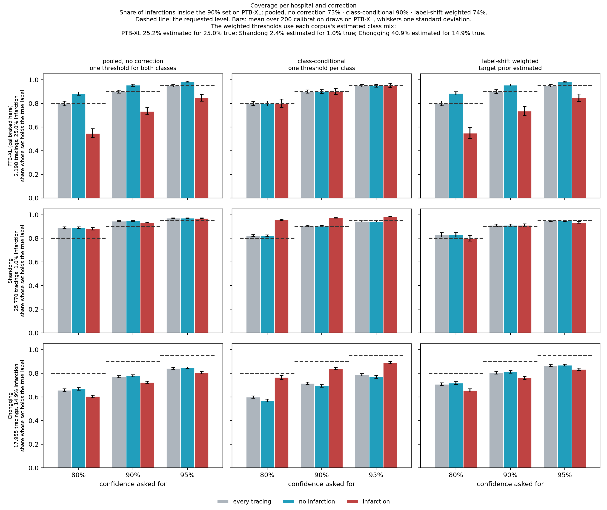
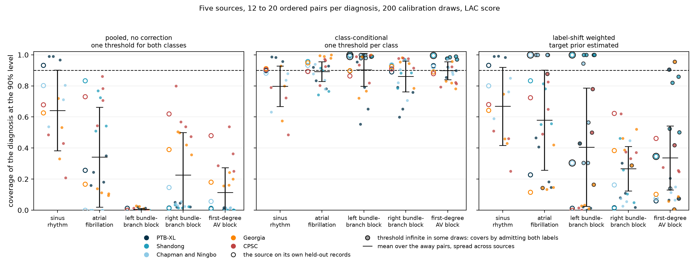
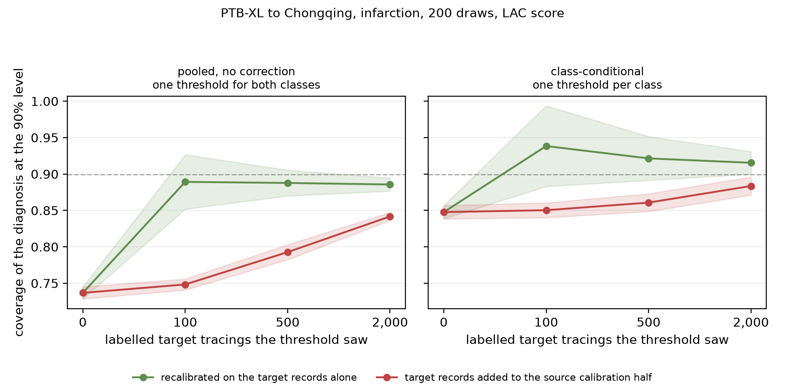
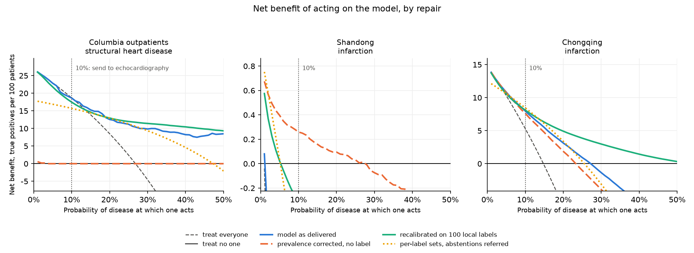

# Supplement to "Predicting an ECG model's positive predictive value from a clinic's prevalence"

Part 1 gives the EchoNext study in statistical terms, with every table the article summarises. Part 2 gives the infarction study and the five-corpus rotation in full. Part 3 gives the measurement of the PPV across transfers and the three updating methods, whose numbers are read from `results/` by `tests/paper_values.py` as well. Sections S1.14 to S1.19, S2.15 and S3.5 to S3.7 give in full the passages the article summarises, and a bracketed number there is a reference of the article. In Part 1, the numbers of sections S1.1 to S1.6, S1.8, S1.9 and S1.13 to S1.19 are read from `results/` by `tests/paper_values.py`, apart from the figures of cited studies, and `tests/test_paper_numbers.py` refuses any other number there; the severity tables of S1.7 are typed and held to `results/echonext_severity.json` by `tests/test_echonext_severity_results.py`; the timings and counts of S1.10 to S1.12 were measured once and are typed. The numbers in Part 2 are held to their files by `tests/test_rotation_report.py`, `tests/test_outcomes.py` and `tests/test_published_numbers.py`.

## Part 1. Structural heart disease, from inpatients to outpatients

### S1.1 The thresholds in statistical terms

Each model gives a probability p of moderate or worse structural heart disease. Split conformal prediction scores a calibration ECG by one minus the probability the model gives its true label, the least-ambiguous-set score, and admits a label for a new ECG when that label's score falls at or below the ⌈(n+1)(1−α)⌉-th smallest of the n calibration scores, here with α = 0.10 [REPORT ref. 23]. Fitted within each true class separately (class-conditional, or Mondrian, calibration [REPORT ref. 24]), it gives one cut-off from the calibration cases and one from the calibration non-cases. A patient's prediction set contains "SHD" when p is at or above the first cut-off and "no SHD" when p is at or below the second. On these models the first cut-off sits below the second in every arm, so no set is empty: a set contains one label, or both, and a set containing both is a deferral to a reader.

The cut-off for cases is the 90%-sensitivity threshold of the calibration inpatients, with the (n+1) correction. The two coincide by construction: both are the ⌈(n+1)(1−α)⌉-th order statistic of the calibration cases' scores, and `tests/test_paper_numbers.py` guards the code against their drifting apart, on `results/echonext_coverage.csv`. On the 1,013 cases among the calibration inpatients the (n+1) correction has little effect: at the uncorrected 90th percentile the trained network had an outpatient sensitivity of 71.2% against 71.6% (field `threshold_spread`). The class-conditional guarantee, 90% coverage within each class whatever the prevalence, holds while the calibration and test patients of a class are exchangeable. Inpatients and outpatients were not exchangeable in these data, which is the principal finding of Part 1.

A third construction, one threshold pair fitted over all calibration patients together (pooled), achieves 90% coverage over all patients and under-covers the rarer label. On EchoNext's composite it covered 74.5% of the outpatients with SHD for the trained network; the main text does not use it. For the trained network the probability cut-offs were 0.27 for cases and 0.79 for non-cases.

Table S0a. The trained network's two thresholds, per 100 patients with SHD and per 100 without: 1,156 with and 1,047 without SHD among the other inpatients, 271 with and 788 without SHD among outpatients, from `results/echonext_clinical.json`. The rows divide the true positives and false positives of the article's Table 2, rounded so that they sum to them.

| | Other inpatients | Outpatients |
|---|---|---|
| With SHD, flagged with no reader | 54 | 36 |
| With SHD, referred to a reader | 36 | 36 |
| Without SHD, referred to a reader | 49 | 27 |
| Without SHD, flagged with no reader | 9 | 2 |

In total, 29.4% of outpatients were referred to a reader, against 42.3% of inpatients; no prevalence with the inpatients' rates could take the outpatients' share below 36.6%.

### S1.2 Cohorts

EchoNext v1.1.1 holds 100,000 ECGs from Columbia, each paired with a transthoracic echocardiogram, with eleven binary findings and their composite. Its source states the labelling rule: an ECG is positive when it was "performed within 1 year prior to an echocardiogram with SHD", and for a patient whose most recent echocardiogram shows none, "all ECGs prior to the most recent echo were labeled as negative" (PhysioNet, EchoNext 1.1.1, read on 5 October 2026). The finer measurements (grades, ejection fraction, wall thickness, pressures) are recorded only for an ECG within the year, so a negative ECG with every measurement missing was recorded earlier; Table S1b counts them. The thresholds are fitted on the 1,903 inpatient ECGs of the validation split and applied unchanged to the test split: 1,059 outpatient ECGs, and the 1,971 emergency and 2,203 inpatient ECGs beside them. No patient appears in two of the roles (training, calibration, each test setting), and no patient contributes two ECGs to one cohort; `transfer_cohorts` raises if either happens. The models were fitted on the 72,475 ECGs of the training split.

Table S0. Every ECG of EchoNext by split and care setting, and its use here, from `results/echonext_clinical.json`, field `flow`.

| Split | ECGs | Patients | Inpatient | Emergency | Outpatient | Procedural | Use |
|---|---|---|---|---|---|---|---|
| train | 72,475 | 26,218 | 34,906 | 22,811 | 12,423 | 2,335 | every setting, to train the network and fit the probes |
| val | 4,626 | 4,626 | 1,903 | 1,688 | 858 | 177 | inpatients set the thresholds; every setting and the outpatients set the variants of calibration_variants and ladder_validation |
| test | 5,442 | 5,442 | 2,203 | 1,971 | 1,059 | 209 | inpatient, emergency and outpatient cohorts; procedural not read |
| no split | 17,457 | 4,618 | 9,150 | 4,983 | 2,854 | 470 | not used |

The remaining reporting items of the STARD checklist for diagnostic accuracy studies are as follows. The ECGs were recorded between 2008 and 2022 at the two sites, by EchoNext's authors' selection; this study takes the published splits whole, with no exclusion beyond the procedural setting. Every patient was 18 or older. Validation and test hold each patient's latest ECG. No ECG of the validation or test split lacks a score, an age, a sex or the composite label, so there are no indeterminate or missing results. No sample size was computed in advance: the cohorts are EchoNext's. The study was not registered, and no protocol was published before the analysis.

The outpatients' ECGs are older than the inpatients': median year 2015 against 2017. Table S1c reads the inpatient threshold's sensitivity within three bands of years.

Table S1c. Sensitivity of the inpatient threshold within bands of recording years (2008 to 2015, 2016 to 2018, 2019 to 2022), from `results/echonext_clinical.json`, field `eras`.

| Model | Setting | 2008 to 2015 | 2016 to 2018 | 2019 to 2022 |
|---|---|---|---|---|
| Network trained here | Inpatients | 402 of 449, 89.5% | 243 of 269, 90.3% | 400 of 438, 91.3% |
| Network trained here | Outpatients | 95 of 135, 70.4% | 51 of 74, 68.9% | 48 of 62, 77.4% |
| EchoNext mini-model | Inpatients | 399 of 449, 88.9% | 246 of 269, 91.4% | 404 of 438, 92.2% |
| EchoNext mini-model | Outpatients | 93 of 135, 68.9% | 55 of 74, 74.3% | 49 of 62, 79.0% |
| ECGFounder | Inpatients | 402 of 449, 89.5% | 242 of 269, 90.0% | 391 of 438, 89.3% |
| ECGFounder | Outpatients | 94 of 135, 69.6% | 49 of 74, 66.2% | 51 of 62, 82.3% |

### S1.3 Every arm in every setting

Table S1. The composite under the inpatient threshold, from `results/echonext_transfer.json` and `results/echonext_coverage.csv`. AUROC with a 95% interval from 500 bootstrap draws; sensitivity and specificity with 95% Wilson intervals, which resample the patients read for the threshold as set; the proportion referred to a reader under the class-conditional pair. Resampling the calibration inpatients too (1,000 draws, field `threshold_spread`), the outpatient sensitivity's interval widens to 65.2% to 78.0%, 66.6% to 78.8% and 65.6% to 77.6% for the three models.

| Model | Setting | AUROC | Sensitivity | Specificity | Referred to a reader |
|---|---|---|---|---|---|
| Network trained here | Inpatients | 0.815 (0.796 to 0.832) | 90.4% (88.6% to 92.0%) | 42.2% (39.3% to 45.2%) | 42.3% |
| Network trained here | Emergency | 0.837 (0.820 to 0.854) | 86.2% (83.6% to 88.4%) | 61.0% (58.2% to 63.8%) | 35.7% |
| Network trained here | Outpatients | 0.805 (0.774 to 0.837) | 71.6% (65.9% to 76.6%) | 71.1% (67.8% to 74.1%) | 29.4% |
| EchoNext mini-model | Inpatients | 0.797 (0.778 to 0.815) | 90.7% (88.9% to 92.3%) | 38.8% (35.9% to 41.8%) | 47.9% |
| EchoNext mini-model | Emergency | 0.822 (0.803 to 0.841) | 85.5% (82.9% to 87.8%) | 57.7% (54.8% to 60.4%) | 40.0% |
| EchoNext mini-model | Outpatients | 0.795 (0.762 to 0.827) | 72.7% (67.1% to 77.7%) | 71.1% (67.8% to 74.1%) | 32.3% |
| ECGFounder | Inpatients | 0.804 (0.785 to 0.820) | 89.5% (87.6% to 91.2%) | 42.8% (39.8% to 45.8%) | 45.8% |
| ECGFounder | Emergency | 0.827 (0.810 to 0.845) | 82.9% (80.1% to 85.3%) | 60.0% (57.2% to 62.8%) | 38.7% |
| ECGFounder | Outpatients | 0.791 (0.760 to 0.822) | 71.6% (65.9% to 76.6%) | 71.3% (68.1% to 74.4%) | 32.2% |
| Untrained floor | Inpatients | 0.779 (0.758 to 0.798) | 90.9% (89.1% to 92.4%) | 36.6% (33.7% to 39.5%) | 52.7% |
| Untrained floor | Emergency | 0.790 (0.771 to 0.810) | 84.4% (81.7% to 86.8%) | 54.5% (51.7% to 57.3%) | 43.0% |
| Untrained floor | Outpatients | 0.758 (0.721 to 0.790) | 78.6% (73.3% to 83.1%) | 57.4% (53.9% to 60.8%) | 44.2% |

Table S1b. Negative ECGs with no echocardiographic measurement, with the calibration-inpatient threshold, from `results/echonext_clinical.json`, field `unmeasured`. The last three columns give each figure on every ECG of the setting, then on the ECGs that carry a measurement. Every positive ECG carries one.

| Model | Setting | Negatives with no measurement | Prevalence | Specificity | AUROC |
|---|---|---|---|---|---|
| Network trained here | Inpatients | 114 of 1,047 | 52.5% to 55.3% | 42.2% to 41.1% | 0.815 to 0.810 |
| EchoNext mini-model | Inpatients | 114 of 1,047 | 52.5% to 55.3% | 38.8% to 37.5% | 0.797 to 0.792 |
| ECGFounder | Inpatients | 114 of 1,047 | 52.5% to 55.3% | 42.8% to 42.3% | 0.804 to 0.800 |
| Network trained here | Emergency | 254 of 1,183 | 40.0% to 45.9% | 61.0% to 57.9% | 0.837 to 0.822 |
| EchoNext mini-model | Emergency | 254 of 1,183 | 40.0% to 45.9% | 57.7% to 54.1% | 0.822 to 0.806 |
| ECGFounder | Emergency | 254 of 1,183 | 40.0% to 45.9% | 60.0% to 56.9% | 0.827 to 0.810 |
| Network trained here | Outpatients | 220 of 788 | 25.6% to 32.3% | 71.1% to 68.3% | 0.805 to 0.792 |
| EchoNext mini-model | Outpatients | 220 of 788 | 25.6% to 32.3% | 71.1% to 68.1% | 0.795 to 0.781 |
| ECGFounder | Outpatients | 220 of 788 | 25.6% to 32.3% | 71.3% to 69.0% | 0.791 to 0.776 |

Table S2. Paired differences in outpatient sensitivity between the three models, in percentage points, with a 95% percentile interval from 2,000 bootstrap draws of the outpatients with SHD, from `results/echonext_clinical.json`.

| Comparison | Difference | 95% interval |
|---|---|---|
| Network trained here minus EchoNext mini-model | -1.1 | -5.2 to +3.0 |
| Network trained here minus ECGFounder | +0.0 | -4.8 to +4.4 |
| EchoNext mini-model minus ECGFounder | +1.1 | -3.3 to +5.5 |

### S1.4 The eleven findings

Table S3. A threshold set separately for each finding, on the calibration inpatients with that finding, for the trained network, from `results/echonext_coverage.csv`. This is not the composite threshold the article follows; section S1.17 reads the composite threshold finding by finding (`results/echonext_clinical.json`, field `by_finding`). No outpatient in the test split has pulmonary regurgitation.

| Finding, moderate or worse | Inpatients with the finding, test split | Sensitivity, inpatients | Outpatients with the finding | Sensitivity, outpatients |
|---|---|---|---|---|
| Ejection fraction 45% or less | 537 | 87.7% | 70 | 87.1% (77.3% to 93.1%) |
| Wall thickness 1.3 cm or more | 483 | 89.4% | 146 | 74.7% (67.0% to 81.0%) |
| Aortic stenosis | 141 | 94.3% | 51 | 96.1% (86.8% to 98.9%) |
| Aortic regurgitation | 33 | 72.7% | 4 | 100.0% (51.0% to 100.0%) |
| Mitral regurgitation | 173 | 90.2% | 30 | 70.0% (52.1% to 83.3%) |
| Tricuspid regurgitation | 183 | 88.5% | 26 | 69.2% (50.0% to 83.5%) |
| Pulmonary regurgitation | 14 | 100.0% | 0 | no cases |
| Right ventricular dysfunction | 246 | 87.4% | 20 | 75.0% (53.1% to 88.8%) |
| Pericardial effusion | 45 | 100.0% | 2 | 100.0% (34.2% to 100.0%) |
| Pulmonary artery pressure 45 mmHg or more | 346 | 92.5% | 63 | 73.0% (61.0% to 82.4%) |
| Tricuspid peak velocity 3.2 m/s or more | 181 | 84.5% | 35 | 74.3% (57.9% to 85.8%) |
| Any of the eleven | 1,156 | 90.4% | 271 | 71.6% (65.9% to 76.6%) |

### S1.5 Predictive values and counts per 1,000

Table S4. At the outpatients' prevalence and at 10% and 5%, from `results/echonext_clinical.json`. The figures at 10% and 5% apply the outpatients' sensitivity and specificity by Bayes' theorem and are valid only if those are transportable to the other prevalence; the article's section 3.1 measures the error of such a recomputation.

| Model | Prevalence | PPV | NPV | Flagged per 1,000 | True positives per 1,000 | False negatives per 1,000 |
|---|---|---|---|---|---|---|
| Network trained here | 25.6% | 46.0% | 87.9% | 398 | 183 | 73 |
| Network trained here | 10.0% | 21.6% | 95.7% | 332 | 72 | 28 |
| Network trained here | 5.0% | 11.5% | 97.9% | 311 | 36 | 14 |
| EchoNext mini-model | 25.6% | 46.4% | 88.3% | 401 | 186 | 70 |
| EchoNext mini-model | 10.0% | 21.8% | 95.9% | 333 | 73 | 27 |
| EchoNext mini-model | 5.0% | 11.7% | 98.0% | 311 | 36 | 14 |
| ECGFounder | 25.6% | 46.2% | 87.9% | 397 | 183 | 73 |
| ECGFounder | 10.0% | 21.7% | 95.8% | 330 | 72 | 28 |
| ECGFounder | 5.0% | 11.6% | 97.9% | 308 | 36 | 14 |

### S1.6 The case-mix model

Among the cases of the inpatient and outpatient test cohorts (1,156 and 271 patients), a logistic regression with an L2 penalty of 1 predicts whether the inpatient threshold detected each patient from the eleven findings, the ejection fraction band (35% or less, 36 to 45%, above 45%, unmeasured), the age band (18 to 49, 50 to 64, 65 to 79, 80 and over), sex and the care setting. The outpatients' sensitivity at the inpatients' case mix is the model's mean prediction over the inpatients with SHD, each assigned the outpatient setting. The share of the gap explained is that prediction minus the observed outpatient sensitivity, over the inpatient sensitivity minus the outpatient one. With an L2 penalty the model's mean prediction among the outpatients is not exactly their observed sensitivity, so the last column takes that prediction instead, both terms then coming from the model (g-computation). Intervals are 95% percentiles over 1,000 draws that resample the patients within each setting and refit the model.

Table S5. From `results/echonext_clinical.json`, field `case_mix`.

| Model | Sensitivity, inpatients | Sensitivity, outpatients | Outpatients at the inpatients' case mix | Share of the gap explained | Share, both terms predicted |
|---|---|---|---|---|---|
| Network trained here | 90.4% (88.7% to 92.0%) | 71.6% (66.1% to 77.1%) | 76.8% (72.0% to 81.3%) | 27.5% (15.7% to 38.2%) | 25.2% (13.2% to 36.4%) |
| EchoNext mini-model | 90.7% (89.1% to 92.5%) | 72.7% (67.5% to 78.2%) | 77.7% (73.4% to 81.9%) | 27.5% (15.7% to 39.5%) | 25.2% (13.1% to 37.4%) |
| ECGFounder | 89.5% (87.8% to 91.3%) | 71.6% (65.7% to 77.1%) | 76.1% (71.4% to 80.8%) | 25.3% (14.6% to 37.0%) | 23.2% (12.0% to 35.0%) |

The analysis below reweights the outpatients to the severity of the calibration inpatients, whose own coverage was read on the ECGs that set the threshold. The case-mix model replaces it in the main text: it compares with inpatients the threshold never saw, and adjusts for findings, age and sex as well.

### S1.7 Disease severity among cases by care setting

The spectrum of SHD among outpatients differs from that among the calibration inpatients. Outpatients with SHD carry fewer of the eleven findings, have a higher ejection fraction, and have less right ventricular dysfunction, tricuspid regurgitation and pericardial effusion; they have a thicker septum and more aortic stenosis, and the wall-thickness finding is more frequent among them (Table S3). The two-sided test is Mann-Whitney's, on ranks; grades read none, mild, moderate, severe (the right ventricle normal to severely reduced, the effusion none, trace, small, moderate, large).

| Among cases, median (quartiles) | Inpatients, 1,013 | Outpatients, 271 | p |
|---|---|---|---|
| Findings present | 2 (1 to 3) | 1 (1 to 2) | < 0.001 |
| Ejection fraction, % | 50.0 (32.5 to 57.5) | 57.5 (45.0 to 62.5) | < 0.001 |
| Pulmonary artery systolic pressure, mmHg | 43.0 (33.0 to 53.0), 661 measured | 39.0 (31.0 to 49.2), 172 measured | 0.007 |
| Tricuspid regurgitation peak velocity, m/s | 2.8 (2.4 to 3.3), 483 measured | 2.7 (2.4 to 3.2), 125 measured | 0.109 |
| Septal thickness, cm | 1.2 (1.0 to 1.3) | 1.2 (1.0 to 1.3) | 0.011 |
| Posterior wall thickness, cm | 1.1 (0.9 to 1.3) | 1.1 (0.9 to 1.3) | 0.387 |
| Aortic stenosis, moderate or worse | none (none to none), 12.7% | none (none to none), 18.8% | 0.056 |
| Aortic regurgitation, moderate or worse | none (none to none), 3.2% | none (none to mild), 1.5% | 0.117 |
| Mitral regurgitation, moderate or worse | mild (none to mild), 14.4% | none (none to mild), 11.1% | 0.053 |
| Tricuspid regurgitation, moderate or worse | mild (none to mild), 17.2% | mild (none to mild), 9.6% | 0.002 |
| Pulmonary regurgitation, moderate or worse | none (none to none), 1.1% | none (none to none), 0.0% | 0.026 |
| Right ventricular dysfunction, moderate or worse | normal (normal to mildly reduced), 21.6% | normal (normal to normal), 7.4% | < 0.001 |
| Pericardial effusion, moderate or large | trace (none to trace), 3.4% | none (none to trace), 0.8% | < 0.001 |

Coverage varied with severity: with the inpatient thresholds, outpatients with
two findings or more are covered more often than those with one, and those
with an ejection fraction of 45% or less more often than those above it. The
test of this question was specified before any coverage by stratum was computed, and
`results/echonext_severity.json` states it: the outpatients' coverage is
reweighted to the distribution of inpatient cases over six cells (one finding or two and
more, by ejection fraction at 35 or less, 36 to 45, above 45), with intervals
from 2,000 bootstrap draws. Severity would explain all of the drop if the
reweighted coverage could reach 90%, and none of it if it could not differ from
the observed one.

| Arm | Outpatients with SHD covered | One finding, 165 | Two or more, 106 | Ejection fraction 35 or less, 37 | 36 to 45, 33 | Above 45, 201 | Reweighted to the inpatients' severity | Share of the drop, against the calibration inpatients |
|---|---|---|---|---|---|---|---|---|
| Network trained here | 71.6% | 64.2% (56.7% to 71.2%) | 83.0% (74.7% to 89.0%) | 86.5% (72.0% to 94.1%) | 97.0% (84.7% to 99.5%) | 64.7% (57.9% to 71.0%) | 77.3% (72.3% to 81.9%) | 31% (16% to 47%) |
| EchoNext mini-model | 72.7% | 65.5% (57.9% to 72.3%) | 84.0% (75.8% to 89.7%) | 94.6% (82.3% to 98.5%) | 84.8% (69.1% to 93.3%) | 66.7% (59.9% to 72.8%) | 78.7% (74.0% to 83.1%) | 35% (21% to 51%) |
| ECGFounder | 71.6% | 66.7% (59.2% to 73.4%) | 79.2% (70.6% to 85.9%) | 89.2% (75.3% to 95.7%) | 90.9% (76.4% to 96.9%) | 65.2% (58.4% to 71.4%) | 76.9% (71.7% to 81.7%) | 29% (15% to 45%) |

Severity explains part of the drop for each of the three arms, between 29% and
35% of it, when the drop is read against the calibration inpatients, whose own
sensitivity was read on the ECGs that set the threshold. The case-mix model of
the section before, read against the test inpatients, replaces this share in
the main text, and the two are not the same quantity. At the inpatients' severity, outpatients with SHD would be covered at
76.9% to 78.7%, still short of 90%. The remainder occurs within strata. Of the 201
outpatients with SHD whose ejection fraction is above 45%, 64.7% to 66.7% are
covered; the calibration inpatients in the same band are covered at 83.5% to
84.6%, a figure read on the ECGs that set the threshold and therefore optimistic. Four
of the six reweighting cells hold fewer than 30 outpatients with SHD and are not
judged one by one; their counts are in the results file. Intervals are 95%:
Wilson for a stratum, bootstrap percentiles for the reweighted figures.

### S1.8 Subgroups

Table S6. Sensitivity of the inpatient threshold among outpatients with SHD by sex and age band, from `results/echonext_clinical.json`. Two groups are compared by Fisher's exact test and four by a chi-square test of independence; the six p-values are adjusted together by Holm's method. Exploratory.

| Model | Subgroup | Detected | Test | p | p, Holm |
|---|---|---|---|---|---|
| Network trained here | sex | female 77 of 126 (61.1%); male 117 of 145 (80.7%) | Fisher's exact | < 0.001 | 0.002 |
| Network trained here | age | 18-49 16 of 30 (53.3%); 50-64 41 of 69 (59.4%); 65-79 89 of 117 (76.1%); 80+ 48 of 55 (87.3%) | chi-square | < 0.001 | 0.002 |
| EchoNext mini-model | sex | female 84 of 126 (66.7%); male 113 of 145 (77.9%) | Fisher's exact | 0.041 | 0.041 |
| EchoNext mini-model | age | 18-49 16 of 30 (53.3%); 50-64 39 of 69 (56.5%); 65-79 89 of 117 (76.1%); 80+ 53 of 55 (96.4%) | chi-square | < 0.001 | < 0.001 |
| ECGFounder | sex | female 79 of 126 (62.7%); male 115 of 145 (79.3%) | Fisher's exact | 0.003 | 0.006 |
| ECGFounder | age | 18-49 16 of 30 (53.3%); 50-64 41 of 69 (59.4%); 65-79 94 of 117 (80.3%); 80+ 43 of 55 (78.2%) | chi-square | 0.001 | 0.004 |

Table S6b. Among outpatients, by sex and age band: the number without SHD, the specificity of the inpatient threshold with a 95% Wilson interval, and the AUROC with a 95% bootstrap interval, from `results/echonext_clinical.json`, field `subgroups.healthy_and_auroc`.

| Model | Group | Outpatients without SHD | Specificity | AUROC |
|---|---|---|---|---|
| Network trained here | sex female | 473 | 78.9% (75.0% to 82.3%) | 0.773 (0.719 to 0.826) |
| Network trained here | sex male | 315 | 59.4% (53.9% to 64.6%) | 0.827 (0.784 to 0.871) |
| Network trained here | age 18-49 | 203 | 80.3% (74.3% to 85.2%) | 0.795 (0.710 to 0.878) |
| Network trained here | age 50-64 | 266 | 75.2% (69.7% to 80.0%) | 0.744 (0.669 to 0.809) |
| Network trained here | age 65-79 | 272 | 64.3% (58.5% to 69.8%) | 0.803 (0.751 to 0.854) |
| Network trained here | age 80+ | 47 | 46.8% (33.3% to 60.8%) | 0.797 (0.704 to 0.881) |
| EchoNext mini-model | sex female | 473 | 74.8% (70.7% to 78.5%) | 0.765 (0.713 to 0.817) |
| EchoNext mini-model | sex male | 315 | 65.4% (60.0% to 70.4%) | 0.813 (0.767 to 0.860) |
| EchoNext mini-model | age 18-49 | 203 | 82.3% (76.4% to 86.9%) | 0.751 (0.645 to 0.848) |
| EchoNext mini-model | age 50-64 | 266 | 77.4% (72.1% to 82.1%) | 0.743 (0.667 to 0.809) |
| EchoNext mini-model | age 65-79 | 272 | 62.5% (56.6% to 68.0%) | 0.779 (0.724 to 0.829) |
| EchoNext mini-model | age 80+ | 47 | 36.2% (24.0% to 50.5%) | 0.767 (0.681 to 0.861) |
| ECGFounder | sex female | 473 | 75.5% (71.4% to 79.1%) | 0.757 (0.709 to 0.811) |
| ECGFounder | sex male | 315 | 65.1% (59.7% to 70.1%) | 0.813 (0.762 to 0.855) |
| ECGFounder | age 18-49 | 203 | 80.8% (74.8% to 85.6%) | 0.775 (0.678 to 0.868) |
| ECGFounder | age 50-64 | 266 | 76.3% (70.9% to 81.0%) | 0.726 (0.645 to 0.799) |
| ECGFounder | age 65-79 | 272 | 62.9% (57.0% to 68.4%) | 0.800 (0.753 to 0.845) |
| ECGFounder | age 80+ | 47 | 51.1% (37.2% to 64.7%) | 0.715 (0.621 to 0.818) |

Table S6c. Sensitivity of the inpatient threshold in each race and ethnicity group EchoNext records, among test inpatients and outpatients, from field `subgroups.race_ethnicity`. Descriptive; no test was run.

| Model | Group | Inpatients | Outpatients |
|---|---|---|---|
| Network trained here | asian | 27 of 31, 87.1% | 9 of 11, 81.8% |
| Network trained here | black | 166 of 181, 91.7% | 28 of 39, 71.8% |
| Network trained here | hispanic | 232 of 257, 90.3% | 41 of 58, 70.7% |
| Network trained here | other | 106 of 119, 89.1% | 16 of 22, 72.7% |
| Network trained here | unknown | 180 of 200, 90.0% | 23 of 32, 71.9% |
| Network trained here | white | 334 of 368, 90.8% | 77 of 109, 70.6% |
| EchoNext mini-model | asian | 25 of 31, 80.6% | 8 of 11, 72.7% |
| EchoNext mini-model | black | 164 of 181, 90.6% | 29 of 39, 74.4% |
| EchoNext mini-model | hispanic | 233 of 257, 90.7% | 39 of 58, 67.2% |
| EchoNext mini-model | other | 110 of 119, 92.4% | 16 of 22, 72.7% |
| EchoNext mini-model | unknown | 187 of 200, 93.5% | 25 of 32, 78.1% |
| EchoNext mini-model | white | 330 of 368, 89.7% | 80 of 109, 73.4% |
| ECGFounder | asian | 27 of 31, 87.1% | 9 of 11, 81.8% |
| ECGFounder | black | 163 of 181, 90.1% | 29 of 39, 74.4% |
| ECGFounder | hispanic | 234 of 257, 91.1% | 42 of 58, 72.4% |
| ECGFounder | other | 105 of 119, 88.2% | 15 of 22, 68.2% |
| ECGFounder | unknown | 181 of 200, 90.5% | 24 of 32, 75.0% |
| ECGFounder | white | 325 of 368, 88.3% | 75 of 109, 68.8% |

### S1.9 Threshold recalibration on labelled outpatients

In each of 2,000 draws the 1,059 outpatients were shuffled and cut into two halves; the labelled sample was drawn from the first half, both thresholds were refitted on it, and every figure was read on the second. Rung zero applies the inpatient thresholds to the same halves.

Table S7. From `results/echonext_clinical.json`, field `ladder`. Means over 2,000 draws, with the 10th to 90th percentile of the draws in brackets.

| Model | Labelled outpatients | Cases among them | Sensitivity | Draws below 90% | Specificity | Referred to a reader |
|---|---|---|---|---|---|---|
| Network trained here | 0 | none | 71.5% (68.0% to 75.0%) | 100.0% | 71.1% (69.2% to 73.2%) | 29.3% |
| Network trained here | 25 | 6.5 (4 to 9) | 98.3% (94.3% to 100.0%) | 6.5% | 5.5% (0.0% to 19.2%) | 77.6% |
| Network trained here | 50 | 12.8 (9 to 17) | 93.1% (82.7% to 100.0%) | 25.6% | 24.4% (3.7% to 55.1%) | 59.8% |
| Network trained here | 100 | 25.6 (20 to 31) | 91.6% (83.8% to 98.0%) | 33.1% | 30.4% (12.9% to 51.2%) | 53.7% |
| Network trained here | 200 | 51.1 (44 to 58) | 90.9% (84.5% to 96.4%) | 37.0% | 33.7% (17.0% to 49.1%) | 50.7% |
| EchoNext mini-model | 0 | none | 72.7% (69.2% to 76.3%) | 100.0% | 71.1% (68.9% to 73.3%) | 32.3% |
| EchoNext mini-model | 25 | 6.5 (4 to 9) | 98.3% (93.6% to 100.0%) | 7.1% | 5.6% (0.0% to 24.7%) | 78.7% |
| EchoNext mini-model | 50 | 12.8 (9 to 17) | 93.1% (83.3% to 100.0%) | 25.4% | 23.4% (0.8% to 52.8%) | 62.0% |
| EchoNext mini-model | 100 | 25.6 (20 to 31) | 91.9% (84.2% to 98.4%) | 31.1% | 28.4% (11.6% to 50.4%) | 56.7% |
| EchoNext mini-model | 200 | 51.1 (44 to 58) | 91.0% (84.7% to 96.3%) | 36.4% | 31.6% (18.3% to 47.2%) | 53.4% |
| ECGFounder | 0 | none | 71.6% (68.1% to 75.2%) | 100.0% | 71.4% (69.4% to 73.5%) | 32.1% |
| ECGFounder | 25 | 6.5 (4 to 9) | 98.3% (93.6% to 100.0%) | 6.9% | 5.8% (0.0% to 23.3%) | 79.3% |
| ECGFounder | 50 | 12.8 (9 to 17) | 92.9% (82.5% to 100.0%) | 26.2% | 25.0% (0.5% to 54.2%) | 61.2% |
| ECGFounder | 100 | 25.6 (20 to 31) | 91.8% (83.9% to 98.4%) | 29.9% | 29.9% (12.5% to 48.8%) | 56.2% |
| ECGFounder | 200 | 51.1 (44 to 58) | 91.0% (84.8% to 96.4%) | 36.4% | 33.7% (19.4% to 46.6%) | 52.6% |

`results/echonext_transfer.json`, field `ladder`, holds the same refit with the outpatients cut once, by a fixed seed, and the labelled samples drawn from the same pool every time. On that one evaluation half, recalibration on 100 outpatients gave sensitivities of 93.4%, 97.6% and 95.3% for the three models. Redrawing the halves in every draw gives 91.6%, 91.9% and 91.8%. The fixed figure is a mean over labelled samples on one half, so it belongs among the same means taken on other halves, not among single draws. Over 400 random halves (field `half_means`), that mean ran from 85.6% to 96.1% for the trained network (2.5th to 97.5th percentile; 86.0% to 96.4% and 86.2% to 96.4% for the other two). The fixed half sat above 70.5%, 99.8% and 91.5% of them: an unusually favourable half, and for the mini-model more favourable than almost every other. The re-drawn figures average over halves and are the ones reported; the one-page reports in `reports/transfer/` keep the fixed half and state it.

In the redrawn series, the labelled outpatients are drawn from the patients on whom the threshold is evaluated. Table S7b sets the same rule on other validation patients and reads it on every test outpatient; Table S7c draws the labelled outpatients from the 858 validation outpatients and reads each refit on all 1,059 test outpatients. Validation and test hold different patients, which `calibration_variants` checks before it runs.

Table S7b. The 90% rule set on three groups of validation patients, read on the test split, from `results/echonext_clinical.json`, field `calibration_variants`. Sensitivity and specificity among the test outpatients with 95% Wilson intervals, and the sensitivity among the test inpatients.

| Threshold set on | Model | Sensitivity, outpatients | Specificity, outpatients | Sensitivity, inpatients |
|---|---|---|---|---|
| Validation inpatients (the report's threshold), 1,903 (1,013 with SHD) | Network trained here | 71.6% (65.9% to 76.6%) | 71.1% (67.8% to 74.1%) | 90.4% |
| Validation inpatients (the report's threshold), 1,903 (1,013 with SHD) | EchoNext mini-model | 72.7% (67.1% to 77.7%) | 71.1% (67.8% to 74.1%) | 90.7% |
| Validation inpatients (the report's threshold), 1,903 (1,013 with SHD) | ECGFounder | 71.6% (65.9% to 76.6%) | 71.3% (68.1% to 74.4%) | 89.5% |
| Validation inpatients (the report's threshold), 1,903 (1,013 with SHD) | Untrained floor | 78.6% (73.3% to 83.1%) | 57.4% (53.9% to 60.8%) | 90.9% |
| Every validation patient, 4,626 (1,990 with SHD) | Network trained here | 77.1% (71.8% to 81.7%) | 63.5% (60.0% to 66.7%) | 94.0% |
| Every validation patient, 4,626 (1,990 with SHD) | EchoNext mini-model | 76.4% (71.0% to 81.0%) | 66.1% (62.7% to 69.3%) | 92.6% |
| Every validation patient, 4,626 (1,990 with SHD) | ECGFounder | 77.9% (72.5% to 82.4%) | 62.8% (59.4% to 66.1%) | 92.8% |
| Every validation patient, 4,626 (1,990 with SHD) | Untrained floor | 83.0% (78.1% to 87.0%) | 45.4% (42.0% to 48.9%) | 93.8% |
| Validation outpatients, 858 (240 with SHD) | Network trained here | 86.3% (81.7% to 89.9%) | 48.5% (45.0% to 52.0%) | 97.1% |
| Validation outpatients, 858 (240 with SHD) | EchoNext mini-model | 87.8% (83.4% to 91.2%) | 40.0% (36.6% to 43.4%) | 97.8% |
| Validation outpatients, 858 (240 with SHD) | ECGFounder | 89.7% (85.5% to 92.8%) | 42.9% (39.5% to 46.4%) | 98.2% |
| Validation outpatients, 858 (240 with SHD) | Untrained floor | 91.9% (88.0% to 94.6%) | 24.7% (21.9% to 27.9%) | 97.5% |

Table S7c. Thresholds refitted on outpatients drawn from the validation split's 858 outpatients and read on every test outpatient, from `results/echonext_clinical.json`, field `ladder_validation`. Means over 2,000 draws, with the 10th to 90th percentile of the draws in brackets.

| Model | Labelled outpatients | Cases among them | Sensitivity | Draws below 90% | Specificity |
|---|---|---|---|---|---|
| Network trained here | 25 | 7.1 (4 to 10) | 97.3% (88.6% to 100.0%) | 10.9% | 9.3% (0.0% to 44.5%) |
| Network trained here | 50 | 14.0 (10 to 18) | 91.0% (82.3% to 98.5%) | 33.4% | 31.9% (8.5% to 58.0%) |
| Network trained here | 100 | 28.1 (23 to 34) | 89.0% (83.0% to 95.2%) | 48.5% | 39.4% (16.9% to 57.1%) |
| Network trained here | 200 | 56.0 (49 to 63) | 87.8% (83.4% to 92.3%) | 64.3% | 44.4% (31.5% to 54.7%) |
| EchoNext mini-model | 25 | 7.1 (4 to 10) | 97.7% (89.3% to 100.0%) | 10.8% | 7.9% (0.0% to 38.6%) |
| EchoNext mini-model | 50 | 14.0 (10 to 18) | 92.7% (83.8% to 99.3%) | 30.2% | 25.7% (4.8% to 54.1%) |
| EchoNext mini-model | 100 | 28.1 (23 to 34) | 90.9% (84.5% to 97.4%) | 43.7% | 32.4% (12.1% to 52.9%) |
| EchoNext mini-model | 200 | 56.0 (49 to 63) | 89.4% (85.6% to 94.1%) | 59.9% | 37.5% (25.0% to 49.5%) |
| ECGFounder | 25 | 7.1 (4 to 10) | 97.4% (90.0% to 100.0%) | 9.2% | 9.3% (0.0% to 41.0%) |
| ECGFounder | 50 | 14.0 (10 to 18) | 91.2% (84.1% to 98.5%) | 26.5% | 32.9% (10.7% to 52.8%) |
| ECGFounder | 100 | 28.1 (23 to 34) | 89.5% (84.1% to 92.3%) | 38.4% | 39.5% (30.3% to 52.7%) |
| ECGFounder | 200 | 56.0 (49 to 63) | 88.8% (84.1% to 91.1%) | 48.0% | 42.1% (37.1% to 50.8%) |

Table S7d. Net benefit among the test outpatients, per 1,000, from `results/echonext_clinical.json`, field `decision`: true positives minus false positives weighted by t/(1-t) at a decision threshold t of 5%, 10% and 20% (Vickers and Elkin, Med Decis Making 2006;26:565-574). Sensitivities are those of Table S1, the means of Table S7 and Table S7b; the 90% point with every diagnosis known is read on the outpatients' own curve.

| Model | Threshold | Sensitivity | Flagged per 1,000 | Net benefit, 5% | 10% | 20% |
|---|---|---|---|---|---|---|
| Network trained here | Inpatient threshold | 71.6% | 398 | 172 | 159 | 129 |
| Network trained here | Set again on 100 outpatients | 91.6% | 752 | 207 | 177 | 105 |
| Network trained here | Set again on 200 outpatients | 90.9% | 726 | 207 | 178 | 109 |
| Network trained here | Set on the validation outpatients | 86.3% | 604 | 201 | 178 | 125 |
| Network trained here | 90% with every diagnosis known | 90.0% | 668 | 207 | 182 | 121 |
| Network trained here | Echocardiogram for every outpatient | 100.0% | 1,000 | 217 | 173 | 70 |
| Network trained here | Echocardiogram for none | 0.0% | 0 | 0 | 0 | 0 |
| EchoNext mini-model | Inpatient threshold | 72.7% | 401 | 175 | 162 | 132 |
| EchoNext mini-model | Set again on 100 outpatients | 91.9% | 768 | 207 | 176 | 102 |
| EchoNext mini-model | Set again on 200 outpatients | 91.0% | 742 | 206 | 176 | 106 |
| EchoNext mini-model | Set on the validation outpatients | 87.8% | 671 | 201 | 175 | 113 |
| EchoNext mini-model | 90% with every diagnosis known | 90.0% | 713 | 205 | 177 | 110 |
| EchoNext mini-model | Echocardiogram for every outpatient | 100.0% | 1,000 | 217 | 173 | 70 |
| EchoNext mini-model | Echocardiogram for none | 0.0% | 0 | 0 | 0 | 0 |
| ECGFounder | Inpatient threshold | 71.6% | 397 | 172 | 159 | 130 |
| ECGFounder | Set again on 100 outpatients | 91.8% | 756 | 208 | 177 | 105 |
| ECGFounder | Set again on 200 outpatients | 91.0% | 727 | 207 | 178 | 109 |
| ECGFounder | Set on the validation outpatients | 89.7% | 654 | 207 | 182 | 123 |
| ECGFounder | 90% with every diagnosis known | 90.0% | 664 | 207 | 182 | 122 |
| ECGFounder | Echocardiogram for every outpatient | 100.0% | 1,000 | 217 | 173 | 70 |
| ECGFounder | Echocardiogram for none | 0.0% | 0 | 0 | 0 | 0 |

### S1.13 The search for earlier work

PubMed (E-utilities) and Europe PMC were searched on 5 October 2026, with no start date:

1. (ECG) AND (AI OR deep learning OR neural network) AND outpatient* AND inpatient* AND (sensitivity OR threshold): one result, a cost-effectiveness study.
2. "spectrum effect" AND (ECG): two results, neither on a threshold carried between settings.
3. (ECG) AND (AI OR deep learning) AND (care setting* OR clinical setting* OR clinical context*) AND (SHD OR ejection fraction OR valvular): 19 results, among them [REPORT ref. 6] and [REPORT ref. 8], which report the AUROC by setting or population without a sensitivity at a fixed threshold by care setting.
4. (ECG) AND (AI OR deep learning) AND (threshold* OR cut-off*) AND (recalibrat* OR site-specific OR population-specific OR local) AND (SHD OR EF OR ventricular dysfunction): two results, [REPORT ref. 7] and [REPORT ref. 9].

Europe PMC also returned PRESENT-SHD [REPORT ref. 11], which transfers a fixed threshold between hospitals and to a population cohort but not between care settings. Google Scholar and OpenReview were not searched. The full text of PREVUE-VALVE [REPORT ref. 8] was not read, so whether it reports a sensitivity at the inpatient threshold by setting is not known.

### S1.10 How the published weights were run

The mini-model's weights come from the authors' IntroECG repository (commit
15233e93) and hold tensors only, so `torch.load` reads them with
`weights_only=True`. Its architecture is `EchoNextMini` in
`src/ecs/echonext_mini.py`, written from the shapes of the checkpoint rather
than copied, since the repository states no licence; every tensor of the
checkpoint loads into it, with none missing. It reads the tracing as
distributed and the seven tabular features the distribution ships already
standardised (sex, age, rates and intervals), which the other three arms do not
see. Scoring the validation and test splits took 2.9 seconds on the Apple GPU.

ECGFounder's checkpoint holds one numpy scalar beside its tensors, which
`weights_only=True` refuses on torch 2.2.2. It is read through an unpickler
that resolves five names (the tensor rebuild, an ordered dict, the numpy
scalar, its dtype and a byte codec) and refuses any other, so the file is never
unpickled in full. Its network is the authors' Net1D, vendored in
`third_party/ecgfounder`. The model card asks for 500 Hz, so each tracing is
resampled from 250 Hz by polyphase filtering; the amplitude stays in z-score,
since no millivolt scale exists to restore. The 1,024 features before the
dense head feed one logistic probe per label. Embedding the 82,543 training,
validation and test ECGs and fitting the probes took 332 seconds.

EchoNext is under PhysioNet's restricted licence. Its tracings, and the
per-record scores computed from them, stay outside this repository; the results
hold counts and aggregate figures only.

### S1.11 The unit of the tracings

EchoNext's tracings have no physical unit. Each lead was median-filtered,
clipped at its 0.1st and 99.9th percentiles and standardised with a mean and a
standard deviation computed over the training set, so every tracing here is in
z-score at 250 Hz, as `results/echonext_provenance.json` records for all
100,000 of them. The authors' code package publishes those per-lead means and
standard deviations, in the integer counts of the GE MUSE export; it does not
state how many microvolts a count is, so the millivolt scale cannot be
recovered from the files. Moving a model trained here to another hospital
means replaying the same preprocessing on that hospital's ECGs, with that
hospital's own standardisation, which absorbs part of any difference between
electrocardiographs.

### S1.12 Reproduce the EchoNext results

EchoNext's tracings stay outside the repository. Point `ECS_ECHONEXT_DIR` at
the distribution (default `~/data/echonext`); `ECS_ECHONEXT_DERIVED` (default
`~/data/echonext-derived`) and `ECS_EMBEDDING_STORE` (default
`~/data/ecg-embeddings`) receive what the scripts derive from it.

```bash
uv run python scripts/echonext_provenance.py   # results/echonext_provenance.json
export PYTORCH_ENABLE_MPS_FALLBACK=1
uv run python scripts/echonext_transfer.py     # the coverage table and the reports
uv run pytest -m data tests/test_echonext_data.py
uv run python scripts/echonext_clinical.py     # results/echonext_clinical.json, about 30 s
uv run python scripts/paper_figures.py          # the article's Figures 2, 3 and 4
```

`echonext_clinical.py` reads the stored scores and refits nothing; it refuses to run without them.

### S1.14 The introduction in full

A hospital evaluating an ECG model receives an AUROC, a sensitivity and a specificity measured in another institution's patients, at a threshold on the model's score. None of these gives the proportion of a clinic's alerts that are true positives. That proportion is the positive predictive value (PPV); its counterpart, the negative predictive value (NPV), is the proportion of test-negative patients who do not have the condition. Both depend on the prevalence of the condition among the clinic's patients. Standard practice is prevalence adjustment: the PPV is recomputed at the local prevalence by Bayes' theorem, PPV = sens × prev / (sens × prev + (1 − spec) × (1 − prev)).

Prevalence adjustment is exact when sensitivity and specificity are transportable between the two populations, that is, when only the prevalence differs and cases and non-cases are otherwise alike. In the machine-learning literature this prevalence shift is termed label shift: the class proportions change while the distribution of ECGs within each class does not [5]. Under covariate shift the distribution of ECGs changes, and under spectrum shift the cases or non-cases themselves differ in disease severity or presentation; in either case sensitivity and specificity may change, and the adjusted PPV is then biased. Both are forms of dataset shift, a difference between the population on which a model was validated and the population in which it is used. Clinical epidemiology describes the same phenomenon as the spectrum effect: a test's sensitivity and specificity depend on the spectrum of cases and non-cases in which they are measured [2,3]. Across 23 meta-analyses, the sensitivity or specificity of a single test differed by up to 40 percentage points between low- and high-prevalence studies, and specificity tended to decrease as prevalence increased [4].

In some settings prevalence adjustment performs well. A hyperkalemia model validated at Mayo Clinic reached 80% sensitivity and 80% specificity in the emergency department, where 1% of patients had a potassium above 6.0 mEq/L and the PPV was 3%, and 82% and 82% in intensive care, at 3% prevalence and a PPV of 14% [1]. With sensitivity and specificity nearly unchanged between the two units, Bayes' theorem applied from one unit to the other approximates the observed PPV. For structural heart disease (SHD) the published evidence is less favourable. In the EchoNext study, at a fixed sensitivity of 70%, specificity at the external hospitals was 10 percentage points lower than at Columbia [6]. On their multicentre test set from eight NewYork-Presbyterian hospitals, EchoNext's authors report for the full model an AUROC of 0.843 among outpatients and 0.841 among inpatients and describe consistent performance across care settings [6]; the public EchoNext set used here comes with no AUROC by care setting. Their table by care setting gives the AUROC and the area under the precision-recall curve, and the F1 score and diagnostic odds ratio at a fixed cut-off of 0.5, but no sensitivity or specificity; the F1 score, which decreases with prevalence, was 0.557 among outpatients against 0.728 among inpatients. At another hospital, the published mini-model discriminated nearly as well, with an AUROC of 0.790 against 0.820 on the EchoNext test patients, and by care setting 0.796 among outpatients against 0.773 among inpatients and intensive care patients, with no sensitivity reported at a fixed cut-off [7]. In a community cohort of people aged 65 to 85 the AUROC fell to 0.71, from 0.83 in hospital, which the authors attribute to milder disease [8]. A preserved AUROC does not imply a preserved operating point at a fixed threshold.

Thresholds that did not transport across populations have been reported previously. The Mayo Clinic model for an ejection fraction of 35% or less retained good discrimination in a Russian population sample, with an AUROC of 0.82, yet the cut-off chosen in its original study detected only 26.9% of cases; its authors concluded that each population may require its own cut-off [9]. Preserved performance has also been reported: across four American sites and 13,960 patients, a model for an ejection fraction of 40% or less, at a cut-off fixed in advance, had a sensitivity of 84.5% and a specificity of 83.6%, with no significant difference in performance between sites [10]. PRESENT-SHD, an SHD model whose threshold was set for 90% sensitivity at one hospital, detected 92.5% to 96.0% of cases at four others and 87.5% in a Brazilian population cohort [11]. In pathology and CT, cut-offs have been recalibrated on local samples of at most 25 cases [12,13]. In screening mammography, a commercial model's cut-off was recalibrated on 16,204 local screens, 200 of them with cancer, and each version of the mammography software required its own [14]. Searches of PubMed and Europe PMC on 5 October 2026 (section S1.13) identified no study that measured, for SHD, the operating point of a fixed threshold when one hospital's model is transferred from its inpatients to its outpatients.

We examined whether a model's PPV in a new setting can be predicted from the local prevalence. We measured the difference between the recomputed and the observed PPV in 174 threshold transfers between hospitals, care settings and corpora, examined the transfer from inpatients to outpatients at Columbia to characterise the source of the error, and compared the updating methods available to a site.

### S1.15 Methods at Columbia in full

This is a retrospective study of the transportability of ECG classification models across hospitals and care settings, reported following the TRIPOD+AI guideline for studies that develop or validate prediction models [26]. The unit of analysis is a transfer: one model, one diagnosis and one threshold, set in a source population and applied unchanged in a target population. All transfers were evaluated on public, de-identified ECGs with known diagnoses, so that the observed PPV could be computed.

EchoNext v1.1.1 holds 100,000 ECGs from Columbia University Irving Medical Center and the Allen Hospital, two NewYork-Presbyterian sites referred to below as Columbia, each paired with a transthoracic echocardiogram; the files do not record the site of each ECG [6]. The target condition is moderate or worse SHD on echocardiography, which EchoNext defines as any of eleven findings: a left ventricular ejection fraction of 45% or less; a left ventricular wall thickness of 1.3 cm or more; moderate or worse aortic stenosis, aortic regurgitation, mitral regurgitation, tricuspid regurgitation or pulmonary regurgitation; moderate or worse right ventricular systolic dysfunction; a moderate or large pericardial effusion; a pulmonary artery systolic pressure of 45 mmHg or more; and a tricuspid regurgitation peak velocity of 3.2 m/s or more. An ECG is labelled positive when it was recorded within one year before an echocardiogram showing any of the eleven findings, and negative when it was recorded at any time before the patient's most recent echocardiogram showing none: EchoNext applies no time limit to negatives [6]. In the test split, 27.9% of the negative outpatient ECGs and 10.9% of the negative inpatient ECGs carry no echocardiographic measurement, which EchoNext records only within the year, so these ECGs were recorded earlier (section S1.2).

EchoNext assigns its ECGs to a training, a validation and a test group, and leaves 17,457 in none, which this study does not use; no patient is in two of the three groups. The models were trained on the 72,475 ECGs of the training group, from 26,218 patients with several ECGs each. In the validation and test groups each patient contributes one ECG, the most recent. The thresholds were set on the 1,903 inpatient ECGs of the validation group, 53.2% of them positive; these are referred to below as the calibration inpatients. All measurements were then made on the test group: 1,059 outpatient ECGs (25.6% positive), and in addition 2,203 other inpatient ECGs (52.5% positive) and 1,971 emergency ECGs (40.0% positive). EchoNext records a fourth setting, procedural, whose 209 test ECGs are not analysed; section S1.2 accounts for every ECG and its use. The ECGs were recorded between 2008 and 2022, from patients aged 18 or over. The outpatients' ECGs are older than the inpatients' (median year 2015 against 2017), and within each band of recording years the outpatients' sensitivity remained below the inpatients' (66.2% to 82.3% against 88.9% to 92.2% across three bands and three models; section S1.2).

At Columbia four models score every ECG. The first is a residual neural network trained on EchoNext for this study. The second is the published EchoNext mini-model, run unchanged on its authors' weights; on the EchoNext test patients it reaches an AUROC of 0.820, the figure its authors report [6] and Otabor and colleagues quote [7]. The third is ECGFounder, a network pre-trained on more than ten million ECGs from another hospital [19]. Its network was kept frozen as published; it maps each ECG to an embedding, a fixed-length vector of features, and a logistic regression fitted on EchoNext maps that embedding to a probability for each finding. The fourth is the first network with randomly initialised weights, read through the same kind of logistic regression: a negative control, referred to below as the untrained floor, that any informative model must exceed. The Columbia results compare the first three. For infarction, a residual network was trained on PTB-XL; for the rotation, one residual network was trained on each corpus. This supplement gives the architectures, how the published weights were loaded, and the statistical details of every method below.

For each model and diagnosis, the threshold was placed among the source cases so that 90% of them scored at or above it, a target sensitivity of 90%. A patient at or above the threshold is test-positive (flagged), and a patient below it test-negative. When cases are few, the threshold is placed slightly below the empirical 90th percentile, so that any error in sensitivity is above the target rather than below it (section S1.1).

At Columbia the source population is the calibration inpatients, a design that corresponds to a model validated in hospital and then deployed in outpatient clinics. The same rule was also applied to two other groups of validation patients: all 4,626 of them regardless of care setting, as a vendor validating on every patient with an echocardiogram might do, and the 858 validation outpatients, 240 of them positive, who are distinct from the outpatients on whom the results are reported. For infarction, the threshold was set on one half of PTB-XL's held-out patients and applied unchanged to the other half, to Shandong and to Chongqing; this was repeated over 200 random halves, and each figure is the mean. In the rotation, each corpus set the threshold on its calibration part, and the threshold was applied to the test part of each of the other four, over 200 draws of the calibration part.

Per 100 patients with SHD: true positives (detected by the threshold) and false negatives (missed). Per 100 patients without SHD: true negatives and false positives (flagged). PPV and NPV are given at the outpatients' own prevalence. A range in parentheses after a percentage is its 95% confidence interval, which resamples the patients evaluated at the threshold as set; where the calibration patients are resampled as well, the text says so. A range across repetitions is labelled as such.

To compare discrimination across settings, the AUROC was computed and a receiver operating characteristic curve drawn, as true positives against false positives per 100 at every possible threshold. The three models were compared on the same outpatients.

A different case mix among outpatients could account for part of the change in sensitivity. To quantify this contribution, a logistic regression fitted on the patients with SHD of both settings estimated each patient's probability of detection from their findings, ejection fraction, age, sex and setting. Applied to the inpatients with SHD as if they were outpatients, it gives the outpatients' sensitivity standardised to the inpatients' case mix (section S1.6). Differences between women and men and between age groups were tested with Holm's correction for six tests [28] (section S1.8); these analyses are exploratory.

At Columbia, the threshold was also recalibrated on outpatients with known diagnoses. In threshold recalibration on local labels, the model's weights and probabilities are unchanged and only the cut-off is reset; it is distinct from logistic recalibration, which refits the probabilities. The outpatients were split at random into two halves; 100 patients with known diagnoses were drawn from the first half, the threshold was recalibrated on them, and the result was evaluated on the second half. This was repeated 2,000 times with a new split each time, and each repetition recorded the number of cases among its 100. Those 100 come from the outpatients on whom the result is evaluated. Local validation, the evaluation of a model in a site's own patients, requires patients the threshold was not set on, so the threshold was also set on all 858 validation outpatients, and on 100 drawn from them 2,000 times, and each was evaluated on every test outpatient.

No sample size was calculated in advance: the cohorts are those of the published datasets, and EchoNext's validation and test groups were used whole, apart from the procedural setting. The precision of each estimate is given by its 95% confidence interval, and transfers were summarised only when they met the criterion of the article's section 2.6. No ECG of EchoNext's validation or test group lacked a model score, an age, a sex or the composite label, so no imputation was required. EchoNext records the finer echocardiographic measurements only for ECGs within a year of the echocardiogram; negatives without them were retained, and their effect on specificity is reported as a limitation (the article's section 4.3; section S1.2). The study was not registered, and no protocol was published before the analysis.

Proportions among patients (sensitivity, specificity, PPV, NPV and the proportion flagged) are given with Wilson 95% confidence intervals [27]. The AUROC carries a 95% percentile bootstrap interval, and the paired differences between models a percentile interval from bootstrap draws of the outpatients with SHD. Where the threshold itself is uncertain, the calibration patients were resampled as well, and the text says so. Proportions across transfers carry the cluster bootstrap intervals of the article's section 2.6. Subgroup comparisons used Fisher's exact test or a chi-square test of independence with Holm's correction [28]. The number of draws behind each interval is given in the supplement.

### S1.16 Discrimination and the three models at Columbia

At Columbia, 25.6% (23.1% to 28.3%) of the test outpatients had moderate or worse SHD. Of the outpatients flagged by the trained network at its inpatient threshold, 46.0% (41.3% to 50.7%) had SHD. Among the calibration inpatients the threshold had a sensitivity of 90.1% and a specificity of 40.4%; Bayes' theorem with those two values at the outpatients' prevalence gives 34.2%, an underestimate of 11.7 points (8.3 to 15.3). The recomputation implied 1.9 false positives per true positive where there were 1.2. For an ejection fraction of 45% or less it predicted that 14.4% of flagged outpatients would have one, and 31.8% (25.6% to 38.7%) did: 5.9 false positives per true positive predicted, 2.1 observed.

Sensitivity and specificity both changed. Set for 90% sensitivity in the calibration inpatients, the trained network's threshold had a sensitivity of 90.4% among the other inpatients (88.6% to 92.0%) and 71.6% among outpatients (65.9% to 76.6%). Resampling the calibration inpatients as well, so that the threshold varies too, widens the outpatient interval to 65.2% to 78.0%. Emergency patients were intermediate, at 86.2%. The threshold also flagged fewer patients without SHD: 29 per 100 among outpatients, against 58 per 100 among the other inpatients; its specificity was 71.1% (67.8% to 74.1%) among outpatients and 42.2% (39.3% to 45.2%) among inpatients. The sensitivity among outpatients was 72.7% for the published mini-model and 71.6% for ECGFounder.

Discrimination was preserved among outpatients. The AUROC of the trained network was 0.815 among inpatients (0.796 to 0.832), 0.805 among outpatients (0.774 to 0.837) and 0.837 among emergency patients (0.820 to 0.854). For the mini-model it changed from 0.797 to 0.795, and for ECGFounder from 0.804 to 0.791. The article's Figure 2 shows the receiver operating characteristic curve, true positives against false positives at every possible threshold. The inpatient and outpatient curves lie within a few points of each other: at 90 true positives per 100 cases the false positives per 100 non-cases are 57 and 59, and at 72 true positives they are 25 and 31. The same threshold falls at a different point on that curve: among inpatients it detected 90 per 100 cases and flagged 58 per 100 non-cases; among outpatients it detected 72 and flagged 29. Outpatients with and without SHD both scored lower than their inpatient counterparts. The AUROC compares cases with non-cases within one setting, and because both score distributions shifted together it changed little; the PPV recomputed from the inpatients' values assumed a specificity that did not hold among outpatients.

Among the same outpatients with SHD, the trained network detected as many as ECGFounder and 1.1 points fewer than the mini-model. Each paired 95% interval lies within 5.5 points of zero (Table S2); the three intervals are marginal, not simultaneous. The untrained floor had a higher sensitivity among outpatients, 78.6%, at the cost of many more false positives: 43 per 100, against 29 for the trained network. The three models were trained on the same EchoNext patients, so they are not three independent tests of the mechanism. A score built on age and sex alone, fitted on the training group and thresholded by the same rule, had a sensitivity of 90.4% among inpatients and 89.7% among outpatients: its sensitivity did not decrease, which suggests that the decrease in the ECG models was not explained by the outpatients' age and sex but was associated with features of their ECGs. That score discriminated poorly (AUROC 0.678 among outpatients) and flagged 73 per 100 outpatients without SHD, where the ECG models, with every diagnosis known, flag 58 to 65 at 90% sensitivity.

The magnitude of the shift depended on the population in which the threshold was set. Set on all 4,626 validation patients, regardless of setting, the threshold had a sensitivity of 77.1% among outpatients (71.8% to 81.7%) and 94.0% among inpatients; for the mini-model and ECGFounder, 76.4% and 77.9% among outpatients. With this threshold the decrease in sensitivity was smaller but persisted.

### S1.17 Factors associated with the lower outpatient scores

The loss of sensitivity was not distributed evenly across the eleven findings. Among patients with an ejection fraction of 45% or less, the threshold detected 91.4% of outpatients (64 of 70) against 94.2% of inpatients, and among those with aortic stenosis 94.1% against 97.2%. For a wall thickness of 1.3 cm or more it detected 69.2% of outpatients (101 of 146) against 91.9%; for mitral regurgitation 70.0% against 95.4%, for tricuspid regurgitation 69.2% against 94.0%, and for a pulmonary pressure of 45 mmHg or more 71.4% against 91.0%. Of the 77 false negatives among outpatients, 59 had a single finding, an increased wall thickness alone for 35 of them; 12 had an ejection fraction of 35% or less or a severe grade. Excluding cases whose only finding was an increased wall thickness, sensitivity was 77.4% among outpatients against 91.6% among inpatients. A threshold set separately for each finding gives a similar pattern (Table S3).

The spectrum of SHD differed between outpatients and inpatients. Among cases, the median number of the eleven findings was 2 for the calibration inpatients and 1 for outpatients, and the median ejection fraction 50.0% against 57.5%; the outpatients had less right ventricular and tricuspid disease, but a thicker septum and more aortic stenosis (section S1.7). The case-mix model compared the outpatients with the test inpatients. The trained network's sensitivity fell by 18.8 points from inpatients to outpatients. Standardised to the inpatients' findings, ejection fraction, age and sex, the outpatients' sensitivity would have been 76.8% instead of 71.6%: 5.2 of the 18.8 points, 27.5% of the fall (16% to 38%); estimated as the difference between two of the model's own predictions (g-computation), the share is 25.2% (13% to 36%). For the other two models the share was 27.5% and 25.3%. Case mix thus accounted for about a quarter of the fall, and the remainder occurred among patients with the same findings, ejection fraction, age and sex.

Among outpatients with SHD, the trained network detected 61.1% of women (77 of 126) and 80.7% of men (117 of 145), and 53.3% of patients aged 18 to 49 (16 of 30) against 87.3% of those aged 80 and over. Both differences remained significant after Holm's correction for six tests (p = 0.002 for sex and 0.002 for age), and the other two models showed the same two differences (adjusted p no higher than 0.041). The same threshold had a higher specificity among women and younger outpatients: 78.9% among women without SHD against 59.4% among men without SHD, and 80.3% at 18 to 49 against 46.8% at 80 and over, while the AUROC intervals of women (0.773, 0.719 to 0.826) and men (0.827, 0.784 to 0.871) overlapped. Women and younger outpatients scored lower, with and without SHD, a pattern within the outpatients that parallels the main result. In the 5 race and ethnicity groups EchoNext records with 20 or more outpatients with SHD, sensitivity was 70.6% to 72.7% among outpatients against 89.1% to 91.7% among inpatients. These are exploratory analyses in one hospital system.

### S1.18 Threshold recalibration on local labels in full

Recalibrated on 100 outpatients with known diagnoses, the threshold had a mean sensitivity of 91.6% over 2,000 repetitions, against 71.5% for the inpatient threshold on the same patients (the article's Figure 4). The 100 contained 26 cases on average, between 13 and 41 across the repetitions. In 33.1% of the repetitions the recalibrated threshold still had a sensitivity below 90% among the outpatients it had not been set on; for the mini-model and ECGFounder, 31.1% and 29.9%, about one repetition in three. The higher sensitivity was accompanied by more false positives: the recalibrated threshold flagged a mean of 70 per 100 outpatients without SHD, against 29 for the inpatient threshold. The mini-model and ECGFounder behaved similarly, with sensitivities of 91.9% and 91.8% and 72 and 70 false positives per 100 non-cases. With 200 outpatients, about 51 of them cases, the trained network had a sensitivity of 90.9%, flagged 66 per 100 non-cases, and still fell below 90% in 37.0% of the repetitions. A larger labelled sample narrowed the spread of sensitivity across repetitions, the middle 80% of repetitions ranging from 83.8% to 98.0% with 100 and from 84.5% to 96.4% with 200, but did not reduce the proportion below 90%: the rule targets 90% sensitivity on average, with a margin above it that narrows as the sample grows.

These 100 were drawn from the outpatients on whom the threshold was evaluated, whereas a clinic sets its threshold on past patients and applies it to new ones. EchoNext's validation group holds 858 other outpatients from the same hospital, 240 of them cases. Set on all of them, the threshold had a sensitivity among the test outpatients of 86.3% (81.7% to 89.9%), 87.8% (83.4% to 91.2%) for the mini-model and 89.7% (85.5% to 92.8%) for ECGFounder: short of 90% for all three, and for the trained network the interval excludes 90%. It flagged 52, 60 and 57 per 100 outpatients without SHD. Set on 100 drawn from those 858, it had mean sensitivities of 89.0%, 90.9% and 89.5% among the test outpatients and fell below 90% in 38.4% to 48.5% of the repetitions. The untrained floor, set on the same 858, had a sensitivity of 91.9% and flagged 75 per 100 non-cases.

Threshold recalibration increased the number of false positives. In the same clinic of 1,000 outpatients, the recalibrated threshold would refer 752 for echocardiography and miss 21 of the 256 patients with SHD, against 398 and 73 with the inpatient threshold: about 7 additional echocardiograms per additional case detected. With every outpatient's diagnosis known, 90% sensitivity flags 59 per 100 non-cases, so the threshold transferred from the inpatients misses 18 more cases per 100 than a threshold set for 90% sensitivity among outpatients, and flags 30 fewer non-cases. Most of the difference between 59 and 70 false positives per 100 reflects the margin the rule applies on a small sample: it places the threshold slightly below the sample's empirical 90th percentile, so that sensitivity remains at least 90% on average when the sample is unrepresentative. Placed at the sample's empirical 90th percentile, with no margin, the threshold had a mean sensitivity of 88.8%, flagged 61 per 100 non-cases, and fell below 90% in 48.8% of the repetitions. The untrained floor, recalibrated on 100 outpatients by the same rule, had a sensitivity of 91.6% and flagged 76 per 100 non-cases: once the threshold is set on outpatients, the trained models flag 5 to 7 fewer non-cases per 100 than a network with random weights.

Net benefit summarises these trade-offs for the trained network, per 1,000 outpatients (Table S7d). At a decision threshold of 10%, threshold recalibration on 100 outpatients has a net benefit of 177, echocardiography for every outpatient 173, and the inpatient threshold 159. At 5%, echocardiography for every outpatient has the highest net benefit, 217 against 207. At 20%, the inpatient threshold has the highest, 129 against 105.

### S1.19 Conformal prediction reduced to the empirical percentile

Conformal prediction was the method with which this study began. It sets a threshold on a sample of patients with known diagnoses and guarantees that, on average over such samples, at least 90% of new cases are flagged, provided the new patients are exchangeable with the sample, that is, drawn from the same distribution so that their order carries no information [23]. Applied within each diagnosis separately (class-conditional, or Mondrian, conformal prediction) [24], its threshold for cases is the 90th percentile of the case sample with a finite-sample correction, the threshold of the article's section 2.5; on the 1,013 cases among the calibration inpatients the correction had little effect, the uncorrected 90th percentile giving a sensitivity of 71.2% among outpatients against 71.6%. In this setting it was therefore equivalent to the empirical percentile. Its guarantee did not hold for outpatients, who are not exchangeable with inpatients; recalibrated on 100 outpatients, it held on average and fell short in about one repetition in three, which the guarantee permits. Its second threshold, set on the non-cases, refers patients between the two thresholds to a human reader. That threshold recovered none of the false negatives of the first: among outpatients it referred 36 cases and 27 non-cases per 100 to a reader, against 36 and 49 among inpatients, and as an updating method it lowered net benefit on average (Table S12). The reader's decisions on referred patients were not measured.

## Part 2. Infarction across hospitals, and the five-corpus rotation

This part is the infarction study of the September version, kept in full, with its own section and reference numbers; its comparison of pooled and class-conditional calibration is not part of the report's argument, and "this part" below means it. Its figures, tables and sections are numbered S2.0 to S2.14 and S1 to S5 (figures), S8 to S10 (tables). The single tuned threshold below is the sensitivity threshold of the main text; pooled conformal calibration is the third construction of S1.1; class-conditional calibration is the pair of thresholds of the main text.

### Summary of Part 2

At the source site, pooled CP met its 90% coverage target overall while covering only 73.2% of MI cases, and gave the non-MI label alone to 26.8% of them. It reaches that point at a 4.5% false-alarm rate, so it is not operating where the single tuned threshold is. Moving an ordinary threshold to that false-alarm rate makes the two agree on MI cases exactly, and by construction rather than by measurement: pooled CP's upper boundary is an ordinary threshold, and a case receives the MI label alone under either scheme when its score sits above it. What pooled CP adds at that operating point is the lower boundary, which turns about ten points of MI cases from wrong answers into deferrals. Calibrating within each label brought coverage to 90.0% within each, at an MI miss rate that matches the single threshold's by construction rather than by measurement, since both thresholds are the same quantile of the same MI scores; against the single threshold it lowers the false-alarm rate from 19.0% to 10.0%, and it defers 9.7% of non-MI cases to do it, so the nine points saved are the cases it declines to answer on rather than cases it now gets right; against pooled CP, which sits at 4.5%, the same scheme doubles the false-alarm rate. Which of the two comparators is in view changes the sign of the result, and both are given here whenever one is. Under transfer, coverage of MI cases rose to 93.6% at the low-prevalence site and fell to 72.5% over the 17,955 tracings of the angiography cohort, where class-conditional calibration recovered it to 84.0% without reaching the 90% requested. Across the rotation the gap appears at every source: reading their own held-out records the five corpora cover 90.1% of all cases under pooled calibration and 29.0% of the cases carrying the diagnosis asked about. Calibrating within each label repairs that at home, at 91.0%, and not on transfer, at 86.1%, over the pairs whose per-class threshold was finite; the three pairs that cover by abstaining take the same figures to 92.0% and 87.7%. The spread across calibrating corpora reaches 13 points and exceeds the mean. Recalibrating on 100 labelled records from the harder target returned its infarction coverage from 73.7% to 88.9% on the 8,984 tracings held out there for evaluation, a different set of tracings from the 72.5% above.

Pooled conformal calibration meets its stated target while systematically under-serving the minority label: 89.9% of all cases against 73.2% of MI cases on a cohort at 25% prevalence. Calibrating within each label closes it at the source site, and does so by declining to answer on about one case in ten rather than by classifying better. At neither target site did any scheme hold the requested coverage within the MI label without also moving what it refuses to answer, so the quantity a receiving site would have to measure for itself is the per-label coverage, not the overall one. Rotating five corpora through the calibration role shows that gap to be a property of pooled calibration rather than of one dataset, and that how far a transferred threshold falls depends on which corpus calibrated more than on any average over transfers, so no single source-target pair supports either claim. What repaired a transfer was the receiving site's own labelled tracings; a hundred brought Chongqing to 88.9% under pooled calibration.

### S2.0 Background

Binary classifiers intended for clinical use report one label per case, obtained by comparing a continuous score against a threshold selected during validation, commonly to meet a sensitivity target or to maximise the sum of sensitivity and specificity. Because that threshold is chosen on a particular population, the operating characteristics it delivers are conditional on that population; a site whose patients differ in disease prevalence, presentation, acquisition hardware or annotation practice will obtain different error rates, and nothing in a single-label output reveals when this has happened.

Conformal prediction addresses the second half of that problem. Given any scoring model and a labelled calibration sample the model has not been trained on, split CP returns for each new case the set of labels that cannot be excluded at a requested confidence level, guaranteeing without distributional assumptions that the set contains the true label in a stated proportion of cases [1]. That proportion is the coverage, and it is the only quantity the guarantee constrains. In a two-label problem the output takes one of four forms: either label alone, both labels, or neither. The last two are deferrals, also called abstentions, and route the case to a specialist rather than to an automated label. They are not the same event clinically: a both-label set says the evidence admits either answer, an empty set says the case resembles nothing in the calibration data. Which of the two a scheme can produce is a property of its thresholds, and section S2.2 gives the condition.

Two properties of the guarantee are central to what follows. It holds only while the calibration and deployment populations remain exchangeable, meaning drawn from the same distribution, which is precisely the condition a change of site breaks. And it is marginal, meaning that it averages over cases rather than holding within any subgroup of them. Ninety per cent coverage therefore implies neither ninety per cent for a given patient nor ninety per cent among cases.

On imbalanced data the marginal property has a known consequence: since the guarantee averages over the whole population, it can be satisfied while coverage within the minority label falls well below the requested level. Both variants below are split CP and differ only in the population each threshold is fitted on. Class-conditional CP avoids the failure by fitting one threshold within each label, which Vovk proves is valid conditionally on the label whatever the class proportions turn out to be, the threshold being fitted inside a taxonomy that partitions the calibration set by label [2]; the same construction is widely called Mondrian conformal prediction. A weighted alternative instead reweights the calibration cases toward the target population's estimated prevalence, with an asymptotic guarantee that depends on that estimate [3,4].

The empirical consequence is documented across several fields. In medical imaging, marginal coverage was met on a skin-lesion classifier while the melanoma class was under-covered and the nevus class over-covered [12]; two 2026 preprints report the same pattern, and its class-conditional repair, in virtual drug screening and across fifteen imbalanced tabular datasets [5,6]. Closest to this setting, a 2026 study of ICU arrhythmia classification from the photoplethysmogram found marginal coverage at 90.0% with critical-rhythm coverage at 7.5%, raised to 82.5% by class-conditional calibration and still uncertified at the patient level, and concluded that such systems should be evaluated by per-class and per-patient coverage [14]. The effect itself is therefore established; its magnitude on the 12-lead ECG, and its behaviour when a calibration is transferred to another hospital, are not. A conference abstract by Dzikowicz and colleagues applies split, class-conditional and learn-then-test CP to acute MI on PTB-XL, reporting an AUROC of 0.923 without CP against 0.932 for split and 0.943 for class-conditional, with overall coverage falling to 84.8% and 86.7% respectively; it uses no dataset besides PTB-XL, reports coverage over all cases rather than within each label, and sets no tuned single threshold beside the conformal ones [7]. The second ECG study is a reader study in which 62 cardiologists, recruited from the mailing list of the Portuguese Society of Cardiology, interpreted 20 ECG Wave-Maven cases under single-valued against set-valued AI support, the sets carrying 95% confidence; it reports improved diagnostic accuracy under set-valued support, most in complex cases and among cardiologists with under ten years of experience. That measures how clinicians respond to prediction sets rather than how the sets themselves behave across sites [8].

The effect has since been shown on the ECG, and by a study whose main subject is elsewhere. El Allam and Hamlich, calibrating a quantised classifier for a microcontroller, compared pooled against class-conditional calibration on PTB-XL over ten patient-wise rotations of a binary Normal-against-MI task at 36.4% MI: "pooled calibration achieved 91.64% Normal coverage and 88.59% MI coverage; Mondrian calibration achieved 90.65% and 90.53%, reducing the class-coverage gap from 3.06 to 0.12 percentage points", and they draw from it the conclusion this report reaches independently, that "nominal overall coverage from a pooled threshold can conceal clinically relevant MI undercoverage" [15]. The under-covering of the minority label at the calibration site, and its repair by fitting a threshold within each label, were therefore first reported on this modality by these authors. Their second dataset does not extend to the question of transfer, and they say so twice: Chapman-Shaoxing "was evaluated in a separate in-distribution experiment", with training and calibration inside Chapman itself, so it "is not evidence that PTB-XL-derived thresholds transfer without recalibration" and "should not be interpreted as evidence of cross-database transfer".

The gap that remains for this part is therefore narrower than a first reading of the literature suggests, and it is defined by the two questions below. No study measures per-label coverage after a threshold has been carried from one site to another without recalibration, none sets a tuned single threshold beside the conformal ones in the error terms a clinician uses, and none reports what the schemes decline to answer on. Searches of the ECG literature on 2 and 4 September 2026, repeated on 8 September across PubMed, arXiv, Crossref, OpenAlex, Google Scholar and OpenReview, found none, and the nearest study, above, states in its own words that it is not one. The first question is how a conformal threshold calibrated at one site behaves when it is transferred without re-calibration to sites at substantially different MI prevalence, measured within each label rather than over all cases. The second is how conformal schemes compare against an ordinary tuned threshold in the error terms a clinician uses, namely the miss rate, the false-alarm rate and the share of cases deferred. Both are measured here, with established techniques throughout.

### S2.1 Datasets

Three public datasets were used, with PTB-XL serving as the training and calibration source while the two remaining datasets served as transfer targets. Each target was scored once, and no label from either entered any threshold.

| Dataset | Country, years | Tracings scored | MI prevalence | Role |
|---|---|---|---|---|
| PTB-XL [9] | Germany, 1989–96 | 2,198 | 25.0% | calibration, in-distribution test |
| SPH, Shandong [10] | China, 2019–20 | 25,770 | 1.0% | transfer target |
| ACS-ECG, Chongqing [11] | China, 2015–24 | 17,955 | 14.9% | transfer target |

Two properties differ between source and targets. MI prevalence falls from 25.0% to 1.0% in the Shandong dataset and to 14.9% in the Chongqing dataset, and the label definition differs as well. The Chongqing positive is that dataset's `AMI` column, set when the discharge diagnosis names an acute myocardial infarction, in a cohort every patient of which underwent coronary angiography; PTB-XL annotates ECG diagnoses, predominantly of older infarct patterns. Shandong codes infarction in the AHA scheme with separate modifiers for acute, recent and old, and 89.6% of its positives carry the old modifier, so its labels sit closer to PTB-XL's than Chongqing's do, though the remaining 10.4% are acute, recent or unmodified. Its shift is therefore the nearer of the two to a change in prevalence alone, while the Chongqing shift moves the definition of the positive class as well.

The counts above are what remained after reading. Each release is larger, and the difference is accounted for record by record.

| | PTB-XL | Shandong | Chongqing |
|---|---|---|---|
| Records in the release | 21,799 | 25,770 | 19,955 |
| No label released | 0 | 0 | 1,995 |
| Unreadable, or holding a non-finite sample | 0 | 0 | 5 |
| Read into canonical form | 21,799 | 25,770 | 17,955 |
| Held out for training, folds 1 to 8 | 17,418 | — | — |
| Held out for validation, fold 9 | 2,183 | — | — |
| **Scored** | **2,198** | **25,770** | **17,955** |
| MI cases among those scored | 550 | 260 | 2,679 |

Chongqing releases its labels for 17,960 of its 19,955 tracings; the remaining 1,995 form the corpus's own held-out split and carry no diagnosis column, so nothing here can be measured on them. Of the 17,960 labelled, three hold a non-finite sample and two do not decode, and all five are MI-negative, which is why the positive count is the release's own. Shandong loses no record: 6,928 of its tracings run longer than ten seconds and are cropped to the first ten. PTB-XL loses none either, and the three counts of its own benchmark split account for all 21,799. The five records dropped at read time are listed by identifier in `results/ingest_report.json`; the 1,995 unlabelled are the corpus's own released split and are not enumerated anywhere, having no diagnosis to record.


### S2.2 Model and calibration

A supervised residual network was trained on PTB-XL folds 1 to 8 and scored on fold 10, where its discrimination on the MI label is an area under the receiver operating characteristic curve (AUROC) of 0.932, with a 95% confidence interval of 0.921 to 0.943. The nearest published anchor for this architecture and split is 0.930, but that is a macro average over the five PTB-XL diagnostic superclasses rather than the MI column, which the benchmark does not report separately and whose archived predictions link to another study's files (`results/baseline.json` records both the anchor and the three routes tried to obtain the MI-only figure). The two are different quantities, so their agreement is a plausibility check on an ordinary baseline and not a reproduction. AUROC, the probability that a randomly selected MI tracing receives a higher score than a randomly selected non-MI tracing, is reported here to certify that the baseline is of ordinary and documented quality, and is not itself a study endpoint. The model was frozen thereafter, so that all three schemes operate on identical scores and any difference between them is a difference in threshold placement alone.

The model itself is a baseline and not a contribution, so it is described here in full and not discussed again.

| | |
|---|---|
| Architecture | one-dimensional ResNet after Wang et al. 2017, the shape the PTB-XL benchmark uses: a stem of one 15-wide convolution to 64 channels at stride 2 with batch normalisation and max pooling, then four stages of two residual blocks at widths 64, 128, 256 and 256 with 7-wide kernels, each stage after the first halving the time axis, then global average pooling and a linear head to two classes. 4,082,306 parameters |
| Input | 12 leads in the order I, II, III, aVR, aVL, aVF, V1 to V6, 500 Hz, ten seconds, 5,000 samples, in millivolts. One centre and one spread over all leads, taken from the training fold alone and applied unchanged everywhere: -0.00078 mV and 0.23707 mV |
| Objective | cross-entropy, unweighted, on the training folds as recorded, neither resampled nor augmented |
| Optimiser | AdamW, learning rate 10⁻³, weight decay 10⁻², batch size 64 |
| Stopping | at most 15 epochs, stopping after 3 without a better validation AUROC on fold 9. Epoch 7 was the best and was kept, so the run stopped at epoch 10 |
| Seed | 0, for the weights and for the batch order |
| Hardware and time | six-core Intel i7-8700, CPU only, six threads, PyTorch 2.2.2 on Python 3.11.15; 9,470 seconds, two hours thirty-eight |
| Determinism | the seed fixes a run at a given thread count, and the thread count is part of the seed. Two runs of the training step agree bit for bit at one thread and at four; a one-thread run and a four-thread run of the same seed differ in every one of the 62 parameter tensors after six batches, by up to 4·10⁻³. Reproducing the checkpoint therefore needs the six threads the machine line records, and reproducing the AUROC to its third decimal does not |
| What it reports | one probability per class for the MI label. AUROC 0.932, 95% interval 0.921 to 0.943; area under the precision-recall curve 0.844, 0.815 to 0.869; on fold 10, 2,198 tracings, 550 of them MI |
| What it is for | supplying frozen scores so that three threshold placements can be compared on identical inputs |
| What it is not for | any clinical use, any diagnosis other than MI, and any site: it was fitted on one German research corpus recorded between 1989 and 1996, and section S2.7 measures what happens when its thresholds are carried elsewhere |

Every value above is recorded in `results/baseline/config.json` and `results/baseline/metrics.json`, or is the setting `scripts/train_baseline.py` applies, with two exceptions: the parameter count is a property of the architecture, recorded in `results/timing.json`, and the determinism row reports a probe of the training step rather than a setting of the run.


The three schemes were as follows. The **single tuned threshold** places one threshold on the calibration half to achieve 90% sensitivity, with every case receiving a label; this represents current practice. Its 90% is a sensitivity, whereas the 90% of the two conformal schemes is a coverage. The single threshold and class-conditional calibration meet at a comparable MI miss rate by construction and not by measurement: the class-conditional MI threshold admits MI above the point below which 10% of the calibration half's MI probabilities fall, which is the single threshold's 90%-sensitivity point, the two differing only by the finite-sample (n+1) correction. Pooled calibration is matched to neither, and where it lands is the result reported below. Both conformal schemes score a case by one minus the probability the model gives its label, the least-ambiguous-set score, and admit a label when that score falls at or below the ⌈(n+1)(1−α)⌉/n empirical quantile of the calibration scores, the (n+1) being what makes the guarantee hold in finite samples rather than asymptotically. Since two label probabilities sum to one, a set comes back empty only when the two thresholds admitting each label sum to less than one. At α = 0.10 on this model they do not: the pooled scheme puts a single threshold at 0.566, and the class-conditional pair at 0.388 and 0.787, summing to 1.18. Every deferral in the two schemes discussed below is therefore a both-label set. The weighted scheme is the exception, and section S2.7 says where. An adaptive-prediction-sets score is also computed in the results files and behaves differently, as section S2.12 notes. **Pooled conformal calibration** fits one threshold pair on all calibration cases, such that 90% of them receive a set containing the true label. **Class-conditional conformal calibration** fits one threshold within the MI cases of the calibration half and one within the remainder, so that the 90% holds separately within each label. A fourth scheme, label-shift weighting with the target prior estimated by black-box shift estimation, was also evaluated. Its result is reported in section S2.7 rather than set aside, because its failure, next to a correction that estimates nothing and holds, is part of the answer.

### S2.3 Evaluation

Every reported figure is a mean over 200 draws in which fold 10 was halved by patient, so that no patient contributed to both calibration and test, with standard deviations across draws recorded in the results files. Coverage is reported separately for each label as well as overall, and outcomes are decomposed into three exhaustive categories per label: the case received the correct label alone, the case was deferred, or the case received the incorrect label alone. Each is expressed as a share of all cases carrying that label, so that a miss rate and a false-alarm rate remain comparable across schemes with and without deferral; deferred cases are counted as neither correct nor wrong rather than excluded from the denominator. Three commitments are enforced by named tests in the repository: patient-level splitting, which fails if a record-level split is substituted; a test that fails if any target-dataset label reaches a threshold, checked by injecting two kinds of leak; and the recomputation of every published figure from the raw scores by an implementation that does not import the one under test. The standard deviations recorded across draws describe the spread of the calibration draw and not the sampling error of the cohorts, which is the larger quantity at the target sites; section S2.12 returns to this. Coverage inside sex and age was measured on those same draws, on the same three schemes and with the same definition of coverage, in bands wide enough that both labels appear in every one of them. PTB-XL records sex as male or female and stores every age above 89 as 300 for privacy [9], so those records sit in the oldest band rather than in one of their own. Because the spread across draws carries none of a subgroup's own sampling error, the intervals quoted with every subgroup figure come from a separate bootstrap of 2,000 replicates, each of which resamples the patients of fold 10 with replacement before halving them, refits every threshold and evaluates on the half it kept back; a difference between two subgroups is formed inside each replicate, so its interval is on the paired difference rather than on the distance between two separately quoted intervals. `scripts/subgroups.py` writes `results/subgroups.json`, and a test recomputes all fifty-four of its cells from the raw scores without importing it. Four acquisition faults were then applied to the same fold and scored through the same model. The first exchanges the left and right arm electrodes, the commonest placement error, which Einthoven's and Goldberger's definitions turn into a determinate relabelling: lead I becomes its own negative, II and III exchange, aVR and aVL exchange, aVF is untouched, and so are the chest leads, since Wilson's central terminal is the mean of the three limb electrodes and does not move. The second and third scale every lead by 0.8 and by 1.25, a calibration set to the wrong standard. The fourth adds a 0.3 Hz sinusoid of 0.5 mV to every lead with the phase drawn per record, which is respiration and electrode drift. A fifth condition inverts the polarity of every lead. In each case the thresholds are fitted on a clean calibration half, as they would be at a site that calibrated before the fault appeared, and spent on the perturbed half. `scripts/perturbations.py` writes `results/perturbations.json` and the six score arrays it rests on; its unperturbed condition is scored through that same path and agrees with `results/baseline/scores.npz` to 3.0 × 10⁻⁷, which is what makes the differences below the fault rather than the pipeline. Six further quantities are argued from in sections S2.11 and S2.12 and none of them belongs in a results table: the interval on the difference between two schemes, the reject rule the discussion compares against, the size of the finite-sample correction, the cases a site would need to measure its own coverage, the predictive value at each site, and the interval Shandong's own MI cases support. `scripts/auxiliary.py` computes all six from the committed scores and writes `results/auxiliary.json`. The interval on a difference is a percentile interval over 2,000 replicates that resample the source patients before halving them and resample each target cohort as well, so it carries the cohorts' sampling error; at the targets the resampling is by record rather than by patient, the committed score files carrying no patient identifier. In both corpora the distinction is small: the scored cohorts are 25,770 tracings from 24,666 patients at Shandong and 17,955 from 17,018 at Chongqing.

### S2.4 The source rotation

One calibration source and two targets give two ordered pairs, which cannot separate a property of conformal prediction under a change of hospital from a property of PTB-XL and Chongqing. Five corpora were therefore rotated through the source role: PTB-XL, Shandong, Chapman-Shaoxing with Ningbo, Georgia, and CPSC 2018 with its extension, the last three read from the PhysioNet/CinC Challenge 2021 collection. Each was trained and calibrated on its own records and its thresholds spent once, unchanged, on the test part of each of the other four.

Infarction is not available across those corpora, so the rotation runs on five diagnoses that are: sinus rhythm, atrial fibrillation, left bundle-branch block, right bundle-branch block and first-degree atrioventricular block. Each is treated as its own binary problem against the rest, so coverage of a diagnosis is the same quantity the infarction axis reports. The corpora annotate in three schemes, and `results/label_map.json` records the mapping onto those five classes together with its counts. Those counts reproduce the Challenge's own published per-partition figures exactly: published minus measured minus the records carrying both halves of a fused pair is zero for every class on every one of its four corpora. Five joins could not be made cleanly and each is recorded, among them Shandong's "Normal ECG", which is a statement about a whole tracing where the Challenge's "sinus rhythm" is a statement about the rhythm, so that class is refused on Shandong and the rotation carries twelve ordered pairs for it against twenty for the others.

Three of the five corpora file the same tracing under more than one record identifier, and the Challenge collection ships no patient key, so a split by patient treated each copy as a separate patient. Screening the first ten seconds of the twelve canonical leads, quantised to ten microvolts, found 485 groups of identical tracings sitting in two parts a figure is read across, 421 of them in CPSC, 56 in Georgia and 8 in Chapman-Shaoxing with Ningbo, some straddling the boundary between training and test. The splitting unit is therefore the transitive closure over same patient and same recording, and `results/split_leak.json` reports the count before and after, which is zero. Shandong repeats 168 tracings and files them under one patient, so its split already held them; PTB-XL's distribution repeats none. On the 49,199 records this screen and the one published by the delivery corpus both cover, the two digests agree on every record. No group of this screen spans two of the five corpora, so no source-target pair shares a recording, which is a condition no split inside a corpus could have repaired.

Train and calibration parts are capped at the size the smallest corpus reaches, 3,500 and 2,000 records, so that a source is not advantaged by the size of its corpus. A corpus is scored on the same test part whether it is acting as source or as target. Coverage is reported per diagnosis under the three corrections of section S2.2, as a mean over 200 calibration draws.

Two quantities accompany it. The spread over calibration draws describes the threshold and not the population, so each target cohort is also resampled by patient, 2,000 times, for a percentile interval; both are in `results/rotation_uncertainty.csv`, which repeats every row by sex and by four age bands and flags a cell resting on fewer than 25 cases of the diagnosis. And because class-conditional calibration is a per-class quantile, the same file reports what a rejection rule with one plain empirical quantile per class reaches on the same scores, which is the construction of section S2.11 minus the finite-sample correction.

### S2.5 Threshold placement

Figure S1 shows where each scheme places its thresholds on the score distribution of the source dataset. Pooled calibration places both thresholds substantially to the right of the single tuned threshold, because three quarters of the calibration population are non-MI cases and the requirement is stated over that population as a whole, so that serving the majority well is the cheapest way to satisfy it. Class-conditional calibration cannot make that trade, since each of its thresholds is answerable only to the label it governs.



Figure S1. Threshold placement on the model score for MI, PTB-XL fold 10. Grey: 1,648 non-MI cases. Red: 550 MI cases. Dashed lines mark the fitted decision boundaries; the labelled bands give the resulting decision regions.

### S2.6 Per-label outcomes at the source site

Table S8 and figure S2 give the decomposition at the source site. Pooled conformal calibration satisfied its stated coverage, covering 89.9% of all cases, while covering only 73.2% of MI cases; it gave the non-MI label alone to 26.8% of them, against 10.4% under the single tuned threshold. That 26.8% and the 73.2% above it are the same row of `results/outcomes.json` and sum to 100: coverage counts the 63.26% given the correct label alone together with the 9.96% deferred. The 90% target was met throughout, since it constrains the average case rather than the minority label.



Figure S2. Outcome decomposition by label at the source site, averaged over 200 patient-level calibration draws. Fold 10 holds 550 MI and 1,648 non-MI cases, of which each draw scores about half, the figure's own note giving the per-draw means. The two conformal schemes run at a 90% coverage target and the single threshold at 90% sensitivity. That places the single threshold and class-conditional calibration at a comparable MI miss rate by construction; pooled calibration is matched to neither and lands at 27%. Each share is of all cases carrying that label, and a deferred case counts as neither correct nor wrong.

Table S8. Source-site outcomes per 100 patients of each label, from `results/outcomes.json`.

| Outcome | Single threshold | Pooled CP | Class-conditional CP |
|---|---|---|---|
| MI case, labelled non-MI | 10 | 27 | **10** |
| MI case, deferred | 0 | 10 | 13 |
| Non-MI case, labelled MI | 19 | **5** | 10 |
| Non-MI case, deferred | 0 | 4 | 10 |

Class-conditional calibration returned coverage to 90.0% within each label in the same file. Measured against the single tuned threshold at a matched MI miss rate of approximately 10%, it reduced the false-alarm rate from 19.0% to 10.0% while deferring 12.7% of MI cases and 9.7% of non-MI cases. Those nine points do not represent additional correct classifications. The share of non-MI cases given the correct label alone falls at the same time, from 81.0% to 80.3%, so the 9.7 points deferred account for the 9.0 points of false alarms removed with 0.7 to spare: the deferrals are 107.8% of the gain. The second threshold moves non-MI cases out of the wrong column and into the deferred one, and moves none into the right one. Measured against pooled calibration, it raised the false-alarm rate from 4.5% to 10.0% while reducing missed infarctions from 26.8% to 10.0%. In clinical terms, the two conformal schemes withhold an MI flag from more infarct patients than the single threshold does, and the withholding is of different kinds: adding the missed to the deferred, 22.6% of infarcts leave class-conditional calibration without an MI flag and 36.7% leave pooled calibration without one, against 10.4% under the single tuned threshold. Which of the three trades is preferable depends on the cost of a missed infarction relative to an unnecessary workup and to a specialist read, a judgement this design does not attempt.

### S2.7 Transfer to the two target sites

Thresholds fitted on PTB-XL were applied unchanged to both target datasets, whereupon coverage moved in opposite directions. At the Shandong site coverage of MI cases under pooled calibration reached 93.6%, above the 90% requested. The majority label does not enter that figure: at a fixed threshold, coverage within the MI label depends only on the scores of MI cases, and what rose is that the MI cases there score further from the threshold than PTB-XL's do. Both labels over-cover at that site, the non-MI label at 94.8%, so a report of the overall figure alone would have suggested adequate performance. Class-conditional calibration, applied to a site that needed no repair, pushed MI coverage to 97.4%. At the Chongqing site coverage of MI cases over all 17,955 tracings fell to 72.5%, 17.5 points below the 90% requested, and class-conditional calibration lifted it to 84.0% without reaching the requested level. The non-MI label moved further at that site than the MI label did, from 95.5% at the source to 78.0% under pooled calibration and 69.4% under class-conditional calibration, so whatever changed at Chongqing did not act on the positive class alone. Coverage is not directly comparable with sensitivity, so both are given here in the same terms. At Chongqing the single tuned threshold returns the MI label to 83.7% of MI cases; class-conditional calibration returns it to 74.6% and defers a further 9.4%, which is what its 84.0% coverage is made of. At Shandong the single threshold returns it to 97.3% and class-conditional calibration to 95.0%, deferring 2.4%. So at both target sites the ordinary threshold labels more infarctions correctly than either conformal scheme does, and the conformal schemes convert part of the difference into deferrals rather than into correct answers. Adding the missed infarcts to the deferred ones as at the source, 25.4% of Chongqing's infarct patients leave class-conditional calibration with no MI flag against 16.4% under the single threshold, and at Shandong 5.1% against 2.7%. The other label moves against class-conditional calibration at that site: class-conditional calibration flags 30.7% of Chongqing's non-MI patients as MI and defers a further 12.0%, where pooled calibration flags 22.1% and defers 6.0%. At the site this part calls the harder one, class-conditional calibration is the worse of the two conformal schemes on false alarms. For completeness the single threshold's specificity fell from 81.0% at the source to 57.9% at Chongqing, so it degrades too, on the axis the coverage figures do not show.



Figure S3. Coverage by site (rows: PTB-XL 2,198 tracings, Shandong 25,770, Chongqing 17,955) and calibration scheme (columns: pooled calibration with no correction, class-conditional, and the label-shift weighted scheme of section S2.7). Within each panel the horizontal axis is the confidence asked for. Grey: all cases. Blue: non-MI cases. Red: MI cases. Dashed line: requested coverage. Bars are means over 200 calibration draws of PTB-XL, and the whiskers are one standard deviation across those draws, which is the spread of the calibration and not the sampling error of the site.

The weighted scheme is the one that had to estimate the target's class mix, and its estimate was poor: 40.9% MI at Chongqing against 14.9% observed, and 2.4% at Shandong against 1.0%. Reweighting also spends calibration data, the effective sample size falling from 1,099 points to 967 at Chongqing and 864 at Shandong. Paired on the same draws it gained 0.1 points of MI coverage at the source where class-conditional calibration gained 16.7 on those same draws, and at Shandong it lost 2.3 points and produced empty sets on 4.3% of tracings. A correction whose coverage holds only asymptotically, and rests on an estimated prior, did no better here than class-conditional calibration, which holds in finite samples and estimates nothing.

Class-conditional calibration did not restore the Chongqing site to the requested coverage because both corrections assume that only the label proportions change between sites. At Chongqing more than the proportions changed: the positive label is drawn from a discharge diagnosis of acute infarction rather than from the tracing, and both score distributions sit elsewhere than they do at the source, the negative one having moved the further of the two. A threshold fitted on German data tracks neither. This report does not separate the contributions of the label definition, the population, the recording hardware and the era, which differ together between the two sites; it measures the resulting gap. The score distributions per site that would show the movement directly are not plotted here.

### S2.8 Coverage inside sex and age

Class-conditional calibration holds coverage within each label, not within a subgroup of one, and on this fold coverage within subgroups departs from the target. Table S9 gives what class-conditional calibration returns to each sex and each age band, within each label, with the bootstrap interval beside every figure.

Table S9. Coverage within each label under class-conditional calibration, PTB-XL fold 10, from `results/subgroups.json`. Counts are of the whole fold; each draw scores about half of it. Intervals are 95% percentile intervals over 2,000 patient-level bootstrap replicates. The under-50 MI row rests on 38 cases, about nineteen per draw, and its upper limit is the ceiling the bootstrap can reach rather than an estimate.

| Subgroup | Tracings (MI) | MI coverage | Non-MI coverage |
|---|---|---|---|
| Under 50 | 521 (38) | 88.9 [69.2, 100.0] | 97.9 [95.4, 99.6] |
| 50 to 64 | 629 (133) | 88.2 [78.8, 95.3] | 89.5 [85.3, 93.9] |
| 65 to 74 | 496 (147) | 87.7 [77.7, 95.8] | 89.0 [82.7, 94.0] |
| 75 and over | 552 (232) | 92.7 [86.6, 98.0] | 79.7 [71.5, 87.7] |
| Men | 1,132 (297) | 92.1 [86.8, 97.0] | 90.4 [86.9, 93.9] |
| Women | 1,066 (253) | 87.6 [79.8, 94.2] | 89.6 [85.6, 93.4] |

Coverage varied across age, and the gradient lay in the non-MI label rather than among infarctions. Coverage over all cases falls from 97.3% under 50 to 85.2% at 75 and over, a gap of 12.1 points with an interval of 6.9 to 17.3. That gap does not arise among patients with infarction: within the MI label coverage runs the other way, 88.9% to 92.7%, a difference of 3.8 points whose interval, -9.2 to 22.5, is uninformative. The whole of the age gradient sits in the non-MI label, 97.9% to 79.7%, a fall of 18.2 points with an interval of 10.2 to 26.3. The figure over all cases also mixes in a change of composition, MI prevalence in the fold rising from 7.3% under 50 to 42.0% at 75 and over, so it should not be read as either label's coverage. A non-MI case whose set does not cover it has been given the MI label alone, so what the age gradient says is that the scheme over-calls infarction in the old: 20.3% of non-MI patients aged 75 and over are labelled MI, against 2.1% under 50. For a receiving site, this implies that its oldest patients without infarction are the most likely to receive a false-positive infarction label.

Across sex the scheme narrows a gap that pooled calibration opens, and neither the gap nor its repair is established on this cohort. Under pooled calibration, coverage of MI cases is 78.5% in men and 66.9% in women, a difference of 11.6 points whose interval, -0.2 to 22.6, does not exclude zero. Class-conditional calibration brings the same difference to 4.5 points, interval -2.5 to 12.3. The point estimates say the minority-label deficit falls harder on women and that fitting a threshold within each label removes most of it; the intervals say fold 10 cannot settle either claim, holding 253 female MI cases of which each draw scores about half. These data do not support a subgroup claim: a cohort large enough to certify per-label coverage is not large enough to certify it inside a subgroup, and a site that adopts per-label reporting on this report's argument still has no estimate of per-label coverage among its women or its oldest patients.

### S2.9 Acquisition faults and their detection without labels

A site's input distribution can change without any deliberate decision: through exchanged electrodes, a gain set to the wrong standard, or baseline wander. Without labels, a deployed scheme exposes two proportions: the tracings it flags and the tracings it defers. We examined whether either changes under a faulty acquisition. Table S10 applies four faults and an inversion to the source fold, with thresholds fitted before the fault.

Table S10. Class-conditional calibration under acquisition faults, PTB-XL fold 10, from `results/perturbations.json`. Coverage and deferral are means over the same 200 patient-level draws; AUROC is over the whole perturbed fold.

| Condition | AUROC | MI coverage | Non-MI coverage | Coverage, all | Deferred |
|---|---|---|---|---|---|
| As recorded | 0.932 | 90.0 | 90.0 | 90.0 | 10.4 |
| Arm electrodes exchanged | 0.727 | 98.5 | 23.4 | 42.2 | 12.2 |
| Every lead × 0.8 | 0.932 | 92.4 | 87.6 | 88.8 | 12.3 |
| Every lead × 1.25 | 0.928 | 86.3 | 92.1 | 90.7 | 10.0 |
| Baseline wander added | 0.886 | 97.6 | 72.6 | 78.9 | 30.5 |
| Polarity inverted | 0.374 | 100.0 | 0.3 | 25.3 | 0.3 |

The deferral rate did not track the loss of performance. Exchanging the arm electrodes takes coverage over all cases from 90.0% to 42.2% and moves the share deferred by 1.8 points, from 10.4% to 12.2%. Inverting the polarity takes the model below chance, AUROC 0.374, and coverage to 25.3%, and the share deferred *falls*, to 0.3%. Neither fault changed the share deferred appreciably; both changed the share flagged: a non-MI tracing whose set lacks the non-MI label carries the MI label alone, since no set is empty, so with the cables crossed 76.6% of non-MI tracings are flagged against 10.0% as recorded, and with the polarity inverted 99.7%. A site that watches its share flagged sees both faults; one that watches only its share deferred does not. Baseline wander is the exception, and it shows the reason: it is the only fault here that moves the bulk of the distribution onto the deferral band rather than past it. It compresses the scores, the standard deviation falling from 0.31 to 0.20, and shifts them, the median rising from 0.10 to 0.34, so that 30.7% of tracings land between the two class-conditional boundaries against 10.5% as recorded. That share is the deferral rate. The fault is visible because it puts cases where the scheme refuses to answer, not because the scheme detects faults.

Coverage within the MI label is no better as a warning. It rises under every fault that pushes scores upward, reaching 98.5% with the cables crossed and 100.0% with the polarity inverted, at the moment the model has stopped separating the classes at all.

The gain conditions make a narrower point about what AUROC monitors. At × 0.8 the AUROC is unchanged to four decimals, 0.932 against 0.932, and this is not because the fault left the scores alone: 2,177 of the 2,198 records change rank, Kendall's tau between the two score vectors being 0.930. The reordering is local and cancels in a statistic that averages over every MI and non-MI pair: 1.6% of those pairs flip, in both directions, and the AUROC moves by 3 in the fifth decimal. What does not cancel is that the whole distribution moves, the median score rising from 0.104 to 0.140, so a threshold left where it was now cuts the distribution somewhere else and non-MI coverage falls 2.4 points.

### S2.10 Five corpora in the calibration role

Sections S2.6 and S2.7 rest on one calibration source and two targets, which cannot separate a property of pooled calibration from a property of PTB-XL. The rotation of section S2.4 puts each of five corpora into the source role in turn and spends its thresholds on the other four, giving twenty ordered source-target pairs, and 92 away cells at the headline setting once the five diagnoses that replace infarction are counted separately. `results/rotation.csv` holds every cell and `results/rotation.json` the summary.

The source-site gap is not specific to PTB-XL. Reading their own held-out records, the five corpora under pooled calibration cover 90.1% of all cases and 29.0% of the cases carrying the diagnosis they are asked about, averaged over the 24 home cells; the requirement is met on the population and missed by sixty-one points inside the label. Section S2.6 measured that gap once, at 89.9% against 73.2%, on infarction at 25% prevalence. It is far wider here because four of the five diagnoses are rarer than infarction on most corpora (sinus rhythm is the majority label at PTB-XL), and the mechanism is the one section S2.5 draws: a threshold fitted to the pooled population follows the majority label. Transferred, both figures fall together, to 82.3% and 23.3%, which is the shift acting on top of a gap that was already there. Each pooled figure is quoted once, unlike the class-conditional ones below: a pooled threshold is a quantile of the whole calibration sample and is finite in every one of the 140 cells the grid holds at this setting: 92 away readings, 24 by a corpus on its own held-out records, and 24 on the calibration part held back from fitting. So no pooled coverage here comes from abstaining.

Calibrating within each label repairs the gap at home on all five corpora, covering 92.0% of the cases carrying the diagnosis against 90.2% of all cases, and does not survive transfer intact: away, the same scheme reads 87.7% within the diagnosis. Both of those include three source-diagnosis pairs that cover by declining to answer, described below. Over the pairs whose per-class threshold was finite the same two figures read 91.0% and 86.1%, and it is the second pair that describes the scheme working rather than abstaining. Per diagnosis the mean away bias is −0.008 for atrial fibrillation over twenty pairs, −0.039 for right bundle-branch block over twenty, and −0.102 for sinus rhythm over the twelve pairs that class carries. The mean is the least informative summary. The standard deviation across sources runs from 0.058 on first-degree atrioventricular block to 0.130 on sinus rhythm, and the worst single pair loses 41.5 points, CPSC's sinus-rhythm threshold spent on PTB-XL, with PTB-XL's left bundle-branch block threshold spent on CPSC next at 34.7. Both of those thresholds were finite in every draw, so neither is an artefact of the abstention below. At home it sits within 0.1 points of the target on sinus rhythm and over-covers by 1.8 to 3.0 points on the other four. So the direction of the two target sites in section S2.7 was not noise around a stable quantity: which source calibrated matters more than the average of the transfers, and two target hospitals cannot establish this.

Three source-diagnosis pairs cover by declining to answer, and reporting them with the rest would overstate the scheme's performance. On Shandong's left bundle-branch block the class-conditional threshold is infinite in 189 of 200 draws, on its first-degree atrioventricular block in 152, and on Chapman-Shaoxing with Ningbo's left bundle-branch block in 132: too few calibration cases of the label for the 90th percentile of their scores to fall below the maximum, so the rule admits both labels and coverage reads high without the scheme separating them. Their sets average 1.49 to 1.76 labels of a possible two, against 1.015 on the other eighty away pairs, and their coverage reads 0.970 to 1.000. Removing them moves left bundle-branch block from +0.004 over twenty pairs to −0.053 over the twelve where the threshold was finite, which is a change of sign, and first-degree atrioventricular block from −0.002 to −0.022. Both columns are carried in `results/rotation.json` and figure S4 marks the affected points.



Figure S4. Coverage of each diagnosis at a 90% target under each correction, every source-target pair drawn. Columns are the five diagnoses, panels the three corrections. Filled dots are away pairs, coloured by the corpus whose threshold they carry; the hollow marker is that corpus reading its own held-out records. Bars are the mean over away pairs with the spread across sources. A marker ringed in black is a pair whose per-class threshold ran to infinity in some draws, so its coverage there comes from admitting both labels: three source-diagnosis pairs under class-conditional calibration and fourteen under label-shift weighting, which is why the height of the weighted panel is not a measure of that scheme answering. The figure draws the home and away readings and not the calibration holdout, so one further weighted pair, Shandong's atrial fibrillation, starves in a role no panel shows and carries no ring; the limitations section counts it. Sinus rhythm carries twelve ordered pairs where the others carry twenty, the class being refused on Shandong for the reason given in section S2.4.

The spread quoted throughout sections S2.6 to S2.9 is the spread of the calibration draw, and the rotation says what that spread is and is not. Two things have to be settled before the comparison means anything: a bootstrap width is a 95% interval and a draw spread is a standard deviation, so the second has to be put on the first's scale, and the two corrections have to be read apart, because they answer differently. Over the 92 source-target-diagnosis pairs of `results/rotation_uncertainty.csv`, class-conditional calibration has a median bootstrap width of 0.055 against a draw spread of 0.122 on the same scale, the draw being the wider on 78 of the 92; pooled calibration inverts it, at 0.041 against 0.036, the draw being the wider on 38. So which quantity dominates depends on the scheme, and a median over both stacked says neither. What makes the class-conditional draw move is that its threshold is a quantile of one label's calibration cases rather than of all of them, so it rests on the smallest sample in the design. Neither quantity stands in for the other: one is what the calibration sample could have been and the other what the cohort could have been, a receiving site has to read both, and the limitation section keeps the separate point that a draw spread is not a confidence interval. 248 of the file's 1,624 rows rest on fewer than 25 cases of the diagnosis and are flagged rather than dropped.

The comparison with a plain reject rule is looser across the rotation than it was at the source site. Chow's rule places one empirical quantile per class, so the class-conditional column is the only like-for-like comparison, and over its 92 away pairs the two constructions differ by a median of 0.026 in coverage and by as much as 0.365. Section S2.11 measures that difference at the source site as 0.44 of a coverage point, the size of the finite-sample correction; across five corpora it is about six times that, and every departure above 0.35 sits on the three pairs whose conformal threshold is infinite, where the two rules are not comparable. So per-label tuning still does most of the work, and the further claim that the conformal apparatus adds only the correction and the vocabulary is a statement about one corpus, not about the rotation.

Coverage inside subgroups moves in different directions for different diagnoses, which section S2.8 could not have shown on one label. Away and under class-conditional calibration, sinus rhythm falls monotonically with age, from 84.2% below 50 to 82.0%, 76.1% and 61.6% in the oldest band, while right bundle-branch block rises across the same bands, from 73.0% to 85.4%, 87.7% and 90.6%. Both are what a shift of the diagnosed patients' scores with age does to a fixed threshold, in opposite directions for the two diagnoses; the prevalence of a diagnosis does not enter a coverage read within it (section S2.7). Between the sexes the median gap over 168 pairs is 2.1 points and the widest is 16.1.

Labelled tracings from the receiving site improved coverage more than the transfer results alone would suggest. On PTB-XL calibrated and spent on Chongqing, infarction coverage under pooled calibration reads 73.7% with no target records, measured on the 8,984 tracings held out for evaluation (72.5% over the whole cohort, section S2.7), and recalibrating on 100 of them takes it to 88.9%, where 500 and 2,000 leave it at 88.8% and 88.6%. Pooling the same records with the source calibration sample instead reaches 74.8%, 79.3% and 84.2% over the same ladder and has not caught up at 2,000. The repair comes from the threshold seeing the target distribution, not from how many records it sees.



Figure S5. Coverage of infarction cases at Chongqing against the number of labelled target records the threshold saw, PTB-XL as source, 90% target, least-ambiguous-set score. Rung zero is the frozen source threshold and is the same point on both lines. Recalibrating uses the target records alone; pooling adds them to the source calibration sample.

Changing the encoder does not repair the transfer. Five encoders were frozen, a linear probe fitted on their PTB-XL representations and the thresholds spent as in section S2.7, at an 80% target rather than the 90% used elsewhere. The same file holds the 90% target: there four of the five encoders over-cover at Shandong and under-cover at Chongqing, and ECG-FM under-covers at both, so the direction at Shandong depends on the encoder. All five hold the target at home, between 79.8% and 80.0%. None of them reaches it at Chongqing, where they read between 14.9% and 75.1%, and four of the five over-cover at Shandong. Their discrimination spans an AUROC of 0.818 (95% CI 0.799 to 0.838) to 0.919 (0.907 to 0.932), and both ends of that range are arms with no corpus of this study in their pre-training: the randomly initialised control and the strongest pretrained encoder. Every Chongqing figure is a held-out reading too, no arm having been pretrained there. What cannot be read is the middle of the range, where three of the five arms had a corpus used here in their pre-training, one PTB-XL, one PTB-XL and Shandong together, and one Chapman-Shaoxing with Ningbo, so their PTB-XL AUROCs are not held-out figures and the five cannot be put in an order. `results/arms.json` records for each arm which corpora it saw, and section S2.12 says what that forbids.

### S2.11 What the schemes trade at the source and the targets

Coverage met over a whole population is compatible with systematic failure inside a minority label, and on a cohort at 25% prevalence the gap was 89.9% against 73.2%. A single-number coverage claim on an imbalanced diagnosis is therefore close to uninformative about the label that matters clinically, and per-label reporting should be treated as the minimum standard for such a tool. This reproduces an effect already reported in medical imaging, where marginal coverage was met while the melanoma class was under-covered [12], since then in virtual drug screening and on fifteen imbalanced tabular datasets [5,6], and on the ECG itself by El Allam and Hamlich, whose ten-fold rotation on PTB-XL closed a 3.06-point Normal-MI gap to 0.12 by calibrating within each label [15]. The gap measured here is the larger one because the task is harder: infarction against everything else at 25% prevalence rather than infarction against normal at 36.4%.

That gap does not count against conformal calibration as against an ordinary threshold, and the comparison requires care. The two schemes sit at different points: pooled CP runs at a 4.5% false-alarm rate and the tuned threshold at 19.0%. Matched at pooled CP's false-alarm rate, an ordinary threshold gives the correct label alone to 63.3% of MI cases and pooled CP to 63.3%; the difference is that pooled CP defers about ten points of them instead of labelling them wrong. Read in the terms a clinician uses, class-conditional calibration returns the MI label to 77.4% of MI cases where the single threshold returns it to 89.6%, the remainder being deferred rather than missed. Whether that is an improvement depends on what a deferral costs, which this design does not measure.

Calibrating within each label removes the source-site gap at no computational cost, and estimates only one quantile per label, the minority one resting on about 275 calibration cases. Little of that is specific to conformal prediction. A classifier with a reject option, in the sense Chow set out in 1970, placed at the empirical 90th percentile of each label's scores, reproduces the class-conditional results at all three sites on both labels at once [16]: MI coverage within 0.44, 0.06 and 0.33 points of it, non-MI coverage within 0.16, 0.11 and 0.22, at a refusal rate lower by under a point. The effect comes from fitting a threshold within each label rather than over the pooled sample; the conformal framework adds the finite-sample (n+1) correction, worth 0.44 of a coverage point here against a between-draw standard deviation of 2.75 points, and the vocabulary of coverage, in which the quantity a receiving site should measure has a name and a target. That near-equivalence is a source-site reading: over the rotation of section S2.10 the two rules differ by a median of 0.026 in coverage, about six times the correction, so the closeness measured here does not carry to another corpus unexamined. What does not reproduce the results is a symmetric reject rule, one that refuses a band around a single threshold. Widened until it refuses as much as the class-conditional scheme does, it cannot hold both labels: at the source site it takes MI coverage to 92.9% and drops non-MI coverage to 85.7%, and at Chongqing it reads 86.6% and 62.5% against 84.0% and 69.4%. It moves the two labels in opposite directions because it has one threshold to move. The gain is per-label tuning, not refusal as such, and any advantage of the conformal approach is attributable to the per-label thresholds rather than to the formalism. Against current practice it offers a lower false-alarm rate at a miss rate that is the same by construction, and the nine points of false alarms it removes are non-MI cases it defers, not non-MI cases it now labels correctly. So what it offers is a specialist read on roughly one case in ten in place of nine points of automated false alarms, and whether that trade is favourable turns on the relative costs of a missed infarction, an unnecessary workup and a specialist read, none of which this design evaluates. On the narrower question of whether clinicians act better on a set than on a single label, the reader study above reports improved diagnostic accuracy under set-valued support, with Cohen's d of 0.53 on complex cases and 0.67 among cardiologists of under ten years' experience, and a further gain from adding a written explanation (d = 0.62). Its comparison was framed as non-inferiority against a margin of -0.20, to establish set-valued support as a viable alternative rather than a superior one, so it speaks to whether a deferral route is tolerable and not to what it costs [8].

Calibrating the probabilities themselves was not compared. Temperature scaling, which divides the model's logits by one fitted constant, and Platt scaling, which fits a logistic curve to its scores, adjust the probability a model reports so that it matches observed frequencies. Neither carries a finite-sample guarantee, and a calibrated probability still needs a threshold chosen by hand before it becomes a decision. Split CP gives a distribution-free finite-sample guarantee on an object a clinical workflow can act on, a set that either names a label or defers, and its deferrals come from the same quantile as its guarantee. That guarantee is marginal and rests on exchangeability, and those two properties are what this report finds failing. The two families also compose: a better-calibrated score gives conformal prediction smaller sets at the same coverage, so probability calibration is a step that can run before the conformal one.

Most relevant to deployment, neither conformal scheme prevented degradation at the harder target site, where the single tuned threshold degraded as well, losing six points of sensitivity and twenty-three of specificity. What distinguishes a conformal scheme is that it commits in advance to an explicit quantity a receiving site can test, namely the share of cases of each label whose set contains the true label. Estimating it is a question of how many cases of the rarer label a site can collect, not of how many tracings: pinning per-label coverage to within two points takes 865 MI cases, which is 5,798 tracings at Chongqing's prevalence and 85,735 at Shandong's. A site cannot estimate its own per-label coverage from a few hundred tracings, and this report does not measure how the estimate behaves at any target sample size, having calibrated only on PTB-XL. That conformal coverage falls below its target under domain and label shift, and that recalibration repairs it, is already established for medical imaging [12], and the value of estimating a model's performance at a new hospital before clinical deployment has been argued there too, albeit through label-free accuracy estimation rather than by re-measuring coverage [13]. What this study supplies is the per-label magnitude on ECG. The two sites moved in opposite directions, and this design cannot say which of the several differences between them produced each move; a third site would be needed to test whether the stability of the positive-class definition predicts the direction. Section S2.10 supplies twenty ordered pairs on other diagnoses, where transfers again run in both directions and the spread across calibrating corpora reaches 13 points, and it decomposes what differs between two corpora no better than this pair does. The two also carry unequal weight. At Shandong, the site whose shift is nearest to a change in prevalence alone, nothing failed: both labels over-covered, and class-conditional calibration lifted MI coverage to 97.4% at a site that needed no repair. Under-coverage after transfer is therefore demonstrated at Chongqing alone, which is the site where the definition of the positive class moves as well. The central transfer result rests on the one target whose shift this design cannot decompose.

### S2.12 Limitations of the infarction study

- A third target, a corpus whose partitions had already been seen in training, was planned and dropped by a rule fixed before any coverage was read: it needed at least as many infarctions as Shandong, the thinnest target (260), and no partition supplying more than half of them. The four Challenge partitions held 212 infarctions, Ningbo supplying 77.8%; adding CPSC-Extra reached 1,727, but CPSC-Extra supplied 87.7% (`results/seen_target.json`).
- Deferral is reported as a rate rather than as a clinical benefit, since whether routing one case in ten to a specialist improves care depends on reader availability and turnaround, neither of which was measured.
- Infarction is measured on one source dataset and two target sites moving in opposite directions, so neither the direction nor the magnitude of that effect extrapolates to a third site. The rotation of section S2.10 widens the design to five corpora and twenty ordered pairs, at the cost of changing the diagnoses: its five are rhythm and conduction findings, and nothing there is ischaemia. All seven corpora were collected in Europe, China and the United States.
- Any scheme that fits a threshold within a label can place it above every score once that label has few calibration cases, whereupon it admits both labels and covers everything. Under class-conditional calibration three source-diagnosis pairs of section S2.10 do this; under label-shift weighting, which fits within the label and then reweights, fifteen do. Every class-conditional figure in that section is therefore given twice, with those pairs and without, and no weighted mean is quoted at all.
- Each of the five corpora was trained once, under one seed, so the spread across sources that section S2.10 reads as a property of the corpora also carries the variance of a single training run. Nothing here separates the two, and the spread should be treated as an upper bound on what changing the calibrating corpus does.
- Three of the five encoders compared in section S2.10 were pretrained on corpora used here, and their published descriptions are the only record of that. Their readings on those corpora are not held-out readings, so the five arms are not a like-for-like ranking and none of the transfer results rests on them.
- Acquisition hardware, population, era and label definition differ simultaneously between source and targets, so the design measures the resulting change without being able to attribute it to any single factor.
- Coverage is an average over the cases of a label and supports no statement about an individual tracing, while class-conditional coverage is conditional on the true label, which is unknown at the point of care.
- The dispersion quoted with every figure is the standard deviation across the 200 calibration draws. Those draws re-partition one fold and overlap by half, and they hold the target cohorts fixed, so that number is not a confidence interval and is smaller than one. At Shandong it is 0.34 points, while the site's own 260 MI cases support a 95% Wilson interval of 89.8% to 95.9%, four points below the estimate and two above. The 90% requested sits inside that interval, so the 93.6% there is not evidence of coverage above the target. A bootstrap that resamples the cohorts leaves the differences this report rests on intact — the source-site gap at +16.8 points, 95% interval 10.9 to 23.4, and the Chongqing recovery at +11.6, 8.9 to 14.6 — while widening the intervals on the individual levels to 66.0% to 80.2% for pooled calibration and 84.6% to 95.0% for class-conditional. Those two remain separated, so the source-site gap survives the wider interval as well as the paired one.
- Section S2.8 reports coverage within sex and age. Within a label, the only difference whose interval excludes zero is the non-MI age gradient; the gradient over all cases excludes zero too, and mixes a change of prevalence into it. The cohort is the reason: 253 female MI cases and 232 MI cases aged 75 and over, each draw scoring about half of them. The measurement is on one fold of one dataset, and sex and age are the two subgroups PTB-XL carries; ethnicity, device and site are not recorded in a usable form, and the two target datasets publish no demographics that would let the transfer results be broken down the same way.
- Everything reported here uses the least-ambiguous-set score at a 90% target. The results files also carry an adaptive-prediction-sets score and an 80% target, and neither is a cosmetic variation: under the adaptive score the source-site MI coverage reads 82.7% against that file's 73.5% for the score used throughout, at the cost of a much larger deferral rate. At the 80% target the ordering of the schemes on the MI miss rate does not hold, and the deferral changes kind as well: the two thresholds then sum to less than one, so every deferral is an empty set rather than a both-label set, 13.4% of tracings at the source, and section S2.0 says those two are not the same event for a reader. The choice of 90% is conventional and is not defended here against any particular clinical cost.
- Coverage says how often a set holds the truth within a label. It is not the probability that a case flagged MI is one, which is what a clinician reads off a positive result and which prevalence moves directly; at Shandong class-conditional calibration's positive predictive value is 9.2%, against 29.9% at Chongqing and 72.3% at the source, all three in `results/auxiliary.json`. No predictive value is reported in the tables.
- The four faults of section S2.9 are applied in software to PTB-XL fold 10, at one severity each and one at a time. A real site's faults arrive on a subset of tracings, in combination, and at uncontrolled severities, and the two target datasets were not perturbed. What the section establishes is that a deferral rate can stay flat while coverage collapses, not how often that happens in a hospital.

### S2.13 References for Part 2

1. Angelopoulos AN, Bates S. *Conformal prediction: a gentle introduction.* Foundations and Trends in Machine Learning 2023;16(4):494-591. doi:10.1561/2200000101
2. Vovk V. *Conditional validity of inductive conformal predictors.* ACML 2012, PMLR 25:475–490. Proposition 3 gives label conditional validity for label conditional inductive conformal predictors.
3. Tibshirani RJ, Barber RF, Candès E, Ramdas A. *Conformal prediction under covariate shift.* NeurIPS 2019. The weighted conformal quantile the reweighting arm is built on.
4. Podkopaev A, Ramdas A. *Distribution-free uncertainty quantification for classification under label shift.* UAI 2021, PMLR 161:844–853. arXiv:2103.03323. Reweighting conformal prediction and calibration by importance weights estimated from unlabelled target data.
5. Tursunbadalov Muhammadjon, Tursunbadalov Mustafojon. *A quiet failure in calibrated virtual screening: marginal conformal prediction under-covers the minority class, and a class-conditional fix recovers it.* arXiv:2607.06605, July 2026. Four molecular datasets; at a 90% global target, minority coverage falls to 64.8% on blood-brain-barrier penetration, 38.9% on a Tox21 endpoint and 4.2% on clinical-trial toxicity.
6. Singh M, Srikantha A, Lakhanpal S. *Cost-sensitive conformal prediction and human-in-the-loop abstention for imbalanced high-stakes decision support: a multi-domain benchmark.* arXiv:2607.27143, July 2026. Fifteen real-world imbalanced tabular datasets, seven models; marginal CP averages 30.5% minority coverage and Mondrian CP recovers 61.7 points of it.
7. Dzikowicz D, Garcia JJ, Zègre-Hemsey J, Kitzmiller R, Rogers D, Betts J, Bouvier M, Goyal A, Hu X, Xiao R. *Conformal prediction improves acute myocardial infarction identification from 12-lead ECGs: a practical deep learning application.* Conference abstract in *Abstracts: 50th International Congress on Electrocardiology*, Annals of Noninvasive Electrocardiology 2025;30(Suppl 1). doi:10.1111/anec.70099, PMCID PMC12234157. Read in full 2026-09-04 via PubMed Central; a one-paragraph meeting abstract, not a full paper.
8. Folgado D, Famiglini L, Campagner A, Dores H, Barandas M, Gamboa H, Cabitza F. *Conformal prediction for ECG interpretation: a study on human-AI collaboration in clinical decision support.* AIME 2025, LNAI 15734, pp. 140-149. doi:10.1007/978-3-031-95838-0_14. Read in full in the AIME 2025 volume 2026-09-08; every figure quoted here is from the chapter itself. A reader study of "1,240 responses from 62 physicians: 27 were assigned to the single-valued group and 35 to the set-valued group"; its abstract calls the same participants cardiologists, which is why both words appear above; set-valued support improved diagnostic accuracy "particularly in complex cases (Cohen's d = .53) and for cardiologists with less than 10 years of experience (Cohen's d = .67)", and textual explanations improved it further (d = .62). The between-subject comparison is a non-inferiority test on Cohen's d against a margin of -0.20, with 95% intervals from "bias-corrected and accelerated (BCa) bootstrap with 5000 reshuffles", asking "whether set-valued support is a viable alternative rather than a strictly superior approach". The recruitment channel, the 20-case Wave-Maven stimulus set and the 95% confidence level appear in the open supplementary material rather than the chapter, doi:10.5281/zenodo.15322935, read in full 2026-09-04 (§A.1, §A.3, Figure 2 caption).
9. Wagner P, Strodthoff N, Bousseljot R-D, Kreiseler D, Lunze FI, Samek W, Schaeffter T. *PTB-XL, a large publicly available electrocardiography dataset.* Scientific Data 2020. doi:10.1038/s41597-020-0495-6. Recorded by Schiller AG devices between October 1989 and June 1996, curated at the Physikalisch-Technische Bundesanstalt.
10. Liu H, Chen Dan, Chen Da, Zhang X, Li H, Bian L, Shu M, Wang Y. *A large-scale multi-label 12-lead electrocardiogram database with standardized diagnostic statements.* Scientific Data 2022. doi:10.1038/s41597-022-01403-5. 25,770 records from 24,666 patients, acquired at Shandong Provincial Hospital between 2019/08 and 2020/08.
11. Du X, Liu Y, Wang L, He W, Yang J, Bin G, Deng G. *A large-scale 12-lead electrocardiogram dataset for acute coronary syndrome prediction containing 19,955 ECGs.* Scientific Data 2026, doi:10.1038/s41597-026-07278-0; data at doi:10.6084/m9.figshare.29925314. Preoperative ECGs from 18,909 patients undergoing coronary angiography at the First Affiliated Hospital of Chongqing Medical University, December 2015 to May 2024.
12. Mehrtens H, Bucher T-C, Brinker TJ. *Pitfalls of conformal predictions for medical image classification.* In: Uncertainty for Safe Utilization of Machine Learning in Medical Imaging (UNSURE 2023, MICCAI workshop), LNCS, pp. 198–207. doi:10.1007/978-3-031-44336-7_20; preprint arXiv:2506.18162. German Cancer Research Center. Coverage under domain shift and label shift on CAMELYON17 and HAM10000, and the marginal against conditional coverage distinction: "The nevus class is over-covered, all other classes, including the melanoma class are undercovered, even though the overall coverage guarantee is met."
13. Lu C, Ahmed SR, Singh P, Kalpathy-Cramer J. *Estimating test performance for AI medical devices under distribution shift with conformal prediction.* arXiv:2207.05796, 2022. Estimates a black-box model's accuracy on an unlabelled target domain; argues for knowing performance "at new hospitals, patient populations, medical scanner equipment, etc. before actual clinical deployment".

14. Kinalioglu IH. *Conformal reliability assessment of PPG-based ICU arrhythmia classification under class imbalance and patient heterogeneity.* Physiological Measurement 2026;47(8):085029. doi:10.1088/1361-6579/ae92e8, PMID 42532108. MIMIC-III-Ext-PPG, 826 patients: "Under global CP, marginal coverage reaches 90.0%, yet critical-rhythm coverage is only 7.5%"; class-conditional calibration raises it to 0.825 with a patient-clustered interval of [0.578, 0.985]; concludes that "systems should be evaluated by per-class and per-patient coverage".

15. El Allam O, Hamlich M. *Quantization-aware Mondrian conformal prediction for embedded ECG classification.* Biomedical Signal Processing and Control 2026;127:111217. doi:10.1016/j.bspc.2026.111217. Received 29 January 2026, revised 15 July, accepted 31 July, online 10 August 2026. Read in full 8 September 2026. A binary Normal-against-MI classifier quantised to INT8 for an ESP32-S3 microcontroller. Its §4.3 compares pooled against Mondrian calibration over a patient-wise ten-fold rotation of PTB-XL: "Across ten patient-wise rotations, pooled calibration achieved 91.64% Normal coverage and 88.59% MI coverage; Mondrian calibration achieved 90.65% and 90.53%, reducing the class-coverage gap from 3.06 to 0.12 percentage points", concluding that "nominal overall coverage from a pooled threshold can conceal clinically relevant MI undercoverage". Its Chapman-Shaoxing evaluation is not a transfer experiment: §3.8 states that Chapman "was evaluated in a separate in-distribution experiment" and that "it is not evidence that PTB-XL-derived thresholds transfer without recalibration", and §4.4 that the results "should not be interpreted as evidence of cross-database transfer"; coverage there is 89.22% with a 27.65% doubleton rate. The earlier SSRN preprint (doi:10.2139/ssrn.5944060, deposited 26 December 2025) carries different figures under a different title; neither the 10.44% nor the 51.9% it reports appears anywhere in the published paper, and this report cites the published version only.

16. Chow CK. *On optimum recognition error and reject tradeoff.* IEEE Transactions on Information Theory 1970;16(1):41–46. doi:10.1109/TIT.1970.1054406. The reject option and its error-rejection tradeoff.

References 1 to 13 and 15 were read in full: the AIME 2025 chapter [8] and the published El Allam and Hamlich paper [15] on 8 September 2026, the rest on 4 September 2026. Reference 14 was read as its published abstract.

### S2.14 Data and code

Numbers: `results/outcomes.json` (per-label outcomes and decision boundaries), `results/shift.json` (coverage per site and correction), `results/subgroups.json` (coverage within sex and age), `results/auxiliary.json` (the quantities sections S2.11 and S2.12 argue from), `results/perturbations.json` with the score arrays in `results/perturbations.npz`, `results/abstention.json`, `results/baseline.json`. `results/arms.json` holds a comparison of five encoders; it records the seed it was drawn with, and section S2.10 quotes it for the two AUROCs at the ends of its range, for the coverage each arm reaches at the three sites, and for which corpora each arm was pretrained on. The rotation of sections S2.4 and S2.10 adds `results/label_map.json` (the join of three label vocabularies onto five classes, with the counts that check it), `results/duplicate_groups.json` and `results/split_leak.json` (the repeated tracings and the split they would have crossed), `results/rotation.csv` with `results/rotation.json` (every source-target cell and the summary), `results/rotation_uncertainty.csv` with its own summary, and `results/target_scale.json`. Every figure those sections print is held to one of those files by `tests/test_rotation_report.py`, which rebuilds the number from the file and fails if the prose does not say it. Those two results files are built by separate scripts that each draw their own 200 patient-level splits, so the same quantity can differ between them in the third digit; the source-site decomposition here is quoted from `outcomes.json` throughout and the per-site coverage from `shift.json`, and neither is mixed into a single sentence. `scripts/outcomes.py` builds the outcome table and `scripts/figures.py` redraws every figure, pixel for pixel, from a committed results file. That script draws more figures than this report shows and numbers its files in its own order, so figure S4 here is `fig7_rotation.png` and figure S5 is `fig8_target_scale.png`; the figure number is the report's and the file name is the script's, and a test holds each of the five to the file it names. Each results file that can be rebuilt from committed inputs carries the digest of every source file its numbers depend on, and a test fails if any of those files has changed since: `results/outcomes.json`, `results/shift.json`, `results/abstention.json`, `results/subgroups.json` and `results/perturbations.json` are therefore the output of the code in this commit. The files that cannot be rebuilt in minutes — the training run, the two external re-scores, the ingest report, the encoder arms and the two timing files — are named in `tests/test_provenance.py` with the reason, so the distinction is on the record. `scripts/subgroups.py` builds the subgroup table. Reproduction: `uv sync`, `uv run pytest`, `uv run python scripts/figures.py`, then `uv run python scripts/outcomes.py` and `uv run python scripts/subgroups.py`, which need PTB-XL's `ptbxl_database.csv` for the patient, sex and age of each record; the README gives the timings and the environment variable that points at it. The rotation is rebuilt by `scripts/label_table.py`, `scripts/duplicate_scan.py`, `scripts/split_leak.py`, `scripts/train_source.py` once per corpus, then `scripts/rotation_table.py`, `scripts/rotation_uncertainty.py` and `scripts/target_scale.py`, in that order and with the same README pointing at the corpora; the five training runs are the part that takes hours.

### S2.15 The infarction threshold at three hospitals

The infarction threshold, set for 90% sensitivity in PTB-XL, had a sensitivity of 89.6% there (84.0% to 95.1%), 83.7% at Chongqing (81.2% to 86.1%) and 97.3% at Shandong (95.4% to 99.3%). Each range spans 95% of the sensitivity a single threshold set this way would achieve: in PTB-XL it is the spread of the 200 draws, each evaluated on about 276 infarctions; at Chongqing and Shandong, evaluated in full in every draw, it also includes the sampling variation of the site's own infarctions. Its specificity was 81.0% in PTB-XL, 57.9% at Chongqing and 82.9% at Shandong.

Table S13. The PTB-XL threshold at three hospitals, from `results/infarction_sites.json` and `results/outcomes.json`. Each draw sets the threshold on one half of PTB-XL's held-out fold and evaluates the other half, so the PTB-XL column counts the whole fold and, in parentheses, the mean number of tracings and infarctions evaluated per draw; Chongqing and Shandong are evaluated in full.

| | PTB-XL, Germany | Chongqing, China | Shandong, China |
|---|---|---|---|
| Tracings | 2,198 (1,099 per draw) | 17,955 | 25,770 |
| Infarctions | 550 (276 per draw) | 2,679 | 260 |
| Infarctions detected, per 100 | 90 | 84 | 97 |
| Non-infarctions flagged, per 100 | 19 | 42 | 17 |
| AUROC | 0.932 | 0.793 | 0.978 |

At Chongqing the recomputation overestimated the PPV: it predicted 45% for infarction, and 26% (25% to 27%) was observed, because specificity fell from 81% to 58%. The threshold detected fewer infarctions and flagged more non-infarctions, and the AUROC fell from 0.932 to 0.793. At Chongqing the definition of infarction, the population, the recording equipment and the period of recording all differ from PTB-XL, and the design cannot attribute the lower AUROC to any one of them. At Shandong, where infarctions are read from the tracing and most are coded as old, the AUROC rose to 0.978 and the threshold exceeded its target sensitivity; the lower bound of its range lies above 90%. There the recomputed PPV differed from the observed PPV by less than one point, 4.5% against 5.4% (4.8% to 6.1%), but that difference is a large fraction of a low PPV: 21 false positives per true positive predicted, 17 observed. With other encoders the direction of the error at Shandong differed (section S2.10). The article's Table 1 summarises the rotation's 92 transfers, and Part 2 reports them by diagnosis.

## Part 3. The PPV across transfers, and three updating methods

### S3.1 Intervals across transfers

The shares of the article's Table 1 (within two points, outside the observed interval, off by a quarter or more, too high) and the median gap are summaries over transfers that are not independent: the transfers of one model on one pair of populations share the model, the threshold rule and the target. Their 95% interval resamples whole groups, one group per model and pair of populations, 30 groups for the transfers and 9 for the controls, 2,000 times, and takes the 2.5th and 97.5th percentiles (`scripts/ppv_intervals.py`, `results/ppv_intervals.json`). Each Columbia block has four groups, one per model, so its intervals are imprecise. The Columbia shares of patients the article quotes without an interval elsewhere (the prevalence, the share flagged and the NPV) carry Wilson intervals in the same file.

### S3.2 The transfers

Table S11. The pairs measured and the transfers summarised, from `results/ppv_gap.json` and `results/echonext_ppv_gap.json`. A transfer is summarised when its target holds at least 10 cases and its threshold flags at least 20 patients.

| Pairs | Models | Diagnoses | Transfers summarised |
|---|---|---|---|
| Columbia inpatients to Columbia emergency patients and outpatients (EchoNext) | four: the network trained here, the published EchoNext mini-model, ECGFounder with logistic regressions, the untrained floor | eleven echocardiographic findings and their composite | 80 |
| Five corpora from Germany, China and the United States, each to the other four | a residual network trained on each source | sinus rhythm, atrial fibrillation, left and right bundle-branch block, first-degree atrioventricular block | 92 |
| PTB-XL (Germany) to Shandong and Chongqing (China) | a residual network trained on PTB-XL | myocardial infarction | 2 |

The source's sensitivity and specificity are those of the threshold on the patients it was set on; the target's prevalence is the true one. The gap's interval comes from 2,000 multinomial redraws of the source and the target counts, and the observed PPV's from Wilson's formula. Each EchoNext model's one-page transfer report, in `reports/transfer/`, prints the gap for every finding.

### S3.3 The likelihood-ratio check and the predictions without diagnoses

The model's probabilities are first recalibrated on the source by a logistic intercept and slope. The likelihood ratio of a patient is the odds of that recalibrated probability divided by the source's prevalence odds. Under label shift, its mean among non-cases is the same at the target as at the source; the article reports the median of those means over diagnoses and models. The prevalence estimate without diagnoses is the maximum-likelihood estimate of Saerens and colleagues [REPORT ref. 5], run on the recalibrated probabilities as Alexandari and colleagues advise [REPORT ref. 20], and the corrected probabilities are the recalibrated ones moved to that prevalence.

### S3.4 The three updating methods

Each target was cut once by patient into a pool and an evaluation half. In each of 200 draws, logistic recalibration fitted an intercept and a slope on 100 ECGs drawn from the pool, or the intercept alone when the draw held fewer than 10 of the rarer class [REPORT ref. 21]; the label-free correction and the per-label sets need no draw. Net benefit is the true positives per patient minus the false positives per patient times t / (1 − t), at decision thresholds t of 5%, 10% and 20% [REPORT ref. 22]. Under the per-label sets a patient referred to a reader is counted once as not referred and once as referred, because what the reader decides is not modelled. A transfer is summarised when its evaluation half holds at least 20 cases; 146 were. `results/repairs.json` holds each transfer's curve and the summary Table S12 prints.

### S3.5 The PPV measurement, the predictions without diagnoses and the updating methods in full

Five corpora were rotated through the source role on five rhythm and conduction diagnoses: sinus rhythm, atrial fibrillation, left bundle-branch block, right bundle-branch block and first-degree atrioventricular block. The corpora are PTB-XL, Shandong, and three from the PhysioNet/Computing in Cardiology Challenge 2021 collection [18]: Chapman-Shaoxing with Ningbo (China), Georgia (United States) and CPSC 2018 with its extension (China). Each corpus was split by patient, after merging records that file the same tracing twice, and its training and calibration parts were capped at the size of the smallest corpus (section S2.4).

In each transfer, the source sensitivity and specificity at the threshold, entered into Bayes' theorem with the target's true prevalence, give the recomputed (prevalence-adjusted) PPV. The observed PPV is the proportion of test-positive target patients who are cases, with a Wilson 95% confidence interval. Supplying the true prevalence favours the recomputation, since in practice a clinic would have to estimate it. The gap is the recomputed PPV minus the observed PPV, in percentage points, with an interval from 2,000 redraws of both the source and the target counts. A transfer enters the summaries when its target holds at least 10 cases and its threshold flags at least 20 patients, so that the confidence interval of the observed PPV is narrower than the gaps of interest; 24 transfers did not meet this criterion.

At Columbia the transfers are four models, eleven findings and their composite, from the calibration inpatients to the emergency patients and to the outpatients. Controls evaluated the same models on held-out patients from their own source population: Columbia's calibration inpatients to the inpatients of the test split, and each rotation corpus to its own test part. Transfers that share a model and a pair of populations are not independent, so each proportion across transfers carries a 95% cluster bootstrap interval that resamples whole groups of them, 30 groups for the transfers and 9 for the controls (section S3.1).

Under label shift, a model recalibrated on the source assigns non-cases the same mean likelihood ratio in both populations, close to 1. The likelihood ratio here is the odds the model assigns to a patient divided by the source's prevalence odds. Its median over diagnoses and models, among the non-cases of each target, was computed as a check of the label-shift assumption.

Three PPV predictions that require no local reference standard were also compared with the observed PPV: the recomputation at a prevalence estimated from the site's unlabelled scores, the model's mean predicted probability among test-positive patients, and that mean probability adjusted to the estimated prevalence.

The right panel relates the gap to the change in specificity. Where specificity rose in the target, the recomputation underestimated the PPV; where it fell, the recomputation overestimated it. The likelihood-ratio check was consistent with this pattern. Among Columbia's test inpatients, the control, the median over all diagnoses and models was 0.99; among emergency patients it was 0.75, and among outpatients 0.49. The distribution of ECGs among non-cases therefore changed, which label shift excludes, and the three settings ranked in the same order on this ratio as on the PPV gap.

Three updating methods were applied to the same scores in every transfer with sufficient patients. The first requires no local diagnosis: it estimates the site's prevalence from its unlabelled probabilities by the maximum-likelihood method of Saerens and colleagues [5], after recalibrating the model on the source as Alexandari and colleagues advise [20], and shifts every probability to that prevalence. The second is logistic recalibration on local labels: an intercept and a slope fitted on 100 local ECGs with known diagnoses, or the intercept alone when the draw holds fewer than 10 of the rarer class [21]. The third, per-label abstention, adds a second, higher threshold set on the source non-cases, so that patients between the two thresholds are referred to a human reader (section S1.19). Each method was evaluated on one half of the target split by patient, the other half serving as the pool from which the labelled method drew, over 200 draws.

The methods were compared by net benefit, the measure of decision curve analysis [22]. Net benefit is the number of true positives per patient minus the number of false positives weighted by the odds of the decision threshold; a clinician who would refer a patient to echocardiography above a 10% probability of disease accepts nine normal studies for one abnormal study. It compares the model with referring every patient and with referring none. It was computed at decision thresholds of 5%, 10% and 20%.

Without diagnoses, a clinic observes the proportion of patients the model flags. From inpatients to outpatients, the proportion flagged by the trained network fell from 74.9% (73.0% to 76.7%) to 39.8% (36.9% to 42.8%). A lower prevalence alone cannot produce that fall. Had the inpatients' sensitivity and specificity been preserved, the proportion flagged would have been 66.1% at the outpatients' prevalence, and no prevalence could reduce it below 57.8%, the false-positive rate among inpatients. The mini-model flagged 40.1% of outpatients against a lower bound of 61.2%, and ECGFounder 39.7% against 57.2%. A comparison of the proportion flagged at a site with the proportion at validation can therefore detect that the score distribution has shifted and that sensitivity or specificity differs from the validated values. The proportion flagged does not give the number of false negatives, 28 per 100 outpatients with SHD here, which only a reference standard can count.

Predictions that require no reference standard had larger errors than the recomputation given the true prevalence. Across the 174 transfers, the recomputation at a prevalence estimated from the site's unlabelled scores differed from the observed PPV by a median of 13.7 points, the model's mean predicted probability among test-positive patients by 8.2, and that probability adjusted to the estimated prevalence by 12.6. At Columbia, the estimate of the outpatients' prevalence from their unlabelled scores was 0.1%, against a true prevalence of 27% among the outpatients on which it was evaluated.

### S3.6 Three updating methods compared by net benefit



Figure S6. Decision curves: net benefit, in true positives per 100 patients, against the threshold probability of disease, for the model as delivered and three updating methods, among Columbia's outpatients for SHD and at Shandong and Chongqing for infarction. Each curve is evaluated on one half of the target.

A low PPV does not by itself establish that a model lacks clinical utility; whether acting on an alert is worthwhile depends on the relative harms of a false positive and a false negative. At Columbia, for outpatients at a decision threshold of 10%, the trained network's probabilities as delivered gave a net benefit of 186 true positives per 1,000 outpatients, against 187 for referring every outpatient to echocardiography, on the 530 outpatients of the evaluation half. At this prevalence and decision threshold, the model's net benefit was similar to that of echocardiography for every outpatient. At Shandong, the model as delivered had a lower net benefit than referring no one at each of the three decision thresholds: its probabilities, fitted in a population with an infarction prevalence of one in four, are miscalibrated upward where the prevalence is about one in a hundred.

Table S12. Mean change in net benefit relative to the model as delivered, per 1,000 patients, over 146 transfers, at decision thresholds of 5%, 10% and 20%, and the number of transfers in which each rule gave the highest net benefit at 10%, from `results/repairs.json`. A tie counts for every rule that reaches it.

| Rule | 5% | 10% | 20% | Best at 10% |
|---|---|---|---|---|
| Prevalence corrected, no label | −22.6 | −15.6 | −6.9 | 15 |
| Logistic recalibration on 100 local labels | +6.9 | +11.0 | +18.1 | 35 |
| Per-label sets, patients sent to a reader counted as cleared | −24.5 | −13.5 | −2.7 | 27 |
| Per-label sets, patients sent to a reader counted as referred | −4.8 | −4.2 | −18.0 | 22 |
| Model as delivered | 0 | 0 | 0 | 39 |

Logistic recalibration on 100 local labels was the only method with a positive mean gain, at each of the three decision thresholds: 6.9, 11.0 and 18.1 net true positives per 1,000 patients. It performed poorly where 100 labelled ECGs contained almost no cases: at Shandong a draw of 100 ECGs holds about 1 infarction, and the recalibrated model remains below the label-free correction there. For Columbia's outpatients it lowered net benefit at decision thresholds of 5% and 10% for all three models.

The label-free correction performed well where the shift was close to a pure prevalence shift and poorly where the distribution among non-cases also changed. At Shandong it gave the highest net benefit of the four rules at decision thresholds of 10% and 20%. At Columbia it estimated the outpatients' prevalence at 0.1%, because outpatients without SHD score lower than any inpatient without SHD, and then referred no one to echocardiography. The likelihood-ratio check of the article's section 3.1 distinguishes the two situations, but it requires diagnoses.

### S3.7 Discussion in full

A PPV recomputed by Bayes' theorem at a clinic's true prevalence fell outside the observed PPV's 95% confidence interval in 75% of transfers, with a median difference of 5.3 points, overestimating the PPV in some transfers and underestimating it in others; in controls the median difference was 0.3 points. Prevalence adjustment is exact under a pure prevalence shift, and these results suggest that, between hospitals and care settings, more than the prevalence changed. At Columbia, discrimination among outpatients was preserved, but outpatients with and without SHD both scored lower than inpatients. A fixed threshold therefore corresponded to a different point on a nearly unchanged receiver operating characteristic curve: it detected fewer cases and flagged fewer non-cases, and the observed PPV exceeded the value predicted from the inpatients' specificity. Case mix accounted for about a quarter of the decrease in sensitivity; the remainder occurred among patients with the same findings, ejection fraction, age and sex. At Chongqing the error was in the opposite direction, with a specificity lower than in the source population, so the direction of the error could not be inferred from the type of setting. The proportion of patients flagged, which requires no reference standard, fell at Columbia below any value that a lower prevalence could produce.

These findings are consistent with the spectrum effect described in clinical epidemiology [2,3], here measured on the PPV, the quantity on which a clinic acts. They agree with the observation of Leeflang and colleagues that sensitivity and specificity vary with prevalence [4], and with the external validation of Attia and colleagues' low ejection fraction model, whose original cut-off detected 26.9% of cases in a Russian population sample in which its AUROC was 0.82 [9]. Carter and colleagues found performance preserved across four sites chosen to represent the national population [10]. PRESENT-SHD preserved its sensitivity at four other hospitals and in a population cohort [11], and that study differs from ours in three respects: its threshold was transferred between hospitals and to a community cohort rather than between the care settings of one hospital; it reports sensitivity at the transferred threshold rather than comparing a recomputed with an observed PPV; and its model reads ECG images. The transfer studied here, from inpatient wards to outpatient clinics, where cases have fewer findings and non-cases lower scores, differs from the transfers in both studies, and we did not test that difference on their sites. A validation that reports the AUROC by care setting, as EchoNext's did [6], therefore does not establish the sensitivity, specificity or PPV that a clinic will obtain at a fixed threshold.

Methods for label shift, such as the maximum-likelihood correction of Saerens and colleagues [5,20], assume that the distribution of ECGs within each diagnosis is unchanged; at Columbia this assumption did not hold, and the correction estimated a prevalence near zero. Han and Qu show that the number of cases a sample requires increases rapidly as the required precision of a threshold tightens [25]; this study did not vary the number of cases and the number of ECGs independently, so it does not measure that relationship.

The recomputed and the observed PPV were compared in 174 transfers spanning three kinds of shift: between care settings within one hospital system, between hospitals in different countries, and between corpora with different annotation schemes, with controls in which the target was drawn from the source population. At Columbia, three models of different provenance (one trained for this study, one run on its authors' published weights and one foundation model pre-trained at another hospital) were evaluated on the same patients, together with an untrained negative control. Threshold recalibration was evaluated on outpatients distinct from those on whom the threshold was set. Every number in the text is read from the results files by code, and a test fails if the text and the files disagree.

The SHD result comes from one hospital system and two care settings; it has not been measured in a second hospital system, and its magnitude there is unknown. The three Columbia models were trained on the same EchoNext patients, and the network trained here was trained once. The mini-model was trained by its authors, and ECGFounder's network elsewhere, with only its final regression fitted here, so an artefact of a single training run is unlikely to explain the agreement of all three. Outpatients were distinguished from inpatients only by the care setting EchoNext records, and the two groups also differ in recording period, although the decrease in sensitivity persisted within each band of years. The lower scores of outpatients with SHD are explained only in part, by the quarter attributable to case mix.

The Columbia thresholds were set on validation inpatients. Set on every validation patient, the threshold detected 77 per 100 outpatients with SHD instead of 72, so the size of the decrease depends on the population in which the threshold is set; vendors set their thresholds in different ways, and the PPV gap depends on the position of the threshold. The separate outpatients form one group of 858 from the same hospital, and a single group cannot separate sampling variation from systematic error in its shortfall from 90%. Negatives are defined with no time limit, and more negative outpatients than inpatients were recorded more than a year before their echocardiogram. Excluding them, the trained network flagged 32 per 100 outpatients without SHD instead of 29, and the outpatient AUROC was 0.792; specificity and the predictive values depend on this definition, whereas sensitivity does not.

The intervals across transfers resample groups of transfers that share a model and a pair of populations; with four groups in each Columbia block, those intervals are imprecise. At Chongqing the definition of infarction, the population, the recording equipment and the period of recording differ together from PTB-XL, and the design does not separate them. EchoNext's tracings carry no physical unit, and each target was standardised in the same way as its source. The rotation models were trained on a few thousand ECGs each, fewer than a commercial model. The decision threshold of 10% for echocardiography is an assumption rather than a measured preference, and net benefit counts true and false positives, not clinical outcomes or costs. The reader's decisions on referred patients were not measured.

For a site adopting a model validated elsewhere, these results suggest that a PPV recomputed from a vendor's sensitivity and specificity can be in error, in either direction, by more than a margin relevant to clinical decisions. The PPV, and the number of false positives per true positive, can instead be measured in the site's own patients with known diagnoses at the threshold to be deployed, in a sample large enough that the confidence interval is narrower than that margin. A decision curve at a stated decision threshold, compared with treating all patients and treating none, indicates whether acting on the alert adds net benefit: among Columbia's outpatients the model performed no better than echocardiography for every outpatient at 10%, and at Shandong's prevalence the model as delivered performed worse than referring no one. Comparison of the proportion of patients flagged with the proportion at validation gives an early indication, before any diagnosis is available, that the score distribution has shifted; a proportion below the lowest value any prevalence allows cannot be attributed to prevalence. A correction that requires no local diagnosis assumes that the site's non-cases resemble those of the source population; among Columbia's outpatients they did not.

A site therefore faces a choice that the original validation did not reveal. It can retain the delivered threshold and measure the resulting PPV, or recalibrate the threshold on its own patients to obtain a sensitivity near 90%, at the cost of echocardiography for most of its outpatients without SHD, and then evaluate the recalibrated threshold on patients it was not set on. The appropriate choice depends on the harm of a missed valve lesion or cardiomyopathy relative to that of an additional echocardiogram, which net benefit summarises at a stated decision threshold.

For research, the SHD result requires replication in a second hospital system, with thresholds set as vendors set them. Validation studies of ECG models could report sensitivity, specificity and PPV at a fixed threshold by care setting alongside the AUROC, and the proportion flagged at validation as a reference for monitoring after deployment.

This is a retrospective measurement study on public, de-identified data. It is not a medical device and has no regulatory status, it involved no contact with patients, and nothing here is intended to guide the care of any patient.

### S3.8 Reproduce the PPV measurement

```bash
uv run python scripts/ppv_gap.py         # results/ppv_gap.json; with EchoNext installed, results/echonext_ppv_gap.json
uv run python scripts/repairs.py         # results/repairs.json
uv run python scripts/ppv_intervals.py   # results/ppv_intervals.json, from the two files above and results/echonext_clinical.json
uv run python scripts/ppv_figures.py     # the article's Figure 1 and Figure S6
```
